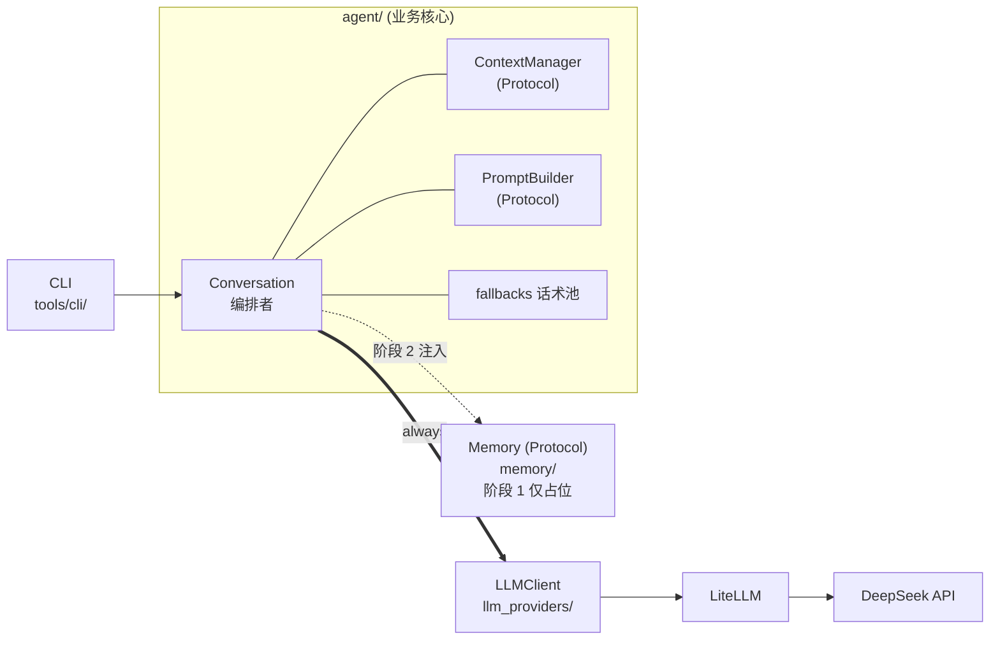
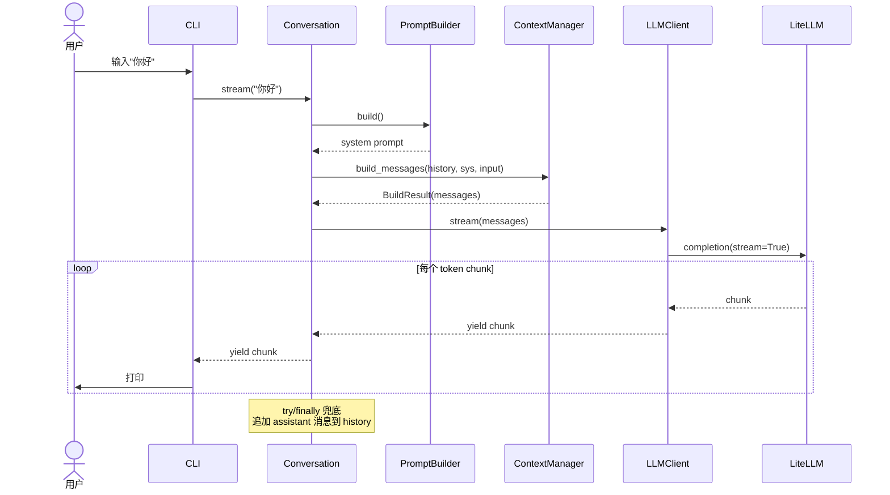

# 001 基础对话与记忆 · 阶段 1 设计文档（对话能力）

## 0. 文档说明

- 本文档是 [001 需求](./requirement.md) 的**阶段 1：对话能力**技术设计文档。
- **阶段 2（记忆能力）会单独写新的设计文档**，但本文档对记忆系统的接入接口已预留（见 §7）。
- **写作过程**：与用户按 5 个思路块（分阶段策略 / `llm_providers` / 上下文管理 / `Conversation` / 外围三件套）迭代讨论后形成，**严格基于讨论拍板的决定，不引入任何未对齐的设计点**。
- 后续在实施过程中如发现接口不足或设计需要调整，回到本文档更新（保持单一信息源）。

---

## 1. 整体目标与边界

### 1.1 阶段 1 要做的事

把 LLM 对话主干打通，让 CLI 用户能：

1. 输入一句话 → 看到 AI 流式回复（打字机效果）
2. 多轮对话（AI 记得本次会话内说过的话）
3. 通过 markdown 文件配置 AI 的人设（机制）
4. 退出时自动保存对话，下次可恢复
5. 网络/限速/认证等错误不让程序崩溃，用户体验上"AI 像人一样卡顿一下"

### 1.2 阶段 1 不做的事（YAGNI 边界）

| 不做的事 | 留到 |
|---|---|
| token 计数 / 上下文截断的精细策略 | 真出现爆 token 时再做 `FifoContextManager` |
| 多 provider fallback（主备自动切换） | 留接口口子，真有第二个 provider 时再做 |
| `async` 接口 | 阶段 3 frontend 接入时用 `asyncio.to_thread` wrap |
| HTTP / SSE 服务 | 阶段 3 |
| 长记忆 / 语义检索 | 阶段 2（本文档预留接口） |
| CLI 复杂命令（`/save`, `/history` 等） | 真有需要再加 |
| **人设 prompt 的语义内容** | 用户想清楚后再填（机制阶段 1 搭好） |
| prompt 缓存 / cost tracking / batch / GUI | 视未来需求 |

### 1.3 与阶段 2 / 阶段 3 的衔接

阶段 1 的接口设计承诺：**阶段 2（加 memory）和阶段 3（加 frontend）只能向后兼容扩展，不能推翻阶段 1 的公开接口**。详见 §5 接口稳定承诺。

---

## 2. 实施路径：3 个里程碑

每个里程碑都是**独立可演示**的状态（不是半成品），方便回滚和阶段性验证。

### 2.1 M0.1 单轮通话

**目标**：CLI 输入一句 → 调 LLM → 打印回复。

**范围**：
- `llm_providers` 最小封装（仅 `complete` 同步接口 + `ProviderSpec` + 基础错误抹平）
- CLI 骨架（朴素 `input()` / `print()`）
- 不管 history、不管流式、不管复杂错误处理

**完成标志**：跑 `uv run python -m tools.cli`，输入 "你好"，能看到 DeepSeek 的回复。

### 2.2 M0.2 多轮 + 流式

**目标**：能连续多轮对话，回复打字机效果。

**范围**：
- 引入 `Conversation` 类，维护 history
- 引入 `NaiveContextManager`（全发，不截断）
- 引入 `PromptBuilder` Protocol + `MarkdownPromptBuilder`（阶段 1 人设内容**仅最低限度身份信息**）
- `llm_providers` 加 `stream` 接口（generator 风格）
- `Conversation.stream` 实现 `try/finally` 兜底，已生成部分入 history（即使中断）
- CLI 用 `print(chunk, end="", flush=True)` 打字机效果

**完成标志**：连续输入 3-5 句，AI 上下文连贯，回复一个字一个字冒出来。

### 2.3 M0.3 截断 + 错误处理 + CLI 升级

**目标**：能给人玩、不容易崩。

**范围**：
- `Conversation` 加 `dump` / `load`，CLI 加 `/quit` 自动保存 + `/reset`
- 兜底话术池（`agent/fallbacks.py`，约 10 条中性化措辞）
- 错误处理按 5 类 `LLMError` 分级（详见 §4.1.3）
- CLI 升级为 `prompt-toolkit`（命令历史、Ctrl+C/D 优雅处理）+ `rich`（彩色输出区分角色）
- `data/personas/` overlay 机制（用户自定义人设优先于默认）

**完成标志**：可以连续聊 30 分钟，断网重连不崩，退出后下次能恢复历史。

---

## 3. 整体架构

### 3.1 模块依赖图



**关键点**：
- `LLMClient` 和 `Memory` 是 `Conversation` **平行调用的两个独立能力提供方**，二者之间没有任何依赖
- 阶段 1 `Memory` 只占一个 Protocol 签名，`Conversation` 构造时传 `None`

### 3.2 模块职责一览

| 模块 | 阶段 1 内容 | 职责边界 |
|---|---|---|
| `llm_providers/` | `ProviderSpec`, `LLMClient`, `LLMError 系列` | 只管"和 LLM 聊天" + 错误抹平。**不**做编排、不做 token 计数、不做缓存 |
| `memory/` | `Memory(Protocol)` 占位 | 阶段 1 不实现，阶段 2 接入 |
| `agent/` | `Conversation`, `ContextManager` + `NaiveContextManager`, `PromptBuilder` + `MarkdownPromptBuilder`, `Message` / `BuildResult`, `personas/`, `fallbacks.py` | 业务编排核心 |
| `tools/cli/` | CLI 入口 + 依赖组装 + 错误展示 | 调试 UI，组装其他模块的依赖、处理用户交互 |

### 3.3 M0.2 流式调用时序图



---

## 4. 模块详细设计

### 4.1 `llm_providers/`

#### 4.1.1 `ProviderSpec`：把"切换 Provider 时变的东西"显式收纳

```python
from dataclasses import dataclass, field

@dataclass(frozen=True)
class ProviderSpec:
    model: str                     # 例 "deepseek/deepseek-chat"，带 provider 前缀
    api_key: str                   # 从 env / config 读取
    api_base: str | None = None    # 自定义端点（代理、自建场景）
    defaults: dict = field(default_factory=dict)  # 默认 temperature / max_tokens 等

    @classmethod
    def from_env(cls, prefix: str) -> "ProviderSpec":
        """从环境变量读取，例如 prefix='DEEPSEEK' → 读 DEEPSEEK_MODEL / DEEPSEEK_API_KEY / ..."""
        ...
```

**为什么阶段 1 就做**：抽象成本极低（一个 dataclass + `from_env`），而"切换 Provider"是 [0002 决策](../../decisions/0002-incubation-tech-stack/README.md) 写过的明确目标，**早做改动小**。

#### 4.1.2 `LLMClient`：核心接口（仅两个方法）

```python
from typing import Iterator

class LLMClient:
    def __init__(self, spec: ProviderSpec): ...

    def complete(self, messages: list[Message], **overrides) -> str:
        """同步一次性返回完整回复"""

    def stream(self, messages: list[Message], **overrides) -> Iterator[str]:
        """流式返回 token chunk（generator 风格）"""
```

`**overrides` 用于本次调用临时覆盖 spec 的默认参数（比如 `temperature=0.9`）。

**实现要点**：
- 内部 wrap LiteLLM 的 `completion` / `completion(stream=True)`
- 把"调一次 LLM"抽成内部私有方法 `_call_once(spec, messages, **kwargs)`，**为未来多 provider fallback 留口子**——届时只需在外层 wrap `for spec in specs: try: _call_once(...) except: continue`，不动公开签名
- 用 LiteLLM 自带的 retry / backoff（`max_retries=2, backoff_factor=2`），不在我们这边手写

#### 4.1.3 错误模型：5 类 `LLMError` 子类

LiteLLM 的异常在 `llm_providers` 内部 catch 掉，转成项目自己的异常，**避免上层 import LiteLLM**。

```python
class LLMError(Exception):
    """所有 LLM 相关错误的基类"""

class LLMAuthError(LLMError):           """API key 错 / 没 key"""
class LLMRateLimitError(LLMError):      """限速"""
class LLMNetworkError(LLMError):        """网络错 / 超时"""
class LLMBadRequestError(LLMError):     """请求格式错 / context 超长（多半是 bug）"""
class LLMProviderError(LLMError):       """其他 provider 错"""
```

上层（CLI）按这 5 类做差异化处理（见 §4.7）。

#### 4.1.4 同步 vs 异步

阶段 1 同步（`def complete` / `def stream`）。阶段 3 frontend 接入时，HTTP handler 用 `asyncio.to_thread` 或 FastAPI 的 `StreamingResponse` 包一层（接受同步 generator）。

---

### 4.2 `agent.Conversation`

#### 4.2.1 接口签名

```python
from typing import Iterator, Literal
from collections.abc import Iterable

class Conversation:
    def __init__(
        self,
        llm_client: LLMClient,
        context_manager: ContextManager,
        prompt_builder: PromptBuilder,
        memory: Memory | None = None,           # 阶段 1 = None
        history: list[Message] | None = None,   # 用于恢复对话
    ): ...

    def send(self, user_input: str) -> str: ...                    # 同步
    def stream(self, user_input: str) -> Iterator[str]: ...        # 流式

    @property
    def history(self) -> list[Message]: ...                        # 只读

    def reset(self) -> None: ...                                   # 清空 history
    def dump(self) -> dict: ...                                    # 导出状态

    @classmethod
    def load(cls, data: dict, **deps) -> "Conversation": ...       # 恢复
```

#### 4.2.2 `Message` 数据结构

```python
from datetime import datetime
from dataclasses import dataclass, field

@dataclass
class Message:
    role: Literal["system", "user", "assistant"]
    content: str
    timestamp: datetime = field(default_factory=datetime.now)
    meta: dict = field(default_factory=dict)   # 扩展用：哪条是 memory 注入的、token 数等
```

#### 4.2.3 `stream` 实现要点

调用方拿到 `Iterator[str]` 后自己 buffer + join：

```python
buffer = []
for chunk in conv.stream("你好"):
    print(chunk, end="", flush=True)
    buffer.append(chunk)
reply = "".join(buffer)
```

**`history` 何时更新**（关键设计）：

`Conversation.stream` 内部用 `try/finally` 兜底——只要 generator 被消费过（包括用户中途 Ctrl+C），结束时把**已生成的部分**作为一条 assistant 消息追加到 `history`。这意味着部分回复也会被保留，是有意而为之的（避免"用户中断 → 历史不一致"）。

伪代码示意：

```python
def stream(self, user_input: str) -> Iterator[str]:
    self.history.append(Message(role="user", content=user_input))
    buffer = []
    try:
        for chunk in self._produce_stream(user_input):
            buffer.append(chunk)
            yield chunk
    finally:
        partial_reply = "".join(buffer)
        if partial_reply:
            self.history.append(Message(role="assistant", content=partial_reply))
```

#### 4.2.4 `dump` / `load`

阶段 1 就做，理由：
- CLI 想做"Ctrl+C 退出保存、下次启动恢复"
- 阶段 2 调试 memory 时，"导出 conversation 状态"也很有用
- 实现简单（dataclass + `asdict` + json）

`dump` 返回的字典结构：

```json
{
  "version": 1,
  "history": [{"role": "user", "content": "...", "timestamp": "...", "meta": {}}, ...],
  "meta": {}
}
```

`load` 从字典恢复，依赖（llm_client / context_manager / prompt_builder / memory）通过 `**deps` 注入，因为这些不应该被序列化。

#### 4.2.5 `history` 的语义说明（重要）

阶段 1 `Conversation.history` 是**完整对话历史**（内存里所有 message）。

> **⚠️ 阶段 2 后语义会变**：阶段 2 引入 memory 后，"长期完整历史"由 memory 持久化，`Conversation.history` 可能改成"短期窗口"语义。**调用方不要依赖 history 的"完整性"做关键逻辑**。

---

### 4.3 `agent.ContextManager`

#### 4.3.1 Protocol 定义

```python
from typing import Protocol

class ContextManager(Protocol):
    def build_messages(
        self,
        history: list[Message],
        system_prompt: str,
        new_user_input: str,
        extra_context: list[Message] | None = None,   # 阶段 2 给 memory 留口子
    ) -> "BuildResult":
        """根据 history + system_prompt + 新输入 + 额外上下文，
        返回实际发给 LLM 的 messages（可能截断）"""
        ...
```

**为什么显式拆开 `system_prompt` / `new_user_input` 而不是统一成 `messages: list`**：

ContextManager 知道哪些是"必须保留的"（system 和最新输入永远不能截掉），不需要"识别"。

**为什么 Memory 走 `extra_context` 参数而不是注入到 ContextManager**：

保持 ContextManager **不知道 memory 的存在**，依赖单向：`Conversation → ContextManager`、`Conversation → Memory`，二者互不耦合。Conversation 编排：先调 `memory.retrieve(query)` 拿到 `extra_context`，再传给 `build_messages`。

#### 4.3.2 `BuildResult` 数据结构

```python
@dataclass
class BuildResult:
    messages: list[Message]
    dropped_count: int = 0          # 截掉了多少条 history（NaiveContextManager 永远是 0）
    notes: dict = field(default_factory=dict)   # 扩展用，比如 token_estimate
```

阶段 1 NaiveContextManager 不会用到 `dropped_count`，但接口稳定，未来 `FifoContextManager` / `TokenBudgetContextManager` 可以填。

#### 4.3.3 `NaiveContextManager`：阶段 1 实现

```python
class NaiveContextManager:
    def build_messages(self, history, system_prompt, new_user_input, extra_context=None):
        messages = []
        if system_prompt:
            messages.append(Message(role="system", content=system_prompt))
        if extra_context:
            messages.extend(extra_context)
        messages.extend(history)
        messages.append(Message(role="user", content=new_user_input))
        return BuildResult(messages=messages)
```

**爆 token 怎么办**：不预检（计算 token 也要调 tokenizer，成本高，YAGNI）。如果真爆了，LLM 返回 `LLMBadRequestError`，CLI 给友好提示（"对话太长了，重启一下吧"）。M0.3 引入 `FifoContextManager` 时这个问题会缓解。

---

### 4.4 `agent.PromptBuilder`

#### 4.4.1 Protocol 定义

```python
class PromptBuilder(Protocol):
    def build(self) -> str:
        """返回组装好的 system prompt 字符串"""
        ...
```

#### 4.4.2 `MarkdownPromptBuilder`：阶段 1 实现

阶段 1 实现就一件事：读 markdown 文件，返回字符串。

```python
class MarkdownPromptBuilder:
    def __init__(self, persona_name: str = "default"):
        self.persona_name = persona_name

    def build(self) -> str:
        # 优先读 data/personas/{name}.md（用户自定义）
        # fallback 读 agent/personas/{name}.md（默认）
        ...
```

#### 4.4.3 `personas/` 文件组织

```
agent/personas/         # git 跟踪，作为示例和默认
├── default.md
└── README.md           # 人设撰写指引

data/personas/          # gitignored，用户自定义，加载时优先
└── default.md          # 用户的覆盖版本
```

#### 4.4.4 ⚠️ 阶段 1 人设内容的明确边界

**阶段 1 只搭机制，不做人设的语义内容设计。**

`agent/personas/default.md` 默认内容**只写最低限度的身份信息**：

```markdown
你是一个名叫 Echo 的虚拟朋友，说话风格自然、口语化。
```

**不写**：
- "行为准则"
- "失忆话术禁令"（明确否决，理由见下）
- 性格细节
- 复杂人设设定

**为什么不做"失忆话术禁令"**：
> 一边说"看起来像真人"，一边禁止说"我不记得"——而真人本来就会说"我不记得"。强行禁止 → 模型不知道也硬说知道 → 用户立刻识破"AI 在装" → 人设崩塌。这是**自相矛盾的需求**。

阶段 1 没有 memory 系统，让模型坦然承认"刚才你说的我得想想"反而比"假装记得"自然。

人设的语义内容（性格、说话风格、行为偏好等）**留给用户后续想清楚再设计**，到时改 markdown 即可，不动代码。

---

### 4.5 `agent.fallbacks`

兜底话术池，约 10 条中性化措辞，**不暗示"失忆"**：

```python
# agent/fallbacks.py
import random

FALLBACK_REPLIES = [
    "等等我，让我整理下",
    "嗯…让我想想怎么回你",
    "稍等一下哈",
    "我反应一下",
    # ... 共约 10 条
]

def random_fallback() -> str:
    return random.choice(FALLBACK_REPLIES)
```

**为什么不用 LLM 生成兜底话术**：兜底场景往往是 LLM 调用失败时，用 LLM 生成兜底有递归失败风险。预定义池简单可靠。

---

### 4.6 `memory.Memory`：阶段 1 仅 Protocol 占位

阶段 1 不实现，但**先定签名**，让 `Conversation` 类型注解能写实：

```python
# memory/src/memory/__init__.py
from typing import Protocol

class Memory(Protocol):
    def retrieve(self, query: str) -> list["Message"]:
        """检索与 query 相关的历史 message。
        
        阶段 2 实现时会向后兼容地扩展（加可选参数如 top_k / filters），
        不会改这个核心签名。
        """
        ...
```

这是 §5 接口稳定承诺的关键预留点之一。

---

### 4.7 `tools/cli`

#### 4.7.1 入口

```bash
uv run python -m tools.cli                              # 默认人设
uv run python -m tools.cli --persona cute_friend       # 指定人设
uv run python -m tools.cli --resume data/sessions/last.json   # 恢复对话
```

#### 4.7.2 演进路径

| 里程碑 | CLI 形态 |
|---|---|
| M0.1 / M0.2 | 朴素 `input()` / `print(..., flush=True)` |
| M0.3 | `prompt-toolkit`（命令历史、Ctrl+C/D 优雅处理）+ `rich`（彩色区分用户/AI/系统消息） |

#### 4.7.3 内部命令（M0.3 引入）

仅做最必要的两个：

| 命令 | 行为 |
|---|---|
| `/quit` 或 Ctrl+D | 自动保存当前对话到 `data/sessions/{timestamp}.json`，退出 |
| `/reset` | 清空 history，从头开始 |

`/save` / `/history` 等其他命令**真有需要再加**。

#### 4.7.4 错误展示策略

按 5 类 `LLMError` 分级处理：

| 错误类型 | CLI 行为 |
|---|---|
| `LLMAuthError` | 打印 "API key 没配置或错误，请检查 `.env`" → 退出（fail fast，让 LiteLLM 自带 retry 不重试这个） |
| `LLMRateLimitError` | LiteLLM 自带 retry 已重试过；仍失败 → 打印兜底话术 |
| `LLMNetworkError` | 同上 |
| `LLMBadRequestError` | 打印 "请求出错（多半是 bug），错误信息：xxx" → 不重试 |
| `LLMProviderError` | 打印兜底话术 |

兜底话术从 `agent/fallbacks.random_fallback()` 取，**不暴露技术细节**（"网络错误" / "服务异常" 等内部术语不要让用户看到）。

---

## 5. 接口稳定承诺

阶段 1 → 阶段 2/3 不能破坏的接口（**硬承诺**）：

| 范围 | 不变的内容 |
|---|---|
| `Conversation` 公开 API | 构造参数（仅 `memory` 从 None 变实例）、`send` / `stream` / `history` / `reset` / `dump` / `load` 签名 |
| `Message` 数据结构 | `role` / `content` / `timestamp` 核心字段 |
| Protocol 接口签名 | `ContextManager.build_messages` / `PromptBuilder.build` / `Memory.retrieve` 只能向后兼容扩展（加可选参数），不能改已有签名 ⚠️ **`Memory.retrieve` 返回类型已由 [008](../008-engine-memory/design.md) 演进为 `MemoryContext`——见下方说明** |
| `LLMClient` 公开 API | `ProviderSpec` 字段、`complete` / `stream` 签名 |
| 错误模型 | 5 类 `LLMError` 子类不删不改 |

允许的扩展（**软承诺**，不破坏调用方）：

- `send` / `stream` 加**可选** kwargs
- `Message.meta` 加新 key
- 新增方法（如 `Conversation.search_history`）
- Protocol 加可选参数

---

## 6. 阶段 2 接口预留点（明确清单）

实施阶段 1 时，下面这些"插槽"必须按本文档预留，否则阶段 2 接入时会被迫改阶段 1 代码：

| 预留点 | 位置 | 阶段 2 用途 |
|---|---|---|
| `Conversation.__init__` 的 `memory: Memory \| None = None` | `agent/Conversation` | 阶段 2 注入实际 memory 对象 |
| `ContextManager.build_messages` 的 `extra_context` 参数 | `agent/ContextManager` Protocol | Conversation 把 `memory.retrieve()` 结果通过这里传入 |
| `Memory(Protocol).retrieve(query: str) -> list[Message]` | `memory/__init__.py` | 阶段 2 实现这个 Protocol ⚠️ 见下方演进说明 |

> ⚠️ **演进说明（008 落地）**：阶段 2 的记忆能力由独立需求 [`008 引擎层长期记忆`](../008-engine-memory/design.md) 落地。落地时 `Memory.retrieve` 的**返回类型从 `list[Message]` 改为 `MemoryContext{rendered, items}`**（[008 design §3.2](../008-engine-memory/design.md)）。这是一次有意识的破坏性演进——本阶段 `Memory` 始终只是占位、无真实消费方，唯一调用点 `Conversation._build_openai_messages_first_turn` 由 008 同步更新。本文档此处保留原始预留点描述作为历史来源。
| `Message.meta` 字典 | `agent/Message` | 阶段 2 标记哪些消息是 memory 注入的 |

---

## 7. 待对齐 / 后续讨论事项

- **人设 prompt 的语义内容**：用户后续想清楚再设计，本文档只承诺机制
- **M0.3 完成后的回看**：实施过程中如发现接口设计不足或边界不清，回到本文档更新（保持单一信息源，不要拆散到多处）
- **阶段 2 设计文档**：阶段 1 完成后单独写 `design-phase2-memory.md`（或类似命名），届时与本文档的衔接通过 §6 的预留点
