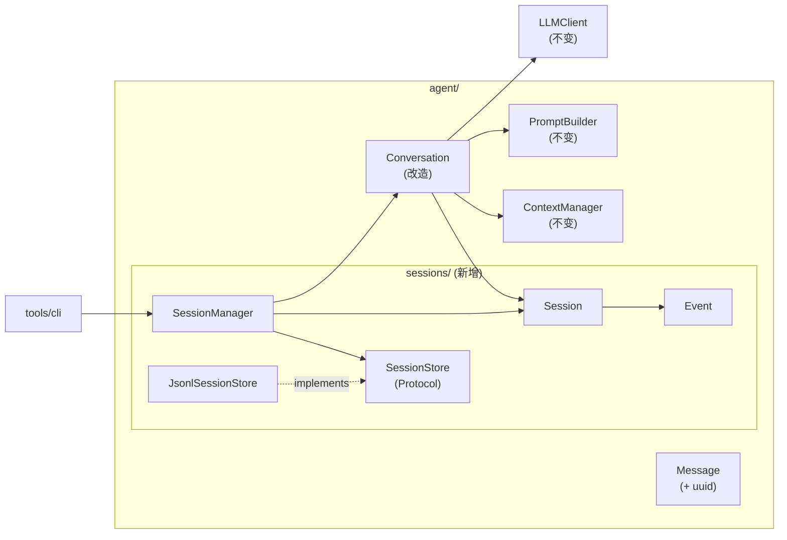
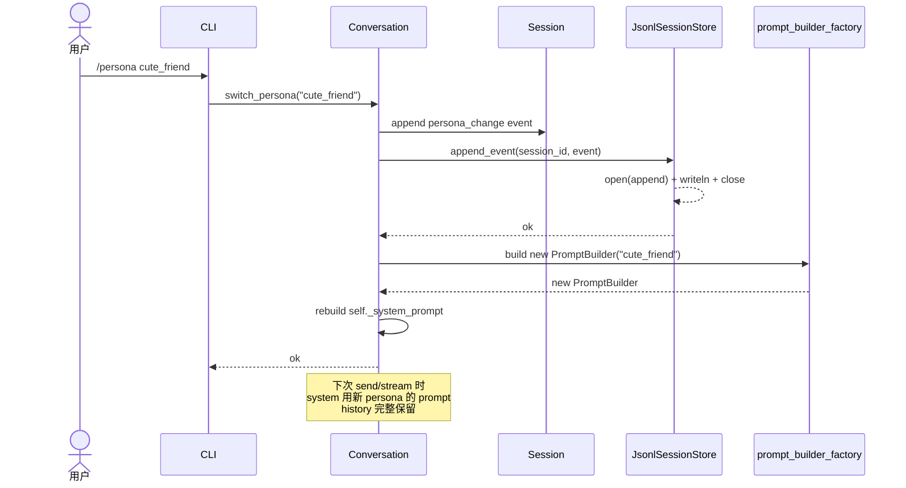

# 002 引擎层会话管理 · 技术方案

## 0. 文档说明

- 本文档是 [002 需求](./requirement.md) 的技术设计文档，回答 requirement §7 中的 Q-1 ~ Q-8。
- **写作过程**：与用户按 8 个不确定点逐条讨论后形成。**严格基于讨论拍板的决定，不引入任何未对齐的设计点**。
- 后续在实施过程中如发现接口不足或设计需要调整，回到本文档更新（保持单一信息源）。

---

## 1. 整体目标与边界

### 1.1 本期要做的事

把"会话"从 CLI 上移成引擎层一等公民：

1. 新增 `agent/sessions/` 子包，包含**事件 schema / Session 数据类 / 持久化协议 / 业务编排管理器**
2. 选 **JSONL append-only** 作为本期持久化格式（与 Claude Code / Gemini CLI 等主流一致），存放路径 `data/sessions/{session_id}.jsonl`
3. 微调 `agent.Conversation`，让它绑定到一个 Session 跑对话；新增 `switch_persona / switch_model` 方法
4. `tools/cli` 改造：所有会话生命周期逻辑下移到引擎层调用；新增 `/sessions` / `/open` / `/persona` / `/model` / `/new` 命令
5. 持久化错误**抛异常上抛**，由 CLI 决定如何展示

### 1.2 不做的事（YAGNI 边界）

| 不做的事 | 留到 |
|---|---|
| archive / fork / rename 等扩展操作 | 未来真有需要再加（其中 rename 只需"读首行 + 改首行"，后期成本低） |
| 多进程并发写入保护 | 单进程使用假设，未来多窗口时再做 |
| 原子写入（fsync + 临时文件 + rename） | 接受"崩溃丢最后一条"的退化 |
| Schema 版本迁移 | 首版 schema 不向前兼容；schema_version 字段已留位但暂不做迁移逻辑 |
| 自动 LLM 提炼标题 | 仅留 `title_generator: Callable` 注入口 |
| 老 JSON 格式自动兼容 | 本期清理旧文件，不做迁移 |
| 列表中显示"当前 persona / model / 消息数" | 这些都是可变状态，按本期"列表 O(1)"目标不展示 |
| HTTP / SSE 包装层 | 阶段 3 形态期再做 |

### 1.3 与 001 接口稳定承诺的关系

001 design §5 承诺"`Conversation` 公开 API 构造参数 / send / stream / history / reset / dump / load 签名不变"。本期为引入 Session 必须做**有限破坏**：

| 001 承诺项 | 本期处理 | 理由 |
|---|---|---|
| `Conversation.__init__` 签名 | **破坏**：去掉 `history`，加入 `session: Session` + 工厂参数 | Session 是引擎层必要架构调整 |
| `Conversation.dump / load` | **删除** | 新架构下无真实调用方：持久化走 SessionStore；导出/导入用 `Session.to_dict/from_dict` |
| `Conversation.reset` | **删除** | 新架构下语义模糊（与 `/new` 重复）且违背 append-only；CLI 用 `/new` 创建新会话替代 |
| `Conversation.send / stream / history` | **不破坏** | 行为按预期对接 Session |
| `Message` 数据结构 role/content/timestamp | **不破坏**，仅**新增** `uuid` 字段 | requirement R-4.4.3 + 用户回复 #6 明确要消息级唯一标识 |
| `LLMClient / ContextManager / PromptBuilder` 接口 | **完全不破坏** | 不需要动 |
| `LLMError` 五子类 | **完全不破坏** | 不需要动 |

→ **后续接口承诺以本文档 §6 为准**。

---

## 2. 实施路径：3 个里程碑

每个里程碑都是独立可验证状态，便于回滚。

### 2.1 M2.1 引擎层骨架（不接 Conversation）

**目标**：`agent.sessions` 子包完整可用，能独立完成 create / open / list / append_event / delete / 切换 persona/model。

**范围**：
- `agent/sessions/events.py` —— 5 类事件 + `Event` dataclass + jsonl 序列化
- `agent/sessions/session.py` —— `Session` 数据类 + 当前激活值计算
- `agent/sessions/store.py` —— `SessionStore` Protocol + `JsonlSessionStore` 实现 + `SessionSummary`
- `agent/sessions/manager.py` —— `SessionManager`（业务编排）
- `agent/sessions/errors.py` —— `SessionError` 异常体系
- 不动 `Conversation`、不动 CLI

**完成标志**：能用 Python REPL 完成"create → append 一些假事件 → list → load → delete"全流程。

### 2.2 M2.2 接入 Conversation + 切换 persona/model

**目标**：`Conversation` 改造完成，对话流可直接走 SessionStore 落盘；`switch_persona / switch_model` 工作。

**范围**：
- `Message` 加 `uuid` 字段
- `Conversation` 构造签名变更：去 `history`，加 `session` + 工厂
- `Conversation.stream/send` 改成 append event 到 session+store
- `Conversation.switch_persona / switch_model` 新增
- `Conversation.dump / load / reset` **从公开 API 中移除**

**完成标志**：能通过 Python 脚本起一段对话、切 persona、关掉、重新通过 `manager.open(session_id)` 打开、继续对话。

### 2.3 M2.3 CLI 改造

**目标**：CLI 走新引擎接口，行为不退化 + 新 slash 命令可用。

**范围**：
- `tools/cli/__main__.py` 改造，去掉 `save_session / find_latest_session / RESUME_LATEST_SENTINEL` 等
- `--resume <session_id>` / `--resume`（取最新）/ 默认新建
- `--persona <name>` / `--model <name>` 影响初始值
- 新增 `/sessions` / `/open <id>` / `/persona <name>` / `/model <name>` / `/new` 命令
- 删除 `/reset` 命令（语义被 `/new` 取代）
- `/quit` 对齐新行为（不再调 `save_session`，持久化已是边写边落盘）
- 持久化错误兜底展示

**完成标志**：requirement §6 的 AC-1 ~ AC-8 全部通过。

---

## 3. 整体架构

### 3.1 模块依赖图



### 3.2 模块职责一览

| 模块 | 职责 | 不做的事 |
|---|---|---|
| `agent/sessions/events.py` | 事件类型枚举、`Event` 数据类、jsonl ↔ Event 互转 | 不做持久化、不做业务逻辑 |
| `agent/sessions/session.py` | Session 聚合根，事件流持有，当前激活值计算 | 不做持久化、不做对话执行 |
| `agent/sessions/store.py` | 持久化协议 + JSONL 默认实现，文件级 IO | 不做业务编排、不感知 Conversation |
| `agent/sessions/manager.py` | 业务编排：create/open/list/delete、装配 Conversation | 不直接做 IO、不直接调 LLM |
| `agent/sessions/errors.py` | `SessionError` / `SessionNotFoundError` / `SessionPersistError` / `SessionCorruptError` | —— |
| `agent.Conversation`（改造） | 绑定 Session 跑对话、切换 persona/model | 不直接做 IO（委托给 store） |
| `tools/cli` | 用户交互、调用 SessionManager API | 不直接接触 Store / 文件路径 |

### 3.3 切 persona 时序图



---

## 4. 模块详细设计

### 4.1 `agent/sessions/events.py` —— 事件 schema

#### 4.1.1 事件类型

5 类（去掉 declare 中讨论过的 `system_message`，原因见 §5 D-8）：

| `type` | 何时写入 | 是否参与 LLM 上下文构建 |
|---|---|---|
| `session_meta` | 首行，session 创建时**唯一一条** | 否（仅元数据） |
| `user_message` | 用户每条输入 | 是（作为 user 消息） |
| `assistant_message` | AI 每次完整或部分回复 | 是（作为 assistant 消息） |
| `persona_change` | `switch_persona` 调用时 | 否（仅观测/前端渲染） |
| `model_change` | `switch_model` 调用时 | 否（仅观测/前端渲染） |

#### 4.1.2 `Event` 数据类

```python
from dataclasses import dataclass, field
from datetime import datetime
from typing import Any, Literal

EventType = Literal[
    "session_meta",
    "user_message",
    "assistant_message",
    "persona_change",
    "model_change",
]


@dataclass(frozen=True)
class Event:
    type: EventType
    uuid: str                          # 事件/消息级唯一标识（uuid4）
    ts: datetime                       # 创建时间（UTC，ISO 8601 序列化）
    payload: dict[str, Any]            # type-specific 数据
    meta: dict[str, Any] = field(default_factory=dict)  # 可扩展（如生成它时的 persona/model）

    def to_jsonl(self) -> str:
        """序列化为一行 JSON（结尾不含 \\n，由调用方加）"""

    @classmethod
    def from_jsonl(cls, line: str) -> "Event":
        """反序列化一行 JSON。
        
        Raises:
            SessionCorruptError: 行不是合法 JSON 或缺字段
        """
```

#### 4.1.3 payload 字段约定

| type | payload 必有字段 | meta 常见字段 |
|---|---|---|
| `session_meta` | `schema_version: int`、`initial_title: str`、`initial_persona: str`、`initial_model: str` | —— |
| `user_message` | `content: str` | —— |
| `assistant_message` | `content: str`、`partial: bool`（流式被中断时为 true） | `persona: str`、`model: str`（生成它时的激活值，便于审计） |
| `persona_change` | `from: str`、`to: str` | —— |
| `model_change` | `from: str`、`to: str` | —— |

#### 4.1.4 文件级 schema（JSONL）

每个 session 一个 `.jsonl` 文件，路径 `data/sessions/{session_id}.jsonl`，每行一个 Event 的 JSON 序列化结果，行末 `\n`。

**文件第一行必须是 `session_meta` 事件**——这是"读首行就能拿到不可变 meta"的依据，也是判断文件完整性的最低保障。

示例（每行展开方便阅读，实际是单行）：

```jsonl
{"type":"session_meta","uuid":"<sid>","ts":"2026-05-14T03:00:00Z","payload":{"schema_version":1,"initial_title":"会话 2026-05-14 11:00","initial_persona":"default","initial_model":"deepseek/deepseek-chat"},"meta":{}}
{"type":"user_message","uuid":"<msg-uuid>","ts":"2026-05-14T03:00:05Z","payload":{"content":"你好"},"meta":{}}
{"type":"assistant_message","uuid":"<msg-uuid>","ts":"2026-05-14T03:00:06Z","payload":{"content":"嘿！","partial":false},"meta":{"persona":"default","model":"deepseek/deepseek-chat"}}
{"type":"persona_change","uuid":"<evt-uuid>","ts":"2026-05-14T03:01:00Z","payload":{"from":"default","to":"cute_friend"},"meta":{}}
```

### 4.2 `agent/sessions/session.py` —— Session 聚合根

```python
@dataclass
class Session:
    session_id: str                            # uuid4 字符串
    created_at: datetime                       # 来自首行事件 ts
    initial_title: str
    initial_persona: str
    initial_model: str
    events: list[Event] = field(default_factory=list)
    # 注：events 仅在内存里，IO 由 SessionStore 负责
    
    @property
    def current_persona(self) -> str:
        """从事件流反向扫描最后一条 persona_change，没有则用 initial_persona"""
    
    @property
    def current_model(self) -> str:
        """同上，model 维度"""
    
    @property
    def messages(self) -> list[Message]:
        """过滤 user_message / assistant_message 事件，转成 Message 列表（按 ts 顺序）。
        
        partial 的 assistant_message 也会被包含，meta 里有 partial=True 标志。
        """
    
    def append(self, event: Event) -> None:
        """仅追加到内存。IO 由 SessionStore 负责（manager / conversation 编排）"""
    
    def to_dict(self) -> dict[str, Any]:
        """完整快照导出（用于程序化访问 / 调试脚本）"""
    
    @classmethod
    def from_dict(cls, data: dict[str, Any]) -> "Session":
        """从 to_dict 输出恢复"""
```

**为什么 `current_persona` 是 property 而非冗余字段**：避免双源数据不一致（事件流是单一真相源）。事件流长度孵化期不会超过几千条，反向扫描成本可忽略。如果未来真有需要可加 lazy cache。

### 4.3 `agent/sessions/store.py` —— 持久化协议

#### 4.3.1 `SessionStore` Protocol

```python
@dataclass(frozen=True)
class SessionSummary:
    """list() 返回的轻量摘要 —— 仅基于"首行 meta + 文件 mtime"，O(1) per 文件"""
    session_id: str
    title: str                # = session_meta.payload.initial_title
    created_at: datetime
    updated_at: datetime      # 来自文件 mtime
    persona: str              # initial_persona（不展示"当前"，详见 §5 D-2）
    model: str                # initial_model


class SessionStore(Protocol):
    """持久化协议。实现方负责具体存储介质（jsonl / sqlite / s3 / ...）"""
    
    def create(self, session: Session) -> None:
        """新建会话，写入首行 session_meta。
        
        Raises:
            SessionPersistError: IO 失败
        """
    
    def append_event(self, session_id: str, event: Event) -> None:
        """追加一条事件。
        
        Raises:
            SessionNotFoundError: session_id 对应文件不存在
            SessionPersistError: IO 失败
        """
    
    def load(self, session_id: str) -> Session:
        """完整加载，读所有事件。
        
        Raises:
            SessionNotFoundError
            SessionCorruptError: 首行非 session_meta 或某行损坏
        """
    
    def list(self) -> list[SessionSummary]:
        """列出所有会话，按 updated_at 倒序。
        
        实现要求：仅读每个文件首行 + stat mtime，不读全文件。
        """
    
    def delete(self, session_id: str) -> None:
        """删除会话（hard delete）。
        
        Raises:
            SessionNotFoundError
            SessionPersistError
        """
    
    def latest(self) -> SessionSummary | None:
        """返回最近活跃的会话摘要；无会话则 None。"""
```

#### 4.3.2 `JsonlSessionStore` 实现要点

```python
class JsonlSessionStore:
    def __init__(self, base_dir: Path):
        self._base_dir = base_dir
        self._base_dir.mkdir(parents=True, exist_ok=True)
    
    def _path(self, session_id: str) -> Path:
        return self._base_dir / f"{session_id}.jsonl"
```

**关键实现细节**：

- `append_event`：每次 `open(path, "a", encoding="utf-8") → write(event.to_jsonl() + "\n") → close`。**不持有 file handle**（详见 §5 D-4）。IO 异常包成 `SessionPersistError` 抛出。
- `list`：`glob("*.jsonl")` → 对每个文件 `open + readline + close + stat()` → 构造 `SessionSummary` → 按 `updated_at` 倒序。
- `load`：流式读所有行，每行 `Event.from_jsonl`；首行必须 `type == "session_meta"`，否则 `SessionCorruptError`。
- `delete`：`path.unlink()`。文件不存在抛 `SessionNotFoundError`。
- 首行损坏（无法识别 session_meta）的文件：`list()` 时**跳过 + 不记日志**（孵化期不引入日志框架，CLI 自行决定是否提示）；`load()` 时抛 `SessionCorruptError`。

### 4.4 `agent/sessions/manager.py` —— SessionManager

```python
class SessionManager:
    """业务编排：会话 CRUD + 装配 Conversation。
    
    所有调用方（CLI / 未来 HTTP / 未来前端）通过本类访问会话能力。
    """
    
    def __init__(
        self,
        store: SessionStore,
        llm_client_factory: Callable[[str], LLMClient],         # str = model name
        prompt_builder_factory: Callable[[str], PromptBuilder], # str = persona name
        context_manager: ContextManager,
        title_generator: Callable[[Session], str] | None = None,
    ):
        ...
    
    # ----- 会话 CRUD -----
    def create(
        self,
        persona: str,
        model: str,
        title: str | None = None,
    ) -> Session:
        """创建新会话。
        
        title 为 None 时：若构造时传了 title_generator 则调用之，否则用占位
        "会话 {created_at:%Y-%m-%d %H:%M}"。
        """
    
    def open(self, session_id: str) -> Session:
        """通过 id 打开"""
    
    def list(self) -> list[SessionSummary]: ...
    
    def delete(self, session_id: str) -> None: ...
    
    def latest(self) -> Session | None:
        """最近活跃会话（完整加载）；列表空则 None"""
    
    # ----- 装配 Conversation -----
    def start_conversation(self, session: Session) -> "Conversation":
        """根据 session.current_persona / current_model 构造 LLMClient / PromptBuilder，
        组装成 Conversation 实例并返回。"""
```

**职责边界**：Manager 不直接做文件 IO（委托 Store）、不直接调 LLM（委托 Conversation）。它是个**编排者 / 装配厂**。

### 4.5 `agent/sessions/errors.py`

```python
class SessionError(AgentError):
    """所有 session 相关异常基类"""

class SessionNotFoundError(SessionError): ...
class SessionPersistError(SessionError):
    """持久化 IO 失败（磁盘满、权限、网络盘断连等）"""
class SessionCorruptError(SessionError):
    """文件损坏（首行非 session_meta、行 JSON 损坏等）"""
```

CLI 按 SessionError 子类做差异化展示（详见 §4.9）。

### 4.6 `agent.Message` 扩展 `uuid` 字段

```python
@dataclass
class Message:
    role: Role
    content: str
    timestamp: datetime = field(default_factory=datetime.now)
    meta: dict[str, Any] = field(default_factory=dict)
    uuid: str = field(default_factory=lambda: str(uuid4()))  # 新增
```

`uuid` 默认值用 uuid4 工厂自动生成，构造时不强制传入；现有调用代码（CLI / Conversation / 测试）**不需要改任何 import 或构造方式**。`to_dict` / `from_dict` 自然带上 `uuid` 字段；反序列化时遇到缺 `uuid` 字段的旧数据，工厂会自动补一个新 uuid（不强制要求迁移）。

详细兼容处理见 §6 接口承诺表。

### 4.7 `agent.Conversation` 改造点

#### 4.7.1 新构造签名

```python
class Conversation:
    def __init__(
        self,
        session: Session,
        store: SessionStore,
        llm_client: LLMClient,
        context_manager: ContextManager,
        prompt_builder: PromptBuilder,
        # 切 persona/model 时用的工厂，manager.start_conversation 注入
        llm_client_factory: Callable[[str], LLMClient] | None = None,
        prompt_builder_factory: Callable[[str], PromptBuilder] | None = None,
        memory: Memory | None = None,   # 001 预留位，本期仍传 None
    ):
        self._session = session
        self._store = store
        self._llm_client = llm_client
        self._context_manager = context_manager
        self._prompt_builder = prompt_builder
        self._llm_client_factory = llm_client_factory
        self._prompt_builder_factory = prompt_builder_factory
        self._memory = memory
        self._system_prompt = prompt_builder.build()
```

**变化点**：去掉 `history` 参数（history 现在从 session 派生），加入 `session / store + 两个工厂`。

#### 4.7.2 `history` property

```python
@property
def history(self) -> list[Message]:
    """从 session.events 派生（与 001 行为一致——返回副本，外部修改不影响内部）"""
    return self._session.messages
```

#### 4.7.3 `send / stream`

逻辑与 001 大致相同，**关键差异**：
- 不再 `self._history.append(...)`，改成构造 `Event` → `session.append(event)` → `store.append_event(session.session_id, event)`
- 每条 `assistant_message` 的 `meta` 里记下当时的 `persona / model`（用于 audit / 未来前端按归属高亮等）

`stream` 的 `try/finally` 兜底逻辑保留：迭代中途异常 → 把已收到部分作为 `assistant_message` 事件落盘（`payload.partial = true`）。

#### 4.7.4 `switch_persona / switch_model` 新增

```python
def switch_persona(self, name: str) -> None:
    """切换 persona：
    1. append persona_change 事件（落盘）
    2. 用 prompt_builder_factory 重建 PromptBuilder
    3. 重新 build self._system_prompt
    
    Raises:
        AgentError: 未注入 prompt_builder_factory（理论上由 manager 保证）
        PersonaNotFoundError: 新 persona 不存在
        SessionPersistError: 事件落盘失败（此时 persona 未切换）
    """

def switch_model(self, name: str) -> None:
    """切换 model：
    1. append model_change 事件
    2. 用 llm_client_factory 重建 LLMClient
    
    Raises:
        AgentError / LLMAuthError / SessionPersistError
    """
```

**失败语义**：先落盘事件、后重建依赖。**事件落盘成功 + 依赖重建成功 = 切换成功**。任一失败则尝试不留半状态：
- 事件落盘失败 → 不重建依赖，抛异常，状态完全不变
- 事件落盘成功但依赖重建失败 → **状态会不一致**（jsonl 里有 change 事件，但运行时依赖没换）。这种场景孵化期罕见（PersonaNotFoundError 在构造前 manager 可以预检），暂不处理；CLI 收到异常后由用户决定是否重启 CLI 来对齐状态。

**扩展性预留**：`Event` 是 frozen dataclass + 事件流 append-only，未来若需要"切换失败回滚"，标准做法是 append 一条 reverse `persona_change` / `model_change` 事件抵消（事件溯源模式），不需要破坏接口；本期不实现。

### 4.8 `tools/cli` 改造点

#### 4.8.0 会话绑定状态机（CLI 策略层）

CLI 是引擎层（`SessionManager`）的**第一个调用方**，但 `create / open / start_conversation / send` 这 4 个动作在引擎里**本来就是分离的**——CLI 选择什么时机调它们是策略问题。

本期 CLI 采用**懒加载策略**：

| 状态 | 含义 | 持有 |
|---|---|---|
| **未绑定** | 用户尚未表达"开始一段对话"的意图 | `session=None, conv=None, pending_persona, pending_model` |
| **已绑定** | 已有目标 session 与 `Conversation` 实例 | `session, conv`（两者非空） |

**未绑定 → 已绑定**的 4 个触发点：

1. **输入非命令消息**（首条消息）→ 用 `pending_*` 调 `manager.create` + `start_conversation`
2. `/new` → 同上（但 `pending_*` 从已绑定的 `conv.current_*` 取值，若已绑定）
3. `/open <id>` → `manager.open` + `start_conversation`
4. 启动时 `--resume <id>` / `--resume`（带 latest） → 在 `main()` 里立即 open

**为什么不"启动即建"**：旧策略（M0 / 早期 M2.3）每次启动 CLI 都 `create`，导致用户开了 CLI 但没说话直接退出时也会留下空 session 文件，污染 `data/sessions/` 与 `/sessions` 列表。懒加载消除这种"无意图垃圾"，与未来前端 `POST /sessions` 必须由用户主动触发的语义也对齐。

**为什么不在引擎层做这个**：引擎层不应该假设"创建 session 必须先有消息"——HTTP API 场景下"先建一个空 session 占位、之后慢慢写"是合理诉求（如离线起草）。这个策略是 CLI 自己的 UX 选择，不约束引擎。

#### 4.8.1 启动流程

```python
def main():
    load_dotenv()
    args = parse_args()
    SESSIONS_DIR.mkdir(parents=True, exist_ok=True)

    store = JsonlSessionStore(SESSIONS_DIR)

    def llm_factory(model: str) -> LLMClient:
        spec = make_spec_with_thinking_off(model)
        return LLMClient(spec)

    def prompt_factory(persona: str) -> PromptBuilder:
        return MarkdownPromptBuilder(persona_name=persona)

    cm = NaiveContextManager()
    manager = SessionManager(store, llm_factory, prompt_factory, cm)

    # 启动时只在 --resume 显式表达"恢复"时才 open；否则保持未绑定
    initial_session, pending_persona, pending_model = _select_initial_state(manager, args)
    initial_conv = manager.start_conversation(initial_session) if initial_session else None

    ctx = _CliContext(
        mgr=manager,
        session=initial_session,
        conv=initial_conv,
        pending_persona=pending_persona,
        pending_model=pending_model,
    )
    _print_banner(ctx)
    _interactive_loop(ctx)
```

`_CliContext` 是 CLI 内部的轻量 dataclass，封装"绑定状态机"。它有一个关键方法 `ensure_bound()`：未绑定时用 `pending_*` 触发 `mgr.create` + `start_conversation`；已绑定时是 no-op。所有"输入非命令消息"的代码路径在调 `conv.stream` 前都先调 `ensure_bound()`。

#### 4.8.2 `_select_initial_state`

返回三元组 `(initial_session: Session | None, pending_persona: str, pending_model: str)`。

| args.resume | 行为 | 返回 |
|---|---|---|
| `None`（未指定，最常见） | **保持未绑定** | `(None, args.persona, args.model_or_default)` |
| `"__latest__"`（`--resume` 不带参数） | `manager.latest()` 找最新 | 有则 `(session, session.current_persona, session.current_model)`；无则 stderr 友好提示 + `(None, args.persona, args.model_or_default)` |
| `<session_id>` | `manager.open(args.resume)`（支持短 id 前缀匹配） | 命中 `(session, session.current_persona, session.current_model)`；找不到 / 歧义则 stderr + `sys.exit(1)` |

**变化**：原来 `--resume <path>` 接路径，改成接 session_id（支持前缀）。

**关键不变量**：仅当用户**显式**通过 `--resume` 表达"恢复"意图时，启动阶段才会调 `open`；其他情况保持未绑定，等用户在交互里产生意图。

#### 4.8.3 新增 slash 命令

| 命令 | 已绑定时 | 未绑定时 |
|---|---|---|
| `/sessions` | 调 `manager.list()` 打印表格：短 id（前 8 位）、title、initial persona、initial model、updated_at | 同左（与绑定状态无关） |
| `/open <id>` | 接受短 id 前缀匹配；唯一匹配则切换 conv，否则提示歧义 | 同左（命中即绑定） |
| `/persona <name>` | `conv.switch_persona(name)`，捕获 `PersonaNotFoundError` 提示 | **客户端预检**（`prompt_factory(name).build()`）通过则更新 `pending_persona`；不调 `switch_persona`（无 conv） |
| `/model <name>` | `conv.switch_model(name)` | 直接更新 `pending_model`（不做客户端预检——model 合法性只能 LLM API 知道） |
| `/new` | `manager.create(persona=conv.current_persona, model=conv.current_model)` + `start_conversation` + 重绑 | `manager.create(persona=pending_persona, model=pending_model)` + `start_conversation` + 首次绑定 |
| `/quit` 或 `q` | 退出（不再需要"退出前 save_session"） | 退出（**不留任何 session 文件**） |

> **001 的 `/reset` 已删除**：新架构下"清空当前 session"和"新建 session"的用户语义等价，保留两个命令会令人困惑。统一用 `/new`。CLI 保留 `/reset` 命令名只是为了给老用户一个"已删除，请用 /new"的友好提示。

#### 4.8.4 错误展示

| 异常 | CLI 行为 |
|---|---|
| `SessionNotFoundError` | `[red]找不到会话 {id}[/red]`，主循环里继续；启动时退出 |
| `SessionPersistError` | `[red]\[会话保存失败] {e}（本轮已发送但未持久化）[/red]`，对话继续；`ensure_bound` 路径报 `[red]\[新建会话失败] {e}[/red]`，主循环继续 |
| `SessionCorruptError` | `[red]\[会话文件损坏] {e}（用 cat 查看 data/sessions/{id}.jsonl 排查）[/red]`，启动时退出；`/open` 内则主循环继续 |
| `PersonaNotFoundError` | 已绑定 `/persona`：红字提示，状态完全不变；未绑定 `/persona`：客户端预检失败，不更新 pending；`ensure_bound` 时（`pending_persona` 文件突然消失）：红字 + 提示"用 /persona 切换 pending 后再发消息" |
| `LLMAuthError` | 启动预检 / `ensure_bound` / `/model` / `stream` 均 catch；启动 / `stream` 路径打提示后**退出**；其他路径主循环继续 |
| LLM 其他四类异常 | **完全沿用 001 §4.7.4 策略**，不动 |

#### 4.8.5 banner & 状态显示

启动时按绑定状态打印：

**已绑定**（`--resume` 命中后）：

```
agent-friend · M2 demo
session: 7f2a3b4c (会话 2026-05-14 11:00) · persona: cute_friend · model: deepseek/deepseek-v4-pro
命令：/sessions /open <id> /persona <name> /model <name> /new /quit  ·  Ctrl+D 退出 · Ctrl+C 取消当前输入
```

**未绑定**（最常见的启动姿势 `./scripts/cli/run.sh`）：

```
agent-friend · M2 demo
未绑定会话（发首条消息或 /new 即可创建；/open <id> 打开已有；/sessions 看所有）
默认 persona: default · 默认 model: deepseek/deepseek-v4-flash
命令：/sessions /open <id> /persona <name> /model <name> /new /quit  ·  Ctrl+D 退出 · Ctrl+C 取消当前输入
```

绑定 / 切换 / 新建后**重新打印一行状态**：

```
[dim]→ 新建会话: 7f2a3b4c (persona=default, model=deepseek/deepseek-v4-flash)[/dim]
[dim]→ persona: cute_friend[/dim]
[dim]→ model: deepseek/deepseek-v4-pro[/dim]
[dim]→ 切换会话: ef73b760 (persona=cute_friend, model=deepseek/deepseek-v4-pro, 8 条历史)[/dim]
[dim]→ 默认 persona: cute_friend（将在首条消息时生效）[/dim]
```

#### 4.8.6 切换会话时的清屏 + 历史回放

切换 / 恢复会话时，**清当前可见屏幕 + 重新打 banner + 重放历史**——目的是让进入新会话像"打开一个新视图"，视觉上不被旧会话的输出干扰；同时尽量不破坏 terminal 既有的 scrollback。

**触发点**：

| 入口 | 清屏 | 重放历史 |
|---|---|---|
| `--resume <id>` / `--resume`（latest 命中）启动 | ✅ | ✅（若 session 有 user/assistant 事件） |
| `/open <id>` 命中切换 | ✅ | ✅（同上） |
| `/new` 显式新建 | ✅ | —（新会话无历史） |
| `/persona` / `/model` 切换 | ❌ | ❌（是会话内状态调整，不是换会话） |
| 启动时未绑定（无 `--resume`） | ❌ | ❌（保留 CLI 启动前的 terminal 内容做参考） |

**清屏实现**：rich `Console.clear()` 内部为 ANSI `\033[2J\033[H`（清当前可见屏幕 + 光标回 (0,0)），**不动 terminal 的 scrollback buffer**。用户向上滚动仍可看到 CLI 启动前的 shell 历史与之前的 CLI 输出。Non-TTY（stdin 被 pipe 喂入）场景下 rich 静默跳过 ANSI 控制序列——这是合理行为，避免污染 pipe 数据流。

**历史回放渲染**（从 `session.events` 派生，与正常对话视觉一致）：

```
你: 请用一句话介绍你自己。
AI: 嗨，我是 Echo，一个可以陪你聊天的虚拟朋友……
你: 最喜欢的颜色？
AI: 蓝色……
→ persona: default → cute_friend
你: 再次介绍你自己。
AI: 哇塞，小可爱我又来啦！……
→ model: deepseek/deepseek-v4-flash → deepseek/deepseek-v4-pro
─── 以上是历史 (6 条消息) ───
```

规则：

- `user_message` → `你: <content>`
- `assistant_message` → `AI: <content>`；若 `payload.partial == True` 加 `(中断)` 后缀
- `persona_change` / `model_change` → 灰字行内显示 `from → to`（同正常切换状态行的视觉）
- 末尾打一行分隔线 `─── 以上是历史 (N 条消息) ───`，N = user/assistant 总条数
- 若 session 没有任何 user/assistant 事件（空 session 或刚 `create` 后什么都没发）→ 整个回放 no-op，只走清屏 + banner

**反例 / YAGNI 边界**：

- 不做"只显示最近 N 条"分页 —— 孵化期单会话 < 100 条，全量重放在终端可接受
- 不做 `--no-replay` flag 关闭历史 —— 需要才加
- 不做"折叠 + `/history` 命令展开" —— 与"打开新视图就该看到全貌"的直觉相反，目前不需要

### 4.9 持久化错误处理整体策略

按 D-3 决策：**抛异常上抛**。

- `JsonlSessionStore.append_event` 内部 catch `OSError` → 包成 `SessionPersistError` 抛
- `Conversation.stream` 的 `finally` 调 `store.append_event`；这里如果抛了，generator 已经 yield 完，CLI 在 `for chunk in conv.stream(...)` 循环结束**之后**收到异常
- CLI 捕获 `SessionPersistError` 后红字提示但**不中断主循环**，下一条用户输入继续

**关键设计选择**：宁可让用户知道"刚才那条没存上"，也不静默吞。理由：体验上"看到红字提示"比"以为存上了下次 resume 才发现丢"更接近真人——朋友会说"诶刚才那条好像没记住"，而不是装作没事。

---

## 5. 关键设计决策记录

回答 requirement §7 的 Q-1 ~ Q-8（以及讨论过程中追加的 D-x 决策）：

| 编号 | 决策点 | 拍板值 | 理由 |
|---|---|---|---|
| Q-1 / D-存储 | 存储格式 | **JSONL append-only** | 与 Claude Code / Gemini CLI 等主流一致；append O(1)；崩溃只丢最后一条不损坏整体；`cat`/`grep` 调试友好 |
| Q-2 / D-2 / D-列表 | 元数据放在哪 | **JSONL 首行 `session_meta` 事件** + 文件 mtime 表示活跃；列表**不展示**当前可变状态（persona/model/消息数） | 避免双数据源同步问题（Claude Code Issue #26485 实战教训）；列表性能永远 O(1)/文件 |
| Q-3 / D-1 / D-2 | 模块分层 | `SessionStore`（持久化）+ `SessionManager`（业务编排）**双层** + `agent/sessions/` 子包 | 职责清晰；可独立测试；存储介质未来可替换 |
| Q-4 / D-8 | 切换事件形态 | **仅一条 `persona_change` / `model_change` 事件**，不附带 system_message | system 总是从当前激活 persona **重新 build**，历史里存 system 文本是 dead data；附带 system_message 还引入"persona 文件快照"语义复杂性 |
| Q-5 | Conversation 与 Session 关系 | **分层**：Session 是数据+元数据，Conversation 是绑定 Session 的运行时执行器 | 职责清晰；Session 可脱离 LLM 单独被列出/删除/审查 |
| Q-6 | 与 NaiveContextManager 的交互 | 切 persona 后，上下文里 system **只用当前激活 persona 重新 build**；切换历史只作前端可视化用 | 上下文构建逻辑保持单一；persona 文件可被用户编辑，"当前激活值"是唯一一致的语义 |
| Q-7 | title_generator 形态 | `Callable[[Session], str] \| None` | 比 Protocol 轻量；类型表达力足够 |
| Q-8 | 删除行为 | **hard delete**（直接 unlink 文件） | 孵化期数据无价值；trash 目录引入额外复杂度无收益；未来真有需要时改 store 实现 |
| D-id | session_id 形式 | **UUID v4** | 避免和 title 显示混淆；与时间戳无关，未来可改时间不影响 |
| D-uuid | message uuid 字段归属 | **加到 `Message` 数据类**（`field(default_factory=uuid4)`） | 数据结构一致；未来"引用具体消息"操作（如复制 AI 回答）需要此 id |
| D-3 / D-错误 | 持久化错误处理 | **抛 `SessionPersistError` 上抛 CLI** | 不静默吞，让用户知道"没存上" |
| D-4 / D-文件 | jsonl 文件句柄持有方式 | **每次 append 重新 open/close**（不持有句柄） | 简单、跨进程安全、孵化期非瓶颈 |
| D-5 / D-旧文件 | 旧 JSON 文件迁移 | **不迁移，本期已清理** | 数据量小、价值低、不值得为兼容投入复杂度 |
| D-7 / D-parent | message 上是否带 parent_uuid | **不带，只带 uuid** | 本期不做 fork，未来加 schema 字段即可 |

---

## 6. 接口稳定承诺

### 6.1 本期（002）建立的稳定接口

| 范围 | 不变的内容 |
|---|---|
| `SessionStore` Protocol | `create / append_event / load / list / delete / latest` 签名 |
| `Event` 数据类 | `type / uuid / ts / payload / meta` 核心字段 |
| `Session` 数据类 | `session_id / created_at / initial_*` 核心字段；`current_persona / current_model / messages` property |
| `SessionManager` | `create / open / list / delete / latest / start_conversation` 签名 |
| `SessionError` 异常体系 | 4 个子类不删不改 |
| jsonl 文件级 schema | `session_meta` 首行约定、每行 `type/uuid/ts/payload/meta` 结构 |

### 6.2 允许的扩展（不破坏调用方）

- 新增事件类型（如未来 `system_message` / `tool_call` / `attachment`）—— 老消费者通过 `type` 字段过滤忽略
- `Event.payload` / `Event.meta` 加新 key
- `Message.meta` 加新 key
- Protocol / Manager / Conversation 加可选参数
- 新增方法（如未来 `Session.fork`）
- 新增 `SessionStore` 实现（SQLite / 远程对象存储）

### 6.3 与 001 的接口承诺差异

**本期对 001 §5 接口承诺做有限破坏**：

| 项目 | 001 承诺 | 002 处理 | 影响 |
|---|---|---|---|
| `Conversation.__init__` 签名 | 承诺不变 | **破坏**：去 `history`，加 `session / store / 工厂` | CLI 同步改造，无外部调用方受影响 |
| `Conversation.dump / load` | 承诺签名不变 | **删除**：新架构下无真实调用方 | 持久化走 SessionStore；导出/导入用 `Session.to_dict/from_dict` |
| `Conversation.reset` | 承诺不变 | **删除**：新架构下与 `/new` 语义重复 | CLI `/reset` 命令同步删除，用户改用 `/new` |
| `Message` 数据结构 | 承诺 role/content/timestamp 不变 | **未破坏**，仅新增 `uuid`（默认值工厂） | 现有构造代码不需要改 |
| 其他（`send` / `stream` / `history` / `LLMClient` / `ContextManager` / `PromptBuilder` / `LLMError`） | 承诺不变 | **完全不变** | —— |

**后续接口承诺以本文档 §6.1 + §6.2 为准**。

---

## 7. 测试 / 验收策略

按 001 项目惯例，本期不强制单元测试覆盖率，但**关键路径必须可手动验证**：

| 验收项 | 验证方法 |
|---|---|
| AC-1 跨进程恢复 | CLI 跑一段 → `/quit` → 重启 `--resume <id>` 看到历史 |
| AC-2 异常退出不丢全部 | CLI 跑几条 → 另一 terminal `kill -9` python 进程 → 重启 `--resume` 看到除最后一条外的历史 |
| AC-3 切 persona 不中断 | CLI 跑 5 轮 → `/persona cute_friend` → 跑 5 轮 → 看到 10 轮历史，6+ 轮风格变化 |
| AC-4 切 model 不中断 | 同 AC-3 model 维度 |
| AC-5 切换可追溯 | `cat data/sessions/{id}.jsonl \| grep persona_change` 能定位到 |
| AC-6 列表性能 | 构造 100 个 session（其中 1 个 1000+ 行），`/sessions` 命令耗时 < 100ms |
| AC-7 CLI 不退化 | 跑一遍 001 M0.3 的完整流程：多轮 / 流式 / Ctrl+C 取消当前输入 / 错误处理 / 人设切换 |
| AC-8 持久化可读 | `cat data/sessions/{id}.jsonl` 能看到结构化人读 JSON |

**建议有单测覆盖的纯逻辑点**（可选，不强制）：
- `Event.to_jsonl / from_jsonl` 往返
- `Session.current_persona / current_model / messages` 派生逻辑
- `JsonlSessionStore.list` 在含损坏文件目录下的行为

---

## 8. 待对齐 / 后续讨论事项

- **`title_generator` 的具体语义**：本期签名是 `Callable[[Session], str]`，但 session 刚 create 时 events 还基本是空的。是否要让 `title_generator` 在 N 轮对话后**重新被触发**？孵化期不做（YAGNI），但要在未来设计。
- **会话太多时的 UX**：`/sessions` 命令未来可能需要分页、按 persona 筛选、按时间范围筛选。本期一次性全打。
- **跨进程并发的将来怎么做**：未来支持多窗口时，需要文件锁（如 `fcntl.flock`）+ 可能要切到 `append_event` 共享句柄的方案。本期接口已为此预留（store 是个抽象层，未来加锁不影响调用方）。
- **schema 版本迁移**：当前 `schema_version=1`。未来真正修改 schema 时需要补迁移函数；本期不做迁移逻辑但留位。
- **切换失败回滚**：本期切换失败可能留半状态（§4.7.4 已分析），未来若需补强，可用"append reverse change event"实现，零接口破坏。

---

## 文档元信息

- **状态**：已实施（Implemented）—— AC-1 ~ AC-8 验收通过，详见 [progress.md](./progress.md)
- **创建时间**：2026-05-14
- **确认时间**：2026-05-14
- **最近修订**：
  - 2026-05-14 · §4.8 同步为 CLI 懒加载策略（M2.3 follow-up #1）
  - 2026-05-14 · 新增 §4.8.6 切换会话时的清屏 + 历史回放（M2.3 follow-up #2）
