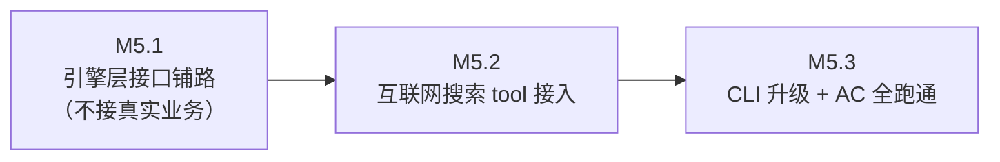
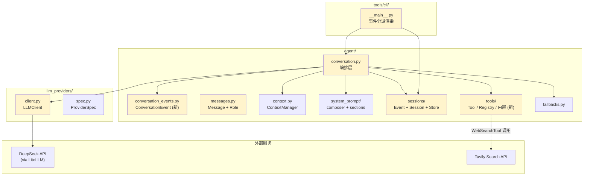
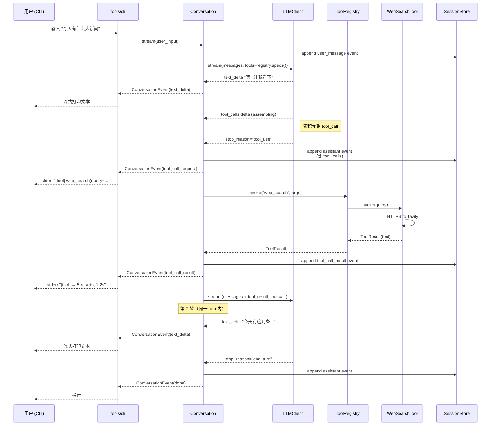
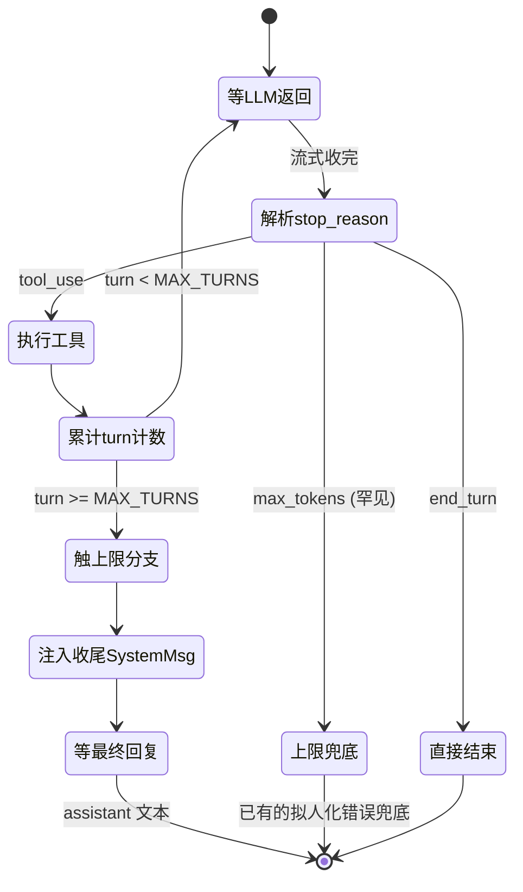

# 005 工具调用机制与互联网搜索 · 技术方案

## 状态

<!-- DRAFT | CONFIRMED -->
CONFIRMED

---

## 0. 文档说明

- 本文档是 [005 需求](./requirement.md) 的技术设计文档，回答 requirement §7 中的 Q-1 ~ Q-8。
- 写作过程：与用户按思路块逐条讨论后形成。严格基于讨论拍板的决定，不引入任何未对齐的设计点。
- 后续在实施过程中如发现接口不足或设计需要调整，回到本文档更新（保持单一信息源）。

---

## 1. 整体目标与边界

### 1.1 本期要做的事

把 LLM 的「工具调用」能力从无到有引入 agent 引擎，并交付第一项真实可用的工具能力（互联网搜索）。具体动作：

1. **`llm_providers/` 扩接口**：让 `LLMClient.stream` 能传 `tools` 参数、能 yield「文本 chunk + 工具调用 delta + 完成事件」三类流事件
2. **`agent/sessions/` 扩 schema**：新增 `tool_call_request` / `tool_call_result` 两类事件类型，进入 append-only JSONL 事件流；现有 schema 不破坏（纯扩展）
3. **`agent/conversation.py` 升级输出协议**：`Conversation.stream` 返回类型从 `Iterator[str]` 升级为 `Iterator[ConversationEvent]`，承载多通道事件（discriminated union）
4. **`agent/tools/` 子包新增**：定义 `Tool` Protocol + `ToolRegistry`，留扩展位让未来 MCP / 远端 tool 等接入只需新增不改核心
5. **`agent/conversation.py` 内置工具调用循环**：基于 LLM 返回的 `stop_reason` 分派；硬上限 + 触上限的兜底动作抽成独立函数
6. **`tools/` 子包新增 `WebSearchTool`**：基于 Tavily provider 的本地 Python 实现
7. **`Message.role` 扩 `"tool"`**：与 OpenAI/Anthropic 协议层对齐（破坏性变更）
8. **`tools/cli` 主循环升级**：消费新 `ConversationEvent` 流，区分「面向用户的连贯文本」与「面向开发的工具观测」双视图

### 1.2 不做的事（YAGNI 边界）

| 不做的事 | 留到 |
|---|---|
| MCP 协议接入 | 单独立项 |
| Skill 调用能力 | 单独立项 |
| 互联网搜索之外的具体 tool（计算器/文件/shell/...） | 各自单独立项 |
| 用户面向的 tool 配置 UI / 启停开关 | 真有用户反馈再立项 |
| 多用户场景的 tool 权限隔离 / 沙箱 | 单设备单用户假设 |
| AI 主动并发执行多个 tool（并行优化） | 协议层兼容多 tool_call，但行为简化为顺序执行 |
| 搜索结果的本地缓存 / 去重 / 持久化索引 | 后期优化 |
| Tool 的细颗粒度行为属性（isReadOnly / isConcurrencySafe / isDestructive 等） | 仅一个 tool，YAGNI |
| Tool 调用过程中用户中断的语义细化（abort 整个循环 vs 只 abort 当前 tool） | 后期优化 |
| Tool 长时间未返回的"AI 还在查"等待 UI | 后期优化 |
| Tool 异步（async）调用 | 本期同步；Protocol 预留 async 重载位 |
| 搜索 provider 多家 fallback / 自动切换 | 仅 Tavily 一家；扩展位通过 Tool 抽象隐式留 |

### 1.3 与既有接口承诺的关系

004 design §6 等位的"不破坏 `Conversation.stream` 返回类型"承诺，本期需要**有限破坏**——理由是协议层升级（让事件流统一支撑文本/工具/未来语音等多通道）的收益大于继续维持 `Iterator[str]` 单通道的成本。

| 既有承诺项 | 本期处理 | 理由 |
|---|---|---|
| `Conversation.send` 签名（`-> str`） | **不破坏** | 同步全量返回的语义不变；忽略 tool 调用过程细节，最终拼出 assistant 文本 |
| `Conversation.stream` 返回类型 | **破坏**：`Iterator[str]` → `Iterator[ConversationEvent]` | 协议级升级，所有形态层（CLI/未来 HTTP+SSE/未来语音）共用同一事件协议 |
| `Conversation.switch_persona / switch_model` | **不破坏** | 002 已就位，本期不动 |
| `Message.role` Literal 集 | **破坏**：加 `"tool"` | 与 OpenAI/Anthropic `role="tool"` 协议对齐 |
| `Message.to_openai()` 返回类型 | **破坏**：`dict[str, str]` → `dict[str, Any]` | `role="tool"` 时要带 `tool_call_id`；含 tool_calls 的 assistant 消息要带 `tool_calls: list[dict]` |
| `Message.content / timestamp / meta / uuid` | **不破坏** | 仅扩 role 集 |
| `LLMClient.complete` 签名 | **不破坏** | 同步全量 API 路径不感知工具调用细节 |
| `LLMClient.stream` 签名 | **破坏**：返回类型升级 + 增加可选 `tools` 参数 | 流式 API 必须暴露工具调用 delta |
| `Event` 已有事件类型集 | **不破坏**（纯扩展） | `ALLOWED_EVENT_TYPES` 增加两个新类型；老文件不会触发新校验路径；`SCHEMA_VERSION` 不动 |
| `SystemPromptComposer` / `Section` 接口 | **不破坏** | 仅在 `project_identity.md` 资源文件中加一两句关于"工具失败兜底"的体验底线，不动结构 |
| `Tool` / `ToolRegistry` | **新增** | 引擎层新公共 API |
| `ConversationEvent` | **新增** | 引擎层新公共类型 |

→ 后续接口承诺以本文档 §6 为准。

---

## 2. 实施路径：3 个里程碑

每个里程碑都是**独立可验证状态**，便于回滚与阶段性 review。



### 2.1 M5.1 引擎层接口铺路（不接真实业务）

**目标**：把"工具调用机制 + 多通道事件流"的地基铺好，用 fake tool 端到端单测整条链路通跑；**完全不动** CLI / 不接真实搜索。

**范围**：

- `agent/tools/` 子包新增：
  - `protocol.py`：`Tool` Protocol（`name` / `description` / `parameters_schema` / `invoke`）
  - `registry.py`：`ToolRegistry` 类（dict 包装 + `list / get / invoke`）
  - `errors.py`：`ToolError` 异常体系
- `agent/sessions/events.py` 扩展：
  - `EventType` Literal 集加 `tool_call_request` / `tool_call_result`
  - `ALLOWED_EVENT_TYPES` 同步加两项
  - `SCHEMA_VERSION` 不动
- `agent/messages.py` 扩展：
  - `Role` Literal 集加 `"tool"`
- `agent/conversation_events.py` 新增（**新模块**）：
  - 定义 `ConversationEvent` discriminated union（`type` 字段分派）
  - 本期类型：`text_delta` / `tool_call_request` / `tool_call_result` / `done` / `error`
- `llm_providers/client.py` 扩展：
  - `LLMClient.stream` 加可选 `tools` 参数
  - 返回类型从 `Iterator[str]` 升级为 `Iterator[LLMStreamEvent]`（内部新类型，仅 llm_providers 自用）
  - 同步映射 LiteLLM 流式响应里的 `tool_calls` delta 到 `LLMStreamEvent`
- `agent/conversation.py` 内核改造：
  - 新增 `_build_openai_messages_with_tools` 内部方法，注入 `tools` 参数
  - 新增 `_run_tool_call_loop` 内部方法承载循环骨架（基于 `stop_reason` 分派）
  - 新增 `_finalize_on_tool_loop_limit` 独立函数（触上限的兜底，**抽出来便于未来替换策略**）
  - `Conversation.stream` 返回类型升级；旧调用方（CLI）暂未升级时**会编译失败**——这是本期有意暴露的破坏面，M5.3 修复
- 测试：用 fake `EchoTool`（输入字符串返回相同字符串）端到端跑"LLM → tool_call → 执行 → 回喂 → 再回复"链路，覆盖 happy path + 失败兜底 + 触上限三种场景

**完成标志**：

- 单测覆盖 `Tool` / `ToolRegistry` / `ConversationEvent` 序列化/反序列化 / 调用循环骨架
- 集成测试：用 fake EchoTool 跑端到端 stream，能从 `Iterator[ConversationEvent]` 中观察到所有期望事件
- **CLI 此时编译失败是预期内**——`tools/cli/__main__.py` 的修复留给 M5.3

### 2.2 M5.2 互联网搜索 tool 接入

**目标**：在 M5.1 的抽象上落地第一项真实可用的 tool。

**范围**：

- 引入 `tavily-python` 依赖（pyproject.toml）
- `agent/tools/builtin/web_search.py` 新增（**`agent` 子包内自带的 tool 实现**）：
  - `WebSearchTool` 类实现 `Tool` Protocol
  - 通过 `os.environ.get("TAVILY_API_KEY")` 读 key（pydantic-settings 风格、与 0002 §3.17 一致）
  - 输入参数 schema：`query: str`（必填）；本期不暴露 `allowed_domains` / `blocked_domains` 等高级字段
  - `invoke` 同步发 HTTPS 请求到 Tavily，返回若干结果的纯文本拼接
  - 失败处理：网络/认证/限流等异常 catch 并转为带 error 标记的字符串返回（不直接 raise，让循环编排层决定如何处理）
  - 在 result 末尾附加 inline reminder（"基于上面的搜索结果用自己的话回答用户，不要直接贴 URL"）
- `agent/__init__.py` 导出 `WebSearchTool` + 默认 `make_default_registry()` 工厂
- 测试：
  - 单测：mock Tavily 响应，验证结果格式、失败兜底
  - 集成测：`Conversation` 注入含 `WebSearchTool` 的 registry，端到端跑"用户问实时信息 → 触发 tool → 拿到结果 → AI 整合回复"——**这一步会触发 LLM API 实际调用，按 `llm-api-confirm` rule 启动前需用户授权**

**完成标志**：

- 单测覆盖 search 成功 / 失败 / 限流 / 认证错四种场景
- 集成测端到端跑通（用户授权后真跑 LLM）
- **CLI 此时仍编译失败**——继续留给 M5.3

### 2.3 M5.3 CLI 升级 + AC 全跑通

**目标**：CLI 走新引擎接口，落实"用户视角连贯文本 + 开发视角看见 tool 全过程"双视图；requirement.md AC-1 ~ AC-6 全部通过。

**范围**：

- `tools/cli/__main__.py` 主循环改造：
  - `for event in ctx.conv.stream(...)` 按 `event.type` 分派渲染：
    - `text_delta` → stdout 流式打印（保持 001 起的"打字机效果"）
    - `tool_call_request` → stderr 灰字打印 `[tool] web_search(query="...")`
    - `tool_call_result` → stderr 灰字打印 `[tool] → N results, X.Xs`（成功）/ 红字 `[tool] ✗ 错误简述`（失败）
    - `done` → 换行 + 可能的状态信息
    - `error` → 走 001 已就位的兜底话术池（`agent/fallbacks.py`）
- `_replay_history` 升级：从 session events 中识别 `tool_call_request` / `tool_call_result` 类型，按上面的渲染规则一致呈现
- CLI 默认装配 `make_default_registry()`（含 `WebSearchTool`）；未来若要切其它 registry，构造 `SessionManager` 时注入
- `agent/prompt_sections/project_identity.md` 资源更新：在已有"严守人设/不暴露身份/不元讨论"三条之后追加一条"工具失败时拟人化兜底，不暴露 API/provider/错误码"
- 测试：requirement §6 的 AC-1 ~ AC-6 全部跑通（**LLM 真调，按 `llm-api-confirm` rule 启动前用户授权**）

**完成标志**：

- 全部 AC 通过
- 既有 001 ~ 004 的测试无回归
- CLI 体感：用户问"今天有什么大新闻" → 看到 `[tool] web_search(...)` 提示后看到 AI 流式回复
- 调试可见 / 用户视图分离两条体验底线落实

---

## 3. 整体架构

### 3.1 模块依赖关系



**图例**：浅黄色块 = 本期改动的模块；其余 = 仅依赖关系不变化。

**关键约束**：

- `agent/tools/` 不依赖 `tools/cli/`（避免引擎反向依赖客户端）
- `agent/conversation.py` 同时依赖 `tools/`（执行）+ `conversation_events.py`（事件协议）
- `WebSearchTool` 作为内置 tool 放在 `agent/tools/builtin/`，与 Protocol 同包但层级清晰

### 3.2 一次"触发工具调用"的完整时序



### 3.3 调用循环的三个出口



- 正常路径：`tool_use` → 执行 → 再调 LLM；`end_turn` 时退出
- 触上限：硬上限 `MAX_TURNS=5`（**经验值，可调**），到达后注入一条 system message 引导 LLM 用已有信息总结收尾；不直接抛错
- `max_tokens`：DeepSeek 较少触发，触发时走 001 已就位的拟人化兜底

---

## 4. 各模块详细设计

### 4.1 `Tool` Protocol 与 `ToolRegistry`

#### 4.1.1 `Tool` Protocol（`agent/tools/protocol.py`）

```python
from typing import Protocol, Any, runtime_checkable

@runtime_checkable
class Tool(Protocol):
    """单个 tool 的最小契约。具体实现可以是内置 Python 类、未来的 MCP 桥接等。"""

    name: str
    """tool 名（在同一个 registry 内唯一；建议 snake_case）"""

    description: str
    """给 LLM 看的简短描述（一句话讲清楚做什么、何时用）"""

    parameters_schema: dict[str, Any]
    """JSON Schema (draft-07) 描述 invoke 入参；遵循 OpenAI tool calling spec"""

    def invoke(self, args: dict[str, Any]) -> "ToolResult":
        """同步执行；失败用 ToolResult.error 字段表达，不抛业务异常。
        协议级异常（实现 bug）允许 raise，由调用循环兜底。"""
        ...
```

**设计要点**：

- **同步**接口（不是 `async`）：与 0002 §3.4 选定的"同步优先"基调一致；未来若引入异步 tool（如长任务、流式日志输出），通过新增可选方法 `async_invoke` 扩展，不破坏现有同步实现
- **不绑定渲染**：Protocol 上无 `render_xxx` / `user_facing_name` 等 UI 相关方法，UI 渲染统一由 CLI / 前端基于 `ConversationEvent` 决定
- **不绑定权限**：本期不做沙箱 / 用户开关，因此不引入 `is_read_only` / `check_permissions` 等字段；未来真有需求时通过新增可选方法扩展
- **`parameters_schema` 用 `dict`**：直接是 OpenAI tool calling spec 要求的 JSON Schema 字典，避免再加一层 Pydantic 转换；写 tool 时保持显式

#### 4.1.2 `ToolResult`（`agent/tools/protocol.py`）

```python
from dataclasses import dataclass

@dataclass(frozen=True)
class ToolResult:
    """tool 执行的统一返回结构。"""

    text: str
    """喂回 LLM 的纯文本（即使 tool 内部产生结构化数据，也要在这里序列化成文本）"""

    is_error: bool = False
    """True 表示业务级失败（网络错/key 错/限流等）；False = 正常结果"""

    meta: dict[str, Any] | None = None
    """供观测/日志用的额外信息（如耗时、result 数量、原始 provider 错误码）；
    不会喂回 LLM。CLI 可以读它做更精细的可视化。"""
```

**设计要点**：

- `text` 是契约必须字段——LLM 协议里的 `tool_result.content` 必须是字符串
- `is_error=True` 时仍然返回 `text`（描述失败的话术），调用循环负责把它作为 `tool` role message 回喂 LLM，让 LLM 决定要不要再试一次或换路
- `meta` 不会进入 LLM 上下文；落 session event 时进 `meta` 字段，CLI 可消费

#### 4.1.3 `ToolRegistry`（`agent/tools/registry.py`）

```python
class ToolRegistry:
    """tool 名 → Tool 的查找表。"""

    def __init__(self, tools: list[Tool]) -> None: ...

    def all_tools(self) -> list[Tool]: ...
    def get(self, name: str) -> Tool: ...
    def invoke(self, name: str, args: dict[str, Any]) -> ToolResult: ...

    def to_openai_tools(self) -> list[dict[str, Any]]:
        """转换为 OpenAI tool calling API 要求的 tools 数组（喂给 LiteLLM）。"""
```

> 命名说明：`all_tools()` 而非 `list()`——避免与 Python 内置 `list` 冲突（mypy 会因方法名遮蔽 `list[Tool]` 类型注解而报错）。

**设计要点**：

- **构造期固化**：本期不做"运行时动态注册/卸载"；如果未来 MCP 接入需要运行时拉新工具，通过派生类或新方法扩展，不动现有契约
- **`to_openai_tools()` 内置在 registry 上**：避免每次构造 LLM 请求时都遍历转换，且 LLM provider 抽象层不感知 tool spec 细节
- 不重名校验：构造时如果有重名直接 raise（fail-fast）

#### 4.1.4 默认 registry 工厂（`agent/__init__.py`）

```python
def make_default_registry() -> ToolRegistry:
    """组装内置 tool 集合的默认配置。"""
    return ToolRegistry([WebSearchTool()])
```

CLI 默认调这个；未来需要"无 tool"模式或"换其它 tool 集"时，构造时注入自定义 registry。

### 4.2 Event schema 扩展（`agent/sessions/events.py`）

#### 4.2.1 `EventType` 加两项

```python
EventType = Literal[
    "system_prompt",      # 既有
    "user_message",       # 既有
    "assistant_message",  # 既有
    "tool_call_request",  # 新增
    "tool_call_result",   # 新增
]
```

`ALLOWED_EVENT_TYPES` 同步加。`SCHEMA_VERSION` **不动**——已有的 1.x 文件读出来不会触发新事件类型的校验路径，是纯加性变更。

#### 4.2.2 新事件类型的 payload / meta 字段约定

**字段分配原则**（与既有事件惯例一致）：

- `payload` = 事件的核心业务数据（如既有的 `user_message.payload.content` / `persona_change.payload.from / to`）
- `meta` = 追加性元信息（如既有的 `assistant_message.meta = {persona, model}`）

**`tool_call_request`**：

```jsonc
{
  "type": "tool_call_request",
  "uuid": "...",
  "ts": "...",
  "payload": {
    "tool_call_id": "call_abc123",   // LLM 给的 ID（OpenAI 协议）
    "tool_name": "web_search",
    "args": { "query": "今天的新闻" },
    "parent_uuid": "..."              // 关联的 assistant message uuid
  },
  "meta": {}                          // 本期空；未来可加 attempt_idx 等
}
```

**`tool_call_result`**：

```jsonc
{
  "type": "tool_call_result",
  "uuid": "...",
  "ts": "...",
  "payload": {
    "tool_call_id": "call_abc123",   // 同 request 关联
    "tool_name": "web_search",
    "content": "搜索结果文本...",     // 喂回 LLM 的 text（来自 ToolResult.text）
    "is_error": false
  },
  "meta": {
    "duration_seconds": 1.23,
    "extra": { ... }                  // ToolResult.meta 透传
  }
}
```

> 字段命名一致性：`tool_call_result.payload.content` 与 `user_message.payload.content` / `assistant_message.payload.content` 同名，便于在派生逻辑里复用 `ev.payload["content"]` 同样的读取方式。

#### 4.2.3 `Session.messages` 派生逻辑扩展

`agent/sessions/session.py` 的 `messages` 属性从 events 流派生 `Message` 列表时：

- `tool_call_request` 不直接产生独立 `Message`——它依附在前一个 `assistant_message` 派生出的 Message 的 `meta["tool_calls"]` 上（OpenAI 协议要求 `assistant` role 消息携带 `tool_calls` 字段）
- `tool_call_result` 产生一条 `role="tool"` 的 `Message`：
  - `content = ev.payload["content"]`
  - `meta["tool_call_id"] = ev.payload["tool_call_id"]`（用于 `to_openai()` 时回填）
  - `meta["tool_name"] = ev.payload["tool_name"]`

派生算法（确定性）：扫描 events，每碰到 `tool_call_request` 就把它累积到上一条 assistant Message 的 `meta["tool_calls"]` 列表里；每碰到 `tool_call_result` 就 emit 一条 tool Message。

#### 4.2.4 老 session 兼容

老 JSONL 文件（M1 / M2 时期写的）不含新类型，读取行为完全不变。新类型写入后，旧版本代码读到 unknown type 会抛 `ValueError`（已有逻辑）——不主动做"老版本兼容读新文件"，因为没有降级使用场景。

### 4.3 `Message.role` 扩 `"tool"`

```python
Role = Literal["system", "user", "assistant", "tool"]
```

- `Message.to_openai()` 对 `role="tool"` 做特殊序列化：必须带 `tool_call_id` 字段（从 `meta.tool_call_id` 取）
- `role="assistant"` 的消息在含 tool 调用时，`to_openai()` 输出里要带 `tool_calls` 数组（从 `meta.tool_calls` 取）

这是和 OpenAI/Anthropic spec 的事实标准对齐，无可商量。

### 4.4 `ConversationEvent`（`agent/conversation_events.py`）

#### 4.4.1 类型定义

```python
from dataclasses import dataclass
from typing import Literal, Union

@dataclass(frozen=True)
class TextDelta:
    type: Literal["text_delta"] = "text_delta"
    text: str = ""

@dataclass(frozen=True)
class ToolCallRequest:
    type: Literal["tool_call_request"] = "tool_call_request"
    tool_call_id: str = ""
    tool_name: str = ""
    args: dict[str, Any] = None  # 实际用 default_factory=dict

@dataclass(frozen=True)
class ToolCallResult:
    type: Literal["tool_call_result"] = "tool_call_result"
    tool_call_id: str = ""
    tool_name: str = ""
    text: str = ""
    is_error: bool = False
    duration_seconds: float = 0.0

@dataclass(frozen=True)
class TurnDone:
    type: Literal["done"] = "done"
    stop_reason: str = ""        # "end_turn" | "max_turns_reached" | ...
    total_tool_calls: int = 0    # 本 turn 累计 tool 调用次数

ConversationEvent = Union[TextDelta, ToolCallRequest, ToolCallResult, TurnDone]
```

**设计要点**：

- **discriminated union**：`type` 字段严格 Literal，运行期通过 `match` 或 `if isinstance` 分派
- **粒度统一**：所有事件都是"流式 chunk + 完成事件"层级，不混杂"整体 message"层级——后者由 sessions 的 `Event` 流承载
- **错误处理走 `raise` 路径**：LLM 失败抛 `LLMError` 子类（与 001/002 已建立的错误处理体系一致），不在 union 里再加错误事件类型。工具的业务级失败已经通过 `ToolCallResult.is_error=True` 表达，不需要额外的错误事件
- **未来扩展**：加新事件类型只需新增一个 dataclass + 加进 union 类型；不破坏既有消费方（消费方对未知 `type` 应 fall-through 忽略，但 CLI 在本期阶段还不实现这种宽容——M5.3 时需要把 fall-through 加上以便未来兼容）
- **不直接复用 `sessions.Event`**：sessions.Event 是"持久化事件"语义；ConversationEvent 是"流式输出事件"语义。两者职责不同，强行复用会造成"该不该入库"的歧义

#### 4.4.2 与未来语音/HTTP-SSE 的关系

未来若要：

- HTTP+SSE：直接把每个 `ConversationEvent` 序列化成 `data: {...}\n\n`，通过 SSE 连接推给前端
- 语音：新增 `audio_delta` / `audio_done` 等事件类型；CLI/前端按 `type` 分派"播放器组件 vs 文本渲染"

**不需要重新设计 `Conversation.stream` 接口**——这正是本期把它升级为 union 的核心收益。

### 4.5 `LLMClient` 接口扩展（`llm_providers/client.py`）

#### 4.5.1 `LLMStreamEvent`（llm_providers 内部新类型）

```python
@dataclass(frozen=True)
class LLMTextDelta:
    type: Literal["text_delta"] = "text_delta"
    text: str = ""

@dataclass(frozen=True)
class LLMToolCallDelta:
    """流式 tool_call 增量；同一个 tool_call_id 可能多次到达，需要客户端累积。"""
    type: Literal["tool_call_delta"] = "tool_call_delta"
    index: int = 0
    tool_call_id: str = ""        # 第一次到达时给出
    tool_name: str = ""           # 第一次到达时给出
    args_json_delta: str = ""     # JSON 字符串片段

@dataclass(frozen=True)
class LLMTurnDone:
    type: Literal["done"] = "done"
    stop_reason: str = ""         # "end_turn" | "tool_use" | "max_tokens" | ...

LLMStreamEvent = Union[LLMTextDelta, LLMToolCallDelta, LLMTurnDone]
```

#### 4.5.2 `LLMClient.stream` 升级

```python
def stream(
    self,
    messages: list[dict[str, Any]],
    *,
    tools: list[dict[str, Any]] | None = None,  # 新增
) -> Iterator[LLMStreamEvent]:                  # 返回类型升级
    ...
```

- 内部把 LiteLLM 流式响应里的：
  - `delta.content` → `LLMTextDelta`
  - `delta.tool_calls[*]` → `LLMToolCallDelta`（带 index/id/name/args_json_delta）
  - 流式结束时根据 `finish_reason` yield `LLMTurnDone`
- 异常映射保持现状（network/auth/server）；异常时直接 raise，由 conversation 层兜底

#### 4.5.3 `LLMClient.complete` 不变

`complete()` 是"全量同步返回字符串"语义，本期工具调用不通过 complete 路径。如未来需要在 complete 路径支持 tool（罕见场景），单独评估。

### 4.6 `Conversation` 内核改造（`agent/conversation.py`）

#### 4.6.1 主流程伪码

```python
def stream(self, user_input: str) -> Iterator[ConversationEvent]:
    self._append_user_event(user_input)

    for turn_idx in range(MAX_TURNS):
        messages = self._build_messages_with_tools()
        tool_specs = self._registry.to_openai_tools() if self._registry else None

        text_buf = ""
        tool_calls_buf: list[ToolCallAccumulator] = []
        stop_reason = ""

        for ev in self._llm.stream(messages, tools=tool_specs):
            match ev:
                case LLMTextDelta(text=t):
                    text_buf += t
                    yield TextDelta(text=t)
                case LLMToolCallDelta() as tcd:
                    self._accumulate_tool_call(tool_calls_buf, tcd)
                case LLMTurnDone(stop_reason=sr):
                    stop_reason = sr

        self._append_assistant_event(text_buf, tool_calls_buf)

        if stop_reason == "end_turn" or not tool_calls_buf:
            yield TurnDone(stop_reason="end_turn", total_tool_calls=...)
            return

        # stop_reason == "tool_use"：执行所有 tool_call（顺序）
        for tc in tool_calls_buf:
            yield ToolCallRequest(...)
            self._append_tool_call_request_event(tc)

            try:
                result = self._registry.invoke(tc.name, tc.args)
            except Exception as exc:
                result = ToolResult(text=f"工具执行出错：{exc}", is_error=True)

            yield ToolCallResult(...)
            self._append_tool_call_result_event(tc, result)

    # 触上限
    yield from self._finalize_on_tool_loop_limit()
```

#### 4.6.2 触上限的兜底（`agent/conversation.py` 内独立函数）

```python
def _finalize_on_tool_loop_limit(self) -> Iterator[ConversationEvent]:
    """工具调用循环达到 MAX_TURNS 时的收尾策略。

    抽出独立函数便于未来替换不同策略（如改成截断式收尾、或交由用户决定继续）。
    """
    # 注入一条临时 system message，引导 LLM 用已有信息直接回复用户
    extra_system = "你已经多次调用工具仍未达成目标，请基于已有信息用一两句话直接回复用户，不要再调用任何工具。"

    messages = self._build_messages_with_tools() + [
        {"role": "system", "content": extra_system}
    ]

    text_buf = ""
    for ev in self._llm.stream(messages, tools=None):  # 关键：tools=None 杜绝再触发
        match ev:
            case LLMTextDelta(text=t):
                text_buf += t
                yield TextDelta(text=t)
            case LLMTurnDone():
                pass

    self._append_assistant_event(text_buf, tool_calls=[])
    yield TurnDone(stop_reason="max_turns_reached", total_tool_calls=MAX_TURNS)
```

**为什么抽成独立函数**：触上限后该如何收尾是策略级决策（拟人化敷衍 / 直接报错 / 让用户继续），未来可能调整；隔离成函数后替换策略不需要动主循环。

#### 4.6.3 `MAX_TURNS` 参数化

```python
MAX_TURNS = 5  # 模块常量，可通过环境变量覆盖
```

经验值 5 的依据：单次 turn 通常 1 ~ 2 次 tool 调用足够；3 次以上往往是 LLM 在死循环。环境变量 `AGENT_MAX_TOOL_TURNS` 可覆盖（dev/test 调小、特殊场景调大）。

#### 4.6.4 `Conversation.send` 的兼容性

```python
def send(self, user_input: str) -> str:
    """对外仍是同步全量返回。内部消费 stream() 的 TextDelta，拼出 assistant 文本。"""
    text_buf = ""
    for ev in self.stream(user_input):
        if isinstance(ev, TextDelta):
            text_buf += ev.text
        # tool_call_request / tool_call_result / done / error 在 send() 路径下被静默丢弃
        # （send 调用者不关心过程细节，只要最终文本）
    return text_buf
```

- `send()` 在工具调用过程中**不暴露**任何 tool 信息——这是 send 这个方法名所代表的"问一句答一句"语义所要求的
- 测试场景或 headless 调用方使用 send() 时仍可正常工作

### 4.7 `WebSearchTool` 实现（`agent/tools/builtin/web_search/`）

#### 4.7.1 模块结构

`web_search` 内部把"搜索能力的对外形态"和"具体 provider 实现"切成两层，让对外 Tool 不依赖任何具体 provider，未来切换 / 新增 provider 通过新增类即可，不动 Tool 主体。

```
agent/src/agent/tools/builtin/web_search/
├── __init__.py            # 仅导出 WebSearchTool
├── tool.py                # SearchHit + WebSearchProvider Protocol + WebSearchTool
└── providers/             # 具体 provider 实现集中在此
    ├── __init__.py
    └── tavily.py          # 本期唯一具体实现（TavilyProvider）
```

依赖方向：`providers/tavily.py` → `tool.py`（import `WebSearchProvider` Protocol + `SearchHit`）；反向不依赖。这样 `tool.py` 不感知任何 provider 名字。

#### 4.7.2 `tool.py`：对外接口集

三件套：

```python
@dataclass(frozen=True)
class SearchHit:
    """provider 解耦的结果数据结构。"""
    title: str
    url: str
    snippet: str


class WebSearchProvider(Protocol):
    """搜索 provider 的最小契约。仅 web_search 内部消费，不暴露到 agent.tools 公共 API。"""

    name: ClassVar[str]                            # "tavily" / 未来 "bocha" / ...

    def search(self, query: str, max_results: int) -> list[SearchHit]:
        """同步发起搜索请求。

        Raises:
            WebSearchAuthError: 认证错（key 错或失效）
            WebSearchRateLimitError: 触达 provider 限流
            WebSearchNetworkError: 网络错或超时
            WebSearchProviderError: 其它 provider 侧错（含未分类）
        """
        ...


class WebSearchTool:
    """对外的 Tool（LLM 看到的）。不依赖具体 provider。"""
    name: ClassVar[str] = "web_search"
    description: ClassVar[str] = (
        "搜索互联网获取实时信息（新闻、天气、价格、时事等）。"
        "当用户问及超出训练数据时间范围的信息时使用。"
    )
    parameters_schema: ClassVar[dict[str, Any]] = {
        "type": "object",
        "properties": {
            "query": {
                "type": "string",
                "description": "搜索查询。用清晰的自然语言描述要找的信息。",
            },
        },
        "required": ["query"],
    }

    def __init__(self, provider: WebSearchProvider, max_results: int = 5) -> None:
        self._provider = provider
        self._max_results = max_results

    def invoke(self, args: dict[str, Any]) -> ToolResult:
        query = args["query"]
        start = time.monotonic()
        try:
            hits = self._provider.search(query, self._max_results)
        except WebSearchAuthError:
            return ToolResult(text="搜索失败：API 鉴权错误", is_error=True)
        except WebSearchRateLimitError:
            return ToolResult(text="搜索失败：触达限流", is_error=True)
        except WebSearchNetworkError:
            return ToolResult(text="搜索失败：网络错误", is_error=True)
        except WebSearchProviderError as exc:
            return ToolResult(text=f"搜索失败：{exc}", is_error=True)

        text = _format(query, hits)
        duration = time.monotonic() - start
        return ToolResult(
            text=text,
            is_error=False,
            meta={
                "duration_seconds": duration,
                "result_count": len(hits),
                "provider": self._provider.name,
            },
        )


def _format(query: str, hits: list[SearchHit]) -> str:
    """把 SearchHit 列表拼成喂给 LLM 的纯文本。

    Provider 无关——任何 provider 返回的 SearchHit 都用同一格式化逻辑，
    便于未来加新 provider 时复用 + 视觉一致。
    """
    if not hits:
        return f"对 '{query}' 的搜索没找到相关结果。"
    lines = [f"对 '{query}' 的搜索结果（top {len(hits)}）："]
    for i, h in enumerate(hits, 1):
        lines.append(f"\n[{i}] {h.title}\nURL: {h.url}\n{h.snippet[:500]}")
    lines.append(
        "\n\n请基于以上信息用自己的话回答用户。如果引用了具体内容，"
        "用拟人化方式提及来源（例如'我在新闻里看到...'），不要直接贴 URL。"
    )
    return "\n".join(lines)
```

#### 4.7.3 `providers/tavily.py`：本期唯一具体实现

```python
class TavilyProvider:
    """Tavily Search API 的 WebSearchProvider 实现。"""

    name: ClassVar[str] = "tavily"

    def __init__(self, api_key: str) -> None:
        self._api_key = api_key

    def search(self, query: str, max_results: int) -> list[SearchHit]:
        from tavily import TavilyClient

        try:
            client = TavilyClient(api_key=self._api_key)
            resp = client.search(query=query, max_results=max_results)
        except <tavily AuthenticationError> as e:
            raise WebSearchAuthError(str(e)) from e
        except <tavily RateLimitError> as e:
            raise WebSearchRateLimitError(str(e)) from e
        except <connection / timeout> as e:
            raise WebSearchNetworkError(str(e)) from e
        except Exception as e:
            raise WebSearchProviderError(str(e)) from e

        return [
            SearchHit(
                title=r.get("title", ""),
                url=r.get("url", ""),
                snippet=r.get("content", ""),
            )
            for r in resp.get("results", [])
        ]
```

> 异常类的具体名字（`AuthenticationError` / `RateLimitError` / 网络错）待 M5.2 实施时按 `tavily-python` 实际 API 校准。

**设计要点**：

- **WebSearchProvider 抽象在 web_search 内部**：不上升到 `agent.tools` 公共 API。引擎层只看到 `Tool` / `ToolRegistry`；`WebSearchProvider` 是 web_search 模块的实现细节
- **错误用本模块自有异常向上传**：`WebSearchAuthError` / `RateLimitError` / `NetworkError` / `ProviderError` 在 `tool.py` 中定义，provider 实现负责把各自 SDK 的异常 catch 后映射成本模块异常向上传。这样 `WebSearchTool.invoke` 只需 catch 本模块异常，不感知具体 SDK
- **`_format` 抽成模块级函数**：与 provider 解耦，所有 provider 返回的 `SearchHit` 共用同一格式化路径
- **错误分类映射到 is_error=True**：循环编排层把它作为 tool message 回喂 LLM 让其换路；用户可见的拟人化兜底由 LLM 自行表达
- **inline reminder**：`_format` 末尾的"请基于以上信息用自己的话回答用户...不要直接贴 URL"是引导语，与 product vision §3.1 的"像真人朋友"原则一致
- **不实现 retry**：单次失败直接返回 error；LLM 自己决定要不要再调一次

#### 4.7.4 配置来源

`TAVILY_API_KEY` 通过 `.env`（已 git-ignore）+ `os.environ.get` 读取，与 0002 §3.17 一致。

`TavilyProvider` 构造期不读 env（接受外部传入的 `api_key`），让 provider 可独立测试 / 多账号场景中可注入；env 读取统一在工厂层（§4.7.5）做。

#### 4.7.5 `make_default_registry()` 工厂

放在 `agent/tools/factory.py`。职责：

- 读 `TAVILY_API_KEY` 环境变量
- 若读不到：返回空 `ToolRegistry`（无 tool），并 stderr 提示一行"未配置 TAVILY_API_KEY，搜索能力已关闭"——保证未配置 key 的用户也能正常使用基础对话
- 若读到：构造 `TavilyProvider(api_key=...)` → `WebSearchTool(provider=provider)` → `ToolRegistry([web_search])`

未来加新 provider（如 Bocha）时：

- 新增 `web_search/providers/bocha.py`（不动 `tool.py`）
- `make_default_registry` 加挑选逻辑（优先级 / 优先用某家等，约 5 行）
- `.env.example` 加 `BOCHA_API_KEY` 占位
- `pyproject.toml` 加新 SDK 依赖

`WebSearchTool` / `Tool` Protocol / 引擎调用循环 / CLI 全部 0 改动。

### 4.8 `tools/cli/__main__.py` 主循环升级

伪码（保留既有的 LLMError / KeyboardInterrupt / SessionPersistError 的 `try/except` 分支不动）：

```python
try:
    for ev in ctx.conv.stream(user_input):
        match ev:
            case TextDelta(text=t):
                sys.stdout.write(t)
                sys.stdout.flush()
            case ToolCallRequest(tool_name=n, args=a):
                args_brief = _brief(a)  # query 长度截断
                print(f"\n\033[90m[tool] {n}({args_brief})\033[0m", file=sys.stderr)
            case ToolCallResult(is_error=False, duration_seconds=d, ...):
                print(f"\033[90m[tool] → done, {d:.1f}s\033[0m", file=sys.stderr)
            case ToolCallResult(is_error=True, ...):
                print(f"\033[31m[tool] ✗ {ev.text[:80]}\033[0m", file=sys.stderr)
            case TurnDone():
                sys.stdout.write("\n")
            case _:  # 未知 type 忽略，前向兼容
                pass
except LLMAuthError as e:
    ...  # 与既有 001/002 处理一致：拟人化兜底或退出
except KeyboardInterrupt:
    ...  # 中断本轮回复
except SessionPersistError as e:
    ...  # 落盘失败提示
```

`_replay_history` 在重放 session 时按相同规则渲染历史 tool 调用：从 events 流里识别 `tool_call_request` / `tool_call_result` 类型，用与实时模式一致的视觉风格重放。

### 4.9 `SystemPromptComposer` 与 `prompt_sections`

不动接口。`agent/prompt_sections/project_identity.md` 资源文件追加一句（不动结构）：

> 当工具调用失败（如搜索打不通）时，保持人设拟人化敷衍："好像没查到 / 网不太好"等，不要暴露 API、错误码、provider 名等技术细节。

这是 requirement R-4.4 的兜底落实点。

### 4.10 `RuntimeContextSection` 与运行时上下文注入

**问题来源**：M5.2 真调 smoke 暴露了"自主决策路径不稳定"——LLM 不知道当前真实日期（默认按训练数据 cutoff 推算），导致：

- 即使代码链路正确（`tool_specs` 正常透传），LLM **不一定**主动调用 `web_search`
- 即使调了，搜索 query 里的年份用的是训练数据时期（如 2025）而非真实当前年份
- "Tavily 公司是哪一年成立的"这种具体事实问题，LLM 倾向凭训练数据猜测（v2 smoke 错答 "2023"）

**解法**：复用 004 §6.2 已经允许的扩展点（"增加新 Section 默认实现，如 `DynamicTimeSection`"），新增第 4 个默认 slot。

**位置**：`agent/src/agent/system_prompt/sections.py` 加 `RuntimeContextSection`；模板内容放 `agent/src/agent/prompt_sections/runtime_context.md`；`composer.py::default()` 末尾追加。

**Section 结构**：

```python
@dataclass(frozen=True)
class RuntimeContextSection:
    key: str                                       # 约定 "runtime_context"
    template: str                                  # 含 "{current_time}" 占位符
    clock: Callable[[], datetime] = _default_now   # 测试可注入固定时钟

    def render(self) -> str | None:
        now = self.clock()
        current_time = now.strftime("%Y-%m-%d %H:%M")
        rendered = self.template.replace("{current_time}", current_time)
        return rendered.strip() or None
```

**模板内容**（`runtime_context.md`）三段式：

1. **当前时间**（动态注入；分钟精度，支持跨 0 点自然滚动）
2. **knowledge cutoff 提示**（"内部知识不覆盖 2024 下半年起的近期信息"——本期写死 + TODO；未来切其它 provider 时再扩"按 model 推断"）
3. **强约束工具使用引导**：
   - 时效性问题**必须**调 web_search（不要凭印象作答）
   - 搜索 query **必须**用上方"当前时间"中的年份
   - 涉及具体公司/产品/人物事实如不确定则验证后回答
   - 整合结果时保持人设语气（不暴露 AI 身份 / 不直接贴 URL）
   - **额外约束**：与 `project_identity.md` 既有禁令配合——LLM 内部知道 cutoff 但不脱口而出"我的训练数据截止到 X"

**装配位置**：放在 default 装配的**最末尾**（`project_identity` → `persona` → `persona_switch_strategy` → **`runtime_context`**）。理由：

1. **recency bias**：LLM 对靠近 user message 的内容更关注；含强约束的运行时引导放最后效果最好
2. **逻辑层次**：身份（不变）→ 人设（中变）→ 切换策略（中变）→ 运行时上下文（每会话变）
3. **cc 同款做法**：cc 的 `# Environment` 也放在 system prompt 中后部，靠近 `# Tools` 而非靠近 `# System`

**为什么不影响 004 接口稳定性**：

- 004 §6.2"允许的扩展"明确列了"增加新默认 slot（追加到 `default()` 末尾、加进 `DEFAULT_KEYS`）"和"增加新 Section 默认实现（如 `DynamicTimeSection`）"
- `Section` Protocol、`SystemPromptComposer.compose() / with_section / without` 等接口形态完全没动
- `DEFAULT_KEYS` 元组延长（破坏假设"长度=3"的调用方），但调用方应使用 `DEFAULT_KEYS` 而非硬编码长度（004 §6.1 已承诺 `DEFAULT_KEYS` 是元组）

**验收**：通过 v3 真调 smoke。4 个自然语气 query（含一个明确命令式触发）全部触发 `web_search` 且搜索 query 含正确年份；其中"Tavily 成立年份"由 LLM 主动查证后回答 2024（修复前凭印象答 "2023"）。

---

## 5. 决策汇总表

### 5.1 Q-1 ~ Q-8（requirement.md §7 中提出的开放问题）

| 编号 | 问题 | 决策 | 落点 |
|---|---|---|---|
| Q-1 | 搜索 provider 选哪家 | **Tavily**（可达性好、对中国 IP 友好、有免费额度、原生为 LLM 优化、Python SDK 成熟） | §4.7 |
| Q-2 | tool 调用循环上限策略 | **硬上限 `MAX_TURNS=5`**；触上限时注入收尾 system msg 引导 LLM 用已有信息直接回复用户 | §4.6.2 / §4.6.3 |
| Q-3 | tool 失败时怎么对用户表达 | **不暴露技术细节**；错误的 `ToolResult.text` 仅给 LLM 看，让 LLM 拟人化敷衍；persona prompt 加一条底线指引 | §4.7 / §4.9 |
| Q-4 | tool 调用对应的事件 schema | 新增 `tool_call_request` / `tool_call_result` 两类事件；`SCHEMA_VERSION` 不动；payload 进 `meta` 字段 | §4.2 |
| Q-5 | 多轮 tool 调用是否并发 | **本期顺序执行**；协议层兼容 LLM 一次返回多个 `tool_calls`，但实现上一个一个调 | §4.6.1 |
| Q-6 | tool 是否应支持异步（async） | **本期同步**；Protocol 不带 `async_invoke`；未来扩展通过新增可选方法，不破坏现有同步实现 | §4.1.1 |
| Q-7 | search API key 配置方式 | `.env` + `os.environ.get("TAVILY_API_KEY")`；未配置时降级为空 registry，给 stderr 提示 | §4.7.2 |
| Q-8 | 调试可见性如何实现 | CLI 双视图：stdout 走用户看的连贯文本，stderr 走开发者看的灰字 `[tool] ...` 提示 | §4.8 |

### 5.2 N-1 ~ N-5（design 阶段独立做出的决策）

| 编号 | 决策点 | 决策 | 理由 |
|---|---|---|---|
| N-1 | `Conversation.stream` 返回类型是否破坏式升级 | **是**：升级为 `Iterator[ConversationEvent]` discriminated union | 协议级升级一次性到位，避免后续语音/SSE 时再次破坏 |
| N-2 | `Tool` Protocol 是否包含权限/渲染/行为属性等字段 | **不包含**：仅 `name / description / parameters_schema / invoke` 四件 | YAGNI；本期仅一个 tool；扩展时通过新增可选方法 |
| N-3 | `ConversationEvent` 是否复用 `sessions.Event` | **不复用**：两者职责不同（流式输出 vs 持久化记录），强行复用造成歧义 | §4.4.1 设计要点 |
| N-4 | tool 内部错误是否走 raise | **走 ToolResult.is_error=True**（仅协议级实现 bug 才 raise） | LLM 看到失败信号后能自己决定换路；让循环编排层对失败有统一处理点 |
| N-5 | `WebSearchTool` 失败时是否本地重试 | **不重试**：直接返回 is_error；让 LLM 决定要不要再调 | LLM 是更高级别的"是否重试"决策者；本地重试会延迟 + 复杂化 |
| N-6 | `web_search` 内部是否引入 `WebSearchProvider` 抽象 | **是**：`WebSearchTool` 不依赖具体 provider，通过构造期注入 `WebSearchProvider`；`TavilyProvider` 是本期唯一实现，独立放 `providers/tavily.py` | "新增 provider"是已明确预见的需求变化（国内支付限制使 Tavily 在产品化阶段必然被换或并存）；按 coding-design.mdc 该对易变策略做边界拆分。本期仅一个实现 = 不引入新框架；未来加 provider 通过新增类接入，`WebSearchTool` / `Tool` Protocol / 引擎层 0 改动 |
| N-7 | system prompt 是否注入运行时上下文（当前时间 + knowledge cutoff + 工具使用强约束）| **注入**：新增 `RuntimeContextSection`（见 §4.10）；放 default 装配末尾 | M5.2 smoke 暴露——纯靠 `tools` 协议参数 + 弱 description 时，LLM 自主决策不稳定（不调工具或搜错年份）。借力 004 §6.2 已经允许的扩展点（"增加新 Section 默认实现，如 `DynamicTimeSection`"），不破坏接口稳定性。修复后 v3 smoke 4 个自然语气 query 全部正确触发 |

### 5.3 与 0002 §3.17（密钥管理）的关系

`TAVILY_API_KEY` 与已有的 `DEEPSEEK_API_KEY` 走同一套：`.env`（git-ignore）+ `os.environ.get`。本期不引入额外的 secret 管理机制。

### 5.4 已知约束：thinking 模式与多轮 tool 循环不兼容

**现象**：DeepSeek 在 thinking 模式开启时（如 `deepseek-reasoner` 系列、或 V4 系列默认开启），LLM 响应会带 `message.reasoning_content` 字段。其协议要求**下一轮请求必须把上一轮的 `reasoning_content` 原样回传**——不传就报错：

```
DeepseekException: The `reasoning_content` in the thinking mode must be passed back to the API.
```

本期落地的多轮 tool 循环（`Conversation.stream` 内 LLM → tool → LLM 来回）天然会触发"下一轮"——若 thinking 开着，第二轮起立即 400。M5.2 真调 smoke 已在没关 thinking 时复现过该错误。

**本期采取的兜底**：CLI 入口（`tools/src/tools/cli/__main__.py` 的 `make_spec_with_thinking_off`）对 DeepSeek 模型默认注入 `extra_body={"thinking": {"type": "disabled"}}`——日常使用 CLI 不会踩到。

**未解决的部分**：

- 当前 `agent.Message` / `LLMClient` 抽象没有 `reasoning_content` 字段也没有回传逻辑——切到任何**强制要求**回传 thinking 字段的 provider 配置（如 DeepSeek 开 thinking、Anthropic Extended Thinking + tool use）就会立即崩
- 各家 provider 的 thinking 协议**互不兼容**（DeepSeek 用 `reasoning_content` 字符串字段；Anthropic 用 `content[]` 内带 signature 的 thinking block；OpenAI o-series 客户端拿不到原文也无法回传）——简单地在 `Message` 加一个 DeepSeek 风格字段会污染抽象层

**未来若要解开**（不在本期 scope）：需先做 provider 适配层——把 `Message.to_openai()` 升级为 `Message + ProviderAdapter → provider-specific dict`，并让 `LLMStreamEvent` 含一个 provider-agnostic 的 thinking 流事件类型。这是个独立 scope 的工作（涉及数据模型重构 + thinking 流的 CLI/UX 决策 + 多 provider 适配），届时另开需求处理。

**为什么本期不做**：与本期"工具调用机制 + Web 搜索"主题正交；当前 CLI 兜底已覆盖日常场景；提前实装会把 005 scope 撑大且方向未明。

---

## 6. 接口稳定承诺

本期落地后，以下接口形态被视作"已就位"，后续需求若要破坏需明确登记：

### 6.1 引擎对外公共 API（`agent/__init__.py` 导出）

- `Conversation.stream(user_input: str) -> Iterator[ConversationEvent]`：协议形态稳定
- `Conversation.send(user_input: str) -> str`：协议形态稳定（内部消费 stream 拼 TextDelta；调用方拿到的是 AI 整合工具结果后的最终文本）
- `Conversation.switch_persona / switch_model`：002/003 已就位，不动
- `Message.role` Literal 集：**只增不减**；本期加 `"tool"`
- `Message.to_openai() -> dict[str, Any]`：稳定（注：本期把签名从 `dict[str, str]` 放宽为 `dict[str, Any]`，兼容 `tool_call_id` / `tool_calls` 等结构化字段）
- `make_default_registry() -> ToolRegistry`：工厂函数；返回的 registry 内容可能扩展（增加 tool / 切换 provider）但接口形态稳定
- `ToolRegistry.all_tools / get / invoke / to_openai_tools`：接口形态稳定
- `Tool` Protocol（四件套）：稳定；扩展通过新增可选方法
- `ToolResult`（dataclass）：稳定；新增字段时保持向后兼容（默认值）
- `WebSearchTool` 的 `name` / `description` / `parameters_schema` 三件套：**对 LLM 可见的协议形态稳定**——LLM 永远只看到 `name="web_search"`，未来切 / 加 provider 不改这三项
- `WebSearchTool.__init__(provider, max_results)` 构造形态稳定；`WebSearchProvider` Protocol（带 `name` + `search(query, max_results)`）形态稳定（**仅 web_search 内部消费，不算引擎对外公共 API**——升级路径同 `LLMStreamEvent`，详见 §6.3 风格）
- `SearchHit` dataclass 字段集（`title` / `url` / `snippet`）：稳定；新增字段保持向后兼容（默认值）
- `ConversationEvent` 类型并集：**只增不减**——新增事件类型不算破坏；删除/重命名既有类型才算破坏
- 各 `ConversationEvent` 子类型的字段：稳定；新增字段时保持向后兼容（带默认值）

### 6.2 持久化数据（session JSONL）

- `Event` dataclass 字段集：稳定
- `EventType` Literal 集：**只增不减**；本期加 `tool_call_request` / `tool_call_result`；后续若要再加事件类型，按 002 design §6 同样规则（不破坏老文件读取）
- `tool_call_request.payload`：稳定字段为 `tool_call_id` / `tool_name` / `args`；新增字段保持向后兼容
- `tool_call_result.payload`：稳定字段为 `tool_call_id` / `tool_name` / `content` / `is_error`；新增字段保持向后兼容
- 上述事件的 `meta`：观测/追加信息位，字段集**非稳定**（本期含 `duration_seconds` 等，未来可能改名）

### 6.3 LLM provider 抽象（`llm_providers/`）

- `LLMClient.complete(messages) -> str`：稳定
- `LLMClient.stream(messages, *, tools=None) -> Iterator[LLMStreamEvent]`：稳定
- `LLMStreamEvent` 类型并集：稳定（仅 llm_providers 内部使用，不视作引擎对外公共 API；如果未来 conversation.py 之外的 caller 也要消费，再单独评估升级到对外公共 API 的事项）

### 6.4 不算稳定承诺的部分

- `MAX_TURNS` 常量值（5）可调
- `WebSearchTool._format` 输出文本格式可调
- CLI 的 `[tool] ...` 渲染样式可调
- `agent/prompt_sections/*.md` 资源文件内容可调
- `_replay_history` 内部细节


