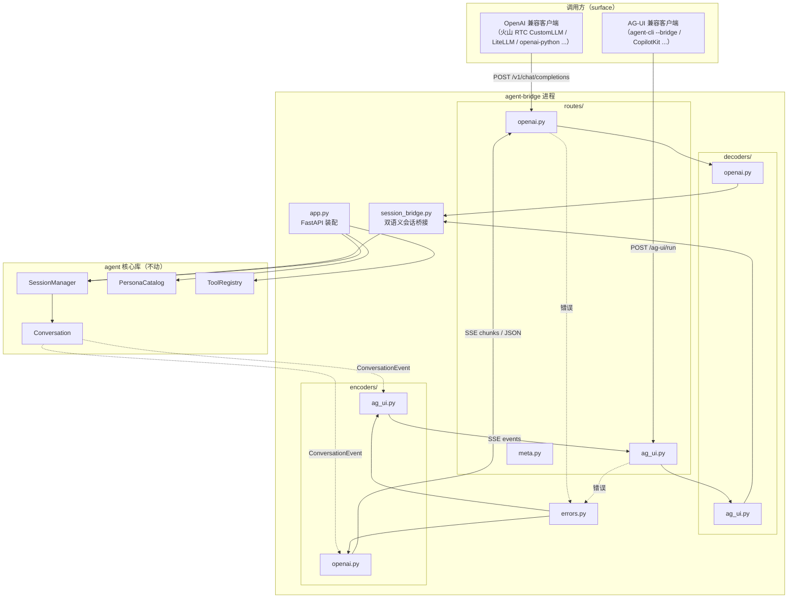
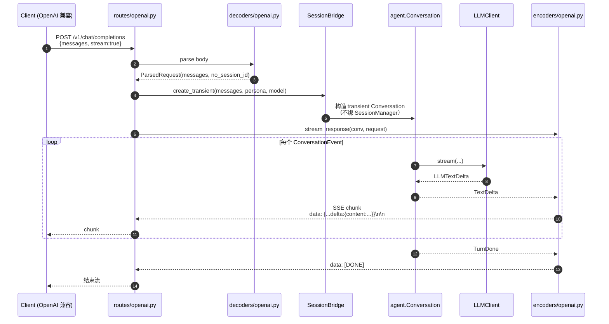
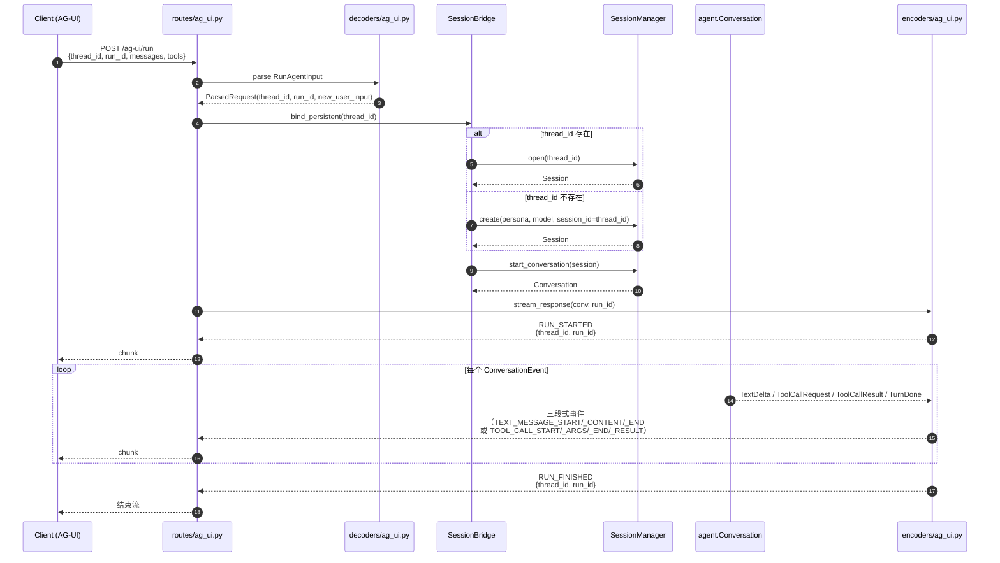

# 006 · agent-bridge 技术方案

> agent-bridge: Technical Design
>
> 把 `agent.Conversation` 通过双协议（OpenAI ChatCompletion + AG-UI）的 HTTP SSE 网络服务对外暴露的**怎么做**。

---

## 状态

<!-- DRAFT | CONFIRMED -->
CONFIRMED（2026-05-22）

---

## 0. 文档说明

本文档回答 [`requirement.md`](./requirement.md) §7 列出的 11 个开放问题，并定义本期的内部架构、模块拆分、实施路径与接口稳定承诺。

**本文档不复述 `requirement.md` 已说的"做什么"**——只讲"怎么做"和"为什么这么做"。涉及到的项目级技术栈决策（Python 3.12 / uv / FastAPI / DeepSeek / SQLite 等）均不在本文重复，参见 [`0002`](../../decisions/0002-incubation-tech-stack/README.md)。

---

## 1. 整体目标与边界

### 1.1 本期要做的事

参照 `requirement.md` §2 的 6 个模块，工程上落地为 3 个里程碑（详见 §2），交付物：

- 顶层独立 uv 项目 `agent-bridge/`（新增）
- 一个 FastAPI 进程，内部有 6 层：装配 / 路由 / 协议解码 / 调度 / 协议编码 / 错误转换
- 双协议出口：OpenAI ChatCompletion（流式 + 非流式）+ AG-UI（SSE 三段式）
- 一个 `SessionBridge`，统一承担 OpenAI 无状态 / AG-UI 有状态 / OpenAI 扩展字段升级三种模式
- 非对话 HTTP 接口（sessions / personas / models 列举与切换）
- `agent-cli --bridge` 改造（在现有 CLI 加远程模式，渲染层零侵入）
- `JsonlSessionStore.append_event` 集成 `portalocker` OS 文件锁
- `scripts/bridge/run.sh` + `run.ps1` 启动脚本

### 1.2 不做的事（YAGNI 边界）

`requirement.md` §3 已经划出大边界，本节补充 design 层进一步明确：

- **不引入新的依赖管理工具**——继续 uv + path dependency，不引入 Poetry / Hatch 等
- **不引入 ORM**——sessions/personas 都是文件，不动 SQLite 数据层（即便 0002 §3.15 说了用 SQLite，本期没有真实表需求）
- **不引入异步数据库 / 异步文件 IO**——FastAPI 路由可以 `async def`，但内部仍调同步的 `Conversation.stream()`（用 `asyncio.to_thread` / `iterate_in_threadpool`），避免为了 async 而 async 把核心库改造
- **不内置 OpenAPI / Swagger UI 美化**——FastAPI 自带 `/docs` 默认开着可用，不投入设计资源
- **不做客户端连接管理**——SSE 流被客户端中途断开时，服务端尽快感知 + 结束 Conversation 流即可，不做 reconnect / resume
- **不做 streaming chunk 的批量合并优化**——每个 `ConversationEvent` 立即编码、立即推送
- **不做配置热重载**——bridge 启动后改 `.env` 不会生效，重启即可
- **不做后台任务 / 定时任务**——bridge 是纯请求响应模型

### 1.3 与既有接口承诺的关系

| 既有承诺                                 | 本期是否动                                                                 |
| ---------------------------------------- | -------------------------------------------------------------------------- |
| `agent/__init__.py` 公开 API（005 §6.1） | **不动**，bridge 通过现有公开 API 装配                                     |
| `Conversation.stream()` 事件协议         | **不动**，bridge 把它编码成 SSE 而已                                       |
| Session JSONL schema（002）              | **不动**                                                                   |
| LLM Provider 抽象（005 §6.3）            | **不动**                                                                   |
| `JsonlSessionStore.append_event`         | **动一行实现**，外加 `portalocker` advisory lock；公开 API 签名不变        |
| `tools/cli/__main__.py`                  | **加 `--bridge URL` 参数 + 一个 BridgeClient 模块**；in-process 路径不变   |

> 唯一对既有代码的实质性改动是 `JsonlSessionStore.append_event` 的实现里加文件锁。公开 API 签名 + 行为契约（"append 是事务性的、错误时抛 SessionPersistError"）不变。

---

## 2. 实施路径：3 个里程碑

里程碑名称沿用项目历史习惯 `M{需求编号}.{里程碑序号}`。

### 2.1 M6.1 装配 + OpenAI 出口

**目标**：把 agent 引擎装配进 FastAPI，实现 OpenAI ChatCompletion 出口（流式 + 非流式），先把"OpenAI 默认无状态"语义跑通。

**包含**：

- 创建 `agent-bridge/` uv 项目骨架（`pyproject.toml` + `src/agent_bridge/`）
- `app.py` FastAPI 装配：`SessionManager` + `PersonaCatalog` + `ToolRegistry` 等都按 `agent-cli` 现有方式装配
- `settings.py`：从 `.env` 读 host / port / log_level 等
- `routes/openai.py`：`POST /v1/chat/completions`（含 `stream:true|false` 分支）
- `decoders/openai.py`：解析 OpenAI request body，把 `messages` 转成 transient Conversation 的 history
- `encoders/openai.py`：`ConversationEvent` → OpenAI SSE chunks（或非流式时聚合成单 JSON）
- `session_bridge.py`：transient 模式骨架
- `scripts/bridge/run.sh` + `run.ps1`

**验收**：AC-1（流式）+ AC-2（非流式）

### 2.2 M6.2 AG-UI 出口 + 非对话接口

**目标**：实现 AG-UI 协议出口（有状态），加上 sessions / personas / models 三个 meta 接口。

**包含**：

- `routes/ag_ui.py`：AG-UI endpoint（路径 §4.3.2 决定）
- `decoders/ag_ui.py`：解析 AG-UI `RunAgentInput`（包含 `thread_id` / `run_id` / `messages` / `tools` 等）
- `encoders/ag_ui.py`：`ConversationEvent` → AG-UI 三段式事件
- `session_bridge.py`：persistent 模式（`thread_id` ↔ `session_id`，不存在时自动创建）
- `routes/meta.py`：`/v1/sessions` `/v1/personas` `/v1/models` `/healthz`
- AG-UI 错误事件（`RUN_ERROR`）路径

**验收**：AC-3（AG-UI 流跑通）+ AC-4（工具调用流双协议都正确）

### 2.3 M6.3 agent-cli --bridge + 错误模型 + 文件锁

**目标**：完成 CLI 改造、错误模型转换层、集成文件锁，跑完所有 AC。

**包含**：

- `tools/cli/__main__.py` 加 `--bridge URL` 参数
- `tools/src/tools/cli/bridge_client.py`（新增）：AG-UI SSE 客户端 + parser，把 AG-UI 事件解码回 `ConversationEvent` 喂给现有渲染层
- `agent_bridge/errors.py`：异常分类（可恢复 / 不可恢复）+ 协议各自的错误响应映射 + 拟人化兜底引用
- `agent/sessions/store.py` 集成 `portalocker`（仅在 `append_event` 实现内部，公开 API 不动）
- `agent-bridge/tests/integration/` 按 AC 一一对应写集成测试

**验收**：AC-5（agent-cli --bridge 行为等价）+ AC-6（跨进程共享会话）+ AC-7（错误模型）+ AC-8（既有不退化）+ AC-9（§3.19 不违反）

---

## 3. 整体架构

### 3.1 仓库布局

```text
agent-friend/
├── agent-bridge/                          # 新增顶层 uv 项目
│   ├── pyproject.toml                     # 依赖 agent / llm_providers / memory（path dep）
│   ├── src/
│   │   └── agent_bridge/
│   │       ├── __init__.py
│   │       ├── app.py                     # FastAPI app + 装配入口
│   │       ├── settings.py                # 配置（host / port / log_level / data_dir）
│   │       ├── session_bridge.py          # 双语义会话桥接（transient / persistent）
│   │       ├── errors.py                  # 异常分类 + 协议错误映射
│   │       ├── routes/
│   │       │   ├── __init__.py
│   │       │   ├── openai.py              # POST /v1/chat/completions
│   │       │   ├── ag_ui.py               # POST /ag-ui/run
│   │       │   └── meta.py                # /v1/sessions /v1/personas /v1/models /healthz
│   │       ├── decoders/
│   │       │   ├── __init__.py
│   │       │   ├── openai.py
│   │       │   └── ag_ui.py
│   │       └── encoders/
│   │           ├── __init__.py
│   │           ├── openai.py
│   │           └── ag_ui.py
│   └── tests/
│       ├── unit/
│       │   ├── test_encoders_openai.py
│       │   ├── test_encoders_ag_ui.py
│       │   ├── test_decoders.py
│       │   └── test_errors.py
│       └── integration/
│           ├── test_ac1_openai_stream.py
│           ├── test_ac2_openai_non_stream.py
│           ├── test_ac3_ag_ui.py
│           ├── ...
│           └── test_ac9_no_new_data_subdir.py
├── tools/
│   └── src/tools/cli/
│       ├── __main__.py                    # 改造：加 --bridge URL 参数
│       └── bridge_client.py               # 新增：AG-UI SSE 客户端
├── agent/
│   └── src/agent/sessions/
│       └── store.py                       # 改：append_event 内部加 portalocker
└── scripts/
    └── bridge/                            # 新增
        ├── run.sh
        └── run.ps1
```

**约束**：

- `agent-bridge/` 与 `agent/` / `memory/` / `llm_providers/` 平级，符合 [`0002 §3.10`](../../decisions/0002-incubation-tech-stack/README.md) "按职责分目录"
- `agent-bridge/` 通过 path dependency 引用本地包（`uv pip install -e ../agent` 风格的 workspace 依赖）
- 内部按职责 + 协议拆子目录：`routes/` / `decoders/` / `encoders/` 各自有 `openai.py` 和 `ag_ui.py`，便于双协议对称演进
- 不在 `agent-bridge/` 内部新建 `data/` 子目录——遵守 [`0002 §3.19`](../../decisions/0002-incubation-tech-stack/README.md)

### 3.2 模块依赖关系



**关键观察**：

- 两个协议的 decoders / encoders 是**对称对偶**的（同样 6 个模块在两侧）
- `SessionBridge` 是双协议的**汇聚点**——`requirement.md` §4.2 双语义承诺的具体实现就在这里
- `ConversationEvent` 是从 agent 核心库流出的**single source of truth**，两侧 encoder 都消费它
- `errors.py` 是另一个汇聚点——异常分类逻辑一份，两侧编码各自实现

### 3.3 一次"OpenAI 流式对话（默认无状态）"完整时序



**要点**：

- 客户端发完整 messages，bridge **不创建任何 session 文件**
- transient Conversation 只活在内存里，请求结束即丢弃
- `tool_call_request` / `tool_call_result` 等中间事件，OpenAI 协议层**不暴露给客户端**（OpenAI 协议天然假设客户端不参与工具循环），但内部循环正常跑

### 3.4 一次"AG-UI 有状态对话"完整时序



**要点**：

- `thread_id` 作 `session_id` 一一对应；不存在时自动创建——符合 AG-UI 的"无感"语义
- session 写盘走 `SessionManager` 现有路径，`portalocker` 在写盘那一层兜底
- AG-UI 协议**完整保留**工具调用过程的可观测性（`TOOL_CALL_RESULT` 是 AG-UI 一等公民）

---

## 4. 各模块详细设计

### 4.1 `agent-bridge/pyproject.toml` 与 uv workspace

**决策**：用 uv path dependency（不引入 monorepo 工具）。

```toml
# agent-bridge/pyproject.toml （示意）
[project]
name = "agent-bridge"
version = "0.1.0"
requires-python = ">=3.12"
dependencies = [
    "fastapi>=0.115",
    "uvicorn[standard]>=0.30",
    "pydantic>=2",
    "pydantic-settings>=2",
    "portalocker>=2.10",      # M6.3 集成到 agent/sessions/store.py 时也要
    "agent",                  # path dep
    "llm_providers",          # path dep
    "memory",                 # path dep
]

[tool.uv.sources]
agent = { path = "../agent", editable = true }
llm_providers = { path = "../llm_providers", editable = true }
memory = { path = "../memory", editable = true }
```

**理由**：

- uv 原生支持 `tool.uv.sources` + `path` + `editable=true`，是 uv 推荐的 workspace 形态
- 不引入 Pants / Bazel / Nx 等 monorepo 工具，符合 [`0002 §3.9`](../../decisions/0002-incubation-tech-stack/README.md) 决策
- editable 模式让 agent 核心库改动**立即生效**，不用每次重装

### 4.2 装配层（`app.py` + `settings.py`）

**`settings.py`**：用 `pydantic-settings`，从 `.env` 读取：

| 字段              | 默认                  | 说明                                                            |
| ----------------- | --------------------- | --------------------------------------------------------------- |
| `host`            | `127.0.0.1`           | 仅 bind 本机，避免意外暴露                                      |
| `port`            | `8000`                | 标准开发端口                                                    |
| `log_level`       | `INFO`                | uvicorn / FastAPI 日志级别                                      |
| `data_dir`        | `Path("data")`        | 与现有 CLI 共用，符合 [`0002 §3.19`](../../decisions/0002-incubation-tech-stack/README.md) "已有沿用" |
| `default_persona` | `"default"`           | bridge 收到无 persona 信息的 OpenAI 请求时用的回退 persona      |
| `default_model`   | 从 `.env` `DEEPSEEK_MODEL` 读 | LLM model 名                                            |

**`app.py`**：装配 FastAPI app

```python
# 示意代码
from fastapi import FastAPI
from agent import (
    JsonlSessionStore, SessionManager, PersonaCatalog,
    NaiveContextManager, MarkdownPromptBuilder, make_default_registry,
)
from llm_providers import LLMClient, ProviderSpec
from .settings import Settings
from .session_bridge import SessionBridge
from .routes import openai_router, ag_ui_router, meta_router


def create_app(settings: Settings | None = None) -> FastAPI:
    settings = settings or Settings()  # 从 .env 自动加载
    sessions_dir = settings.data_dir / "sessions"
    store = JsonlSessionStore(sessions_dir)
    tool_registry = make_default_registry()
    mgr = SessionManager(
        store=store,
        llm_client_factory=lambda model: LLMClient(_make_spec(model)),
        prompt_builder_factory=lambda persona_id: MarkdownPromptBuilder(persona_id=persona_id),
        context_manager=NaiveContextManager(),
        tool_registry=tool_registry,
    )
    catalog = PersonaCatalog()
    bridge = SessionBridge(
        manager=mgr, catalog=catalog, tool_registry=tool_registry,
        default_persona=settings.default_persona, default_model=settings.default_model,
    )

    app = FastAPI(title="agent-bridge", version="0.1.0")
    app.state.bridge = bridge
    app.state.manager = mgr
    app.state.catalog = catalog
    app.include_router(openai_router)
    app.include_router(ag_ui_router)
    app.include_router(meta_router)
    return app


app = create_app()  # 模块级实例供 uvicorn 加载
```

**要点**：

- `create_app()` 工厂函数风格 → 测试时可以传自定义 settings（如 `data_dir=tmp_path`）
- 装配逻辑跟 `tools/src/tools/cli/__main__.py` `main()` 内部装配**保持一致**——未来如果其中一个 surface 需要新的装配点，把装配代码抽到 `agent/` 内部的公共工厂里
- `app.state` 持有引用，路由通过 `request.app.state.bridge` 访问

### 4.3 OpenAI 协议层

#### 4.3.1 路由 `routes/openai.py`

`POST /v1/chat/completions` 是事实标准路径（OpenAI / Azure / OpenRouter / DeepSeek / LiteLLM 等都用这个），bridge 沿用。

```python
# 示意
@router.post("/v1/chat/completions")
async def chat_completions(request: Request) -> Response:
    bridge: SessionBridge = request.app.state.bridge
    body = await request.json()
    session_id_hint = request.headers.get("X-Agent-Friend-Session-Id")  # 扩展字段
    parsed = decode_openai_request(body, session_id_hint=session_id_hint)

    conv = await bridge.bind_for_openai(parsed)
    if parsed.stream:
        return StreamingResponse(
            encode_openai_stream(conv, parsed),
            media_type="text/event-stream",
        )
    return JSONResponse(encode_openai_non_stream(conv, parsed))
```

#### 4.3.2 扩展字段：HTTP header `X-Agent-Friend-Session-Id`

**决策**：用 HTTP header `X-Agent-Friend-Session-Id`，不在 body 里加扩展字段。

**理由**：

- HTTP header 是协议层的扩展位，**任何 OpenAI 客户端**（OpenAI SDK / LiteLLM / 火山 RTC `CustomLLM` 等）都能传——只要客户端允许传自定义 header（绝大多数客户端都允许）
- body 里加扩展字段会被严格 Pydantic schema 校验的客户端拒绝
- header 命名按 IANA 风格：`X-` 前缀（虽然 RFC 6648 不推荐 `X-` 但行业仍普遍这么用）、产品名 + 字段名

**语义**：

- 不传 → 走默认无状态语义（`requirement.md` R-4.2.1）
- 传一个不存在的 session_id → **400 Bad Request**（不自动创建，避免和 AG-UI 出口的"自动创建"语义混淆——OpenAI 出口是无状态的，扩展是 opt-in 升级，不应该有 side effect）
- 传一个存在的 session_id → 走持久化语义，写入该 session

#### 4.3.3 解码 `decoders/openai.py`

把 OpenAI request body 解析为 `ParsedOpenAIRequest`（pydantic model），包含：

| 字段                 | 类型              | 说明                                                                  |
| -------------------- | ----------------- | --------------------------------------------------------------------- |
| `messages`           | `list[dict]`      | OpenAI 标准 messages（role: user/assistant/system/tool）              |
| `stream`             | `bool`            | 默认 `False`                                                          |
| `model`              | `str \| None`     | 客户端指定的 model 名；优先级 > 默认                                  |
| `tools`              | `list[dict] \| None` | 客户端声明的 tools；**本期忽略**（agent 自己注册的 tools 优先）       |
| `tool_choice`        | `Any \| None`     | 同上忽略                                                              |
| `temperature`        | `float \| None`   | 透传到 LLMClient（如果传了）                                          |
| `session_id_hint`    | `str \| None`     | 从 header 读到的扩展字段                                              |

**特殊处理**：

- `messages` 里的 `system` role 消息：本期**忽略**——bridge 用 agent 自家的 system prompt composer（004）生成 system message，不允许客户端覆盖（否则 persona / tool description 等会被吞）。客户端的 system 消息记入日志方便调试。
- `messages` 里的 `tool` role 消息：本期**忽略**——OpenAI 协议假设客户端自执行 tool 把结果回传，但 agent-bridge 是服务端自执行 + 自整合，客户端不参与工具循环。这种 message 进来就丢。

#### 4.3.4 编码 `encoders/openai.py`

##### 流式（`stream:true`）

`ConversationEvent` → OpenAI ChatCompletion SSE chunks 的映射：

| 内部 ConversationEvent | OpenAI SSE chunk                                                                                       |
| ---------------------- | ------------------------------------------------------------------------------------------------------ |
| `TextDelta(text)`      | `data: {"id":"<chunk_id>","object":"chat.completion.chunk","choices":[{"delta":{"content":text}}]}` |
| `ToolCallRequest`      | **不暴露**——OpenAI 协议假设客户端自执行 tool，bridge 自己跑完整合就好                                  |
| `ToolCallResult`       | **不暴露**——同上                                                                                       |
| `TurnDone`             | `data: {...,"choices":[{"delta":{},"finish_reason":"stop"}]}` + `data: [DONE]`                          |

##### 非流式（`stream:false`）

把整个流跑完，把所有 `TextDelta` 拼接成完整 content，包成单个 JSON 响应：

```json
{
  "id": "chatcmpl-xxx",
  "object": "chat.completion",
  "created": 1737xxx,
  "model": "deepseek-v4-flash",
  "choices": [{
    "index": 0,
    "message": {"role": "assistant", "content": "完整拼接后的回复"},
    "finish_reason": "stop"
  }],
  "usage": {"prompt_tokens": 0, "completion_tokens": 0, "total_tokens": 0}
}
```

**注**：本期 `usage` 字段全填 0——agent 核心库尚未追踪 token 用量。未来如有需要再加。

### 4.4 AG-UI 协议层

#### 4.4.1 路径与协议

**决策**：endpoint 路径 `POST /ag-ui/run`。

**理由**：AG-UI 官方 mock server 例子用的是 `POST /api/agent/run`，但我们的 bridge 内部还会有 `/v1/chat/completions`，分两个 namespace（`/v1/...` OpenAI 兼容 / `/ag-ui/...` AG-UI 兼容）更清晰。

#### 4.4.2 解码 `decoders/ag_ui.py`

AG-UI 官方定义 `RunAgentInput` 包含 `thread_id` / `run_id` / `messages` / `tools` / `state` / `forwarded_props` 等。本期实现：

- `thread_id` / `run_id`：必填，从 body 直接读
- `messages`：本期**只取最后一条** user message 当 `new_user_input`——bridge 假设 `thread_id` 已经在服务端落盘了之前所有历史
- `tools`：本期忽略（同 OpenAI 出口）
- `state` / `forwarded_props`：本期忽略

**`thread_id` 语义**：

- `thread_id` 是 ULID / UUID 格式，bridge **不校验内部格式**（只校验非空字符串）
- 把 `thread_id` 直接当 `session_id` 用——这意味着 bridge 创建的 session id 也是 AG-UI thread_id 范畴
- `thread_id` 不存在时：**自动创建**新 session（id = thread_id），用默认 persona / model

#### 4.4.3 编码 `encoders/ag_ui.py`：三段式事件

每次 `POST /ag-ui/run` 的事件序列：

```text
RUN_STARTED { thread_id, run_id }
... 对话事件流 ...
RUN_FINISHED { thread_id, run_id }
```

对话事件流的具体映射：

| 内部 ConversationEvent | AG-UI 事件序列                                                                                  |
| ---------------------- | ----------------------------------------------------------------------------------------------- |
| 第一个 `TextDelta`     | `TEXT_MESSAGE_START { message_id, role:"assistant" }` + `TEXT_MESSAGE_CONTENT { message_id, delta }` |
| 后续 `TextDelta`       | `TEXT_MESSAGE_CONTENT { message_id, delta }`                                                    |
| `ToolCallRequest`      | `TOOL_CALL_START { tool_call_id, tool_call_name }` + `TOOL_CALL_ARGS { tool_call_id, delta:args_json }` + `TOOL_CALL_END { tool_call_id }` |
| `ToolCallResult`       | `TOOL_CALL_RESULT { tool_call_id, content, is_error }`                                          |
| `TurnDone`             | （不直接对应；用最后一个 `TEXT_MESSAGE_END` 关闭最后一条 assistant 消息）                       |

**`message_id` 生成策略**：

- 一轮对话内**多个 `TextDelta` 共享同一个 `message_id`**（assistant 一段连续文本是一个 message）
- 工具调用穿插时：tool 调用前后的文本是**两条**独立 assistant message（不同 `message_id`），符合 AG-UI lifecycle 语义
- `message_id` 用 `uuid4().hex[:16]`

**`persona_change` / `model_change` 等 002 事件**：

- 本期不映射到 AG-UI 事件——这些事件发生在 `switch_persona()` / `switch_model()` 显式调用时，AG-UI `/run` 主流程中不会出现
- 未来如果通过 AG-UI 事件流也能切 persona / model，再用 `CUSTOM` 事件类型扩展（AG-UI spec 提供了 `CUSTOM` 兜底）

### 4.5 `SessionBridge`：双语义会话桥接

**核心类**：

```python
# 示意
class SessionBridge:
    def __init__(self, manager: SessionManager, catalog: PersonaCatalog,
                 tool_registry: ToolRegistry, default_persona: str, default_model: str): ...

    async def bind_for_openai(
        self, parsed: ParsedOpenAIRequest,
    ) -> Conversation:
        """OpenAI 出口入口。"""
        if parsed.session_id_hint:
            # 扩展字段升级：走持久化
            return await self._open_or_404(parsed.session_id_hint)
        # 默认无状态
        return self._create_transient(parsed)

    async def bind_for_ag_ui(
        self, thread_id: str, default_persona: str, default_model: str,
    ) -> Conversation:
        """AG-UI 出口入口。thread_id ↔ session_id 一一对应，不存在则自动创建。"""
        return await self._open_or_create(thread_id, default_persona, default_model)
```

**transient 模式**（OpenAI 默认）：

- **不**走 `SessionManager`
- 把 `parsed.messages` 直接当 `Conversation` 的 history
- `Conversation` 仍正常用 `LLMClient` / `PromptBuilder` / `ToolRegistry`——除了"不持久化"这一点跟 in-process 完全一样
- 实现细节：构造一个临时 `Session` 对象（内存里、不写盘）+ 一个用 `NullSessionStore` 装配的 `Conversation`，或直接绕过 `Session`、给 `Conversation` 注入 messages 列表

**实现细节**：transient 模式需要 `agent.Conversation` 能接受"无 store / 不持久化"的装配方式。目前 `Conversation.__init__` 强制要求 `store`——本期需要：

**选项 N-1**：在 `agent` 核心库加一个 `NullSessionStore`（实现 `SessionStore` Protocol，所有方法 no-op），保持 `Conversation` 公开 API 不变。这是**软扩展**，符合 `requirement.md` R-4.3.4「引擎纯库无侵入」精神（不改公开 API），新增一个 store 实现属于 N-side 扩展。

**persistent 模式**（AG-UI 默认 + OpenAI 扩展字段升级）：

- 走 `SessionManager.open(thread_id)` 或 `create(persona, model, session_id=thread_id)`
- `SessionManager.create()` 当前签名不支持显式传 `session_id`——本期需要加一个可选参数

**选项 N-2**：在 `SessionManager.create()` 加 `session_id: str | None = None` 参数（不传则随机生成，与现行行为兼容）。这是软扩展。

### 4.6 错误模型转换层（`errors.py`）

#### 4.6.1 异常分类

| 异常类别                | 归属         | bridge 处理                                                     |
| ----------------------- | ------------ | --------------------------------------------------------------- |
| `LLMRateLimitError`     | 可恢复       | 拟人化兜底（用 `agent.random_fallback()`）→ 走正常文本流        |
| `LLMNetworkError`       | 可恢复       | 同上                                                            |
| `LLMProviderError`      | 可恢复       | 同上                                                            |
| `ToolNotFoundError`     | 可恢复       | 同上（实际上 005 已经在 `Conversation` 内部转 `is_error` ToolResult） |
| `Tool` 内部异常         | 可恢复       | 同上                                                            |
| `LLMAuthError`          | **不可恢复** | 协议错误响应：OpenAI 401 / AG-UI `RUN_ERROR`                    |
| `LLMBadRequestError`    | **不可恢复** | 协议错误响应：OpenAI 400 / AG-UI `RUN_ERROR`                    |
| `PersonaNotFoundError`  | **不可恢复** | 协议错误响应：404 + 拟人化 message                              |
| `SessionNotFoundError`  | **不可恢复** | 协议错误响应：404                                               |
| `SessionPersistError`   | **不可恢复** | 协议错误响应：500，**拟人化 message**（不暴露 IO 错误细节）     |
| `SessionCorruptError`   | **不可恢复** | 协议错误响应：500，拟人化                                       |
| 未捕获 Exception        | **不可恢复** | 协议错误响应：500，**永远**拟人化 message，技术细节进日志       |

#### 4.6.2 OpenAI 错误响应

非流式：直接返回 HTTP 状态码 + JSON：

```json
{"error": {"message": "拟人化文案", "type": "agent_friend_error", "code": "rate_limit"}}
```

流式：先返回 200 + SSE 起始流，如果中途出错，emit 一个 error chunk 然后 `[DONE]`：

```text
data: {"choices":[{"delta":{"content":"已部分流出的文本"}}]}

data: {"error":{"message":"拟人化文案","type":"agent_friend_error","code":"rate_limit"}}

data: [DONE]
```

#### 4.6.3 AG-UI 错误响应

走 `RUN_ERROR` 事件：

```text
data: {"type":"RUN_ERROR","message":"拟人化文案","code":"rate_limit"}
```

随后**不**发 `RUN_FINISHED`——AG-UI 协议规定 `RUN_ERROR` 是终止事件。

#### 4.6.4 拟人化文案来源

复用 `agent.random_fallback()`（001 fallbacks 池），加 5 条 bridge 专属的话术兜底（如"我这边好像出了点小问题，能稍后再问我一遍吗？"）——这些进 `agent_bridge/errors.py` 内部常量，不污染 001 fallbacks 池。

### 4.7 `agent-cli --bridge` 改造

#### 4.7.1 CLI 参数

`tools/src/tools/cli/__main__.py` 加：

```python
p.add_argument(
    "--bridge",
    default=None,
    metavar="URL",
    help="bridge 模式：通过 HTTP 调远程 bridge（如 http://localhost:8000）。"
         "不传则走 in-process 模式（默认）",
)
```

也支持环境变量 `AGENT_BRIDGE_URL`（CLI 参数优先）。

#### 4.7.2 BridgeClient

新文件 `tools/src/tools/cli/bridge_client.py`：

```python
# 示意
class BridgeClient:
    def __init__(self, base_url: str, http_timeout: float = 30.0): ...
    def list_sessions(self) -> list[SessionSummary]: ...
    def open_session(self, session_id: str) -> SessionRemote: ...
    def create_session(self, persona: str, model: str) -> SessionRemote: ...
    def stream(
        self, session_id: str, user_input: str,
    ) -> Iterator[ConversationEvent]: ...  # 返回内部事件类型，复用现有渲染层
```

**`stream()` 实现核心**：

1. `httpx.stream("POST", f"{base_url}/ag-ui/run", json={...})`
2. 用 `httpx` 自带的 `iter_lines()` 逐行读，找 `data: ` 前缀的行
3. 把 AG-UI 事件解码回内部 `ConversationEvent`（多个三段式事件可能合并成单个 `TextDelta`）
4. yield 给调用方

##### 决策 N-3：自己写 SSE parser，不用 `ag-ui-protocol` 官方 Python SDK

**理由**：

- CLI 调试客户端只消费 10 种以内的事件类型，自己写 ≤ 200 行
- 官方 SDK Source reputation: Medium、协议还在演进，跟着升版风险高于自写
- 自写让 bridge_client.py 完全可控、可读、可测

但**服务端**编码层可以用 `ag-ui-protocol` 官方 Python SDK 的 `EventEncoder` 来生成 wire 格式——服务端用官方 SDK 没有升级风险（出问题报错可见），客户端不依赖反而保险。

### 4.8 跨进程文件锁：`portalocker` 集成到 `JsonlSessionStore.append_event`

#### 4.8.1 范围

**只**在 `agent/sessions/store.py` 的 `JsonlSessionStore.append_event` 实现内部加锁。其他方法（`open` / `list` 等只读）不动——读时不加锁（advisory lock 只保证写串行，读到不完整一行的概率极低，且 JsonlSessionStore 的读路径本来就要忍受"读到一半文件"的情况，详见 002 design.md）。

#### 4.8.2 实现

```python
# agent/src/agent/sessions/store.py 示意
import portalocker

class JsonlSessionStore:
    def append_event(self, session_id: str, event: Event) -> None:
        path = self._path_for(session_id)
        line = json.dumps(event.to_dict(), ensure_ascii=False) + "\n"
        try:
            with open(path, "a", encoding="utf-8") as f:
                with portalocker.Lock(f, portalocker.LOCK_EX, timeout=5):
                    f.write(line)
                    f.flush()
                    os.fsync(f.fileno())
        except portalocker.LockException as e:
            raise SessionPersistError(f"获取会话写锁失败 (timeout=5s): {e}") from e
        except OSError as e:
            raise SessionPersistError(f"写入会话失败: {e}") from e
```

**要点**：

- `LOCK_EX`：排他锁，跨进程串行
- `timeout=5`：5 秒拿不到锁就抛 `SessionPersistError`（防死锁）
- critical section 只包含 `write + flush + fsync`，**不持有锁跨 IO**——任何耗时操作（LLM / 网络）都在锁外
- portalocker 跨平台：mac 用 `fcntl.flock`、Win 用 `msvcrt.locking`
- 公开 API 签名不变，仅实现层加锁——满足 `requirement.md` R-4.3.4「公开 API 不动」

#### 4.8.3 测试

`agent/tests/test_session_store.py` 加跨进程并发写测试（spawn 5 个 subprocess 同时 append 同一 session 各 100 条，断言最终行数 = 500 + 顺序无丢失）。

### 4.9 启动脚本与配置

#### 4.9.1 `scripts/bridge/run.sh`

```bash
#!/usr/bin/env bash
set -euo pipefail
cd "$(dirname "$0")/../.."
exec uv run --project agent-bridge uvicorn agent_bridge.app:app --host "${HOST:-127.0.0.1}" --port "${PORT:-8000}" --reload "$@"
```

#### 4.9.2 `scripts/bridge/run.ps1`

```powershell
$ErrorActionPreference = "Stop"
Set-Location (Join-Path $PSScriptRoot "..\..")
$HostArg = $env:HOST; if (-not $HostArg) { $HostArg = "127.0.0.1" }
$PortArg = $env:PORT; if (-not $PortArg) { $PortArg = "8000" }
uv run --project agent-bridge uvicorn agent_bridge.app:app --host $HostArg --port $PortArg --reload @args
```

#### 4.9.3 `scripts/README.md` 同步登记

按 [`cross-platform-dev`](../../../.cursor/rules/cross-platform-dev.mdc) 规则，加一行：

| 脚本名     | 用途           | mac/linux                      | windows                          |
| ---------- | -------------- | ------------------------------ | -------------------------------- |
| `bridge`   | 启动 bridge HTTP server | `./scripts/bridge/run.sh` | `./scripts/bridge/run.ps1` |

### 4.10 健康检查

`/healthz`：返回 `{"status":"ok"}`，仅检查进程存活。

`/readyz`：本期等价 `/healthz`（没有需要 warmup 的依赖；LLM 是按需调用、本身就是远程）。

**不实现**：`/v1/models` 列出可用模型——这需要从 LiteLLM 查 provider 模型清单，超出本期范围。

### 4.11 非对话 HTTP 接口（`routes/meta.py`）

| Endpoint                       | 方法 | 行为                                                                 | 等价 CLI 命令               |
| ------------------------------ | ---- | -------------------------------------------------------------------- | --------------------------- |
| `GET /v1/sessions`             | GET  | 返回 `list[SessionSummary]` JSON                                     | `/sessions`                 |
| `GET /v1/sessions/{id}`        | GET  | 返回单个 session 的 `events`（不走 AG-UI 协议，纯 REST 调试用）      | （内部）                    |
| `POST /v1/sessions/{id}/persona` | POST | body `{"persona": "name", "source": "user|builtin"}` 切换            | `/persona <name>`           |
| `POST /v1/sessions/{id}/model` | POST | body `{"model": "name"}` 切换                                        | `/model <name>`             |
| `GET /v1/personas`             | GET  | 返回 `list[PersonaInfo]`                                             | `/personas`                 |
| `GET /healthz`                 | GET  | 健康检查                                                             | （无）                      |

**注**：这些接口**不**遵循 OpenAI 或 AG-UI 协议——它们是 bridge 自家的 REST。客户端是 `agent-cli --bridge` 或调试工具，不是协议兼容客户端。

---

## 5. 决策汇总

### 5.1 Q-1 ~ Q-11（`requirement.md` §7）

| Q   | 题目                                | 决策                                                                                                                | 见      |
| --- | ----------------------------------- | ------------------------------------------------------------------------------------------------------------------- | ------- |
| Q-1 | OpenAI 出口扩展字段命名             | HTTP header `X-Agent-Friend-Session-Id`；body 不加字段                                                              | §4.3.2  |
| Q-2 | AG-UI 事件粒度细节                  | 一段连续 assistant 文本共享同 `message_id`；tool 调用前后是不同 message；persona/model_change 本期不映射 AG-UI 事件 | §4.4.3  |
| Q-3 | AG-UI `thread_id` 语义              | `thread_id` 直接当 `session_id`；不存在时自动创建（无感）；OpenAI 扩展字段相反——不存在时 400                       | §4.3.2 / §4.4.2 |
| Q-4 | 跨进程并发写 sessions               | `JsonlSessionStore.append_event` 集成 `portalocker.LOCK_EX`（5s timeout）；公开 API 签名不变                       | §4.8    |
| Q-5 | 服务监听                            | `127.0.0.1:8000` 默认；`.env` 可配 `host/port`；本期仅 bind 本机                                                    | §4.2    |
| Q-6 | 健康检查                            | `/healthz` 本期上线；`/readyz` 等价（无 warmup）；`/v1/models` 本期不做                                              | §4.10   |
| Q-7 | bridge 进程启停管理                 | `scripts/bridge/run.sh` + `run.ps1`；不做守护化；`agent-cli --bridge` **不**自动 spawn subprocess                   | §4.9    |
| Q-8 | AG-UI 客户端 SDK 选用               | **客户端**自己写 SSE parser（< 200 行）；**服务端**用 `ag-ui-protocol` 官方 Python SDK 的 `EventEncoder`             | §4.7.2  |
| Q-9 | 错误码映射 / 拟人 vs 上报边界       | 见 §4.6.1 表格；可恢复 → 拟人化文本；不可恢复 → OpenAI HTTP 错误 / AG-UI `RUN_ERROR`                                | §4.6    |
| Q-10 | 非对话 HTTP 接口形状                | 自家 REST，不混 OpenAI / AG-UI；6 个 endpoint                                                                       | §4.11   |
| Q-11 | bridge 与 agent 包依赖方向          | uv path dependency + editable install；`tool.uv.sources` 在 `agent-bridge/pyproject.toml`                           | §4.1    |

### 5.2 N-1 ~ N-4（design 阶段独立做出的决策）

| N   | 决策                                                                                | 影响                                      |
| --- | ----------------------------------------------------------------------------------- | ----------------------------------------- |
| N-1 | 新增 `agent.NullSessionStore`：no-op 实现，给 OpenAI transient 模式用                | `agent/sessions/store.py` 加一个 class    |
| N-2 | `SessionManager.create()` 加 `session_id: str \| None = None` 可选参数；与现行行为兼容 | `agent/sessions/manager.py` 改签名        |
| N-3 | 服务端用 `ag-ui-protocol` 官方 SDK 的 `EventEncoder`；客户端自写 SSE parser           | 见 §4.7.2 / §4.4                          |
| N-4 | 测试覆盖：每个 AC 一对应集成测试 + 编/解码层单元测试；不做压测 / 多客户端并发        | 见 §6                                     |

### 5.3 与 0001 / 0002 决策的关系

- [`0001 §1.3`](../../decisions/0001-product-vision-and-roadmap/README.md) 三条原则的落地见 `requirement.md` §5
- [`0002 §3.11`](../../decisions/0002-incubation-tech-stack/README.md) 「核心库 + 薄包装」首次工程兑现——`agent/` 保持纯库，`agent-bridge/` 是薄薄一层 FastAPI
- [`0002 §3.19`](../../decisions/0002-incubation-tech-stack/README.md)：本期不在 `data/` 新增任何持久化子目录；sessions 共用现有 `data/sessions/`

### 5.4 已知约束 / 后续 TODO

- **本期 `tools` 和 `tool_choice` 透传不完整**：客户端通过 OpenAI / AG-UI 协议传的 `tools` 字段本期**忽略**——agent 自家注册的 tool 优先。未来如果要支持"客户端临时关闭某 tool"等用例再扩展
- **本期 `usage` token 计数全 0**：等 agent 核心库追踪 token 用量后填
- **本期 SSE keepalive 间隔**：FastAPI / uvicorn 默认无 keepalive comment；客户端长时间无数据可能被中间代理切断。本期默认不做；如果在某些代理场景下出问题再加（每 15s 发一个 `: ping\n\n` 注释行）
- **OpenAI session 升级模式没有 CLI 验**：CLI 默认走 AG-UI 出口，OpenAI header 扩展只能用 curl 验
- **火山 RTC 对接侧的 `LLMConfig.SystemMessages` 必须配空**：voice-io 落地时（后续需求），把火山 RTC 切到 `LLMConfig.Mode=CustomLLM` 指向 agent-bridge 的 `/v1/chat/completions`；此时**必须**把 `LLMConfig.SystemMessages` 配为空数组（或省略），不要在火山侧配 persona / 约束语——所有 system prompt 由 agent 自家 system_prompt composer（004）装配，bridge 端会丢弃 messages 里所有 `system` role。`experiments/voice-poc/rtc-aigc-demo/Server/scenes/Custom.json` 当前用的是 ArkV3 模式的 SystemMessages，切到 CustomLLM 时记得清空，否则双 system 会污染 persona / tools description / runtime context

---

## 6. 接口稳定承诺

### 6.1 HTTP endpoint 与协议（稳定）

以下契约一旦本期落地，作为**长期承诺**——下游接入需求只能扩展、不能破坏：

- `POST /v1/chat/completions`：严格 OpenAI ChatCompletion 协议；`stream:true|false`；`X-Agent-Friend-Session-Id` header 扩展位
- `POST /ag-ui/run`：严格 AG-UI 协议；`thread_id` 不存在时自动创建（无感）
- `GET /healthz`：返回 200 + `{"status":"ok"}` 表示进程存活
- 双协议出口的事件语义：`requirement.md` §4.1 / §4.2 / §4.5 已经写明

### 6.2 自家 REST endpoint（弱稳定）

`/v1/sessions` / `/v1/personas` / `/v1/sessions/{id}/persona|model` 这些自家 REST，schema 在本期落地后**默认不变**，但留小幅调整空间——下游目前没有真正消费方（只有 `agent-cli --bridge` 自家用）。一旦未来有外部消费方（如桌宠前端），会单独立项锁死。

### 6.3 持久化数据（沿用 002，不变）

Session JSONL schema、目录布局（`data/sessions/`）：**不变**，沿用 002。本期加的 `portalocker` 锁不改文件格式。

### 6.4 agent 核心 API（沿用 005 §6.1）

`agent/__init__.py` 导出的所有公开类 / 函数：**签名不变**。本期新增的 `NullSessionStore`（N-1）和 `SessionManager.create(session_id=None)` 参数（N-2）都是**向前兼容**扩展。

### 6.5 不算稳定承诺的部分

- `agent-bridge/` 内部模块名 / 类名 / 函数名
- 错误消息文案（拟人话术池可以加可以改）
- 日志格式
- 配置项的环境变量命名（除 `AGENT_BRIDGE_URL` 之外）

---

## 文档元信息

- **创建时间**：2026-05-22
- **确认时间**：2026-05-22
- **基于**：[`requirement.md`](./requirement.md)（CONFIRMED 2026-05-22）
- **下一步**：进入 M6.1 实施（顶层 `agent-bridge/` 项目骨架 + OpenAI 协议出口）
