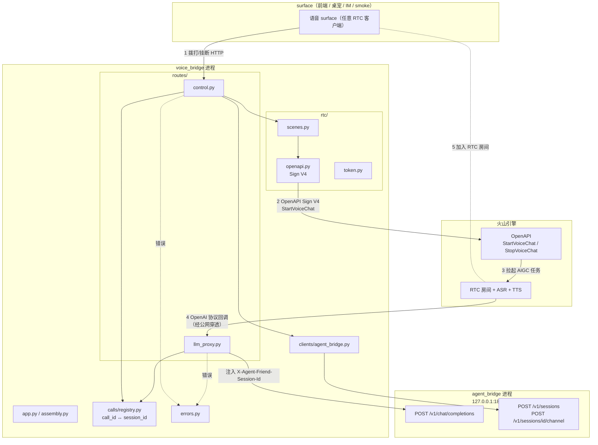
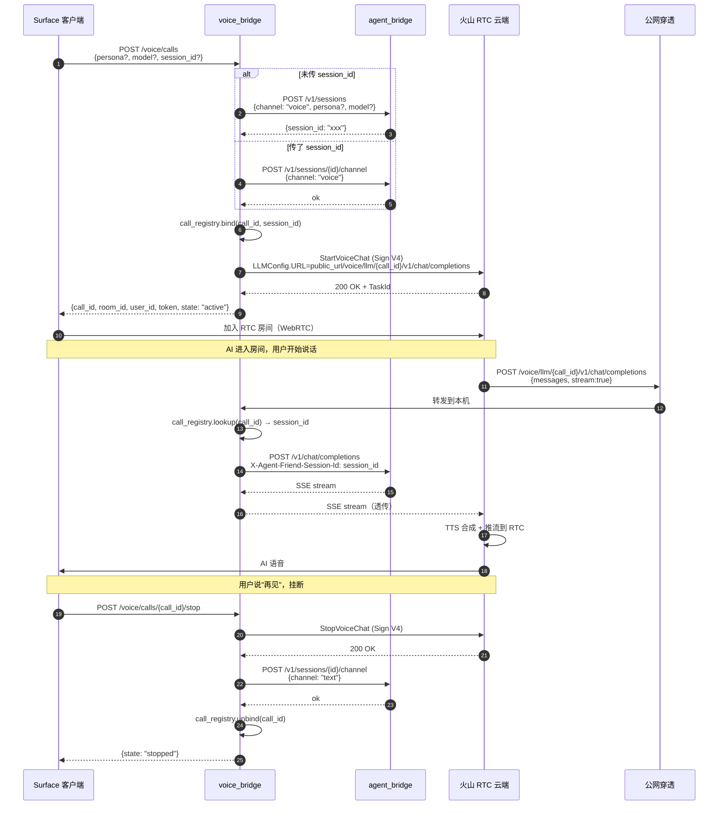
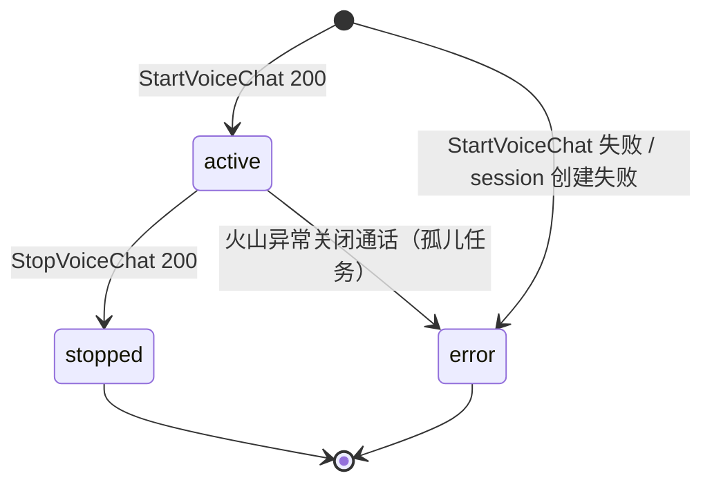

# 007 · voice-call 技术方案

> voice-call: Technical Design
>
> 把"agent 当大脑的语音通话"作为独立 voice_bridge 模块层落地的**怎么做**。

---

## 状态

<!-- DRAFT | CONFIRMED -->
CONFIRMED（2026-05-25）

---

## 0. 文档说明

本文档回答 [`requirement.md`](./requirement.md) §7 列出的 11 个开放问题，并定义本期内部架构、模块拆分、实施路径与接口稳定承诺。

**本文档不复述 `requirement.md` 已说的"做什么"**——只讲"怎么做"和"为什么这么做"。涉及的项目级技术栈决策（Python 3.12 / uv / FastAPI / DeepSeek / SQLite 等）参见 [`0002`](../../decisions/0002-incubation-tech-stack/README.md)。

---

## 1. 整体目标与边界

### 1.1 本期要做的事

参照 `requirement.md` §2 的 6 个模块，工程上落地为 4 个里程碑（详见 §2），交付物：

- 顶层独立 uv 项目 `voice_bridge/`（新增）
- 一个 FastAPI 进程，内部 5 层：装配 / 路由 / 火山 RTC 客户端 / 通话注册表 / 错误转换
- HTTP 控制平面：拨打 / 挂断 / 查通话状态
- LLM 入站代理：火山 RTC `CustomLLM` 调过来 → 注入 `X-Agent-Friend-Session-Id` → 转发 agent_bridge
- agent_bridge 加显式 session 创建端点 `POST /v1/sessions` + 切 channel 端点 `POST /v1/sessions/{id}/channel`
- agent 核心库 channel 扩展：`channel_change` 事件 + `current_channel` 派生属性 + `Conversation.switch_channel()` + `ChannelSection`
- `voice_bridge/smoke/` 最小 HTML 客户端 + `scripts/voice/{run.sh,run.ps1,tunnel.sh}`

### 1.2 不做的事（YAGNI 边界）

`requirement.md` §3 已经划出大边界，本节补充 design 层进一步明确：

- **不引入 `volcengine-python-sdk`**——本期只用到 OpenAPI Sign V4 + 1 个 RTC API，自己实现 50 行 HMAC 比拖整个 SDK 轻
- **不引入新的依赖管理工具**——继续 uv + path dependency
- **不引入 ORM / 数据库**——voice_bridge 自身**完全无状态**（call 注册表是进程内存）
- **不引入异步火山 RTC SDK**——RTC token 算法是纯计算，HTTP 调用走 httpx async 即可
- **不在控制平面暴露火山 callback 接收端点**——`EnableConversationStateCallback` 在 spike Custom.json 里默认关闭，本期保持关闭；状态机只能通过"成功调 StartVoiceChat = active；成功调 StopVoiceChat = stopped"两个事件流转
- **不做 streaming chunk 重打包优化**——LLM proxy 收到 SSE 直接转发字节流，不解析 / 不修改
- **不做配置热重载 / 后台任务 / 定时任务**——voice_bridge 是纯请求响应模型
- **不做客户端连接管理**——SSE 流被火山中途断开时尽快感知 + 结束转发即可

### 1.3 与既有接口承诺的关系

| 既有承诺 | 本期是否动 |
| --- | --- |
| `agent/__init__.py` 公开 API（[005 §6.1](../005-engine-tool-calling-and-web-search/requirement.md)）| **小幅扩展**：导出 `ChannelSection`；`current_channel` 是 `Session` 新增 property |
| `Conversation.stream()` 事件协议 | **不动** |
| Session JSONL schema（[002](../002-engine-session-management/requirement.md)）| **纯加性**：`session_meta.payload` 加 `initial_channel`（缺省 `text`，向后兼容）；新增 `channel_change` 事件类型 |
| `ALLOWED_EVENT_TYPES` / `EventType` | **加 `channel_change`**（同 005 加 tool 事件，SCHEMA_VERSION 不递增） |
| LLM Provider 抽象（[005 §6.3](../005-engine-tool-calling-and-web-search/requirement.md)）| **不动** |
| `JsonlSessionStore.append_event` | **不动**（[006](../006-agent-bridge/requirement.md) 已集成 portalocker，本期复用） |
| `agent_bridge` `POST /v1/chat/completions` / `/ag-ui/run` 协议契约 | **不动** |
| `agent_bridge` `routes/meta.py` | **新增 2 个端点**：`POST /v1/sessions` 显式创建、`POST /v1/sessions/{id}/channel` 切 channel |
| `SystemPromptComposer` 默认装配 | **加 1 个槽位**：`channel`，缺省渲染空（text 通道）→ 完全向后兼容 |

> 公开 API 签名 + 行为契约都不破坏。`Session` 加 `current_channel` property 是纯加性；`SystemPromptComposer.default()` 加 ChannelSection 在 text 通道下不输出任何内容，老 session 行为完全不变。

---

## 2. 实施路径：4 个里程碑

里程碑命名沿用 `M{需求编号}.{序号}`。

### 2.1 M7.1 voice_bridge 骨架 + 控制平面

**目标**：把 voice_bridge 启起来、能对外暴露拨打/挂断 endpoint、能正确签名调火山 OpenAPI（mock）。

**包含**：

- `voice_bridge/` uv 项目骨架（pyproject + path dep）
- `settings.py`：从 `.env` 读 `VOLC_*` + voice_bridge host/port
- `assembly.py`：FastAPI app 装配 + 注入依赖
- `rtc/openapi.py`：火山 OpenAPI Sign V4 实现 + `start_voice_chat()` / `stop_voice_chat()`
- `rtc/scenes.py`：scenes 配置组装（继承 spike Custom.json 字段）
- `rtc/token.py`：RTC roomToken 签发
- `routes/control.py`：`POST /voice/calls` / `GET /voice/calls/{id}` / `POST /voice/calls/{id}/stop`
- `calls/registry.py`：call_id ↔ session_id 内存注册表
- `errors.py`：错误模型骨架
- `scripts/voice/run.{sh,ps1}`

**验收**：AC-1 拨打 + AC-2 挂断（mock 火山 OpenAPI）

### 2.2 M7.2 LLM 入站代理 + 错误模型

**目标**：实现 LLM proxy，让 voice_bridge 真正变成"火山 RTC 与 agent_bridge 之间的桥"。

**包含**：

- `routes/llm_proxy.py`：`POST /voice/llm/{call_id}/v1/chat/completions`，按 call_id 反查 session_id 注入 header，httpx 流式转发到 agent_bridge
- `errors.py`：拟人化兜底 / 不可恢复错误分类完整化；voice_bridge 各模块统一错误抛出 + 路由层转换
- `clients/agent_bridge.py`：voice_bridge 调 agent_bridge 的 HTTP 客户端封装

**验收**：AC-3 通话状态机 + AC-4 LLM 入站代理 session 注入 + AC-7 错误兜底

### 2.3 M7.3 引擎层 channel 扩展

**目标**：让"channel 通道差异化"在 agent / agent_bridge 上落地，使 voice 通话真正能体现 persona + 记忆 + 通道适应的 prompt。

**包含**：

- `agent/sessions/events.py`：`EventType` Literal 加 `channel_change`，`ALLOWED_EVENT_TYPES` 同步加
- `agent/sessions/session.py`：`Session.new` 接受 `channel` 参数；`current_channel` 派生属性；`session_meta.payload.initial_channel` 落盘
- `agent/sessions/manager.py`：`create()` 加 `channel` 参数透传到 `Session.new`
- `agent/conversation.py`：加 `switch_channel(to: str)` 方法（同 switch_persona / switch_model 模式）
- `agent/system_prompt/sections.py`：加 `ChannelSection`（持有 `session` 引用 + voice / text 模板，`text` 通道下 render 返回 `None`）
- `agent/system_prompt/composer.py`：`DEFAULT_KEYS` 加 `channel`；`default()` 装配新增 ChannelSection 槽位
- `agent/system_prompt/defaults.py` + `prompt_sections/channel_voice.md`：voice 通道 prompt 文本模板
- `agent_bridge/routes/meta.py`：新增 `POST /v1/sessions` 显式创建端点 + `POST /v1/sessions/{id}/channel` 切 channel 端点

**验收**：AC-5 channel 字段贯穿 + AC-6 channel 互切 + AC-8 既有不退化

### 2.4 M7.4 测试 + scripts + smoke 客户端

**目标**：完整测试覆盖 + 启动脚本双端 + smoke 客户端就位，让用户在 Windows 个人电脑上能跑端到端冒烟。

**包含**：

- `voice_bridge/tests/unit/`：火山 OpenAPI 签名 / scenes 组装 / call registry / errors 单元测试
- `voice_bridge/tests/integration/`：M7.1~M7.3 各 AC 一一对应的集成测试（mock 火山 OpenAPI 用 `respx`）
- `voice_bridge/smoke/index.html`：最小 HTML 客户端（火山 RTC Web SDK CDN + 拨打/挂断按钮 + 通话状态显示）
- `scripts/voice/tunnel.sh`：cloudflared 启动样例（mac/linux 单端）
- `scripts/README.md`：登记 voice 脚本

**验收**：AC-9 §3.19 不违反 + AC-10 启动脚本 + smoke 客户端就位

---

## 3. 整体架构

### 3.1 仓库布局

```text
agent-friend/
├── voice_bridge/                          # 新增顶层 uv 项目
│   ├── pyproject.toml                     # 依赖 agent_bridge（HTTP 客户端层面，path dep 仅用类型）
│   ├── src/
│   │   └── voice_bridge/
│   │       ├── __init__.py
│   │       ├── __main__.py                # python -m voice_bridge
│   │       ├── app.py                     # FastAPI app + 装配入口
│   │       ├── settings.py                # VoiceBridgeSettings
│   │       ├── assembly.py                # 装配 RTC client / call registry / agent_bridge client
│   │       ├── errors.py                  # 错误模型 + 拟人化兜底
│   │       ├── routes/
│   │       │   ├── __init__.py
│   │       │   ├── control.py             # POST /voice/calls / GET / POST stop
│   │       │   └── llm_proxy.py           # POST /voice/llm/{call_id}/v1/chat/completions
│   │       ├── rtc/
│   │       │   ├── __init__.py
│   │       │   ├── openapi.py             # Sign V4 + StartVoiceChat / StopVoiceChat
│   │       │   ├── scenes.py              # scenes 配置组装
│   │       │   └── token.py               # RTC roomToken 签发
│   │       ├── calls/
│   │       │   ├── __init__.py
│   │       │   └── registry.py            # call_id ↔ session_id 内存表
│   │       └── clients/
│   │           ├── __init__.py
│   │           └── agent_bridge.py        # 调 agent_bridge HTTP 的薄封装
│   ├── smoke/
│   │   ├── README.md                      # "非产品代码，仅 smoke 用"
│   │   └── index.html                     # 最小 HTML + 火山 RTC Web SDK CDN
│   └── tests/
│       ├── unit/
│       │   ├── test_rtc_openapi_sign.py
│       │   ├── test_rtc_scenes.py
│       │   ├── test_calls_registry.py
│       │   └── test_errors.py
│       └── integration/
│           ├── test_ac1_call_start.py
│           ├── test_ac2_call_stop.py
│           ├── test_ac3_state_machine.py
│           ├── test_ac4_llm_proxy_session_inject.py
│           ├── test_ac5_channel_propagation.py
│           ├── test_ac6_channel_switch.py
│           ├── test_ac7_error_fallback.py
│           ├── test_ac8_no_regression.py
│           └── test_ac10_scripts_smoke.py
├── agent/
│   └── src/agent/
│       ├── sessions/
│       │   ├── events.py                  # 改：EventType + ALLOWED_EVENT_TYPES 加 channel_change
│       │   ├── session.py                 # 改：Session.new 加 channel 参数；current_channel property
│       │   └── manager.py                 # 改：create() 加 channel 参数
│       ├── conversation.py                # 改：加 switch_channel()
│       ├── system_prompt/
│       │   ├── sections.py                # 改：加 ChannelSection
│       │   ├── composer.py                # 改：DEFAULT_KEYS 加 channel；default() 装配新槽位
│       │   └── defaults.py                # 改：加 load_default_channel_section
│       └── prompt_sections/
│           └── channel_voice.md           # 新增：voice 通道 prompt 文本
├── agent_bridge/
│   └── src/agent_bridge/routes/
│       └── meta.py                        # 改：加 POST /v1/sessions + POST /v1/sessions/{id}/channel
└── scripts/
    └── voice/                             # 新增
        ├── run.sh
        ├── run.ps1
        └── tunnel.sh                      # mac/linux 单端，cloudflared 样例
```

**约束**：

- `voice_bridge/` 与 `agent_bridge/` / `agent/` / `memory/` 平级，符合 [`0002 §3.10`](../../decisions/0002-incubation-tech-stack/README.md) "按职责分目录"
- `voice_bridge` **不直接 import agent / memory**——所有跟 agent 相关的事走 agent_bridge HTTP（清晰边界，避免把 voice 拖进 agent 编排逻辑）
- `voice_bridge` 是否 path dep `agent_bridge`：**仅可选 import 类型 stub**（如错误类型）做静态校验，运行时不实例化任何 agent_bridge 内部对象
- 不在 `voice_bridge/` 内部新建 `data/` 子目录——遵守 [`0002 §3.19`](../../decisions/0002-incubation-tech-stack/README.md)；voice_bridge 完全无状态

### 3.2 模块依赖关系



**关键观察**：

- voice_bridge 是双向桥：上行（surface → 火山）走控制平面 + RTC client；下行（火山 → agent_bridge）走 LLM proxy
- `VB_Calls` 是双方向都依赖的关键中间件（控制平面写 / LLM proxy 读）
- agent_bridge 对 voice_bridge 而言是纯 HTTP 后端，依赖单向

### 3.3 一次"完整通话生命周期"时序



**要点**：

- 拨打时，voice_bridge **先**绑 session（创建或升级 channel），**再**调火山 OpenAPI——确保 LLM 回调过来时 session 已就绪
- 挂断时，voice_bridge **先**调火山 StopVoiceChat 释放 RTC 资源，**再**降级 channel + 解绑 call_id
- 所有 LLM 流量经过 voice_bridge 透明转发，agent_bridge 看不见火山——保持协议纯净

---

## 4. 各模块详细设计

### 4.1 `voice_bridge/pyproject.toml` 与 uv workspace

**决策**：用 uv path dependency；**不**直接依赖 `agent` / `memory`，仅依赖 `agent_bridge`（用于 import 错误类型 stub）。

```toml
[project]
name = "voice-bridge"
version = "0.1.0"
requires-python = ">=3.12,<3.13"
dependencies = [
    "fastapi>=0.115.0",
    "uvicorn[standard]>=0.30.0",
    "pydantic>=2.7.0",
    "pydantic-settings>=2.4.0",
    "python-dotenv>=1.0.0",
    "httpx>=0.27.0",
    "agent-bridge",  # path dep, 仅类型 stub
]

[tool.uv.sources]
agent-bridge = { workspace = true }

[build-system]
requires = ["hatchling"]
build-backend = "hatchling.build"

[tool.hatch.build.targets.wheel]
packages = ["src/voice_bridge"]
```

**理由**：

- 跟 [`006`](../006-agent-bridge/pyproject.toml) 同款 uv workspace 模式
- 不依赖 `agent` / `llm_providers` / `memory`：voice_bridge 完全不应该有 agent 编排逻辑，所有跟 agent 相关的事走 agent_bridge HTTP——保持 [`0001 §1.3`](../../decisions/0001-product-vision-and-roadmap/README.md) "底层可替换、上层稳定"
- `httpx>=0.27.0` 用 async + streaming 转发 SSE
- 测试用 `respx`（M7.4 单独装到 dev deps）

### 4.2 装配层（`app.py` + `settings.py` + `assembly.py`）

#### 4.2.1 `settings.py`

```python
class VoiceBridgeSettings(BaseSettings):
    model_config = SettingsConfigDict(env_prefix="VOICE_BRIDGE_", env_file=".env", extra="ignore")

    host: str = "127.0.0.1"
    port: int = 18900
    log_level: str = "INFO"
    public_url: str = ""
    """voice_bridge 对火山可见的公网 URL 前缀（如 cloudflared URL）；
    生产前必须设置，开发期可空，仅用于纯本机 mock 测试。"""

    agent_bridge_url: str = "http://127.0.0.1:18800"

    volc_access_key: str = ""
    volc_secret_key: str = ""
    volc_rtc_app_id: str = ""
    volc_rtc_app_key: str = ""
    volc_speech_app_id: str = ""
    """复用 spike 已有 .env 变量（VOLC_ACCESS_KEY / VOLC_SECRET_KEY 等），
    通过 env alias 映射，避免每个变量都加 VOICE_BRIDGE_ 前缀。具体 alias
    实现见 settings.py 内部。"""

    voice_type: str = "zh_female_linjianvhai_moon_bigtts"
    welcome_message: str = "嗨，我们终于打上电话了，你最近怎么样？"
    default_persona: str = "default"
    default_model: str = ""
    """缺省时由 agent_bridge 自身的 default_model 决定。"""
```

#### 4.2.2 `assembly.py`

```python
@dataclass
class VoiceBridgeRuntime:
    settings: VoiceBridgeSettings
    rtc_client: VolcRtcClient        # rtc/openapi.py
    scenes_builder: ScenesBuilder    # rtc/scenes.py
    token_signer: RoomTokenSigner    # rtc/token.py
    call_registry: CallRegistry      # calls/registry.py
    agent_bridge: AgentBridgeClient  # clients/agent_bridge.py


def build_runtime(settings: VoiceBridgeSettings) -> VoiceBridgeRuntime:
    """voice_bridge 启动时调用一次，构造所有依赖。"""
    ...
```

#### 4.2.3 `app.py`

```python
def create_app() -> FastAPI:
    settings = VoiceBridgeSettings()
    _configure_logging(settings.log_level)
    runtime = build_runtime(settings)

    app = FastAPI(title="voice-bridge", version="0.1.0")

    @app.get("/healthz")
    def healthz() -> dict[str, str]:
        return {"status": "ok"}

    register_control_routes(app, runtime)
    register_llm_proxy_routes(app, runtime)
    return app
```

跟 [`006 app.py`](../../../agent_bridge/src/agent_bridge/app.py) 形态对仗。

### 4.3 控制平面 `routes/control.py`

#### 4.3.1 端点设计（回答 Q-1）

| 方法 | 路径 | 用途 | 响应 |
| --- | --- | --- | --- |
| POST | `/voice/calls` | 拨打通话 | `{call_id, room_id, user_id, token, state: "active"}` |
| GET | `/voice/calls/{call_id}` | 查通话状态 | `{call_id, state, session_id, started_at}` |
| POST | `/voice/calls/{call_id}/stop` | 挂断通话（幂等）| `{call_id, state: "stopped"}` |

#### 4.3.2 拨打 body schema

```python
class StartCallBody(BaseModel):
    session_id: str | None = Field(None, description="续上已有 session；不传则新建")
    persona: str | None = Field(None, description="新建 session 时使用，不传走默认")
    model: str | None = Field(None, description="新建 session 时使用，不传走默认")
    welcome_message: str | None = Field(None, description="覆盖默认欢迎语；不传走 settings.welcome_message")
```

#### 4.3.3 通话状态机（回答 Q-3，简化为 3 态）



**拒绝细分 `pending` / `ai_joined` / `talking` 的理由**：

- 区分这些状态需要订阅火山 `EnableConversationStateCallback` 回调（要 voice_bridge 暴露公网回调端点 + 状态推到 surface），本期不做
- 三态足够支撑 surface 的"显示通话中 / 已挂断 / 错误"基础体验
- 未来需要细分时可纯加性扩展

### 4.4 LLM 入站代理 `routes/llm_proxy.py`

#### 4.4.1 端点设计（回答 Q-5）

**决策**：path 参数 `call_id`。

```
POST /voice/llm/{call_id}/v1/chat/completions
```

**理由**：

- 火山 RTC `LLMConfig.URL` 完整支持 path 参数（spike 验证）
- path 参数比 query string 更"OpenAPI 风格"，且 voice_bridge 内部 routing 自然
- agent_bridge 那侧的 `/v1/chat/completions` 路径完整保留——voice_bridge 把 request 透明转发，URL 路径在转发前去掉 `/voice/llm/{call_id}` 前缀

#### 4.4.2 转发实现

```python
@router.post("/voice/llm/{call_id}/v1/chat/completions")
async def proxy_chat_completions(call_id: str, request: Request) -> StreamingResponse:
    runtime: VoiceBridgeRuntime = request.app.state.runtime
    binding = runtime.call_registry.lookup(call_id)
    if binding is None:
        raise UnknownCallError(call_id)

    # 透明转发：完整保留 body / 标准 OpenAI headers + 注入 session_id header
    upstream_headers = {
        **{k: v for k, v in request.headers.items() if k.lower() not in {"host", "content-length"}},
        "X-Agent-Friend-Session-Id": binding.session_id,
    }
    body = await request.body()
    upstream_url = f"{runtime.settings.agent_bridge_url}/v1/chat/completions"

    async def stream():
        async with httpx.AsyncClient(timeout=None) as client:
            async with client.stream("POST", upstream_url, content=body, headers=upstream_headers) as resp:
                async for chunk in resp.aiter_bytes():
                    yield chunk

    return StreamingResponse(stream(), media_type="text/event-stream")
```

**要点**：

- 完整透明：除了注入 `X-Agent-Friend-Session-Id`，body / headers / SSE 内容全部原样转发
- 不解析 SSE chunks——voice_bridge 只是字节管道，不引入解析延迟
- `timeout=None` 因为 LLM 流可能跑很久；客户端断开时 httpx 会触发取消

### 4.5 火山 RTC 客户端 `rtc/openapi.py`（回答 Q-2）

#### 4.5.1 决策：手写 Sign V4

**为什么不用 `volcengine-python-sdk`**：

- 它是个超大 SDK（覆盖火山所有产品线），仅为本期 1 个 OpenAPI 调用引入太重
- 它的 RTC 模块 API 风格与本项目代码风格不一致，封装一层反而增复杂
- 火山 OpenAPI Sign V4 算法稳定（基于 AWS V4 改的），手写 50 行 + 单元测试覆盖签名向量更可控

#### 4.5.2 实现要点

```python
def sign_v4(
    *,
    method: str,
    url: str,
    headers: dict[str, str],
    body: bytes,
    access_key: str,
    secret_key: str,
    region: str = "cn-north-1",
    service: str = "rtc",
    now: datetime | None = None,
) -> dict[str, str]:
    """返回应附加到 headers 的 Authorization / X-Date 等签名头。"""
    ...


class VolcRtcClient:
    def __init__(self, settings: VoiceBridgeSettings) -> None: ...

    async def start_voice_chat(self, scenes: dict[str, Any], task_id: str) -> StartResult:
        """调 POST https://rtc.volcengineapi.com/?Action=StartVoiceChat&Version=2024-12-01"""
        ...

    async def stop_voice_chat(self, app_id: str, task_id: str, room_id: str) -> None: ...
```

**单元测试**：用一个固定时间戳 + 固定 secret 算出标准签名，断言函数输出与之一致（可参考 spike Node 实现的产物作为 oracle）。

### 4.6 scenes 配置 `rtc/scenes.py`（回答 Q-8）

**决策**：把 spike `Custom.json` 的关键字段 inline 到 Python `dataclass`，**不**保留 JSON 文件读取。

**理由**：

- spike Custom.json 里有大量 spike 期硬编码（`Mode: ArkV3` / `EndPointId: ep-...` / 写死的 SystemMessages 等），不适合作为产品代码
- 把关键字段抽成 dataclass + factory function，每次拨打按运行时 settings 填充
- LLM 的 system prompt 在产品里走 agent 自己的 SystemPromptComposer，scenes.LLMConfig.SystemMessages 改成空列表（不让火山方舟也叠一层 system prompt）

```python
def build_scenes(
    *,
    settings: VoiceBridgeSettings,
    call_id: str,
    room_id: str,
    bot_user_id: str,
    target_user_id: str,
    welcome_message: str,
) -> dict[str, Any]:
    """组装 StartVoiceChat 请求 body（火山 OpenAPI 期望的字典结构）。

    LLMConfig.URL 指向 voice_bridge 自身的 LLM proxy 端点（注入了 call_id）。
    """
    return {
        "AppId": settings.volc_rtc_app_id,
        "RoomId": room_id,
        "TaskId": call_id,
        "AgentConfig": {
            "TargetUserId": [target_user_id],
            "WelcomeMessage": welcome_message,
            "UserId": bot_user_id,
            "EnableConversationStateCallback": False,  # 本期关闭，简化状态机
        },
        "Config": {
            "ASRConfig": {
                "Provider": "volcano",
                "ProviderParams": {
                    "Mode": "bigmodel",
                    "StreamMode": 0,
                    "AppId": settings.volc_speech_app_id,
                    "AccessToken": settings.volc_speech_access_token,
                },
                "VADConfig": {"SilenceTime": 300, "AIVAD": True},
            },
            "TTSConfig": {
                "Provider": "volcano",
                "ProviderParams": {
                    "app": {"appid": settings.volc_speech_app_id, "cluster": "volcano_tts"},
                    "audio": {
                        "voice_type": settings.voice_type,
                        "speed_ratio": 1, "pitch_ratio": 1, "volume_ratio": 1,
                    },
                },
            },
            "LLMConfig": {
                "Mode": "CustomLLM",
                "URL": f"{settings.public_url}/voice/llm/{call_id}/v1/chat/completions",
                "SystemMessages": [],  # 关键：让 agent 自己的 system prompt 完整接管
            },
            "InterruptMode": 0,
        },
    }
```

### 4.7 通话注册表 `calls/registry.py`（回答 Q-4）

```python
@dataclass(frozen=True)
class CallBinding:
    call_id: str
    session_id: str
    state: Literal["active", "stopped", "error"]
    started_at: datetime
    task_id: str  # 火山 OpenAPI 的 TaskId（= call_id）
    room_id: str
    bot_user_id: str
    target_user_id: str


class CallRegistry:
    """call_id ↔ session_id 内存映射 + 状态机。

    本期纯内存：进程重启即丢；火山的 idle timeout 自动清理孤儿 RTC 任务。
    所有方法都是 sync，调用方在 asyncio 上下文里通过 RLock 保证并发安全
    （单 worker 内 asyncio 是单线程，理论无竞态；显式 RLock 是为了未来如果
    切多 worker 时不需要重写）。
    """

    def __init__(self) -> None:
        self._bindings: dict[str, CallBinding] = {}
        self._lock = threading.RLock()

    def bind(self, binding: CallBinding) -> None: ...
    def lookup(self, call_id: str) -> CallBinding | None: ...
    def update_state(self, call_id: str, state: str) -> None: ...
    def unbind(self, call_id: str) -> None: ...
    def list_active(self) -> list[CallBinding]: ...
```

**孤儿处理**：voice_bridge 进程重启后，所有 in-memory binding 丢失；之前的火山 RTC 任务变孤儿，由火山自身的 idle timeout（spike 实测约几分钟）自动清理。这是本期 acceptable 的退化——产品化阶段如果接受不了再加持久化。

### 4.8 agent_bridge 改动（回答 Q-7）

#### 4.8.1 新增 `POST /v1/sessions`（显式创建）

```python
class CreateSessionBody(BaseModel):
    persona: str | None = None
    model: str | None = None
    channel: Literal["voice", "text"] = "text"


@router.post("/sessions")
def create_session(body: CreateSessionBody) -> dict[str, Any]:
    persona_info = runtime.catalog.find_by_name(body.persona or runtime.default_persona)
    session = runtime.persistent_session_manager.create(
        persona=persona_info.name,
        model=body.model or runtime.default_model,
        persona_id=persona_info.id,
        channel=body.channel,
    )
    return {"session_id": session.session_id, "channel": session.current_channel}
```

#### 4.8.2 新增 `POST /v1/sessions/{id}/channel`（同 persona / model 模式）

```python
class ChannelSwitchBody(BaseModel):
    channel: Literal["voice", "text"]


@router.post("/sessions/{session_id}/channel")
def switch_channel(session_id: str, body: ChannelSwitchBody) -> dict[str, Any]:
    session = mgr.open(session_id)  # 异常映射到 404
    conv = mgr.start_conversation(session)
    conv.switch_channel(body.channel)
    return {"session_id": session.session_id, "channel": session.current_channel}
```

### 4.9 agent 核心库改动

#### 4.9.1 `agent/sessions/events.py`

```python
EventType = Literal[
    "session_meta",
    "user_message",
    "assistant_message",
    "persona_change",
    "model_change",
    "channel_change",  # 新增
    "tool_call_request",
    "tool_call_result",
]
ALLOWED_EVENT_TYPES: Final[frozenset[str]] = frozenset({..., "channel_change"})
```

`SCHEMA_VERSION` **不递增**——纯加性变更，老文件不会触发新校验路径（同 005 加 tool 事件）。

#### 4.9.2 `agent/sessions/session.py`

```python
@classmethod
def new(
    cls,
    title: str,
    persona: str,
    model: str,
    *,
    persona_id: str | None = None,
    session_id: str | None = None,
    created_at: datetime | None = None,
    channel: Literal["voice", "text"] = "text",  # 新增
) -> Session:
    ...
    payload: dict[str, Any] = {
        "schema_version": SCHEMA_VERSION,
        "initial_title": title,
        "initial_persona": persona,
        "initial_model": model,
        "initial_channel": channel,  # 新增
    }
    if persona_id is not None:
        payload["initial_persona_id"] = persona_id
    ...


@property
def current_channel(self) -> str:
    """同 current_persona / current_model 模式：反向扫 channel_change 事件。"""
    for ev in reversed(self.events):
        if ev.type == "channel_change":
            to = ev.payload.get("to")
            if isinstance(to, str):
                return to
    head = self.events[0] if self.events else None
    if head is not None and head.type == "session_meta":
        initial = head.payload.get("initial_channel")
        if isinstance(initial, str):
            return initial
    return "text"  # 老文件 fallback
```

#### 4.9.3 `agent/conversation.py`

```python
def switch_channel(self, to: Literal["voice", "text"]) -> None:
    """切换当前会话 channel，落 channel_change 事件。同 switch_persona / switch_model 模式。"""
    if to not in ("voice", "text"):
        raise ValueError(f"unknown channel: {to!r}")
    if self._session.current_channel == to:
        return  # 幂等
    event = Event(
        type="channel_change",
        uuid=str(uuid4()),
        ts=datetime.now(UTC),
        payload={"to": to, "from": self._session.current_channel},
        meta={},
    )
    self._store.append_event(self._session.session_id, event)
    self._session.append(event)
```

#### 4.9.4 `agent/system_prompt/sections.py`

```python
@dataclass(frozen=True)
class ChannelSection:
    """根据 session.current_channel 输出对应通道的 system prompt 片段。

    - text 通道：返回 None（空）→ 老文字会话行为完全不变
    - voice 通道：返回 prompt_sections/channel_voice.md 文本
    """

    key: str
    session: Session
    voice_template: str  # 由 defaults.load_default_channel_section 注入

    def render(self) -> str | None:
        if self.session.current_channel == "voice":
            stripped = self.voice_template.strip()
            return stripped if stripped else None
        return None
```

#### 4.9.5 `agent/system_prompt/composer.py`

```python
DEFAULT_KEYS: ClassVar[tuple[str, ...]] = (
    _PROJECT_IDENTITY_KEY,
    _PERSONA_KEY,
    _PERSONA_SWITCH_STRATEGY_KEY,
    _CHANNEL_KEY,        # 新增
    _RUNTIME_CONTEXT_KEY,
)


@classmethod
def default(
    cls,
    persona_id: str,
    *,
    catalog: PersonaCatalog,
    session: Session,  # 新增：ChannelSection 需要
) -> SystemPromptComposer:
    ...
```

**ChannelSection 位置**：在 `persona_switch_strategy` 之后、`runtime_context` 之前。理由：

- persona section 给基调 → 切换策略 → 通道适应（"在这个通道下怎么说"）→ 运行时上下文（时间 / 工具规约）
- 通道指令更靠后 = recency bias 略强，让 LLM 在生成时更倾向于贯彻"短句口语化"

#### 4.9.6 `prompt_sections/channel_voice.md`（回答 Q-6）

```markdown
你正在通过语音和用户对话，请遵守以下表达规范：

- **像在打电话一样说话**：单次回复保持简短（一两句话即可），让对方有空间回应
- **避免任何不利于朗读的格式**：不输出 markdown 标题、不输出 list / table、不输出代码块、不输出 URL 链接
- **避免冗长的段落**：把长解释拆成多次对话轮次，让用户能随时打断或追问
- **遣词贴近口语**：避免书面语（"综上所述" / "首先...其次..."）、避免专业术语堆砌；可以用"嗯""那个"等口头语让节奏自然
- **数字与单位用口语化表达**：如"一千二百块"而不是"1200 元"、"下午三点"而不是"15:00"
- 当确实需要复杂结构时（如读一段代码 / 列清单），先用语音简要说"这个我用文字发给你方便看"，提示用户后续切回文字模式查看
```

具体措辞 M7.3 实施时再调，本节给个落地基准。

### 4.10 错误模型 `errors.py`（回答 Q-9）

#### 4.10.1 错误分类

| 错误类型 | 是否可恢复 | 控制平面响应 | LLM proxy 响应 |
| --- | --- | --- | --- |
| `VolcRateLimitError` | 是 | 503 + "通话服务繁忙" | 拟人兜底（agent fallback） |
| `VolcAuthError` | 否 | 502 + "通话服务配置异常" | 502 |
| `VolcUnreachableError` | 是（重试） | 503 + "网络好像有点问题" | 502 |
| `AgentBridgeUnreachableError` | 否 | 502 + "AI 大脑暂时不可达" | 502 |
| `SessionCreateFailedError` | 否 | 502 + "通话准备失败" | （不应到 LLM proxy） |
| `UnknownCallError`（call_id 不存在）| 否 | 404 | 404 |
| `InvalidRequestError` | 否 | 400 + 字段错误说明 | 400 |

#### 4.10.2 拟人兜底

LLM proxy 遇到 `VolcRateLimitError` / `VolcUnreachableError` / agent_bridge 流式中断：voice_bridge **不在自己这层兜**，而是让 agent 通过 `random_fallback`（[001 R-4.1.4](../001-foundation-chat-and-memory/requirement.md) / [005 R-4.1.4](../005-engine-tool-calling-and-web-search/requirement.md) 已有机制）说一句拟人话术——这是统一的兜底路径，voice_bridge 不重写一份。

控制平面错误（拨打/挂断失败）才返回结构化 4xx/5xx + 用户语言 message。

### 4.11 smoke 客户端 `voice_bridge/smoke/`（回答 Q-10）

**目的**：让用户在合规允许公网穿透的环境（如 Windows 个人电脑）跑一次端到端体验确认。

**形态**：单文件 `index.html` + 内嵌 JS，引用火山 RTC Web SDK CDN（版本锁定 `@volcengine/rtc@4.x.y`，具体版本 M7.4 实施时锁定）。

**功能**：

- 输入 voice_bridge URL（如 `http://localhost:18900`）
- "拨打通话"按钮：调 `POST /voice/calls`，拿到 RTC 凭证，加入 RTC 房间
- 显示当前通话状态（active / stopped / error）
- "挂断通话"按钮：调 `POST /voice/calls/{id}/stop`
- 简单的延迟埋点显示（按下拨打到听到 AI 第一次说话的时间），不做精细的 spike `===VPOC-TIMELINE===` 分解

**README 顶部**：明确"非产品代码 / 仅 smoke 用 / 不做样式 / 不做错误处理 UI"。

---

## 5. 关键决策回顾

| 问题 | 决策 | 节 |
| --- | --- | --- |
| Q-1 voice_bridge HTTP 接口形态 | 3 个 endpoint：拨打 POST `/voice/calls`、查 GET `/voice/calls/{id}`、挂 POST `/voice/calls/{id}/stop` | §4.3.1 |
| Q-2 火山 OpenAPI 签名实现 | 手写 HMAC-SHA256，不引 `volcengine-python-sdk` | §4.5 |
| Q-3 通话状态机 | 简化为 3 态 active / stopped / error；不订阅火山 callback | §4.3.3 |
| Q-4 call_id ↔ session_id 注册表 | 纯内存 dict + RLock；进程重启即丢，火山 idle timeout 兜底 | §4.7 |
| Q-5 LLM 入站代理路径 | path 参数 `/voice/llm/{call_id}/v1/chat/completions` | §4.4.1 |
| Q-6 ChannelSection 措辞 + 顺序 | voice 通道输出"短句口语化"指令；位置在 persona_switch_strategy 之后、runtime_context 之前 | §4.9.5 + §4.9.6 |
| Q-7 channel_change agent_bridge endpoint | 新增 `POST /v1/sessions/{id}/channel`（同 persona / model 模式） | §4.8.2 |
| Q-8 复用 spike scenes 配置方式 | inline 到 Python dataclass + factory function；spike `Custom.json` 不复用 | §4.6 |
| Q-9 错误码 + 拟人话术 | 控制平面错误用 HTTP 4xx/5xx + 用户语言；LLM proxy 中转的可恢复错误让 agent fallback 说 | §4.10 |
| Q-10 smoke 客户端 SDK | 火山 RTC Web SDK CDN 锁定；不做 timeline 埋点 | §4.11 |
| Q-11 voice_bridge 与 agent / agent_bridge 依赖 | path dep `agent_bridge`（仅类型 stub）；不直接 import agent / memory；运行时全走 HTTP | §3.1 + §4.1 |

---

## 6. 接口稳定性承诺

本期一旦交付落地，以下接口为**长期稳定承诺**——下游需求只能扩展不替换：

### 6.1 强稳定（破坏性变更需新决策文档）

- `POST /voice/calls` body schema（增字段允许，删/改字段不允许）
- `POST /voice/calls/{call_id}/stop` 幂等语义
- `POST /voice/llm/{call_id}/v1/chat/completions` 完全兼容 OpenAI ChatCompletion 协议这一点
- session 的 `channel` 元字段语义（值域 `voice` / `text`）
- `channel_change` 事件 schema（`payload.to` / `payload.from`）

### 6.2 弱稳定（默认不变，按需可调）

- `GET /voice/calls/{call_id}` 响应 schema（增字段允许）
- 通话状态机具体状态值（本期 3 态，未来可加，不会减）
- ChannelSection 输出文本内容（措辞可演进）

### 6.3 实现细节（不承诺稳定）

- 火山 OpenAPI Sign V4 实现（手写 vs SDK 可未来切）
- call registry 的内存形态（未来可改持久化）
- voice_bridge 内部模块拆分

---

## 7. 风险与回滚

| 风险 | 影响 | 缓解 |
| --- | --- | --- |
| 火山 OpenAPI Sign V4 算法解读偏差 | 拨打全失败 | M7.1 单元测试覆盖签名向量；spike 已有可对照的成功调用 |
| 公网穿透在用户 Windows 上失败 | smoke 跑不通 | smoke 不进 AC；用户可换 ngrok / 内网穿透服务尝试 |
| agent_bridge `POST /v1/sessions` 加新端点引入回归 | 既有 OpenAI / AG-UI 出口异常 | M7.3 跑完 [006 全部 AC](../006-agent-bridge/requirement.md)（AC-8 既有不退化） |
| ChannelSection 在 text 通道下意外渲染内容 | 老文字会话行为变 | M7.3 单元测试断言：`current_channel="text"` 时 ChannelSection.render() 返回 None |
| voice_bridge 进程重启后所有 active 通话变孤儿 | 用户感知通话突然中断 | spike 已观察到火山 idle timeout 自动清理；本期 acceptable |

---

## 8. 变更记录

| 日期 | 变更内容 | 影响范围 |
| ---- | -------- | -------- |
| 2026-05-25 | 初版确认通过 | 全文 |

---

## 文档元信息

- **创建时间**：2026-05-25
- **确认时间**：2026-05-25
- **下一步**：M7.1 实施
