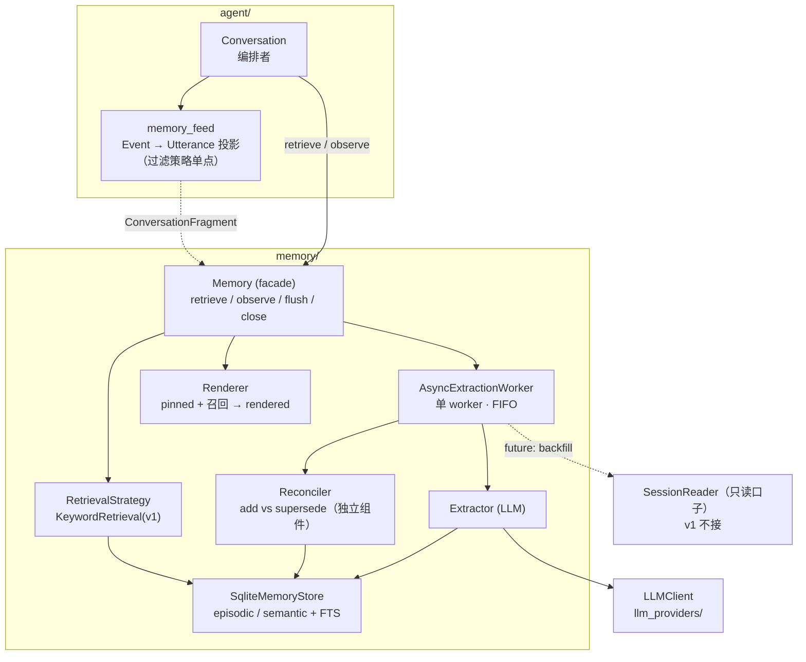
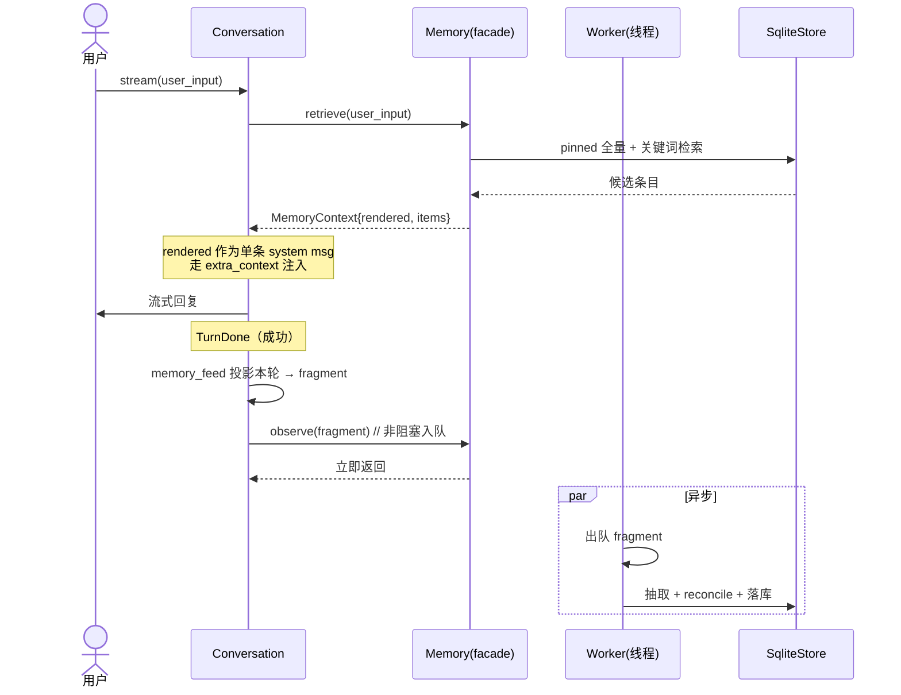

# 008 引擎层长期记忆 · 技术方案

## 状态

<!-- DRAFT | CONFIRMED -->
CONFIRMED

---

## 0. 文档说明

- 本文档是 [008 需求](./requirement.md) 的技术设计文档，回答 requirement §7 的 Q-1 ~ Q-9。
- 写作过程：与用户按思路块逐条讨论后形成。严格基于讨论拍板的决定，不引入任何未对齐的设计点。
- 思考过程（主流方案对比、形态选择理由等）沉淀在 [`docs/explorations/memory`](../../explorations/memory/README.md)；**结论以本文档为准**。
- 后续实施中如发现接口不足或设计需调整，回到本文档更新（保持单一信息源）。

---

## 1. 整体目标与边界

### 1.1 本期要做的事

把 [001 design §6](../001-foundation-chat-and-memory/design.md) 预留、却一直是占位的记忆能力从无到有落地：

1. **`memory/` 模块成型**：facade `Memory`（读 `retrieve` / 写 `observe`）+ 存储层（SQLite）+ 抽取（LLM）+ 召回（打分）+ 异步 worker。
2. **会话→记忆素材投影层**：契约形状（`ConversationFragment` / `Utterance`）定义在 `memory`，投影实现（`Event → Utterance`）放在 `agent` 侧——**过滤策略单点维护**。
3. **`Conversation` 接两个钩子**：聊前调 `retrieve`（复用现有 `extra_context` 接缝）、聊完调 `observe`（新增、非阻塞入队）。
4. **`Memory.retrieve` 返回类型演进**：`list[Message]` → `MemoryContext`（见 §3.2 与 §7 的破坏性说明）。

### 1.2 不做的事（YAGNI 边界）

| 不做的事 | 留到 / 口子形态 |
|---|---|
| Reflection（多 episodic 反思出更抽象 semantic） | schema 留 `source: extracted\|reflected` 字段，不实现异步反思 |
| inspect / forget（用户翻记忆 / 让 agent 忘事） | schema 留 `deleted_at`；不暴露方法 |
| 多 user / 多 persona 行为 | schema 留 `owner_user_id` / `persona_id`，查询锁死单一值 |
| 崩溃时未抽取轮次的回填（backfill） | 留 `SessionReader` 只读口子 + "未抽取水位"字段，不实现回填逻辑 |
| 按 `source_ref` 回取原文细节 | episodic 存指针，v1 不回取（摘要够用） |
| 向量检索（Chroma + BGE，[0002 §3.16](../../decisions/0002-incubation-tech-stack/README.md)） | 抽 `RetrievalStrategy` 接口，v1 仅 keyword 实现 |
| 抽取 / 召回挂不同模型 | 构造注入 `LLMClient`，v1 与主对话同 client |
| 实体消歧 / 合并（"鹅厂"="腾讯"） | 冲突解决仅做"取代"，不做归一 |
| 跨进程并发写同一 memory db | 单进程单 worker 假设 |

### 1.3 与既有接口承诺的关系

| 既有承诺项（[001 design §5](../001-foundation-chat-and-memory/design.md)） | 本期处理 | 理由 |
|---|---|---|
| `Memory.retrieve(query) -> list[Message]` | **破坏**：返回 `MemoryContext` | memory 一直是占位、无真实消费方；唯一调用点（`Conversation` line 460）由本期同步更新。详见 §3.2 |
| `Conversation.__init__(memory=...)` | **不破坏** | 参数早已预留，本期注入真实实例 |
| `ContextManager.build_messages(extra_context=)` | **不破坏** | 记忆渲染成单条 system message 走此参数 |
| `Conversation.send / stream` 签名 | **不破坏** | 新增 `observe` 是内部钩子，不改公开签名 |

---

## 2. 整体架构

### 2.1 模块依赖图



**关键点**：

- `agent → memory` 单向依赖（既有）；**`memory` 运行时不 import `agent`**，契约类型自带（沿用现状 `TYPE_CHECKING` 思路）。
- `memory` v1 **不依赖 `SessionStore`**：素材由 `Conversation` 投影后 push 进来；`SessionReader` 只读口子留给 future backfill。
- `memory` 依赖注入的 `LLMClient`（复用 `llm_providers`），不自己造。

### 2.2 一轮对话里 memory 的两个触点



### 2.3 目录布局

```
memory/src/memory/
├── __init__.py            # 导出公共契约 + build_memory 装配函数
├── contracts.py           # Utterance / ConversationFragment / MemoryContext / MemoryItem / Layer
├── facade.py              # Memory：retrieve / observe / flush / close
├── store/
│   ├── schema.py          # 建表 DDL + 列定义 + 迁移占位
│   └── sqlite_store.py    # episodic / semantic CRUD + FTS5
├── extraction/
│   ├── worker.py          # AsyncExtractionWorker（队列 + 单线程）
│   ├── extractor.py       # LLM 抽取（prompt 组装 + 调用 + 解析）
│   ├── reconciler.py      # add vs supersede（独立组件）
│   └── prompts/extract.md # 抽取 prompt 模板
└── retrieval/
    ├── strategy.py        # RetrievalStrategy 接口 + KeywordRetrieval
    ├── scoring.py         # relevance × importance × time-decay
    └── renderer.py        # items → MemoryContext.rendered（pinned/召回 内部编排）

agent/src/agent/
└── memory_feed.py         # list[Event] → list[Utterance] 投影（过滤策略单点维护）
```

> 目录按职责拆（[repo-directory-layout](../../../.cursor/rules/repo-directory-layout.mdc)）：store / extraction / retrieval 三条边界清晰，避免单文件巨石。

---

## 3. 契约层（contracts.py）

### 3.1 投影素材：Utterance / ConversationFragment

memory 只认识"干净的对话发言"，不认识 `Event`：

```python
from dataclasses import dataclass, field
from datetime import datetime
from typing import Literal

Speaker = Literal["user", "agent"]

@dataclass(frozen=True)
class Utterance:
    speaker: Speaker
    text: str
    ts: datetime
    source_ref: str          # "{session_id}#{event_uuid}"，溯源指针（v1 存不取）

@dataclass(frozen=True)
class ConversationFragment:
    session_id: str
    utterances: list[Utterance]
    persona_id: str          # 本段归属（为 episodic 按 persona 隔离预留）
    owner_user_id: str = "local"   # 多 user 预留，v1 固定
```

### 3.2 召回结果：MemoryContext / MemoryItem

沿用 [exploration §4](../../explorations/memory/README.md) 草案：

```python
@dataclass(frozen=True)
class MemoryItem:
    text: str
    layer: Literal["episodic", "semantic", "pinned"]
    source_ref: str
    score: float

@dataclass(frozen=True)
class MemoryContext:
    rendered: str               # 渲染好的整段，直接塞 system；空召回 = ""
    items: list[MemoryItem]     # 结构化（observability / 调试），空召回 = []

    def is_empty(self) -> bool:
        return not self.rendered
```

**为什么换掉 `list[Message]`（破坏性，已对齐）**：

- 调用方真正要的是"一段可直接注入的 system 文本"——`rendered` 一次给到，调用方不绑定内部结构（[exploration §4 调用方约定](../../explorations/memory/README.md)）。
- `items` 服务 AC-5 可观测（哪些被召回、得分多少）。
- memory 从来是占位、**无真实消费方**，唯一调用点是 `Conversation._build_openai_messages_first_turn`，本期一并改（见 §6.1）。这是**有意识的合理 break**，会在 001 design §5/§6 处标注演进。

---

## 4. 存储层

### 4.1 介质与表

- 介质：**SQLite**（[0002 §3.15](../../decisions/0002-incubation-tech-stack/README.md) 已锁定长期记忆用 SQLite），文件 `data/memory/memory.db`。
- 开 WAL 模式：worker 线程写、主线程读并发更顺。
- 两张主表 + 两张 FTS5 影子表。

### 4.2 schema（一次把预留位建全）

```sql
-- 语义记忆：事实 / 偏好 / 关系
CREATE TABLE semantic (
    id              TEXT PRIMARY KEY,        -- uuid4
    statement       TEXT NOT NULL,           -- "用户养了一只叫 Tom 的猫"
    importance      REAL NOT NULL DEFAULT 0.5,
    pinned          INTEGER NOT NULL DEFAULT 0,   -- 1 = 每次必进上下文
    source          TEXT NOT NULL DEFAULT 'extracted',  -- extracted | reflected
    speaker_origin  TEXT NOT NULL DEFAULT 'user',  -- user | agent（来源权重）
    valid_from      TEXT,                    -- ISO8601
    valid_until     TEXT,                    -- 非空 = 已失效（被取代）
    provenance      TEXT,                    -- JSON: [episode_id, ...]
    deleted_at      TEXT,                    -- 非空 = 软删（forget 预留）
    owner_user_id   TEXT NOT NULL DEFAULT 'local',
    persona_id      TEXT NOT NULL,
    created_at      TEXT NOT NULL,
    updated_at      TEXT NOT NULL
);

-- 情节记忆：对一段对话的认知摘要（不存原文）
CREATE TABLE episodic (
    id              TEXT PRIMARY KEY,
    summary         TEXT NOT NULL,
    source_ref      TEXT NOT NULL,           -- "{session_id}#{start_uuid}..{end_uuid}"
    importance      REAL NOT NULL DEFAULT 0.5,
    participants    TEXT,                    -- JSON
    occurred_at     TEXT NOT NULL,
    deleted_at      TEXT,
    owner_user_id   TEXT NOT NULL DEFAULT 'local',
    persona_id      TEXT NOT NULL,
    created_at      TEXT NOT NULL
);

CREATE VIRTUAL TABLE semantic_fts USING fts5(statement, content='semantic', content_rowid='rowid');
CREATE VIRTUAL TABLE episodic_fts USING fts5(summary,  content='episodic', content_rowid='rowid');
```

**有效性约定**：召回只看 `deleted_at IS NULL AND valid_until IS NULL`（活跃条目）。pinned 跨 persona 共享（user 维度事实）、episodic 按 `persona_id` 过滤——为 [exploration §6 第 1 条](../../explorations/memory/README.md)"semantic 共享 / episodic 隔离"预留，v1 锁单一 persona 时两者表现一致。

### 4.3 SqliteMemoryStore 接口（节选）

```python
class SqliteMemoryStore:
    def __init__(self, db_path: Path): ...

    # 写
    def add_semantic(self, fact: SemanticRow) -> None: ...
    def supersede_semantic(self, old_id: str, valid_until: datetime) -> None: ...
    def add_episodic(self, ep: EpisodicRow) -> None: ...

    # 读
    def pinned(self, *, owner_user_id: str, persona_id: str) -> list[SemanticRow]: ...
    def search_semantic(self, query: str, *, limit: int, **scope) -> list[SemanticRow]: ...
    def search_episodic(self, query: str, *, limit: int, **scope) -> list[EpisodicRow]: ...
    def related_semantic(self, statements: list[str], **scope) -> list[SemanticRow]: ...  # 供 reconcile
```

---

## 5. 写路径（异步抽取）

### 5.1 异步形态（已对齐）

- `Memory.observe(fragment)` **非阻塞入队即返回**，对话主线程无感、零额外延迟。
- memory 内部 **单 worker 线程 + FIFO 队列**：串行、按入队顺序处理（保证 reconcile 时"看到的旧事实"状态一致，不并发打架）。
- `Memory.flush()` / `Memory.close()`：退出前 drain 队列，把没抽完的处理掉（CLI 在 `/quit` / Ctrl-D 调）。
- **崩溃语义**：`kill -9` 时队列里未处理的 fragment 丢失。v1 接受；future 由 backfill 口子兜（§5.5）。

```python
class AsyncExtractionWorker:
    def submit(self, fragment: ConversationFragment) -> None: ...   # 入队
    def flush(self, timeout: float | None = None) -> None: ...      # 阻塞至队列空
    def close(self) -> None: ...                                    # flush + 停线程
```

> **同步/异步是 memory 内部决定**：`observe` 契约不变，未来若要改回同步或换进程池，调用方不动。

### 5.2 抽取管线

worker 出队一个 fragment 后：

1. **取相关旧事实**：`store.related_semantic(...)`（关键词召回本段提到的实体相关 semantic），喂给 LLM 做去重/更新判断。
2. **LLM 抽取**（`extractor.py`）：独立 prompt，输入 = fragment 文本 + 相关旧事实；输出结构化 JSON：
   ```json
   {
     "episodic_summary": "用户分享了新养的猫 Tom，语气兴奋",
     "semantic_ops": [
       {"op": "add", "statement": "用户养了一只叫 Tom 的猫", "importance": 0.7, "pinned": false},
       {"op": "supersede", "target_hint": "用户在腾讯工作", "statement": "用户在字节工作", "importance": 0.6}
     ]
   }
   ```
3. **reconcile**（`reconciler.py`，独立组件）：把 `semantic_ops` 落地——
   - `add` → `add_semantic`
   - `supersede` → 用 `target_hint` 在相关旧事实里定位匹配项，对其 `supersede_semantic(valid_until=now)` 后再 `add_semantic` 新值
   - 定位不到匹配项的 `supersede` → 降级为 `add`（不硬失败）
4. **落 episodic**：`add_episodic(summary, source_ref=fragment 首尾 uuid, occurred_at=...)`，新 semantic 的 `provenance` 指向该 episode。

> reconcile 单独成件（应你要求）：以后要升级冲突策略（引入实体消歧、置信度、人审）只改这一处。

### 5.3 重要性与来源权重（R-4.1.4）

- LLM 给 `importance ∈ [0,1]` 初值。
- **user-said 加一档**：`speaker_origin == "user"` 时 `importance = min(1.0, importance + 0.15)`（系数可调）。agent 自己说的记、但权重低。
- 重要性打分 v1 = **LLM 主打 + 规则微调**（混合），对应 requirement Q-4。

### 5.4 抽取时机与"段"的粒度

- 时机：每轮 `TurnDone`（成功、非 partial/中断）后，`Conversation` 投影本轮 → fragment → `observe`。
- "段" = **一轮**（一次 user + 对应 assistant 文本）。简单、稳定；future 可在 worker 侧合并相邻轮再抽（不影响契约）。

### 5.5 backfill 口子（留位不实现）

- episodic 记录已覆盖到的 `source_ref`；future 可对比 session 事件流找出"没抽过的轮次"补抽。
- 该路径走 `SessionReader`（只读）+ 同一个 `memory_feed` 投影，**与热路径共用投影**，不另写一份过滤逻辑。

---

## 6. 读路径（召回 + 注入）

### 6.1 retrieve 与注入

`Memory.retrieve(query, *, session_id=None, persona_id=..., owner_user_id="local") -> MemoryContext`：

1. `pinned`：`store.pinned(...)` 全量取（小池子，硬上限如 50 条）。
2. 召回：`RetrievalStrategy.search(query)` → semantic + episodic 候选。
3. 打分排序（§6.2）→ 取 top-k（如 8 条）。
4. `renderer` 把 **pinned 段 + 召回段** 编排成一段 `rendered`（pinned 在前作"身份底色"，召回在后；内部编排，对外单块），同时产出 `items`。

注入（改 `Conversation._build_openai_messages_first_turn`）：

```python
ctx = self._memory.retrieve(user_input, session_id=self._session.session_id,
                            persona_id=self._session.current_persona_id) if self._memory else None
extra = [Message(role="system", content=ctx.rendered)] if ctx and not ctx.is_empty() else None
build = self._context_manager.build_messages(
    history=self._session.messages, system_prompt=self._system_prompt,
    new_user_input=user_input, extra_context=extra,
)
# ctx.items 供调试展示（见 §8）
```

→ **单一注入点、不动 004**；004 composer 仍只产 persona system prompt，记忆是独立的 `extra_context` system 段。

### 6.2 打分公式（起点，可调）

```
score = w_rel * relevance + w_imp * importance + w_rec * recency
relevance = 归一化的 FTS5 BM25 排名（0~1）
recency   = decay ** age_days          # decay≈0.98，age = now - occurred_at/updated_at
权重起点  = (w_rel, w_imp, w_rec) = (1.0, 0.6, 0.4)
```

- 参考 Generative Agents 三因子（relevance/importance/recency）但简化（requirement Q-3）。
- 权重与 decay 作为常量集中在 `scoring.py`，调参不散落。

### 6.3 RetrievalStrategy 口子（已对齐抽薄接口）

```python
class RetrievalStrategy(Protocol):
    def search(self, query: str, *, limit: int, **scope) -> list[Candidate]: ...

class KeywordRetrieval:   # v1：SQLite FTS5
    ...
# future：VectorRetrieval（Chroma + BGE-small-zh），构造时替换注入，retrieve 不变
```

### 6.4 连续感（R-4.4）与如实反馈（R-4.5.3）

- 连续感：renderer 在 rendered 里带 episodic 的时间信息（"上次（N 天前）聊到 X"）；**话术归 persona**，memory 只供素材。
- 空召回：`rendered=""`、`items=[]`，`is_empty()` 为真 → Conversation 不注入任何记忆段；memory 不编造（话术兜底由 persona fallback 负责）。

---

## 7. agent 侧投影（memory_feed.py）

过滤策略**单点维护**（应你的核心诉求）：

```python
def project_turn(events: list[Event], *, session_id, persona_id) -> ConversationFragment:
    """把本轮的 events 投影为记忆素材。过滤规则集中在此。"""
    utterances = []
    for ev in events:
        if ev.type == "user_message":
            utterances.append(Utterance("user", ev.payload["content"], ev.ts, f"{session_id}#{ev.uuid}"))
        elif ev.type == "assistant_message" and not ev.payload.get("partial"):
            utterances.append(Utterance("agent", ev.payload["content"], ev.ts, f"{session_id}#{ev.uuid}"))
        # 丢弃：session_meta / persona_change / model_change / tool_call_request / tool_call_result
    return ConversationFragment(session_id, utterances, persona_id)
```

**v1 过滤策略**：保留 `user_message` / `assistant_message`（非 partial）文本；丢弃其余事件类型。`tool_call_result` 是**最明显的未来例外**（工具查出的事实可能值得记）——要改只改这一个函数。

> 投影函数放 agent 侧（它拥有 `Event` taxonomy），产出 memory 定义的 `Utterance`；memory 不反向认识 `Event`。

---

## 8. 可观测性（AC-5）

- **召回**：`MemoryContext.items` 已带 `layer / source_ref / score`，CLI 调试区每轮回复后可展示"本轮召回了哪些"。
- **写入**：因抽取异步，写入不再与"本轮"同步。worker 完成一次抽取后通过**回调 / 事件**回报"刚写/更新了哪些条目（含来自哪个 fragment）"，CLI 以"异步通知"形式打印（不强求与该轮回复同屏）。
  - 接口：`Memory` 构造可注入 `on_extracted: Callable[[ExtractionResult], None]`（调试钩子，默认 None）。
- 这满足 AC-5"看到召回 / 写入了哪些记忆"，同时如实反映异步语义。

---

## 9. 实施里程碑

| 里程碑 | 范围 | 完成标志 |
|---|---|---|
| **M8.1 存储 + 写路径** | contracts、SqliteMemoryStore + schema、memory_feed 投影、Extractor + Reconciler、AsyncExtractionWorker、`Conversation` 接 `observe` + `flush/close` | 聊几轮、退出，`memory.db` 里能看到抽出的 episodic / semantic（含一次 supersede） |
| **M8.2 读路径 + 注入** | KeywordRetrieval + scoring + renderer → `MemoryContext`；`retrieve` 接进 `Conversation` 的 `extra_context`（含返回类型演进 + 改调用点 + 标注 001 design） | 跨会话：A 会话说"养了猫 Tom"→重启→B 会话显式问能召回（AC-1） |
| **M8.3 pinned + 连续感 + 可观测** | pinned 总注入 + 时间感渲染；CLI 调试区展示召回/写入；`build_memory` 装配 + `SessionManager` 接线 | AC-2 / AC-3 / AC-5 跑通 |

---

## 10. 接口稳定承诺与预留点

### 10.1 本期对外接口

| 接口 | 承诺 |
|---|---|
| `Memory.retrieve(...) -> MemoryContext` | 本期定型；后续仅向后兼容扩展（加可选参数 / `MemoryItem` 加字段） |
| `Memory.observe(fragment) -> None` | 非阻塞契约稳定；同步/异步是内部实现 |
| `Utterance / ConversationFragment / MemoryContext / MemoryItem` | 字段只增不改义 |

### 10.2 预留点清单（留口子、v1 不实现）

| 预留点 | 形态 |
|---|---|
| Reflection | `semantic.source = extracted\|reflected` 字段 |
| forget | `deleted_at` 列 + 召回过滤；不暴露方法 |
| 多 user / persona | `owner_user_id` / `persona_id` 列 + 查询 scope 参数；锁单一值 |
| backfill | `SessionReader` 只读接口 + episodic `source_ref` 水位；与热路径共用 `memory_feed` |
| 向量召回 | `RetrievalStrategy` 接口 |
| 抽取/召回独立模型 | 构造注入 `LLMClient` |
| 冲突策略升级 | `reconciler.py` 独立组件 |

---

## 11. 影响分析

### 11.1 上下游影响

- **`agent.Conversation`**：改 `_build_openai_messages_first_turn`（retrieve 返回类型）+ `stream` TurnDone 后加 `observe` 钩子。`send/stream/switch_*` 公开签名不变。
- **`agent` 装配（SessionManager / build）**：新增 memory 装配与注入；不注入时 `memory=None`，行为与今日完全一致（向后兼容）。
- **`tools/cli`**：`/quit` 调 `memory.close()` drain；调试区加召回/写入展示。
- **`memory/` 唯一调用点**：line 460，已覆盖。
- **001 design**：在 §5/§6 标注 `retrieve` 返回类型已由 008 演进为 `MemoryContext`（指针，不改原结论正文）。

### 11.2 风险点

- **异步丢数据**：崩溃丢未抽轮次 → 影响有限（working memory 当场已覆盖近期，长期记忆靠下次；future backfill 兜）。需保证正常退出 drain。
- **抽取质量/成本**：每轮一次 LLM 调用，长会话累计成本；worker 异步不阻塞体验，成本可观测后再优化（合并轮次 / 小模型）。
- **召回噪声**（隐性应用捞错代价高）：v1 keyword 可能召回不准，靠 importance/recency 压制 + top-k 限制；不达预期时上向量（口子已留）。
- **SQLite 读写并发**：WAL + 单 worker 写，孵化期单进程足够。

---

## 12. 变更记录

| 日期 | 变更内容 | 是否需要重新实现 |
|------|---------|----------------|

---

## 文档元信息

- **状态**：已确认（Confirmed）
- **创建时间**：2026-06-05
- **确认时间**：2026-06-05
- **需求文档**：[requirement.md](./requirement.md)
- **下一步**：进入实现（Phase 3），见 `progress.md`
