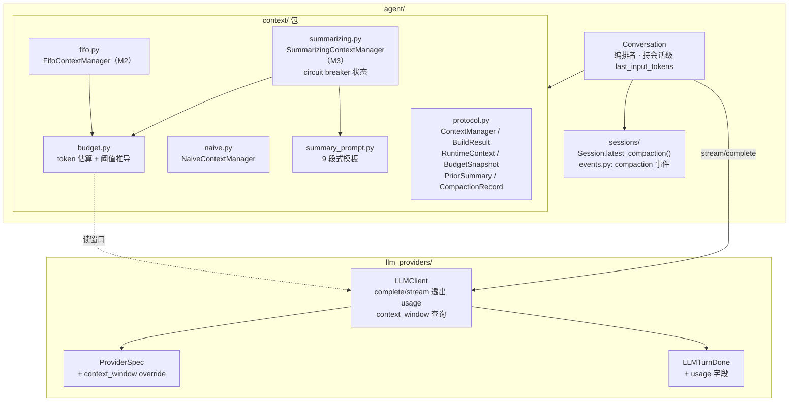
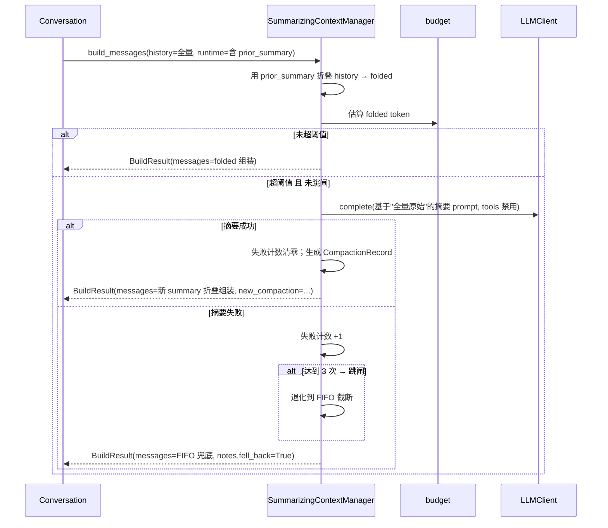

# 009 引擎层上下文管理 · 技术方案

## 状态

<!-- DRAFT | CONFIRMED -->
CONFIRMED

---

## 0. 文档说明

- 本文档是 [009 需求](./requirement.md) 的技术设计文档，回答 requirement §7 的 Q-1 ~ Q-10。
- 写作过程：与用户按思路块逐条讨论后形成。严格基于讨论拍板的决定，不引入任何未对齐的设计点。
- 思考过程（主流方案对比、cc 取舍借鉴等）沉淀在 [`docs/explorations/context-management`](../../explorations/context-management/README.md)；**结论以本文档为准**。
- 后续实施中如发现接口不足或设计需调整，回到本文档更新（保持单一信息源）。

---

## 1. 整体目标与边界

### 1.1 本期要做的事

把 [001 design §4.3](../001-foundation-chat-and-memory/design.md) 预留、却一直只有 `NaiveContextManager`（全发不截断）的"上下文管理"扩展点真正落地，按三个里程碑交付：

1. **M1 度量与预算**：让 `LLMClient` 透出真实 token `usage`、暴露 model 的 context window；在 `agent` 侧做 hybrid token 估算 + 按窗口动态推导阈值。
2. **M2 防爆窗兜底**：`FifoContextManager`，摘要不可用时零 LLM 成本的 FIFO 截断保证不爆窗。
3. **M3 摘要压缩**：`SummarizingContextManager` 为主策略，结构化摘要把长历史蒸馏成 summary 落盘；连续失败经 circuit breaker 退化到 M2。

同时收口两处"绕过 ContextManager"的现状（requirement R-0.3）：**统一所有发往 LLM 的上下文入口**（首轮 / 工具续轮 / 触上限兜底收尾），消除续轮防爆窗漏洞与兜底手拼消息的重复。

### 1.2 不做的事（YAGNI 边界）

| 不做的事 | 留到 / 口子形态 |
|---|---|
| L3 轮内单条 tool 结果爆炸控制 | 纳入蓝图，留后续独立需求；本期续轮覆盖只做"整轮历史预算检查/裁剪/压缩" |
| 选择性保留（按重要性留/丢） | 仅 FIFO + 摘要两条策略，不做打分 |
| 与 memory 的强协同（压缩前确认已沉淀） | 接受现有每轮 `observe` 尽力而为 |
| 删除 / 修改原始会话事件 | 摘要只新增 `compaction` 折叠点事件，原始事件一条不动 |
| 重构 `build_messages` 单次组装职责（问题 A） | 只松绑签名 + 加策略，不重写组装逻辑 |
| 自维护 model→window 表 | 复用 `litellm.get_model_info`，仅留 `ProviderSpec.context_window` override 兜底 |

### 1.3 与既有接口承诺的关系

| 既有承诺项 | 本期处理 | 理由 |
|---|---|---|
| `ContextManager.build_messages(...)` 签名 | **向后兼容地放松**：`new_user_input` 改可选、新增 `extra_context` 之外的 `trailing_system` 与 `runtime` 可选参数 | 续轮/兜底无新输入；首轮调用不受影响 |
| `ContextManager` 作为无会话状态 Protocol | **演进**：实现可持依赖注入 + 会话级状态，但通过 **per-session 工厂**隔离（不再单例共享） | 摘要要持 circuit breaker 计数等会话状态，单例会串话 |
| `SessionManager(context_manager=...)` | **破坏（内部）**：改为 `context_manager_factory=...` | 与现有 `llm_client_factory` / `prompt_builder_factory` 邻居一致；孵化期内部代码无外部调用方，不做兼容 shim |
| `LLMTurnDone` | **加性**：新增可选 `usage` 字段 | 仅 `llm_providers` 内部 + `agent.conversation` 消费，非对外公共 API |
| `ProviderSpec` | **加性**：新增可选 `context_window` 字段（默认 `None`） | 现有调用方不传 = 走 litellm 查询 |
| `Session.messages`（memory 数据源） | **不变** | memory 抽取继续读原始全量；折叠仅作用于 context 组装 |
| 会话事件 schema | **加性**：新增 `compaction` 事件类型，`SCHEMA_VERSION` 不递增（沿用"纯加性不递增"约定） | 老文件无该事件时自然退化为全量 |

---

## 2. 整体架构

### 2.1 模块与数据流



### 2.2 关键约束（贯穿全设计）

1. **`agent` 不直接 import litellm**：窗口查询封装在 `llm_providers`，`budget.py` 只从 `LLMClient` 拿窗口数值。
2. **`Session.messages` 行为不变**：折叠（summary 替换旧段）发生在 context manager 内部，不污染原始派生视图，memory 零影响。
3. **会话级可变状态隔离**：`context_manager` 改 per-session 工厂；`SummarizingContextManager` 实例只服务一个会话，可安全持 circuit breaker 计数。
4. **运行时依赖 per-call 注入**：`llm_client`（摘要要用，且 `switch_model` 后会变）、上轮 usage 锚点、已有 summary，统统打包成 `RuntimeContext` 每轮传入，不在构造时固化。

---

## 3. M1 · 度量与预算

### 3.1 `LLMClient` 透出真实 usage（Q-1）

**非流式 `complete`**：litellm `response.usage` 现成可取。保持 `complete` 公开签名返回 `str` 不变，新增内部方法返回 `(content, usage)` 供需要的调用方使用；主对话不走 `complete`（走 stream），摘要调用走 `complete` 并取 usage 校准锚点。

**流式 `stream`**：

- `litellm.completion(..., stream=True, stream_options={"include_usage": True})` 让最后一个 chunk 带 `usage`。
- `_stream_once` 在收到带 usage 的尾 chunk 时，把它塞进 `LLMTurnDone.usage`。
- provider 不支持 `include_usage` 时尾 chunk 无 usage → `LLMTurnDone.usage = None`，退化到纯字符估算（不阻断）。

`LLMTurnDone` 加字段（加性，frozen dataclass）：

```python
@dataclass(frozen=True)
class LLMUsage:
    prompt_tokens: int = 0
    completion_tokens: int = 0
    total_tokens: int = 0

@dataclass(frozen=True)
class LLMTurnDone:
    stop_reason: str = ""
    usage: LLMUsage | None = None        # 新增；provider 不透出时为 None
    type: Literal["done"] = "done"
```

### 3.2 model 窗口查询：三层兜底（Q-1 配套，发现 C）

封装在 `llm_providers`（`agent` 不碰 litellm）。`LLMClient` 暴露：

```python
@property
def context_window(self) -> int:
    # 1) ProviderSpec.context_window override（私有 api_base / litellm 不认识的 model）
    if self.spec.context_window is not None:
        return self.spec.context_window
    # 2) litellm 元数据
    try:
        info = litellm.get_model_info(self.spec.model)
        win = info.get("max_input_tokens") or info.get("max_tokens")
        if win:
            return int(win)
    except Exception:
        pass
    # 3) 保守默认（宁小不大，偏早触发，安全）
    return DEFAULT_CONTEXT_WINDOW  # 8192
```

`ProviderSpec` 加 `context_window: int | None = None`（加性，`from_env` 可读 `{prefix}_CONTEXT_WINDOW`）。

### 3.3 token 估算与阈值推导（Q-2 / Q-4）

`budget.py` 提供 hybrid 估算（偏保守上界，requirement R-1.1）：

- **锚点**：上一轮真实 `usage.prompt_tokens`（由 `Conversation` 持有并传入）。
- **增量**：锚点之后新增消息按字符数估算。系数取 **0.75 token/char**（cc 的 `/4`≈0.25 对英文准，但中文 1 字≈1~2 token，0.25 会严重低估；0.75 是偏上界的保守值，宁可早触发）。无锚点时（首轮 / provider 不透出 usage）整段按字符估算。
- 估算值记入 `BuildResult.notes["token_estimate"]`（observability，requirement R-1.4 / AC-1.3）。

阈值按窗口比例推导（requirement R-1.3，**不写死固定值**）：

```
effective_window = llm_client.context_window
output_reserve   = effective_window * OUTPUT_RESERVE_RATIO   # 给本轮输出留的
buffer           = effective_window * BUFFER_RATIO           # 估算误差缓冲
trigger_threshold = effective_window - output_reserve - buffer
```

`OUTPUT_RESERVE_RATIO` / `BUFFER_RATIO` 为 `budget.py` 内常量（如各 0.1）。小窗口模型（8K）下比例化是否够用，在 M1 联调时用真实 usage 对照校准（探索 §7 遗留点）。

### 3.4 `BudgetSnapshot`（纯数据，便于单测）

```python
@dataclass(frozen=True)
class BudgetSnapshot:
    effective_window: int          # = llm_client.context_window
    last_input_tokens: int | None  # 上轮真实 prompt_tokens 锚点；首轮 None
    output_reserve: int
    buffer: int

    @property
    def trigger_threshold(self) -> int:
        return self.effective_window - self.output_reserve - self.buffer
```

---

## 4. 统一 LLM 上下文入口（Q-9，R-0.3）

### 4.1 接口形状

把所有"附加成分"做成可选，`history` 是唯一必给主体；运行时依赖收进单个 `runtime`：

```python
def build_messages(
    self,
    history: list[Message],              # 原始全量 session.messages（见 §6.3）
    system_prompt: str,
    new_user_input: str | None = None,   # 续轮/兜底传 None：不再 append 新 user
    extra_context: list[Message] | None = None,   # memory 召回（仅首轮）
    trailing_system: str | None = None,  # 兜底收尾的临时指令，放最末
    runtime: RuntimeContext | None = None,  # 预算/llm_client/已有 summary
) -> BuildResult: ...
```

Protocol 不变量放松（`protocol.py` docstring 同步）：

- 原"`new_user_input` 必须放最后" → "**若提供** `new_user_input` 放在最后"；
- 新增"**若提供** `trailing_system` 放在所有消息之后（比 `new_user_input` 还靠后）"；
- `runtime=None` 时所有实现退化为不做预算判断（`Naive` 行为完全不变，向后兼容）。

三个调用点收敛（消除 `_build_openai_messages_continuation` / `_finalize_on_tool_loop_limit` 的手拼重复）：

| 调用点 | history | new_user_input | extra_context | trailing_system |
|---|---|---|---|---|
| 首轮 | `session.messages` | 用户输入 | memory 召回 | — |
| 工具续轮 | `session.messages`（已含 user） | `None` | — | — |
| 兜底收尾 | `session.messages` | `None` | — | 收尾指令 |

> 续轮不需要 `new_user_input`：首轮 LLM 完成后已 `_append_user_event`，用户输入早进了 `session.messages`（见 conversation.py L296-299）。当初设成必填才逼出"续轮另走一条路"。

### 4.2 `RuntimeContext`：运行时依赖的单一载体

把"靠什么算/压"这类运行时能力打包，与"拼什么内容"的参数分离；未来 M1/M3 需要新运行时信息直接扩字段，不再改 `build_messages` 签名：

```python
@dataclass
class RuntimeContext:
    budget: BudgetSnapshot
    llm_client: LLMClient              # 摘要要用；per-call 传入 → switch_model 后自动跟随
    prior_summary: PriorSummary | None # 已落盘的最近折叠点（平时折叠展示用）

@dataclass(frozen=True)
class PriorSummary:
    summary: str
    covered_through_uuid: str          # summary 覆盖到哪条事件（含）
```

三策略对 `runtime` 的用法：`Naive` 忽略；`Fifo` 用 `budget`；`Summarizing` 全用。

### 4.3 `BuildResult` 扩展

```python
@dataclass
class BuildResult:
    messages: list[Message]
    dropped_count: int = 0
    new_compaction: CompactionRecord | None = None  # 本轮新生成、待 Conversation 落盘
    notes: dict[str, Any] = field(default_factory=dict)  # token_estimate / compacted / fell_back ...
```

**职责边界**：context manager 只做"决策 + 生成摘要（含调 LLM）+ 折叠"，**不做存储 IO**；落盘由 `Conversation` 读 `BuildResult.new_compaction` 后执行（§6.4）。

---

## 5. M2 · 防爆窗兜底（FifoContextManager，Q-3）

```python
class FifoContextManager:
    def build_messages(self, history, system_prompt, new_user_input=None,
                       extra_context=None, trailing_system=None, runtime=None) -> BuildResult:
        # runtime=None → 等价 Naive（不裁剪）
        # 否则：组装后估算 token，超 trigger_threshold 则从最老 history 开始丢，
        #       直到落回预算内；始终保留 system / extra_context / 最近若干轮 / new_user_input / trailing_system
```

保留策略（Q-3）：**按 token 预算裁剪 + 保护最近 N 轮**（条数下限），避免极端长单条把近期全裁光。`dropped_count` 记裁剪条数（requirement R-2.3 / AC-2.2）。定位：仅作摘要不可用时的零 LLM 成本安全网（R-2.2）。

---

## 6. M3 · 摘要压缩（SummarizingContextManager）

### 6.1 主流程



### 6.2 摘要 prompt 与调用（Q-5，R-3.2/3.3/3.4）

- `summary_prompt.py` 放 9 段式结构模板（借鉴 cc）：先 `<analysis>` 草稿纸梳理时间线/关键决策，再输出结构化 summary（用户画像 / 待办 / 最近上下文等段）。**user 原话关键信息逐字保留**（防意图漂移）。
- 调用走 `LLMClient.complete`（单轮、`tools=None`、文本输出），最终只把 summary 段留进上下文（`<analysis>` 丢弃）。
- ⚠️ 真实 LLM 调用，触发与验证受 `llm-api-confirm` 约束。

### 6.3 关键决策：摘要基于"全量原始的较旧部分"，保留最近 N 轮逐字（不做 summary-of-summary）

为避免"摘要的摘要"累积失真：**每次触发摘要时，输入用全量原始 `session.messages` 的较旧部分重新蒸馏**，而非在 `prior_summary` 上增量叠加。

- 因此 `Conversation` 三个入口传给 `build_messages` 的 `history` 一律是**原始全量** `session.messages`（不是折叠视图）。
- **保留最近 N 个 user 轮逐字不折**（`SUMMARY_RECENT_TAIL_TURNS`，默认 2）：摘要只覆盖"较旧部分"，最近若干轮原样保留。切点取 **user 轮边界**（复用 M2 FIFO 的保组逻辑）——保证进行中的工具组（assistant `tool_calls` + `tool` 结果）不被折断，也给摘要后的对话留逐字近况、维持连续性。
- 折叠只发生在 context manager 内部：平时（未超阈值）用 `runtime.prior_summary` 把已覆盖旧段替换为一条 summary system 消息、其后逐字保留，省 token；超阈值要重摘时，忽略 prior_summary、直接吃全量原始的较旧部分。
- 折叠后的上下文形态：`[system_prompt] + [summary system 消息] + [最近 N 轮逐字] + [new_user?] + [trailing_system?]`。
- **极端退化**：若较旧部分本身已超过"摘要输入预算"（`trigger_threshold`，很长的会话摘要调用自己都塞不下），才退回到增量模式（`prior_summary` + 其后到切点的原始消息）。常见会话长度下走全量重摘。

### 6.4 compaction 事件落盘与折叠投影（Q-10，R-3.7）

**新增事件类型**（`events.py` 的 `EventType` / `ALLOWED_EVENT_TYPES` 各加 `"compaction"`，`SCHEMA_VERSION` 不递增）：

```jsonc
{
  "type": "compaction",
  "uuid": "...",
  "ts": "...",
  "payload": {
    "summary": "结构化摘要文本",
    "covered_through_uuid": "被折叠覆盖到的最后一条事件 uuid（含）= 较旧部分末尾、保护 tail 之前",
    "tokens_before": 12000,   // observability
    "tokens_after": 1800,
    "model": "deepseek/deepseek-v4-flash"
  },
  "meta": {}
}
```

**原始事件一条不删不改**——compaction 只是 append-only 流上叠加的折叠点 marker。

`Session` 新增只读派生（不改 `messages`）：

```python
def latest_compaction(self) -> Event | None:
    """反向扫最后一条 compaction 事件；无则 None（老文件自然退化为全量）。"""
```

折叠逻辑放在 context manager（用 `RuntimeContext.prior_summary`，由 `Conversation` 从 `latest_compaction()` 派生传入），而非 `Session` 内：保持 `Session` 纯净、`messages` 行为不变，memory 读全量不受影响。多次压缩天然叠加——最新 compaction 的 summary 已含此前内容，折叠永远只认最近一条。

---

## 7. 装配模型：context_manager → per-session 工厂（Q-7，发现 A）

现状 `SessionManager` 持 `context_manager` 单例，`start_conversation` 把同一实例传给每个 `Conversation`（会串话）。改为工厂，与 `llm_client_factory` / `prompt_builder_factory` 邻居一致：

```python
# SessionManager.__init__
context_manager_factory: Callable[[], ContextManager] | None = None
# start_conversation 内：每个会话 new 一个独立实例
context_manager = self._context_manager_factory()
```

- `Conversation.__init__` 的 `context_manager` 参数保留（仍接单实例，由工厂产出，便于手工测试）。
- 默认工厂产 `SummarizingContextManager`（M3 完成后切默认；M1/M2 阶段可配 `Naive` / `Fifo` 分阶段上线，requirement R-0.2）。
- **不做向后兼容 shim**：孵化期内部代码，直接改全部装配点（§9）。

---

## 8. Conversation 改造

- 三入口收敛为一个内部 `_assemble(...)`：差异只在 `new_user_input` / `extra_context` / `trailing_system`，`history` 统一传 `session.messages`。
- 新增会话级 `_last_input_tokens`：消费 `LLMTurnDone.usage` 更新；每轮打包进 `BudgetSnapshot` → `RuntimeContext`。
- 从 `session.latest_compaction()` 派生 `PriorSummary` 放进 `RuntimeContext`。
- 收到 `BuildResult.new_compaction` 后调新增 `_append_compaction_event(...)` 落盘（复用现有 `store.append_event` + `session.append` 模式）。
- 摘要在 `build_messages` 内同步发生 → 用户发问到回复间会多一次 LLM 往返延迟。CLI 应给"正在压缩上下文…"提示（§10 风险）。

---

## 9. 下游影响 / 改动清单

| 模块 | 改动 | 破坏性 |
|---|---|---|
| `llm_providers/stream_events.py` | 加 `LLMUsage` + `LLMTurnDone.usage` | 加性 |
| `llm_providers/client.py` | stream 传 `stream_options`、取尾 chunk usage；`context_window` 属性；complete 内部透出 usage | 公开签名不变 |
| `llm_providers/spec.py` | `ProviderSpec.context_window` 可选字段 + `from_env` 读取 | 加性 |
| `agent/context.py` → `context/` 包 | protocol/naive/fifo/summarizing/budget/summary_prompt 拆分；`__init__.py` re-export 保兼容 | 内部重组 |
| `agent/sessions/events.py` | `compaction` 事件类型 | 加性 |
| `agent/sessions/session.py` | `latest_compaction()` | 加性 |
| `agent/conversation.py` | 三入口收敛、消费 usage、落 compaction | 内部 |
| `agent/sessions/manager.py` | `context_manager` → `context_manager_factory` | 破坏（内部） |
| `agent/__init__.py` | 导出新增 `Fifo`/`Summarizing`/数据类 | 加性 |
| 装配点：`tools/.../cli/__main__.py`、`agent_bridge/.../assembly.py` | 改传 `context_manager_factory` | 破坏（内部） |
| 测试：`test_tool_calling_integration.py`、`test_channel.py`、`test_system_prompt_integration.py`、`agent_bridge/.../test_meta_channel_routes.py` | 同步改装配 | 破坏（内部） |
| `memory/` | **零改动**（读 `session.messages` 原始全量） | 无 |

新增脚本（若需要跑 009 专项验证）按 `cross-platform-dev` 规范双端补 `run.sh` / `run.ps1` 并登记 `scripts/README.md`。

---

## 10. 风险与权衡

- **摘要延迟**：超阈值轮会插一次完整 LLM 调用，用户侧有等待。缓解：CLI 显式提示"正在压缩上下文"。
- **字符系数对混合语言偏差**：0.75/char 是保守上界，配合真实 usage 锚点逐轮校准；M1 联调时对照 usage 调参。
- **全量重摘成本**：每次重摘吃全量原始 → 比增量贵，但换来"最近一次摘要质量最高、无累积失真"。极端超长会话退化为增量兜底。
- **provider 不透出 usage**：退化到纯字符估算，精度下降但不阻断（偏保守仍安全）。
- **小窗口模型（8K）比例化阈值**：M1 校准期重点验证；必要时给 `budget.py` 常量留按窗口分档的口子。

---

## 11. 实现里程碑

- **M1**：`llm_providers` 透出 usage + 窗口查询；`context/` 包骨架 + `budget.py`；`build_messages` 新签名 + 三入口收敛（先用 `Naive` 跑通，验证入口覆盖与度量可观测）。
- **M2**：`fifo.py` + 工厂化装配（默认仍可配 `Naive`）；验 AC-2.x（含工具续轮不爆窗）。
- **M3**：`summarizing.py` + `summary_prompt.py` + `compaction` 事件 + `latest_compaction()` + 折叠；默认切 `Summarizing`；验 AC-3.x（真实 LLM，遵 `llm-api-confirm`）。

进入实现前按 `dev-workflow` 从最新 main 切 `feature/009-engine-context-management` 分支。

---

## 12. 开放问题答复对照（requirement §7）

| 编号 | 结论 |
|---|---|
| Q-1 usage 透出 | complete 内部透出 + stream `stream_options.include_usage` → `LLMTurnDone.usage`；取不到为 None（§3.1） |
| Q-2 缓冲量 | 按窗口比例（`OUTPUT_RESERVE_RATIO` + `BUFFER_RATIO`），常量在 `budget.py`，小窗口校准（§3.3） |
| Q-3 FIFO 保留窗口 | 按 token 预算裁剪 + 保护最近 N 轮条数下限（§5） |
| Q-4 字符系数 | 0.75 token/char 保守上界，配真实 usage 锚点校准（§3.3） |
| Q-5 摘要 prompt | 9 段式 + `<analysis>` 草稿纸，最终只留 summary（§6.2） |
| Q-6 circuit breaker | 连续失败 3 次跳闸 → 退化 FIFO；状态 per-session，本会话内不自动恢复（§6.1/§7） |
| Q-7 策略装配 | `context_manager_factory` per-session；默认 `Summarizing`，可配 `Naive`/`Fifo`（§7） |
| Q-8 预算账本 | `BudgetSnapshot` 作 M2/M3 共享预算概念（§3.4） |
| Q-9 接口形状 | `build_messages` 加可选 `new_user_input`/`trailing_system` + 单个 `runtime: RuntimeContext`；不变量放松（§4） |
| Q-10 compaction | 新增 `compaction` 事件 + `Session.latest_compaction()`；折叠在 context manager 内部（用 `prior_summary`）；`history` 传原始全量、最近摘要基于全量重摘、极端长会话退化增量；原始事件不动（§6.3/§6.4） |

---

## 13. 变更记录

| 日期 | 变更内容 | 影响范围 |
|------|---------|---------|
| 2026-06-09 | 初稿：基于与用户逐块讨论拍板的设计落地，回答 requirement Q-1~Q-10。 | 全文 |
| 2026-06-09 | M3 落地细化：摘要只覆盖"较旧部分"、按 user 轮边界保留最近 N 轮逐字不折（保组完整 + 近期连续性），明确折叠后上下文形态与 `covered_through_uuid` 语义。 | §6.3 / §6.4 |

---

## 文档元信息

- **状态**：已确认（Confirmed）
- **创建时间**：2026-06-09
- **确认时间**：2026-06-09
- **承接**：[009 requirement](./requirement.md)
- **下一步**：按 `dev-workflow` 从最新 main 切 `feature/009-engine-context-management` 分支，进入 Phase 3 实现（M1 → M2 → M3）
