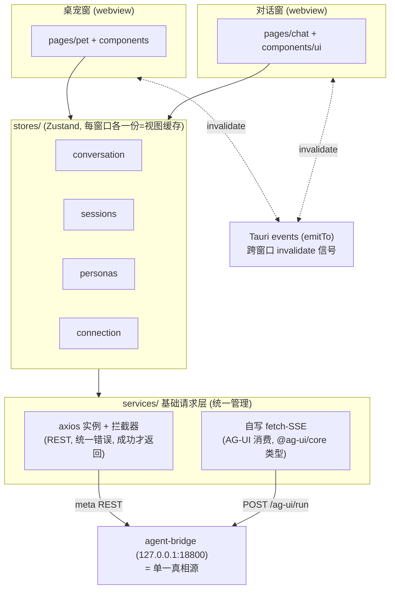
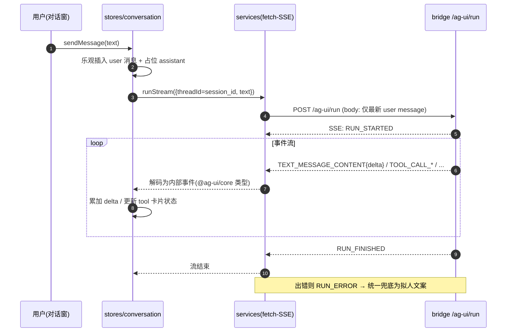

# 010 · 桌面外壳与对话界面 技术方案

> Desktop Shell & Chat UI: Technical Design
>
> 在已锁定的项目级技术栈（[`0003`](../../decisions/0003-frontend-stack-and-phase1-kickoff/README.md)：React + Vite + Tailwind + pnpm + Tauri 2）下，把 [`requirement.md`](./requirement.md) 的三里程碑落成"怎么做"。

---

## 状态

<!-- DRAFT | CONFIRMED -->
CONFIRMED（2026-06-10）

---

## 0. 文档说明

本文档回答 [`requirement.md`](./requirement.md) §7 的开放问题（Q-1 ~ Q-8），并定义前端的内部架构、目录分层、数据流、模块设计与实施路径。

**不复述 `requirement.md` 的"做什么"，也不复述 [`0002`](../../decisions/0002-incubation-tech-stack/README.md) / [`0003`](../../decisions/0003-frontend-stack-and-phase1-kickoff/README.md) 已锁定的项目级技术栈。** 后端契约直接复用 [`006 agent-bridge`](../006-agent-bridge/design.md)，本期前端作为其下游客户端接入，**不改动 bridge 与 agent 核心库**。

---

## 1. 整体目标与边界

### 1.1 交付物

- 顶层 `frontend/`（Tauri 2 + React + Vite + TS + pnpm，单 build 多 entry）
- 两个窗口：桌宠悬浮窗（透明置顶）+ 对话窗（常规）
- 基础请求层：axios 封装的 REST 客户端 + 自写 fetch-SSE 的 AG-UI 流消费，统一错误处理
- 自写数据流：Zustand 多 store（conversation / sessions / personas / connection）
- 组件层：shadcn/ui（copy-in 到 `components/ui/`）+ Tailwind + CSS 变量换肤
- 占位形象 + 操作栏浮层（单按钮：打开对话窗），预留 Live2D 挂载点
- `scripts/frontend/`（install / dev / build）双端脚本 + `scripts/README.md` 登记

### 1.2 不做的事（YAGNI 边界，补充 requirement §3）

- 不引入 `@ag-ui/client`（只用 `@ag-ui/core` 的 TS 类型）
- 不引入全量**通用**组件库（antd / MUI）——通用原子件走 shadcn/ui（§4.5），避免与 CSS 变量换肤形成两套主题系统
- 不引入对话全家桶式方案（如 Ant Design X）；对话域改用 `@tdesign-react/chat` 散件作底层（见 §4.5）
- 不做 SSE 自动重连 / 离线缓存 / 请求重试中间件（本期失败即拟人提示）
- 不做跨平台打包 / 签名 / 自动更新（开发态 dev / 本地 build 验证形态即可）
- 不做 i18n、不做无障碍完整适配（shadcn 自带的 Radix a11y 够用即可）

### 1.3 与既有契约的关系（均不改）

| 既有契约 | 本期是否动 |
| --- | --- |
| bridge `POST /ag-ui/run`（AG-UI） | 不动，前端作为客户端消费 |
| bridge meta REST（`/v1/sessions` 等） | 不动，前端调用 |
| agent 核心库 / session JSONL schema | 不动 |
| bridge 默认监听 | 沿用 `127.0.0.1:18800`（见 `scripts/bridge`） |

---

## 2. 实施路径：3 个里程碑

沿用项目 `M{需求编号}.{序号}` 习惯，对齐 requirement 的 M1/M2/M3。

### 2.1 M10.1 · 环境搭建（对齐 requirement §4.1）

- 初始化 `frontend/`：Vite + React + TS 模板，接入 Tauri 2（`src-tauri/`）
- 配置单 build 多 entry（`pet.html` / `chat.html`）与 `tauri.conf.json` 双窗口定义
- 接入 Tailwind + CSS 变量主题骨架（`styles/` + `theme/`）、shadcn/ui 初始化
- 建立 `src/` 分层空目录 + 基础请求层骨架（axios 实例 + 健康检查打通）
- `scripts/frontend/`（install / dev / build）双端脚本 + 登记 README
- **验收**：AC-M1.1 / AC-M1.2

### 2.2 M10.2 · 界面大框架（对齐 requirement §4.2）

- 桌宠窗：透明、置顶、无边框、占位形象、Live2D 挂载点占位
- 鼠标穿透 / hit-test / 拖拽 / 托盘（**本里程碑做 Tauri spike 实测校正**，呼应 0002 §3.6）
- 操作栏浮层（hover/click 显示，单按钮"打开对话界面"）
- 点按钮打开对话窗（本里程碑可为占位空壳）
- **验收**：AC-M2.1 / AC-M2.2 / AC-M2.3

### 2.3 M10.3 · 传统对话页（对齐 requirement §4.3）

- 对话窗：消息列表 + 输入发送 + 流式打字机（自写 fetch-SSE 消费 AG-UI）
- 工具调用展示（`TOOL_CALL_*`）；思考展示本期挂起（bridge 无 reasoning 事件，见 issue 002），仅前端预留渲染位
- 历史会话列表 + 切换（meta REST `GET /v1/sessions`、`GET /v1/sessions/{id}`）
- persona 展示与切换（P1，meta REST）
- 拟人化错误兜底
- **验收**：AC-M3.1 ~ AC-M3.5（对话类需真 LLM，按 `llm-api-confirm` 授权）+ AC-G.1 / AC-G.2

---

## 3. 整体架构

### 3.1 仓库布局

```text
agent-friend/
├── frontend/                          # 新增顶层职责目录（0002 §3.10 已预留）
│   ├── src-tauri/                     # Rust 壳
│   │   ├── src/
│   │   │   ├── lib.rs                 # tray / 窗口命令 / setIgnoreCursorEvents 等
│   │   │   └── main.rs
│   │   ├── tauri.conf.json            # 双窗口（pet / chat）定义
│   │   └── Cargo.toml
│   ├── src/
│   │   ├── pages/                     # 窗口级入口（≈ pages，粒度=窗口）
│   │   │   ├── pet/                   #   桌宠窗（含页私有 components/）
│   │   │   └── chat/                  #   对话窗（含页私有 components/）
│   │   ├── components/
│   │   │   └── ui/                    # shadcn/ui copy-in 的纯 UI 组件
│   │   ├── stores/                    # Zustand：conversation/sessions/personas/connection
│   │   ├── services/                  # 基础请求层：axios REST + 自写 fetch-SSE(AG-UI)
│   │   ├── hooks/
│   │   ├── utils/
│   │   ├── types/                     # 本地类型（协议类型从 @ag-ui/core 引）
│   │   ├── constants/
│   │   └── styles/
│   │       ├── index.css              # Tailwind 入口 + 基础变量
│   │       └── theme/                 # html[theme='xxx'] 注入同名不同值 CSS 变量
│   │           ├── light.css
│   │           └── dark.css
│   ├── pet.html                       # 多 entry：桌宠窗
│   ├── chat.html                      # 多 entry：对话窗
│   ├── index.html                     # 开发期总入口（可选，便于浏览器调试）
│   ├── package.json
│   ├── vite.config.ts                 # 多 entry 配置
│   ├── tailwind.config.ts
│   ├── tsconfig.json
│   └── README.md                      # 替换 0002 预留的占位 README
└── scripts/
    └── frontend/                      # 新增：install / dev / build 双端脚本
        ├── install.sh / install.ps1
        ├── dev.sh / dev.ps1
        └── build.sh / build.ps1
```

约束：`frontend/` 与 `agent/` / `agent-bridge/` 平级（0002 §3.10 按职责分）；前端代码不侵入既有 Python 模块。

### 3.2 多窗口模型与构建

- **2 窗口模型**：桌宠窗（`pet`）+ 对话窗（`chat`），两个独立 OS 窗口/webview。
- **单 build 多 entry**：`vite.config.ts` 配 `build.rollupOptions.input = { pet: 'pet.html', chat: 'chat.html' }`，一次构建产出两个入口；`tauri.conf.json` 的两个 window 各自 `url` 指向对应 entry。
- **桌宠窗配置**（`tauri.conf.json` 示意）：`transparent: true`、`alwaysOnTop: true`、`decorations: false`、`skipTaskbar: true`、`shadow: false`；对话窗为常规窗口（有边框、不透明、可缩放）。
- 对话窗**按需创建/显示**（点操作栏按钮时 show，而非常驻），降低资源占用。

### 3.3 数据流与分层



分层职责：

- `pages/` `components/`：只读 store + 调 store action，不直接碰 services。
- `stores/`（Zustand）：本窗口视图状态 + 缓存；action 内部调 services；消费 AG-UI 事件流更新自身。
- `services/`（基础请求层）：唯一与 bridge 通信的地方；REST 走 axios、流式走自写 fetch-SSE，两者同文件域统一管理，**错误统一在此兜底，只有成功才把结果交给 store**。

### 3.4 跨窗口一致性

- **bridge 为单一真相源**：会话、消息、persona 都在后端；前端 store 只是本窗口的视图缓存。
- **写后广播 invalidate**：一个窗口产生持久化变更（如新建/切换会话、切 persona）后，用 Tauri `emitTo(对端窗口 label, 'sessions:invalidate', ...)` 发信号，对端窗口收到后从 bridge 重新拉取，**不做两份 store 的逐字段镜像同步**。
- 本期需要跨窗口同步的面很小（主要是"会话列表变化"），先只覆盖这一类。

### 3.5 一次"发送消息 + 流式回复"时序



要点：消息真相在 `stores/conversation` + bridge 会话库；`services` 每轮只发最新 user message（bridge 自取历史），不依赖任何客户端 SDK 的内部 message 累积。

---

## 4. 各模块详细设计

### 4.1 工程骨架与依赖（M10.1）

`frontend/package.json` 关键依赖（示意，版本随脚手架锁定）：

```jsonc
{
  "dependencies": {
    "react": "^19", "react-dom": "^19",
    "zustand": "^5",
    "axios": "^1",
    "@ag-ui/core": "^0",          // 仅用其 TS 类型 (EventType / 事件 interface / RunAgentInput)
    "clsx": "^2", "tailwind-merge": "^3",   // shadcn 常用工具
    "@radix-ui/react-*": "...",   // 随 shadcn 组件按需 copy-in 引入
    "@tauri-apps/api": "^2"
  },
  "devDependencies": {
    "vite": "^6", "@vitejs/plugin-react": "^4",
    "typescript": "^5",
    "tailwindcss": "^4", "@tailwindcss/vite": "^4",
    "@tauri-apps/cli": "^2"
  }
}
```

> shadcn/ui 不是 npm 运行时依赖，而是用其 CLI 把组件源码 copy 进 `components/ui/`（代码归本仓库），底层行为依赖按需引入对应 `@radix-ui/react-*`。

### 4.2 基础请求层（`services/`）

统一在 `services/` 管理两条通道，对上层只暴露语义化方法。

#### 4.2.1 axios 实例 + 拦截器（REST）

```ts
// services/http.ts（示意）
const http = axios.create({ baseURL: connection.bridgeUrl, timeout: 30_000 });

http.interceptors.response.use(
  (res) => res.data,                       // 成功：直接把 data 给外侧
  (err) => {
    const friendly = toFriendlyError(err); // 统一转拟人/可展示错误，吞掉技术细节
    reportError(friendly);                 // 集中上报/日志
    return Promise.reject(friendly);       // 外侧只在失败时拿到归一化错误
  },
);
```

- 上层只调 `services/api/*` 暴露的方法（如 `sessionsApi.list()`），不直接 import axios。
- **错误统一在拦截器兜底**：技术细节（HTTP status / 异常栈）不外泄；外侧拿到的要么是成功结果、要么是归一化后的可展示错误（呼应 requirement R-M3.6 / `0001 §1.3`）。

#### 4.2.2 自写 fetch-SSE（AG-UI 流式）

放在同一基础请求层文件域（与 axios 统一管理，符合用户约定），但因浏览器 axios 不适合 SSE 流式，单独用 `fetch`：

```ts
// services/stream.ts（示意）
import { EventType, type BaseEvent } from "@ag-ui/core";

export async function* runAgentStream(
  input: { threadId: string; runId: string; text: string },
  signal?: AbortSignal,
): AsyncGenerator<BaseEvent> {
  const res = await fetch(`${bridgeUrl}/ag-ui/run`, {
    method: "POST",
    headers: { "Content-Type": "application/json" },
    body: JSON.stringify(toRunAgentInput(input)), // 只带最新 user message
    signal,
  });
  const reader = res.body!.getReader();
  // 解析 text/event-stream：按 \n\n 分帧、取 data: 行、JSON.parse → 用 @ag-ui/core 类型收敛
  for await (const evt of parseSSE(reader)) yield evt as BaseEvent;
}
```

- 事件用 `@ag-ui/core` 的 `EventType` / 事件 interface 做类型收敛，**不手维护事件结构**。
- 流式错误（网络中断 / `RUN_ERROR`）走与 REST 一致的兜底风格：转拟人文案交给 store，不暴露技术细节。
- 通过 `AbortController` 支持取消（如用户关闭对话窗 / 发新消息打断）。

### 4.3 store 设计（Zustand，`stores/`）

| store | 职责 | 关键状态 |
| --- | --- | --- |
| `conversation` | 当前会话消息列表 + 流式态 | `messages[]`、`streaming`、`currentSessionId` |
| `sessions` | 历史会话列表 | `list[]`、`loading` |
| `personas` | persona 列表 + 当前选择（P1） | `list[]`、`current` |
| `connection` | bridge 连接配置 + 健康态 | `bridgeUrl`、`status` |

- 每个 store 单一职责；action 内部调 `services/`。
- `conversation` 消费 §4.2.2 的事件流：`TEXT_MESSAGE_CONTENT` 累加 delta、`TOOL_CALL_*` 推进工具卡片状态机、`RUN_ERROR` 转兜底文案。
- 多窗口下各 store 是本窗口私有实例（webview 内存隔离），跨窗口经 §3.4 的 Tauri event 触发重拉。

### 4.4 历史会话与 persona/model 切换（meta REST）

| 行为 | 接口（006） | 归属 |
| --- | --- | --- |
| 拉会话列表 | `GET /v1/sessions` | `sessions` store |
| 加载某会话历史渲染 | `GET /v1/sessions/{id}` → events | `conversation` store |
| 切 persona（P1） | `POST /v1/sessions/{id}/persona` | `personas` store |
| 切 model（P1） | `POST /v1/sessions/{id}/model` | `connection`/`conversation` |
| 健康检查 | `GET /healthz` | `connection` store |

切换历史会话流程：`sessions` 选中 → `conversation` 调 `GET /v1/sessions/{id}` 把历史 events 投影成 messages 渲染 → 后续输入用该 `session_id` 作 `threadId` 续聊。

### 4.5 组件方案（双层：通用 shadcn/ui + 对话域 tdesign-chat）

组件按域分两层，**互不取代**（单一库无法覆盖全项目组件）：

- **通用原子层 = shadcn/ui**：copy 进 `components/ui/`（Button / Input / ScrollArea / Dialog / DropdownMenu / Tooltip 等按需），代码归本仓库，用我们既有语义 token（§4.6）。
- **对话域底层 = `@tdesign-react/chat`（composable 散件）**：`ChatList` / `ChatMessage` / `ChatSender` 等作**受控视图**——吃 `conversation` store 的 messages、`onSend` 回调进 store action；**不**用它自带的 `useChat` / chatEngine（其 chunk 格式 ≠ bridge 的 AG-UI 事件协议，流式仍走 §4.2.2 自写 fetch-SSE）。其依赖的 `tdesign-react` 仅因 chat 引入，通用件不用它写。
  - 渲染我们的消息结构（含工具调用卡片、思考展示）可能需一层 message 适配；若 `ChatMessage` 不支持纯受控自定义内容，则降级为用 `ChatList` 容器 + 自写气泡，仍优先复用其散件，本期实测校正。
- **业务组件**（会话列表项等）放页私有 `pages/<页>/components/` 或跨页 `components/`，组合 `ui/` 与 chat 散件。
- markdown / 代码高亮：优先用 tdesign-chat 自带能力，不足再补轻量库，本期不自造。

> **纪律（机械门禁）**：页面 / 业务代码**禁止散写原生交互件**（`button` / `input` 等），一律用 `components/ui/` 封装件。该约束由 ESLint `react/forbid-elements` 强制、接入 `scripts/check`、合 main 前必过、IDE 内即时报错——不靠自觉，门禁不认"占位 / MVP"理由。详见 `.cursor/rules/frontend-ui-conventions.mdc`。

### 4.6 主题 / 换肤（`styles/theme/`）

- `styles/index.css` 定义基础 CSS 变量（颜色/圆角/间距 token 的语义名，如 `--color-bg` / `--color-fg` / `--color-accent`）。
- `theme/light.css`、`theme/dark.css` 在 `html[theme='light']` / `html[theme='dark']` 选择器下声明**同名不同值**的变量。
- `tailwind.config.ts` 把 token 映射到 CSS 变量（如 `colors.bg = 'var(--color-bg)'`），组件用 Tailwind 工具类即吃变量；切 `html[theme]` 即整体换肤。
- shadcn 组件本就基于 CSS 变量主题，与本方案同一套。
- tdesign-chat 的 `--td-*` Design Token 同样是 CSS 变量；换肤时在 `styles/theme/` 同处按主题给 shadcn token 与需覆盖的 `--td-*` 一并赋值，一个 `html[theme]` 开关同时驱动两层——故"shadcn + tdesign-chat 并存"仍是**一套**主题机制，不形成两套主题系统。

### 4.7 桌宠窗形态与占位形象（M10.2，含 Tauri spike）

- **窗口形态**：透明、置顶、无边框、跳过任务栏（§3.2）。
- **鼠标穿透 + hit-test**：默认 `setIgnoreCursorEvents(true)` 让空白透明区穿透到桌面；当指针进入"形象/操作栏"实心区域时切回可交互。实现上对形象/操作栏的包围盒做 hover 检测，动态切 `setIgnoreCursorEvents`。**具体策略在本里程碑做 spike 实测，Win/Mac 差异按实测校正**（呼应 0002 §3.6、requirement Q-4）。
- **拖拽**：形象区域用 Tauri `startDragging()`（或 `data-tauri-drag-region`）实现窗口拖动。
- **托盘**：`src-tauri` 注册 tray，菜单含"显示/隐藏桌宠""打开对话""退出"。
- **占位形象**：静态图 / 简单 CSS 动画；外层包一个固定尺寸容器作为**未来 Live2D PixiJS canvas 的挂载点**（结构预留，本期不挂渲染），未来换 Live2D 只是往该容器填 canvas。

### 4.8 操作栏浮层（M10.2）

- 桌宠窗内 DOM 浮层，hover/click 桌宠形象时显示（CSS 过渡），不单独开窗。
- 本期单按钮"打开对话界面"→ 调 Tauri 命令 show/创建 chat 窗。
- 结构上预留可扩展为多按钮（未来"直接弹输入框"等）。

### 4.9 开发脚本（`scripts/frontend/`）

按 `cross-platform-dev` 提供双端脚本，包装 pnpm/tauri 命令（开发者不记长命令）：

| 脚本 | 用途 | mac/linux | windows |
| --- | --- | --- | --- |
| `frontend/install` | 安装前端依赖（pnpm install） | `./scripts/frontend/install.sh` | `.\scripts\frontend\install.ps1` |
| `frontend/dev` | 启动 Tauri dev（拉起双窗口） | `./scripts/frontend/dev.sh` | `.\scripts\frontend\dev.ps1` |
| `frontend/build` | 构建前端 + Tauri 产物 | `./scripts/frontend/build.sh` | `.\scripts\frontend\build.ps1` |

> 这些脚本用 pnpm/tauri，不用 `uv`；登记到 `scripts/README.md`。前端是否纳入 `scripts/check` 门禁（lint/typecheck）由实现时按需补（前端 lint/typecheck 可加 `frontend/lint`、`frontend/typecheck`）。

---

## 5. 决策汇总（requirement §7）

| Q | 题目 | 决策 | 见 |
| --- | --- | --- | --- |
| Q-1 | 目录与分层 | `pages/`(pet/chat) + `components/`(含 `ui/`) + `stores/` + `services/` + `hooks/` + `utils/` + `types/` + `constants/` + `styles/`(含 `theme/`)，分层优先 | §3.1 |
| Q-2 | 状态库 + 跨窗口 | Zustand 多 store；store=视图缓存，bridge=真相源；跨窗口 Tauri event 发 invalidate | §4.3 / §3.4 |
| Q-3 | 数据流 / AG-UI 客户端 | 只用 `@ag-ui/core` 类型；传输消费自写 fetch-SSE；连接/REST 走 axios 层，事件落库走 store | §4.2 |
| Q-4 | 窗口形态实现 | 透明/置顶/无边框 + `setIgnoreCursorEvents` 做穿透/hit-test + 托盘；M10.2 spike 实测校正 Win/Mac | §4.7 |
| Q-5 | 主题/换肤 | `html[theme='xxx']` 注入同名不同值 CSS 变量 + Tailwind token 映射 | §4.6 |
| Q-6 | 占位形象与挂载点 | 静态图/简单动画 + 固定容器作 Live2D PixiJS canvas 挂载点（结构预留） | §4.7 |
| Q-7 | meta 接口对接 | 复用 006 的 `/v1/sessions`(+`/{id}`)、`/v1/personas`、`/v1/sessions/{id}/persona\|model`、`/healthz`；thread_id=session_id | §4.4 |
| Q-8 | 开发脚本 | `scripts/frontend/`（install/dev/build）双端，包装 pnpm/tauri | §4.9 |

补充 design 阶段独立决策：

- **D-1** 组件方案 = shadcn/ui copy-in 到 `components/ui/`（Tailwind + CSS 变量主题，代码归本仓库，行为基于 Radix），不引全量组件库。
- **D-2** HTTP 客户端 = axios + 拦截器统一错误、成功才返回；流式自写 fetch-SSE，同放基础请求层统一管理。
- **D-3** AG-UI = 仅引 `@ag-ui/core` 类型，不引 `@ag-ui/client`。
- **D-4** 对话域组件 = `@tdesign-react/chat` composable 散件作受控视图底层，与通用层 shadcn/ui 并存；流式仍自写 fetch-SSE（不使用其 `useChat` / engine）。原 §1.2"不引入 TDesign Chat"作废——当初把"对话域专用库"误并入"通用全家桶"，已修正。
- **D-5** 前端 UI 纪律靠机械门禁落地：ESLint `react/forbid-elements` 禁页面 / 业务散写原生交互件，接入 `scripts/check`；`components/ui/` 内部豁免。

---

## 6. 影响分析

### 6.1 上下游影响

- **后端**：零侵入，仅作为 bridge 下游消费方；依赖 006 既有契约（弱稳定的 meta REST 若调整需同步，但本期不驱动其改动）。
- **仓库**：新增 `frontend/`（替换 0002 预留的占位 README）+ `scripts/frontend/`；不动 Python 模块。
- **决策**：本设计依赖 0003 锁定项；未新增项目级决策。

### 6.2 风险点

- **M10.2 透明窗穿透/hit-test/托盘是最大不确定性**（0002 §3.6 早已预警需 spike）。缓解：M10.2 内先做最小 spike 跑通 Win/Mac，再铺功能；方案细节以实测为准，可能回头微调本文 §4.7。
- **bridge meta REST 为"弱稳定"**：若未来 006 调整 schema，前端投影层（§4.4）需跟随。缓解：投影集中在 store/services，改动面收敛。
- **真 LLM 验收**：M10.3 对话类 AC 需真实调用，按 `llm-api-confirm` 单独授权。

---

## 7. 变更记录

| 日期 | 变更内容 | 是否需要重新实现 |
|------|---------|----------------|
| 2026-06-10 | 初版起草（DRAFT） | — |
| 2026-06-10 | 用户确认通过，状态置 CONFIRMED | — |
| 2026-06-10 | 修订组件方案（§1.2/§4.5/§4.6 + D-4/D-5）：引入 `@tdesign-react/chat` 散件作对话域底层（与 shadcn 并存）；补 ESLint `forbid-elements` 机械门禁 | 否（M10.3 未开工，无返工） |

---

## 文档元信息

- **创建时间**：2026-06-10
- **确认时间**：2026-06-10
- **状态**：CONFIRMED
- **基于**：[`requirement.md`](./requirement.md)（CONFIRMED 2026-06-10）、[`0003`](../../decisions/0003-frontend-stack-and-phase1-kickoff/README.md)
- **下一步**：从 main 切 `feature/010-desktop-shell-and-chat-ui` 分支，进入 M10.1 实施
