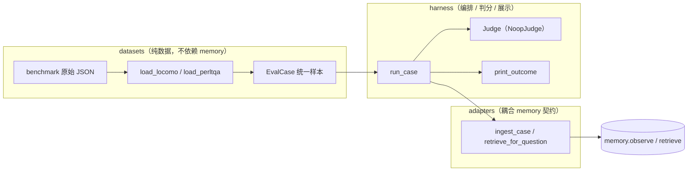

# 011 · 记忆召回质量评测机制 — 技术方案

> 对应 [`requirement.md`](./requirement.md)。本文讲"怎么做"：包结构、统一样本契约、各层职责、适配取舍、运行入口与已知简化。
>
> 项目级技术栈（Python / uv monorepo / DeepSeek / SQLite 等）已在 [`0002`](../../decisions/0002-incubation-tech-stack/README.md) 锁定，本文不复述。

---

## 1. 设计目标回顾

落地一套**可复用、可追溯**的召回评测机制，把外部 benchmark 的对话灌进 [008 memory](../008-engine-memory/design.md) 的真实写路径（`observe`），再用 benchmark 问题走 `retrieve` 观察召回。机制本身是交付物，memory 的召回表现不是本期验收对象（见 requirement §1.3 / §6）。

核心设计取向：**稳定核心 + 易变边缘分离**——把"统一样本结构 + 编排"做成稳定核心，把"benchmark 格式"和"判分实现"做成可插拔边缘，让"新增 benchmark / 接入 judge"都只是新增实现，不动主干。

---

## 2. 整体架构

### 2.1 分层与数据流

三层单向依赖，`memory` 始终是被消费的外部黑盒：



依赖方向：`harness → adapters → datasets`；`datasets` 不依赖 `memory`，`adapters` 才接 `memory` 契约。这样数据归一化（与 benchmark 耦合）和角色映射（与 memory 耦合）被切在两层，互不污染。

### 2.2 包结构

新增**顶层独立包** `memory_eval/`（与 `memory` / `agent` 平级），评测的依赖（benchmark 数据、判分等）不污染核心 `memory` 包——呼应 [`repo-directory-layout`](../../../.cursor/rules/repo-directory-layout.mdc) 的"整条交付单元放顶层职责目录"。

```text
memory_eval/
├── pyproject.toml              # 独立包，workspace 成员；依赖 memory / llm-providers
├── README.md                   # 用法 + 数据下载 + LLM 授权提示
├── data/                       # benchmark 原始数据（.gitignore，使用者自备）
└── src/memory_eval/
    ├── __main__.py             # CLI 入口：--dataset / --limit-* / --model
    ├── datasets/               # loader 层
    │   ├── case.py             # EvalCase / EvalTurn / EvalQuestion 契约
    │   ├── locomo.py           # 英文基线
    │   └── perltqa.py          # 中文（dialogues 子集，默认）
    ├── adapters/
    │   └── memory_adapter.py   # 接 memory observe/retrieve
    └── harness/
        ├── runner.py           # run_case 编排
        ├── judge.py            # Judge 协议 + NoopJudge
        └── report.py           # print_outcome 控制台展示
```

---

## 3. 统一样本契约（datasets/case.py）

各 benchmark 归一到三个 frozen dataclass，下游只认这套类型（对应 R-4.1.1 / R-4.1.2）：

- **`EvalCase`**：一个样本 = 一段长对话 + 配套问答。字段 `sample_id` / `speaker_a` / `speaker_b` / `turns` / `questions`。`speaker_a`/`speaker_b` 记录原始说话人名，**角色映射延后到 adapter**。
- **`EvalTurn`**：一条发言。带 `session_index`——保留 benchmark 的"分段"信息，供 adapter 按段投影成 fragment（见 §5）；`dia_id` 供 evidence 溯源。
- **`EvalQuestion`**：一道问答。`category: str | None`——用最宽松类型容纳两套 benchmark：LoCoMo 是整数码、loader 内映射成 `multi-hop`/`temporal`/… 字符串标签；PerLTQA 本身就是 `dialogues` 字符串。`answer` + `evidence` 携带 ground truth，**为未来 judge 预留好入参**（本期 NoopJudge 不消费）。

> **关键取舍**：`category` 不做成跨 benchmark 的枚举。不同 benchmark 的类别体系本就不同，强行统一成枚举会在每次新增 benchmark 时被迫改枚举（违背"新增 = 新增实现"）；用自由字符串 + 各 loader 自行映射，扩展成本最低。

---

## 4. datasets 层：loader 职责与适配取舍

每个 loader 把一份原始数据读成 `list[EvalCase]`，共同遵守（对应 R-4.1.3 / R-4.1.4）：

- **防御式解析**：脏数据 / 缺字段的条目 `continue` 跳过，不让单条坏数据拖垮整次评测。
- **`limit_samples` 规模控制**：`<= 0` 早返回空列表（避免"limit=0 仍返回 1 条"的边界 bug）。

### 4.1 LoCoMo（英文基线）

整数 `category`（1–5）映射成人类可读标签；`speaker_a`/`speaker_b` 取对话双方名；按 session 切 `session_index`。作用是**英文对照基线**，验证机制不绑定语言。

### 4.2 PerLTQA（中文，默认）

[PerLTQA](https://github.com/Elvin-Yiming-Du/PerLTQA)（`Dataset/zh/`，**CC BY-NC 4.0 仅非商用研究**）。两份文件配套：`perltmem.json`（记忆库，提供对话素材）+ `perltqa.json`（QA）。关键取舍：

- **只取 `dialogues` 子集**：角色还带 `profile` / `social_relationship` / `events`，但只有 `dialogues` 是对话流形态，契合 memory"从对话抽取→召回"的范式；其余是无对话来源的结构化记忆，本机制不取（requirement §3 已排除）。QA 侧同样只取 `dialogues` 类问题。
- **按时间块切 session**：`dialogues` 的 `contents` 是 `{时间戳: [发言…]}`。loader 把**每个时间戳块**作为一个独立单元、`session_index` 递增——避免把一个角色的全部对话糊成一次巨大抽取（与 LoCoMo 按 session 切分对齐，也控制单次抽取的上下文长度）。
- **角色约定**：protagonist 名 → `speaker_a`，`"AI助手"` → `speaker_b`，交给 adapter 做角色映射。
- **`Reference Memory` 容错**：常是字符串化列表（`"['4_0_0#0']"`），用 `ast.literal_eval` 尽力解析，失败则降级为单元素，保证不抛。

---

## 5. adapters 层：接 memory 真实写路径

`memory_adapter.py` 把 `EvalCase` 接到 memory 公共接口（对应 R-4.2.x）：

- **`ingest_case`**：按 `session_index` 把 turns 分组，每组投影成一个 `ConversationFragment` 调 `memory.observe()`。`observe` 是异步入队抽取，评测需要"全部落库后再召回"，故末尾 `memory.flush()` 阻塞到抽取队列清空。
- **`retrieve_for_question`**：`memory.retrieve(question, persona_id=...)` 返回 `MemoryContext`（含结构化 `items` + 渲染串 `rendered`）。
- **角色映射**：`speaker == speaker_a → "user"`，否则 `"agent"`。固定映射，理由是抽取器会从双方发言里提事实，映射不影响"记住了什么"（见 §8 风险标注）。
- **`persona_id` 固定为 `"benchmark"`**：memory 的 episodic 按 persona 隔离，评测只用一个 persona。

> **关键取舍 · fragment 粒度**：一个 session 投影成一个 fragment（而非严格"一轮 user+agent"）。抽取 prompt 本就吃多轮素材，按 session 粒度让每个 case 的 LLM 抽取次数 ≈ session 数，成本可控。

---

## 6. harness 层：编排、判分、展示

### 6.1 runner（编排 + 隔离）

`run_case(case, llm_client, *, db_path, judge, limit_questions)`：

1. `build_memory(db_path, llm_client)` 起一个 memory 实例；
2. `ingest_case` 灌入；
3. 逐题 `retrieve` → `judge` → 收集 `QuestionOutcome`；
4. `finally: memory.close()`。

**样本隔离**：每个 case 用调用方传入的独立 `db_path`，记忆互不串味（对应 R-4.2.2）。

### 6.2 judge（扩展点）

```python
class Judge(Protocol):
    def judge(self, question: EvalQuestion, context: MemoryContext) -> JudgeResult: ...
```

- `JudgeResult(correct: bool | None, detail: str)`：`correct=None` 表示未判分。
- 本期 `NoopJudge` 只回 `correct=None`、不打分——**避免在 ingest 抽取之外再引入第二处真实 LLM 调用**（对应 R-4.3.2 / requirement §3 不实现 judge）。
- **接口已能容纳未来 LLM-as-judge**：`question` 已带 `answer`/`evidence`，`context` 已带 `items`/`rendered`，未来"喂 context+question 给 LLM 生成答案、与 ground truth 比对"所需入参都在，新增一个实现类即可，runner / report 不动（对应 R-4.3.1）。

> **取舍说明**：judge 接口保持当前最小形态、不提前为 LLM judge 加形参。现有入参已覆盖可预见需求，提前扩参属"无真实需求的抽象"，按 [`coding-design`](../../../.cursor/rules/coding-design.mdc) 只保留清晰边界、不提前实现。

### 6.3 report（展示）

`print_outcome` 用 rich 把每题的 问题 / 标准答案 / category / 召回条目结构化打印到控制台，供人评估（对应 R-4.4.3）。

---

## 7. 运行入口与成本控制

`__main__.py` 提供 CLI（对应 R-4.4.x / 使用约束）：

- **`--dataset perltqa|locomo`**（默认 `perltqa`）：选 loader；数据缺失时打印含**下载地址 + 许可提示**的错误并退出码 1。
- **`--limit-samples` / `--limit-questions`**：控制规模与真实 LLM 成本（默认各 1 / 5）。
- **`--model`**：覆盖抽取用 model，默认取 `.env` 的 `DEEPSEEK` 配置。
- **临时库隔离**：`tempfile.TemporaryDirectory` 下每个 case 一个 `case-N.db`（用序号而非 `sample_id` 命名，规避路径不安全字符），跑完自动清理。
- **真实 LLM 前置告知**：模块 docstring / 脚本注释 / README 均标注"运行触发真实抽取调用"，按 [`llm-api-confirm`](../../../.cursor/rules/llm-api-confirm.mdc) 每次运行前需授权。

一键脚本 `scripts/memory-eval/run.{sh,ps1}` 双端包装（[`cross-platform-dev`](../../../.cursor/rules/cross-platform-dev.mdc)）。

---

## 8. 已知简化与风险

均为 PoC 阶段的有意取舍，**不是严谨建模**，记录以免被误读：

- **角色 user/agent 硬映射**：benchmark 双方未必对应"用户 vs AI助手"（LoCoMo 是两个普通人）。这里硬映射只为喂进抽取器、不影响"抽到什么事实"，但**不代表对说话人身份做了严肃建模**。
- **judge 缺位 = 无量化结论**：本期只能"人看召回"，给不出准确率。这是 requirement §3 明确的范围，非缺陷。
- **抽取过度概括的观察**：首轮 PerLTQA 试跑发现 memory 的 episodic 抽取偏高度概括，对"对话细节型"问题召回不足。这是 **memory（008）侧**的潜在改进点，本机制只负责持续暴露，修复不在 011（requirement §7 Q-2）。

---

## 9. 测试策略

按 [`dev-workflow`](../../../.cursor/rules/dev-workflow.mdc)"核心逻辑必须配单测、真实 LLM 单独授权"：

- **loader 单测**（`test_locomo.py` / `test_perltqa.py`）：覆盖解析、session 切分、category 映射、`limit_samples` 边界、脏数据跳过。
- **adapter 单测**（`test_adapter.py`）：用 **fake LLM** 验证 `ingest_case` → `retrieve_for_question` 端到端能写能读，**不触发真实调用**。
- **真实 LLM 路径**：只在 CLI 手动运行时发生，按 `llm-api-confirm` 单独授权；不进 `./scripts/check`、不进 CI 门禁（requirement §3）。

---

## 文档元信息

- **状态**：已确认（Confirmed）
- **创建时间**：2026-06-11
- **确认时间**：2026-06-11
- **对应实现**：`memory_eval/` 包（PoC 已落地）
- **上游**：[`requirement.md`](./requirement.md)
