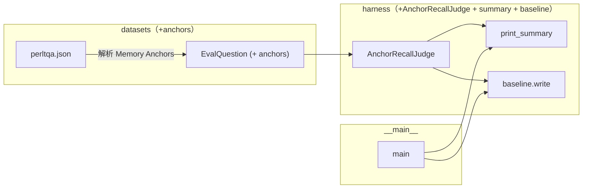

# 012 · PerLTQA 召回判分与首份 baseline — 技术方案

> 对应 [`requirement.md`](./requirement.md)。本文讲"怎么做"：anchor 数据怎么从 PerLTQA JSON 串到 judge、judge 内部如何匹配、report 与 baseline 文件怎么落、判分器的已知偏差与升级路径。
>
> 项目级技术栈（Python / uv monorepo / DeepSeek 等）已在 [`0002`](../../decisions/0002-incubation-tech-stack/README.md) 锁定；评测机制层（datasets / adapters / harness 分层、统一样本契约、运行入口）已在 [`011 design`](../011-memory-recall-eval/design.md) 锁定。本文只讲增量。

---

## 1. 设计目标回顾

让 011 留好的 `Judge` 扩展点接入第一个具体实现 —— **基于 PerLTQA 自带 `Memory Anchors` 的 substring 召回判分器** —— 并产出可对比的 baseline 文件。

核心设计取向：**Additive over breaking** —— 既有类型 / 接口 / 编排全部不动语义，**仅加可选字段、新增同名空间下的实现与一个汇总函数**，LoCoMo 路径不退化。

---

## 2. 整体改动地图



涉及文件清单：

| 文件 | 改动类型 | 说明 |
|---|---|---|
| `memory_eval/src/memory_eval/datasets/case.py` | 修改（additive） | `EvalQuestion` 加 `anchors: list[str] = []` |
| `memory_eval/src/memory_eval/datasets/perltqa.py` | 修改（additive） | 解析 `Memory Anchors` → 填 `anchors`；LoCoMo loader 不动 |
| `memory_eval/src/memory_eval/harness/judge.py` | 修改（additive） | `JudgeResult` 加 `score: float \| None = None`；新增 `AnchorRecallJudge` 类 |
| `memory_eval/src/memory_eval/harness/report.py` | 修改（additive） | 新增 `print_summary(outcomes)`；`print_outcome` 不动 |
| `memory_eval/src/memory_eval/harness/baseline.py` | **新文件** | baseline json 写盘逻辑（独立模块） |
| `memory_eval/src/memory_eval/__main__.py` | 修改 | PerLTQA 默认 judge 换为 AnchorRecallJudge；跑完调 `print_summary` + `baseline.write` |
| `memory_eval/baselines/README.md` | **新文件** | 解释 baseline 字段语义、归档目的、不要乱删 |
| `memory_eval/tests/test_anchor_judge.py` | **新文件** | 3 个 sanity case 单测 |

> **关键取舍**："additive only"。所有 011 已存在的字段、方法签名、调用顺序保持原样；只是末尾追加。这样 011 既有单测 / LoCoMo 路径完全不需要改一行。

---

## 3. anchor 数据流（datasets 层增量）

### 3.1 EvalQuestion 加可选字段

`memory_eval/src/memory_eval/datasets/case.py`：

```python
@dataclass(frozen=True)
class EvalQuestion:
    question: str
    answer: str
    category: str | None
    evidence: list[str]
    anchors: list[str] = field(default_factory=list)   # ← 新增；非 PerLTQA 数据集留空
```

> **关键取舍 · 为什么不另建子类型**：anchor 只 PerLTQA 有；做成子类型（`PerLTQAQuestion`）会让 judge / runner 在类型上分叉，违背 011 §3 "下游只认一套类型"。可选字段是侵入面最小的解法 —— LoCoMo loader 不填、AnchorRecallJudge 看到空列表时按"无 anchor"防御式跳过。

### 3.2 perltqa.py 解析 anchors

PerLTQA 的 anchor 形态（见 011 试跑确认）：

```json
"Memory Anchors": [
  {"建议": [254, 255]},
  {"培训课程": [170, 173]}
]
```

每个元素是单键 dict，key 是 anchor token、value 是字符 span。**判分只需要 token，span 丢弃**。新增解析函数：

```python
def _parse_anchors(raw: object) -> list[str]:
    """提取 anchor token；脏数据（非 list / 非 dict / 空 key）单条跳过，不抛。"""
    if not isinstance(raw, list):
        return []
    tokens: list[str] = []
    for item in raw:
        if not isinstance(item, dict):
            continue
        for key in item:
            if isinstance(key, str) and key.strip():
                tokens.append(key.strip())
                break  # 单键 dict；按规范只取一个
    return tokens
```

`_parse_questions` 里在构造 `EvalQuestion` 时填入 `anchors=_parse_anchors(raw.get("Memory Anchors"))`。

> **防御点**：缺字段 / 错类型一律返回 `[]`，不抛 —— 与 011 §4 "防御式解析"统一精神（对应 R-4.1.4）。

---

## 4. AnchorRecallJudge（harness/judge.py 增量）

### 4.1 JudgeResult 加 score 字段

```python
@dataclass(frozen=True)
class JudgeResult:
    correct: bool | None
    detail: str
    score: float | None = None   # ← 新增；NoopJudge 保持 None
```

> **取舍**：保留 `correct` 不动 —— LoCoMo / NoopJudge 路径继续返回 `correct=None`，零退化。AnchorRecallJudge 同时填两个：`correct=(score == 1.0)`（语义：anchor 全命中视作"答对"）+ `score=hit/total`（用于 macro 平均 / baseline 对比）。Report / baseline 优先看 `score`，`correct` 仅作展示。

### 4.2 AnchorRecallJudge 实现

```python
class AnchorRecallJudge:
    """基于 PerLTQA Memory Anchors 的 substring 召回判分。

    每个 anchor 是 PerLTQA 标注的"答案关键 token"；本判分器在召回内容（rendered
    context）里 substring 检索每个 anchor，输出 hit/total ∈ [0, 1]。

    防御：anchors 缺失或全空时，返回 correct=None（视为未判分，不计入 macro）。
    """

    def judge(self, question: EvalQuestion, context: MemoryContext) -> JudgeResult:
        anchors = question.anchors
        if not anchors:
            return JudgeResult(
                correct=None, score=None,
                detail="(无 anchor，跳过判分)",
            )
        text = context.rendered
        hits = [a for a in anchors if a in text]
        misses = [a for a in anchors if a not in text]
        score = len(hits) / len(anchors)
        return JudgeResult(
            correct=(score == 1.0),
            score=score,
            detail=f"{len(hits)}/{len(anchors)} 命中" + (f"；未命中: {misses}" if misses else ""),
        )
```

要点：

- **匹配算法：substring，不分词**。理由详见 [§8](#8-已知偏差与升级路径) 与本次对话沉淀的判断。
- **detail 列出未命中 anchor**：零成本的自证伪机制 —— 看错题时能一眼判断"是真没召回，还是 substring 匹配漏了同义改写"，为未来是否升级 judge 提供数据依据。
- **anchors 缺失返回 `correct=None`**：与 NoopJudge 行为一致，runner / report / baseline 已能处理 `None`，不计入 macro 平均。

### 4.3 入口装配

`__main__.py` 按 dataset 选 judge：

```python
judge: Judge = AnchorRecallJudge() if args.dataset == "perltqa" else NoopJudge()
```

LoCoMo 路径继续走 NoopJudge（其数据无 anchor）。

---

## 5. Report 增量（harness/report.py）

新增独立函数，**`print_outcome` 不动**：

```python
def print_summary(outcomes: Iterable[CaseOutcome]) -> None:
    """全部 case 跑完后输出 macro 平均 + 0 分错题清单。"""
```

行为：

1. 遍历所有 `QuestionOutcome`，收集 `judge.score is not None` 的题（跳过未判分的）。
2. **Macro 平均**：算术平均，打印形如 `Macro 平均: 0.62（基于 30 道有效题）`。
3. **0 分错题清单**：得分严格等于 0 的题，每条打印 sample_id / question / anchors / 召回到的记忆条目（复用 `print_outcome` 里的渲染逻辑或简化版本）。
4. 控制台 only，**不输出格式美化、不出 markdown / html**（requirement §3 排除）。

`__main__.py` 的循环改造：

```python
all_outcomes: list[CaseOutcome] = []
for index, case in enumerate(cases):
    outcome = run_case(...)
    print_outcome(outcome)
    all_outcomes.append(outcome)
print_summary(all_outcomes)            # ← 新增
baseline.write(all_outcomes, args, ...) # ← 新增（见 §6）
```

---

## 6. Baseline 产物（harness/baseline.py）

### 6.1 文件位置与命名

- **位置**：`memory_eval/baselines/`（新目录，仓库内）
- **命名**：`<ISO-datetime>-<short-sha>.json`，如 `2026-06-11T14-30-22-c8735f0.json`
  - ISO datetime 用 `-` 替换 `:`（Windows 路径安全）
  - short-sha 取 `git rev-parse --short HEAD`，失败时填 `nogit`
- **入 git 归档**：baseline 文件随代码一起进 git，作为可对比的历史。文件名带 ISO 时间 + sha 天然不冲突，单文件 ~12 KB、运行频率有限，膨胀风险可控。目录下附 `README.md` 解释字段语义。

> **取舍**：每跑一次产一份独立文件，**不覆盖、不 append、不维护"最新" symlink**。理由：本次 baseline 是"跑出一份就够"，多份记录靠文件系统排序就能看到时间线；symlink / 最新指针属未列入范围的便利性优化。

### 6.2 JSON 结构（schema_version=2）

```json
{
  "schema_version": 2,
  "run": {
    "started_at": "2026-06-11T07:36:01.093+00:00",
    "ended_at": "2026-06-11T07:38:42.521+00:00",
    "duration_seconds": 161.43,
    "git_commit": "c8735f0",
    "working_tree_dirty": false,
    "dataset": "perltqa",
    "limit_samples": 3,
    "limit_questions": 10,
    "note": "before extraction prompt v2",
    "provider": {
      "model": "deepseek/deepseek-v4-flash",
      "api_base": null,
      "defaults": {"temperature": 0.7}
    },
    "dataset_files": [
      {"path": "perltmem.json", "sha256": "<hex>", "bytes": 12345},
      {"path": "perltqa.json", "sha256": "<hex>", "bytes": 67890}
    ]
  },
  "macro": {
    "score_mean": 0.133,
    "n_questions_total": 30,
    "n_questions_scored": 30,
    "n_questions_zero": 20
  },
  "per_question": [
    {
      "question_id": "张小红#q0",
      "sample_id": "张小红",
      "question": "小明最近感到困惑的是什么？",
      "answer": "张小明对自己的成长和婚姻家庭领域的发展感到很迷茫。",
      "anchors": ["迷茫"],
      "score": 0.0,
      "detail": "0/1 命中；未命中: ['迷茫']",
      "recalled_count": 1,
      "recalled": [
        {"layer": "pinned", "text": "用户叫张小红", "source_ref": "...", "score": 1.0}
      ]
    }
  ]
}
```

字段语义说明：

- **`run.working_tree_dirty`**：通过 `git status --porcelain` 判定；非 git 环境为 `null`。让读 baseline 的人能区分"`commit` 字段所指即真实状态"与"还有未提交改动可能影响结果"。
- **`run.dataset_files`**：每个数据集原始文件的 SHA256 + 字节数。PerLTQA 会更新数据，没有这个字段时旧 baseline 与新 baseline 表面一致但实际样本不同，对比会误导。
- **`run.provider.defaults.temperature`** 等：抽取阶段实际使用的 provider 参数，影响抽取确定性，必须留痕。
- **`per_question.question_id`**：稳定问题标识 `<sample_id>#q<idx>`，未来对比工具按此 join 两个 baseline；用 idx 而非 question 文本，规避 PerLTQA 文本微调时配不上的脆弱性。
- **`per_question.recalled`**：完整召回内容，每条含 `layer / text / source_ref / score`。**让 baseline 同时是"对比基准"和"离线再判分的输入"**——未来想换一个 SemanticAnchorRecallJudge 重判分，不需要重跑 LLM 抽取。

### 6.3 baseline.py 模块边界

```python
def write(
    outcomes: Iterable[CaseOutcome],
    run: BaselineRun,
    out_dir: Path,
) -> Path:
    """序列化 outcomes + 运行上下文到 JSON，返回写入路径。"""
```

- 元数据封进 `BaselineRun` frozen dataclass：`started_at` / `ended_at` / `dataset` / `model` / `api_base` / `provider_defaults` / `limit_samples` / `limit_questions` / `note` / `dataset_paths`。`dataset_paths` 在 `write()` 内转成 hash + bytes。
- `git_commit` / `working_tree_dirty` 通过 `subprocess.run(["git", ...])` 取，**全部失败降级**：commit 填 `"nogit"`、dirty 填 `null`。
- 召回 `MemoryItem` 用 `dataclasses.asdict` 序列化，避免硬编码字段名与 `MemoryItem` 演进绑死；非 dataclass 退化为 `{"repr": str(item)}` 保证不抛。

### 6.4 噪声策略

抽取链路是真实 LLM、有抖动；同一份代码 + 同一份数据多跑几次，macro 也会有几个百分点级别的浮动（取决于 `temperature`）。本系统选择**不在 baseline 模块内做多次平均**：

- **当下接受单次跑分数有噪声**：MVP 范围内只对"几个 percent 以上的 delta"作"真有变化"判断，更小的差异先归因到噪声。
- **由 README 显式提醒读者**：`memory_eval/README.md` 明确写出"重大判断建议手动跑 N 次取人工平均"，避免把单次 0.133 当成确定的值。
- **暴露关键噪声参数**：`run.provider.defaults.temperature` 让读者一眼看到当时温度；下次想稳定可以改 `.env` 设 `temperature=0`。

工具内置多次平均（自动 N 跑取均值 / 标准差）属未来需要再评估，本次不做。

---

## 7. 测试策略

### 7.1 单测层（不依赖真实 LLM）

| 文件 | 覆盖 |
|---|---|
| `tests/test_perltqa.py` | **扩展**：用人造样本验证 `Memory Anchors` 解析到 `EvalQuestion.anchors`；脏数据（缺字段 / 非 dict / 空 key）走防御路径 |
| `tests/test_anchor_judge.py` | **新增**：3 个 sanity case（见下） |
| `tests/test_baseline.py` | **新增（hotfix-2）**：锁 schema_version=2 字段齐备（run / macro / per_question 完整召回 + answer + question_id），覆盖 macro 跳过未判分题、dataset_files 缺失走防御路径 |

### 7.2 AnchorRecallJudge sanity case（对应 AC-4）

构造方式：手工 `EvalQuestion(question=..., anchors=[...])` + 假 `MemoryContext`（最小子集，足以让 `context.rendered` 是给定字符串）。

| Case | 输入 | 期望 |
|---|---|---|
| **全命中** | anchors = `["A", "B", "C"]`，rendered = `"... A ... B ... C ..."` | `score == 1.0`，`correct == True`，`detail` 不含"未命中" |
| **全不命中** | anchors = `["X", "Y"]`，rendered = `"完全无关的文本"` | `score == 0.0`，`correct == False`，`detail` 列出 `[X, Y]` |
| **部分命中** | anchors = `["P", "Q", "R", "S"]`，rendered = `"P 和 R 出现"` | `score == 0.5`（**严格等于**），`correct == False`，`detail` 列出 `[Q, S]` |

> **要点**：`score` 的 0.5 是严格相等断言（`assert score == 0.5`），不是 `pytest.approx` —— 因为它是 `2/4` 的有理数除法，浮点本来就能精确表达。这样 sanity case 真的能抓住"算法被改坏了"（比如有人把分子分母搞反、或把 `<=` 写成 `<`）。

### 7.3 真实 LLM 端到端

不入单测、不入 `./scripts/check`，沿用 011 的"手动 CLI 运行 + `llm-api-confirm`"模式（对应 AC-5）。

---

## 8. 已知偏差与升级路径

> 本节诚实记录 substring 判分的偏差与"何时升级判分器"的判断依据。**不在本次修复范围**，仅作未来评估的输入。

### 8.1 偏差：substring 看不出同义改写

具体例子：

```
Anchor:        "提升专业能力"
召回到:         "增强职业素质"   ← 语义对等，substring 命中数 = 0
本判分器结论:    0 分
```

**这是真实的 false negative**。AnchorRecallJudge 只看字面包含，不感知语义。

### 8.2 为什么本次仍接受

四点判断：

1. **偏差是系统性的，不影响"前后对比"**：baseline 的价值在 delta（"改了 memory 之后变好/变差"），不在绝对值。同一个 judge 在改前和改后都同样压低 ——delta 仍有意义。
2. **实际数据里偏差可能没想象中大**：memory 抽取倾向**保留原词**（LLM 从原文压缩而非自由改写），anchor 是基于答案标的、记忆是基于同段对话抽的，两边重合度本来就高。
3. **升级代价不小**：LLM-as-judge 每题多一次 LLM 调用（慢、贵、需 pin 模型 / 多次采样稳定）；embedding 判分要引入额外依赖、调阈值、选中文模型。**远超 MVP 边界**。
4. **detail 字段提供自证伪机制**：看 0 分错题时，人能一眼判断"是真没召回还是同义改写"。当大量 0 分题被人判定为"其实召回到了"，那就是升级 judge 的明确数据信号。

### 8.3 升级路径（不承诺时间，仅说"接口已为它准备好"）

新增一个实现 `Judge` 协议的类（如 `SemanticAnchorRecallJudge`），runner / report / baseline JSON 结构都不需要动 —— 因为 `score: float | None` 本来就是连续值，任何"打实数分"的 judge 都能复用同一套基础设施。**这是 011 §6.2 "接口已能容纳未来 judge"的兑现点**。

---

## 9. 影响分析

### 9.1 上下游

- **011 既有路径不退化**：所有改动 additive，LoCoMo loader / NoopJudge / `print_outcome` / `ingest_case` / `runner` 全部不动语义；011 的单测在 import / 字段构造层面继续通过。
- **memory（008）**：不改任何代码。

### 9.2 跨平台

- 文件命名用 `-` 替 `:`（避免 Windows 文件名问题）。
- `subprocess.run(["git", ...])` 取 commit：Windows / macOS / Linux 均依赖系统 git，但 011 已假设有 git 环境（项目本身就是 git repo），无新增依赖。

### 9.3 风险点

| 风险 | 说明 | 缓解 |
|---|---|---|
| substring false negative（§8） | 同义改写被判 0 分 | detail 列未命中清单，作为升级 judge 的数据依据 |
| Anchor 字段格式漂移 | 未来 PerLTQA 升级数据格式 | `_parse_anchors` 防御式跳过，不抛；不影响整体评测 |
| baseline 文件膨胀 | 长期累积可能很多 | 单文件 ~12 KB、运行频率有限，预期一年内可控；真累积过多再评估"分目录归档" / "保留 N 份"，YAGNI |
| `git rev-parse` 不可用 | 非 git 环境（如 CI sandbox） | 降级填 `"nogit"`，运行不中断 |

---

## 10. 变更记录

| 日期 | 变更内容 | 是否需要重新实现 |
|------|---------|----------------|
| 2026-06-11 | §2 改动地图 / §6.1 / §6.3 R-4.3.3 / §9.3 风险表同步修订：baseline 由"不入 git + 配 .gitignore"改为"入 git 归档"；目录新增 `README.md` 解释字段语义。承接 [`requirement.md` §7](./requirement.md#7-变更记录) 的同日修订。 | 部分：删除 `memory_eval/baselines/.gitignore` + 新增 `memory_eval/baselines/README.md` + 把首份归档 baseline 入 git；其余主流程（runner / judge / report / baseline.write）不动。 |
| 2026-06-11 | §6.2 schema 全量重写到 v2（加 working_tree_dirty / dataset_files SHA / provider defaults / note / question_id / answer / 完整 recalled[]）；§6.3 baseline.py 接口签名改用 `BaselineRun` 聚合元数据；§6.4 新增噪声策略段；§7.1 测试表加 test_baseline 行。理由见 [`requirement.md` §7 同日条目](./requirement.md#7-变更记录)。 | 部分：`baseline.py` 大改 + `BaselineRun` 字段扩展 + `__main__.py` 新增 `--note` flag、传入 spec / dataset_paths / ended_at；新增 `tests/test_baseline.py`；其余主流程不动。 |

---

## 文档元信息

- **状态**：已确认（Confirmed）
- **创建时间**：2026-06-11
- **确认时间**：2026-06-11
- **对应实现**：本期新增 / 修改文件见 §2 改动地图
- **上游**：[`requirement.md`](./requirement.md)
- **承接**：[`011 design §6.2`](../011-memory-recall-eval/design.md) 判分扩展点
