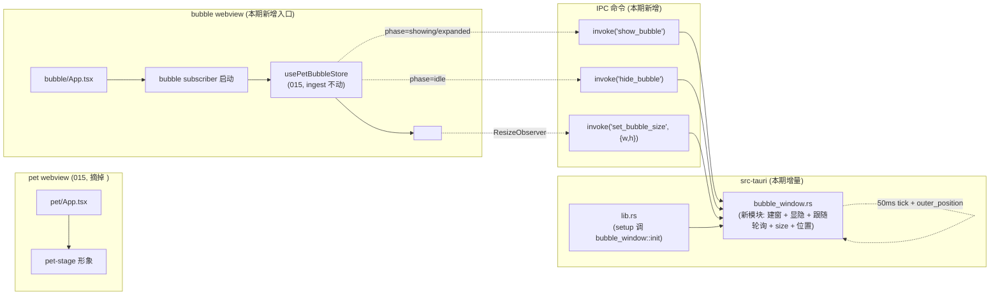

# 016 · 桌宠气泡独立窗承载 — 技术方案

> 对应 [`requirement.md`](./requirement.md)。本文讲"怎么做"：bubble window 配置、Rust 控制权（建窗 / 显隐 / 位置跟随 / size 适配 / macOS 加料）、前端 bubble 入口 + 组件改造、复用 015 已有的 store / policy / push subscriber。
>
> 项目级技术栈（Tauri 2 + React 19 + Zustand + Tailwind 等）已在 [`010 design`](../010-desktop-shell-and-chat-ui/design.md) 锁定；push 协议 / owner / policy / store 已在 [`015 design`](../015-desktop-pet-bubble-and-conversation-owner/design.md) 锁定。本文只讲承载形态升级的增量。

---

## 状态

<!-- 草稿（Draft） | 已确认（Confirmed） -->
已确认（Confirmed）

---

## 1. 设计目标回顾

把 015 真跑暴露的"气泡装不进 pet 主窗"问题（issue 005），从凑合 hot-fix（pet 主窗加大到 480×460）升级到承载形态层修复。三个关键取向贯穿全文：

- **Window 控制权统一在 Rust 侧**：bubble window 的建 / 显隐 / 位置 / size / 透明 / 置顶 / 跨 Space / 全屏加料**全部由 Rust 持有**。前端只管"内容 + 显隐意图 + 期望尺寸"，通过 invoke 命令向 Rust 表达。这条线是为了把调研里 JS 侧 API 坑（Tauri #14673 `getCurrentWebviewWindow().position()` 在 macOS 返 0,0）绕开，同时给未来叠 macOS NSPanel 优化留单一改造点。
- **一份 Tauri 跨平台 API 代码三端通跑**：核心机制（WebviewWindow / `show` / `hide` / `set_size` / `set_position` / `outer_position`）不写按端分支；唯一例外是 015 已有的 macOS NSWindow `setLevel` 跨 Space + 全屏加料，本期 bubble window **复用同一段**。
- **015 既有路径零退化**：015 的 owner / policy / push subscriber / store 状态机 / sessionProjection / PetBubble 组件内容渲染逻辑**一行不动**；改造点只在"气泡装在哪个 window 里"那一层 + PetBubble 组件去掉窗内 absolute 定位相关代码。

---

## 2. 整体改动地图



涉及文件清单：

| 文件 | 改动类型 | 说明 |
|---|---|---|
| `frontend/src-tauri/src/bubble_window.rs` | **新文件** | 独立 mod：建窗 / 显隐 / 跟随轮询 tokio task / set_size / `compute_bubble_position` 纯函数 / macOS 加料调用 |
| `frontend/src-tauri/src/lib.rs` | 修改（additive） | setup 阶段调 `bubble_window::init`；新增 3 个 invoke 命令注册（`show_bubble` / `hide_bubble` / `set_bubble_size`） |
| `frontend/src-tauri/tauri.conf.json` | 修改 | pet 窗回 240×320；新增 bubble window 配置（label="bubble", visible:false, transparent, alwaysOnTop, decorations:false, skipTaskbar:true, shadow:false） |
| `frontend/bubble.html` | **新文件** | bubble entry HTML（参考 pet.html / chat.html 模板） |
| `frontend/src/pages/bubble/main.tsx` | **新文件** | React entry，挂载 `<BubbleApp />` |
| `frontend/src/pages/bubble/App.tsx` | **新文件** | 只挂 `<PetBubble />` + 调 `startPetBubbleSubscriber` |
| `frontend/src/pages/pet/App.tsx` | 修改（减项） | 去掉 `<PetBubble />` import + 渲染；去掉 `relative` 外层（不再需要 absolute anchor）；保留 `startPetBubbleSubscriber` 调用 → **移到 bubble/App.tsx**；保留拖拽 / hover 操作栏 / 透明区穿透 |
| `frontend/src/components/pet/PetBubble.tsx` | 修改（减项） | 去掉 `absolute` / `flipBelow` / `top-[200px]` / `bottom-[200px]` / `left-1/2 -translate-x-1/2` / `useEffect getBoundingClientRect 翻转`；新增 ResizeObserver hook 上报 size；保留内容渲染 / 截断 / expand / dismiss / `data-hit` |
| `frontend/src/stores/petBubble.ts` | 修改（additive） | `usePetBubbleStore` 状态机不动；新增订阅 phase 变化的 effect 函数：phase showing/expanded → invoke('show_bubble')；phase idle → invoke('hide_bubble') |
| `frontend/src/components/pet/PetBubble.test.tsx` | 修改 | 删掉 flipBelow 相关断言；保留内容 / 截断 / expand / dismiss / `data-hit` 测试 |
| `frontend/src-tauri/Cargo.toml` | 不动 | `tokio` + `tauri::async_runtime` 已在 015 引入；不新增依赖 |
| `scripts/dev-bubble-spotcheck/run.sh` + `run.ps1` | **新文件** | 本地 spot-check：直接 mock envelope 触发 bubble window 显示（不依赖 bridge），便于 dev 期调 size / 位置 |
| `scripts/README.md` | 修改 | 登记 spot-check 脚本 |

**不动什么**（要在 AC-8 / AC-9 显式验证）：

- `frontend/src-tauri/src/push_subscriber.rs`（015，零改动）
- `frontend/src/stores/petBubble*.test.ts`（015 store / policy 单测，零改动；状态机不变 → 测试通过）
- `frontend/src/stores/sessionProjection.ts` / `*.test.ts`（015，零改动）
- `frontend/src/services/stream.ts` / `frontend/src/stores/conversation*.ts`（chat 窗对话流，零改动）
- `frontend/src/pages/pet/usePetPassthrough.ts`（透明区穿透，零改动）
- `agent_bridge/*` / `agent/src/agent/*`（后端，零改动）

---

## 3. 架构决策

### 3.1 Window 控制权：Rust 侧 vs 前端 JS API

| 形态 | 优点 | 缺点 | 决断 |
|---|---|---|---|
| **Rust 侧持有 bubble window 控制权** | 绕开 Tauri JS 侧 `getCurrentWebviewWindow().position()` macOS 返 0,0 已知 bug（#14673）；位置 / size / 显隐都在 Rust 集中管控，未来叠 macOS NSPanel 优化只动一个 mod；与 015 push_subscriber 已有"Rust 侧 owner"模式一致 | 每次 size / 显隐多一次 IPC（开销可忽略） | **选这个** |
| 前端 JS API 直接调 `getCurrentWindow().setSize/setPosition/show/hide` | IPC 少一跳；改动小 | 触发 Tauri JS API 坑（#14673）；位置同步要前端定时器，跨 webview 协调难；NSPanel 优化未来要前端配合 | 不选 |

### 3.2 位置跟随：50ms 轮询 + `outer_position` vs `WindowEvent::Moved` 事件

| 形态 | 优点 | 缺点 | 决断 |
|---|---|---|---|
| **Rust tokio task 50ms tick + `outer_position` 轮询** | Hyprnote `tauri-plugin-overlay` 生产验证（KEPT high confidence）；不依赖 macOS `Moved` 事件的可靠性；20Hz 视觉上无错位感；hidden 时停轮询、show 时启动 → 静态期零开销 | 拖拽期理论上有最多 50ms 滞后（视觉上感知不到） | **选这个** |
| `WindowEvent::Moved` 事件驱动 | 即时；零空转 | 调研显示 macOS 上事件抖动 + 拖拽中可能丢；跨平台行为差异更大 | 不选 |

> **关键取舍 · hidden 时停轮询**：bubble window 不可见时 tokio task park，show 时唤醒。这样 long-running 桌宠场景（启动整天）静态期 CPU 占用基本为 0。

### 3.3 size 适配：前端 ResizeObserver → Rust set_size

```
<PetBubble />
  ├─ ResizeObserver 监测 root 元素 box size
  ├─ debounce (16ms, 1 帧) 防止短时多次抖动
  └─ invoke('set_bubble_size', { width, height })
       │
       ▼
bubble_window.rs::set_bubble_size
  ├─ clamp to (MIN_W..MAX_W, MIN_H..MAX_H)
  └─ bubble_window.set_size(LogicalSize { width, height })
```

**透明窗渲染 workaround**（调研 Tauri #1564 已知）：bubble window 创建后立刻 `set_size` 一次（用配置初始值，避免首次内容到达时透明窗失去阴影/边框）。

**size 上下限**（design 定值）：

- `MIN_W = 240`（与 pet 主窗等宽，视觉对齐）
- `MAX_W = 360`（最长一行 ~30 个中文字时仍可读）
- `MIN_H = 64`（一行文字 + padding）
- `MAX_H = 480`（超出走内部滚动；ResizeObserver 上报内容高度 = `min(scrollHeight, MAX_H)`）

### 3.4 翻转判定：Rust 侧 `compute_bubble_position`

纯函数 + 单测：

```rust
struct Anchor { x: i32, y: i32, w: u32, h: u32 }  // pet 主窗
struct BubbleSize { w: u32, h: u32 }
struct Screen { x: i32, y: i32, w: u32, h: u32 }

/// 返回 bubble window 应在的左上角屏幕坐标。
/// 默认贴 pet 形象上方，居中对齐；屏顶贴墙时翻到下方。
fn compute_bubble_position(pet: Anchor, bubble: BubbleSize, screen: Screen) -> (i32, i32) {
    let margin = 8;
    let bubble_x = pet.x + (pet.w as i32 - bubble.w as i32) / 2;
    let above_y = pet.y - bubble.h as i32 - margin;
    let below_y = pet.y + pet.h as i32 + margin;
    let y = if above_y >= screen.y + margin { above_y } else { below_y };
    (bubble_x.max(screen.x), y)
}
```

单测覆盖：

- 默认贴上方（pet 在屏幕中央）
- 屏顶贴墙翻下方（pet 顶部距屏顶 < bubble 高度 + margin）
- 水平居中对齐
- pet 在屏幕左/右边缘时 bubble x 被 clamp 到 screen.x（不超出左边界）
- bubble 比 pet 宽时居中偏移为负也能 clamp

### 3.5 显隐同步：store phase 监听 → invoke

`usePetBubbleStore` 状态机本身不变（015 已有的 `idle` / `showing` / `expanded` / ingest / expand / dismiss）。新增一个**store 内部的 phase 监听 effect**：

```ts
// frontend/src/stores/petBubble.ts (additive)
let lastPhase: BubblePhase = 'idle'
usePetBubbleStore.subscribe((state) => {
  const next = state.phase
  if (next !== 'idle' && lastPhase === 'idle') {
    void invoke('show_bubble')
  } else if (next === 'idle' && lastPhase !== 'idle') {
    void invoke('hide_bubble')
  }
  lastPhase = next
})
```

> 在 bubble entry 启动时挂订阅（避免 pet 入口也跑同步逻辑）；非 Tauri 环境（vitest jsdom）`invoke` 走 stub no-op。

### 3.6 跨 Space + 全屏 macOS 加料：复用 015 helper

015 在 `lib.rs` 已有：

```rust
#[cfg(target_os = "macos")]
fn apply_pet_window_level(app: &AppHandle) { ... }
```

本期**重命名 + 泛化**为 `apply_floating_window_level(window: &Window)`，接收任意 webview window；在 bubble_window setup 时也调一次。

Win / Linux 上是 no-op 分支（与 015 一致）。

---

## 4. Rust 侧：`bubble_window.rs` 模块

### 4.1 模块结构

```rust
// frontend/src-tauri/src/bubble_window.rs

use serde::Serialize;
use std::sync::Arc;
use tauri::{AppHandle, LogicalPosition, LogicalSize, Manager, WebviewWindow, WebviewUrl, WebviewWindowBuilder};
use tokio::sync::Notify;

const BUBBLE_LABEL: &str = "bubble";
const TICK_MS: u64 = 50;
const MARGIN: i32 = 8;

#[derive(Default)]
pub struct BubbleState {
    pub visible_notify: Arc<Notify>,
    pub is_visible: std::sync::atomic::AtomicBool,
}

/// setup 阶段调；建 bubble window + 起跟随 tokio task。
pub fn init(app: &AppHandle) -> tauri::Result<()> { ... }

/// 显示 bubble window + 唤醒跟随 task。
#[tauri::command]
pub fn show_bubble(app: AppHandle, state: tauri::State<BubbleState>) -> Result<(), String> { ... }

#[tauri::command]
pub fn hide_bubble(app: AppHandle, state: tauri::State<BubbleState>) -> Result<(), String> { ... }

#[tauri::command]
pub fn set_bubble_size(app: AppHandle, width: u32, height: u32) -> Result<(), String> { ... }

/// 纯函数 · 单测覆盖
pub(crate) fn compute_bubble_position(...) -> (i32, i32) { ... }
```

### 4.2 跟随 tokio task

```rust
fn spawn_follow_loop(app: AppHandle, state: Arc<BubbleState>) {
    tauri::async_runtime::spawn(async move {
        loop {
            // hidden 时 park
            if !state.is_visible.load(Ordering::Relaxed) {
                state.visible_notify.notified().await;
                continue;
            }
            if let (Some(pet), Some(bubble)) = (
                app.get_webview_window("pet"),
                app.get_webview_window(BUBBLE_LABEL),
            ) {
                if let (Ok(pet_pos), Ok(pet_size), Ok(bubble_size)) =
                    (pet.outer_position(), pet.outer_size(), bubble.outer_size())
                {
                    let screen = current_screen_rect(&pet);
                    let (x, y) = compute_bubble_position(
                        Anchor::from_window(pet_pos, pet_size),
                        BubbleSize::from_size(bubble_size),
                        screen,
                    );
                    let _ = bubble.set_position(PhysicalPosition { x, y });
                }
            }
            tokio::time::sleep(Duration::from_millis(TICK_MS)).await;
        }
    });
}
```

> `Notify` 用于 hidden ↔ show 之间唤醒；`AtomicBool` 防数据竞争。

### 4.3 建窗

```rust
fn build_bubble_window(app: &AppHandle) -> tauri::Result<WebviewWindow> {
    let win = WebviewWindowBuilder::new(app, BUBBLE_LABEL, WebviewUrl::App("bubble.html".into()))
        .visible(false)
        .transparent(true)
        .always_on_top(true)
        .decorations(false)
        .skip_taskbar(true)
        .shadow(false)
        .inner_size(280.0, 96.0)  // 初始
        .resizable(false)
        .focused(false)
        .build()?;
    // 透明窗渲染 workaround（#1564）：创建后强制 setSize 一次
    let _ = win.set_size(LogicalSize::new(280.0, 96.0));
    apply_floating_window_level(&win); // 015 helper（macOS 加料）
    Ok(win)
}
```

### 4.4 lib.rs 接入

```rust
// frontend/src-tauri/src/lib.rs (additive)
mod bubble_window;

#[cfg_attr(mobile, tauri::mobile_entry_point)]
pub fn run() {
    tauri::Builder::default()
        .manage(bubble_window::BubbleState::default())
        .setup(|app| {
            // 015 已有
            push_subscriber::spawn_push_subscriber(app.handle(), bridge_base_url());
            // 016 新增
            bubble_window::init(app.handle())?;
            Ok(())
        })
        .invoke_handler(tauri::generate_handler![
            open_chat, // 010
            bubble_window::show_bubble,
            bubble_window::hide_bubble,
            bubble_window::set_bubble_size,
        ])
        ...
}
```

---

## 5. 前端：bubble entry + PetBubble 改造

### 5.1 多入口配置

`vite.config.ts`（015 已有 pet/chat/devhub 多入口模式，本期加一项）：

```ts
build: {
  rollupOptions: {
    input: {
      pet: resolve(__dirname, 'pet.html'),
      chat: resolve(__dirname, 'chat.html'),
      devhub: resolve(__dirname, 'devhub.html'),
      bubble: resolve(__dirname, 'bubble.html'),  // 本期新增
    },
  },
}
```

### 5.2 bubble entry

`frontend/bubble.html`（参考 pet.html 模板，只换 entry 路径）：

```html
<!doctype html>
<html lang="zh-CN">
  <head><meta charset="UTF-8" /><title>bubble</title></head>
  <body><div id="root"></div><script type="module" src="/src/pages/bubble/main.tsx"></script></body>
</html>
```

`frontend/src/pages/bubble/main.tsx`：

```tsx
import React from "react"
import ReactDOM from "react-dom/client"
import { BubbleApp } from "./App"
import "@/styles/globals.css"

ReactDOM.createRoot(document.getElementById("root")!).render(<BubbleApp />)
```

`frontend/src/pages/bubble/App.tsx`：

```tsx
import { useEffect } from "react"
import { PetBubble } from "@/components/pet/PetBubble"
import { startPetBubbleSubscriber, attachBubbleWindowSync } from "@/stores/petBubble"

export function BubbleApp() {
  useEffect(() => {
    const unsubSync = attachBubbleWindowSync()  // 挂 phase → invoke 的订阅
    let unlistenPush: (() => void) | null = null
    void startPetBubbleSubscriber().then((u) => (unlistenPush = u))
    return () => {
      unsubSync()
      unlistenPush?.()
    }
  }, [])

  return (
    <div className="h-full w-full bg-transparent">
      <PetBubble />
    </div>
  )
}
```

### 5.3 pet/App.tsx 减项

```tsx
// 去掉：
// - import { PetBubble } ...
// - import { startPetBubbleSubscriber } ...
// - useEffect 启动 startPetBubbleSubscriber 的那段
// - 外层 div 的 `relative`
// - <PetBubble /> 渲染

// 保留：
// - usePetPassthrough
// - openChat invoke
// - 形象拖拽 / hover 操作栏
```

### 5.4 PetBubble.tsx 减项 + size 上报

```tsx
import { useEffect, useRef } from "react"
import { invoke } from "@tauri-apps/api/core"
import { X } from "lucide-react"
import { Button } from "@/components/ui"
import { cn } from "@/utils/cn"
import { isTauri } from "@/utils/tauri"
import { usePetBubbleStore } from "@/stores/petBubble"

const TRUNCATE_LEN = 120

export function PetBubble() {
  const phase = usePetBubbleStore((s) => s.phase)
  const current = usePetBubbleStore((s) => s.current)
  const expand = usePetBubbleStore((s) => s.expand)
  const dismiss = usePetBubbleStore((s) => s.dismiss)
  const ref = useRef<HTMLDivElement>(null)

  // size 上报：ResizeObserver + debounce 一帧
  useEffect(() => {
    if (ref.current === null || !isTauri()) return
    let raf = 0
    const ro = new ResizeObserver((entries) => {
      cancelAnimationFrame(raf)
      raf = requestAnimationFrame(() => {
        const r = entries[0]?.contentRect
        if (r) void invoke("set_bubble_size", { width: Math.ceil(r.width), height: Math.ceil(r.height) })
      })
    })
    ro.observe(ref.current)
    return () => { cancelAnimationFrame(raf); ro.disconnect() }
  }, [phase, current?.id])

  if (phase === "idle" || current === null) return null

  const isExpanded = phase === "expanded"
  const truncated = current.text.length > TRUNCATE_LEN && !isExpanded
  const displayText = truncated ? current.text.slice(0, TRUNCATE_LEN) + "…" : current.text

  return (
    <div
      ref={ref}
      data-hit
      onClick={truncated ? expand : undefined}
      className={cn(
        "w-fit max-w-[360px] rounded-2xl border border-border bg-surface px-3 py-2 pr-8 text-fg shadow-lg",
        "animate-in fade-in-0 zoom-in-95 duration-200",
        truncated && "cursor-pointer hover:bg-accent/10",
      )}
    >
      <div className="text-sm whitespace-pre-wrap break-words">{displayText}</div>
      {truncated && <div className="mt-1 text-xs text-muted">点击展开</div>}
      <Button
        data-hit
        variant="ghost"
        size="icon-sm"
        className="absolute right-1 top-1 size-6 text-muted hover:text-fg"
        onClick={(e) => { e.stopPropagation(); dismiss() }}
        aria-label="关闭气泡"
      ><X className="size-3" /></Button>
    </div>
  )
}
```

**去掉的代码**：

- `ref.current.getBoundingClientRect()` + `flipBelow` state + 翻转 useEffect → 翻转改由 Rust 算
- `absolute left-1/2 z-10 -translate-x-1/2`、`top-[200px]` / `bottom-[200px]` → 位置由 bubble window 承担
- `w-[280px]` 固定宽 → `w-fit max-w-[360px]` 内容驱动宽度（配合 ResizeObserver 上报）

### 5.5 petBubble.ts 新增 `attachBubbleWindowSync`

```ts
// frontend/src/stores/petBubble.ts (additive，store 状态机不动)

import { invoke } from "@tauri-apps/api/core"
import { isTauri } from "@/utils/tauri"

export function attachBubbleWindowSync(): () => void {
  if (!isTauri()) return () => {}
  let lastPhase: BubblePhase = "idle"
  const unsub = usePetBubbleStore.subscribe((state) => {
    const next = state.phase
    if (next !== "idle" && lastPhase === "idle") {
      void invoke("show_bubble").catch((e) => console.warn("show_bubble", e))
    } else if (next === "idle" && lastPhase !== "idle") {
      void invoke("hide_bubble").catch((e) => console.warn("hide_bubble", e))
    }
    lastPhase = next
  })
  return unsub
}
```

015 已有的 `usePetBubbleStore` / `startPetBubbleSubscriber` / `petBubblePolicy` 全部不动。

---

## 6. Tauri 配置改动

`frontend/src-tauri/tauri.conf.json`：

```jsonc
{
  "app": {
    "windows": [
      {
        "label": "pet",
        "url": "pet.html",
        "title": "agent-friend",
        "width": 240,         // ← 016: 从 480 回到 240
        "height": 320,        // ← 016: 从 460 回到 320
        "resizable": false,
        "transparent": true,
        "decorations": false,
        "alwaysOnTop": true,
        "skipTaskbar": true,
        "shadow": false,
        "fullscreen": false
        // 注：不写 visibleOnAllWorkspaces —— 015 决策（lib.rs apply_pet_window_level 注释）
        // 已锁定 Rust 端全权设 collectionBehavior，conf.json 不写避免冲突
      },
      {
        "label": "bubble",          // ← 016: 新增
        "url": "bubble.html",
        "title": "agent-friend-bubble",
        "width": 280,
        "height": 96,
        "resizable": false,
        "transparent": true,
        "decorations": false,
        "alwaysOnTop": true,
        "skipTaskbar": true,
        "shadow": false,
        "fullscreen": false,
        "visible": false,
        "focus": false
        // 同样不写 visibleOnAllWorkspaces；M16.5 用 apply_floating_window_level 一并设 collectionBehavior
      },
      { "label": "chat", ... }  // 不动
    ]
  }
}
```

---

## 7. 测试策略

### 7.1 Rust 单测

`frontend/src-tauri/src/bubble_window.rs` 内嵌 `#[cfg(test)] mod tests`：

- `compute_bubble_position`：默认贴上方 / 屏顶翻转下方 / 水平居中 / 边缘 clamp / bubble 宽于 pet 时居中 — **5 个 case**
- 跟随 loop / set_size invoke / show / hide：薄包装，依赖真 window，**不单测**；由 AC-11 端到端覆盖

### 7.2 前端单测

- `frontend/src/components/pet/PetBubble.test.tsx` 改造：删 `flipBelow` / 位置相关断言；保留内容渲染 / 截断 / expand / dismiss / `data-hit` / 关闭按钮
- 新增 `frontend/src/stores/petBubbleSync.test.ts`：mock `invoke`，断言 store 状态变化触发 `show_bubble` / `hide_bubble`
- 015 已有的 `petBubble.test.ts` / `petBubblePolicy.test.ts` / `sessionProjection.test.ts` 全部**不改、全绿**（回归硬指标）

### 7.3 真跑端到端

- macOS：dev CLI 触发 BedtimeSource → bubble window 冒出（独立 OS window） / 拖 pet → bubble 跟随 / 长文本不裁切 / 切 Space + 全屏浮动 / chat 窗不出现该消息（沿用 015 AC-9 路径）
- 本地 spot-check：`scripts/dev-bubble-spotcheck/run.sh` 直接对 bubble window 注入 mock envelope（不依赖 bridge），dev 期快速调 size / 位置 / 翻转
- `./scripts/check` 全绿（lint + typecheck + 单测）；`cargo build` 全绿

---

## 8. 影响分析

### 8.1 上下游影响

- **下游 015**：bubble entry 启动后 015 push_subscriber 通路、policy、store 行为完全不变 → AC-8（015 全部 9 条 AC）回归通过
- **下游 010（桌面 shell）**：pet 主窗回 240×320、保留 transparent / alwaysOnTop / 拖拽 / 操作栏 / 透明区穿透 → 010 AC 不退化
- **下游 014（push 通道）**：零侵入
- **上游 Live2D 形象需求**：pet 主窗回到"纯形象承载"语义，Live2D 模型 size 决策与气泡解耦 → 解锁

### 8.2 风险点

1. **bubble window 跟随轮询的视觉错位**：50ms tick 在拖拽中可能感知到轻微滞后。备选 fallback：tick 降到 33ms（30Hz）；hidden 时仍停轮询。本期 AC-4 验"感知不到明显错位"，定性判断；如果真跑感知明显，design 阶段降 tick。
2. **透明窗渲染 bug（Tauri #1564）**：bubble window 创建后立刻 set_size 一次的 workaround 是社区已知做法；如果 Tauri 后续版本修了这个 bug，workaround 无害。
3. **macOS NSWindow `setLevel` 加料的复用**：015 helper 重命名 + 泛化（`apply_pet_window_level` → `apply_floating_window_level`）需要谨慎，确保 015 pet 窗调用点同步更新；否则编译错。
4. **ResizeObserver 触发频率**：debounce 一帧（requestAnimationFrame）足够；极端情况下 expand → collapse 高频切换会触发频繁 invoke，可加 throttle 但本期不预优化。
5. **pet 窗位置在 macOS 用 `outer_position` 是否仍有 #14673 类 bug**：调研里 Hyprnote 用同一 API 生产可用（KEPT high），#14673 是 JS 侧 `getCurrentWebviewWindow().position()` 不是 Rust 侧 `outer_position`——本期走 Rust 侧绕开。真跑若仍有问题，fallback 用 `inner_position` + window decoration offset 自补。

### 8.3 跨平台行为

- **macOS**：完整端到端 AC 验证（含跨 Space / 全屏浮动 NSWindow setLevel 加料）
- **Windows / Linux**：核心机制（透明 / alwaysOnTop / show / hide / set_size / set_position / outer_position）走 Tauri 跨平台 API，理论 work；端到端真跑留下个跨平台 spike 需求；本期 typecheck / lint / cargo build 三平台 CI 全绿

---

## 9. 变更记录

| 日期 | 变更内容 | 是否需要重新实现 |
|------|---------|----------------|
| 2026-06-13 | §6 tauri.conf.json 删去 pet / bubble 窗的 `visibleOnAllWorkspaces: true` 字段——015 lib.rs `apply_pet_window_level` 注释已锁定"Rust 端全权设 collectionBehavior、conf.json 不写避免冲突"决策；本期 M16.5 `apply_floating_window_level` 沿用同一路径，bubble 窗的跨 Space 行为也由 Rust 设 | 否（M16.1 同步修正，未影响后续 M） |
| 2026-06-13 | §2 涉及文件清单 + §4 "Cargo.toml 不动"判断作废——本期需新增 `tokio = { version = "1", features = ["sync"] }`（M16.3 BubbleState 用 `tokio::sync::Notify` 做 hidden ↔ show park / unpark；M16.4 follow loop 用 `tokio::time::sleep`）。tauri::async_runtime 自带的 tokio 不暴露 sync 模块给 user code，需要显式 dep | 否（M16.3 增量改动，不影响 design 决策） |

---

## 文档元信息

- **状态**：已确认（Confirmed）
- **创建时间**：2026-06-13
- **确认时间**：2026-06-13
- **关联需求**：本目录 [`requirement.md`](./requirement.md)
- **关联 issue**：[`docs/issues/005-pet-bubble-window-sizing/`](../../issues/005-pet-bubble-window-sizing/)
- **承接**：[`015 design`](../015-desktop-pet-bubble-and-conversation-owner/design.md) §6.1（pet 窗内 absolute 定位 DOM 气泡）的承载形态替代方案；015 既有 owner / push subscriber / policy / store 全部保留
- **关键调研参考**：
  - Hyprnote `tauri-plugin-overlay`（50ms tick + `outer_position` 生产模式）
  - Tauri #14673（JS 侧 `getCurrentWebviewWindow().position()` macOS 返 0,0 → 本期走 Rust 侧绕开）
  - Tauri #1564（透明窗失去阴影/边框直到 resize → 本期创建后强制 set_size workaround）
  - BongoCat（21.4k stars 跨平台 Tauri 2 桌宠 → 本期未选 NSPanel 路径，留作未来 macOS 优化期参考）
- **下一步**：本文档确认后撰写同目录 [`progress.md`](./progress.md)（实施进度）
