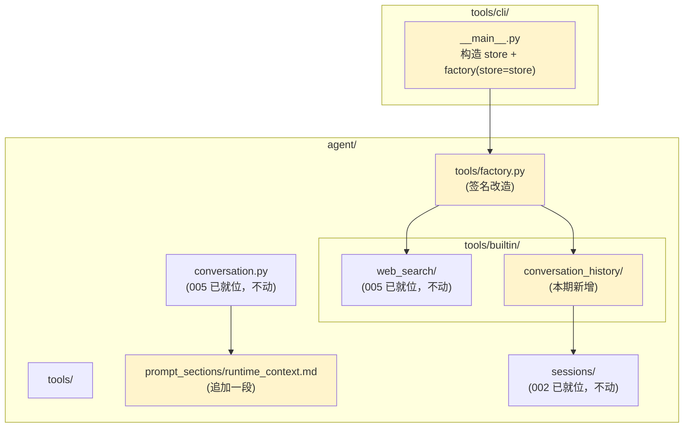
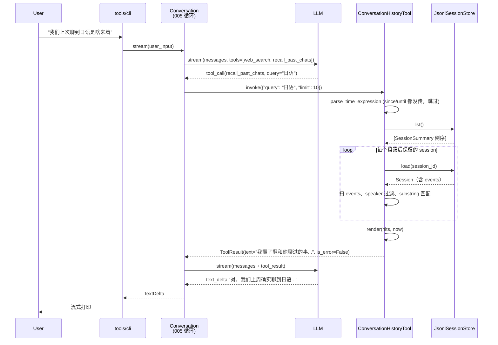

# 020 工具能力扩展：会话记录查询 · 技术方案

## 状态

<!-- DRAFT | CONFIRMED -->
CONFIRMED

---

## 0. 文档说明

- 本文档是 [020 需求](./requirement.md) 的技术设计文档，回答 requirement §7 中的 Q-1 ~ Q-9。
- 写作过程：与用户按思路块逐条 declare 后形成。严格基于讨论拍板的决定，不引入任何未对齐的设计点。
- 后续实施中如发现接口不足或设计需要调整，回到本文档更新（保持单一信息源）。

---

## 1. 整体目标与边界

### 1.1 本期要做的事

把"会话记录查询"作为 [005](../005-engine-tool-calling-and-web-search/requirement.md) 已建立的 Tool Protocol 的**第二个具体落地**——纯加性扩展。具体动作：

1. `agent/tools/builtin/conversation_history/` 子包新增：`ConversationHistoryTool` + 独立 `time_parser` + 拟人 `render`
2. `agent/tools/factory.py` 改造：`make_default_registry()` 加 `session_store=None` 可选参数（向后兼容）
3. 调用方（`tools/cli/__main__.py`）改造：构造 `SessionManager` 时同时把 `JsonlSessionStore` 传给 factory
4. `agent/prompt_sections/runtime_context.md` 资源文件**追加一段**关于"记不清时主动 recall"的引导（不动 004 接口）
5. 测试：单测覆盖 `time_parser` / `render` / 工具的 happy + 失败路径；集成测覆盖端到端"用户问 → AI 调 recall → 拿到结果 → 整合回复"

### 1.2 不做的事（YAGNI 边界）

| 不做的事 | 留到 |
|---|---|
| 结构化检索 / 分词 / 语义相似度 | 用户反馈不够再升级 |
| 持久化索引 / 全文搜索引擎 | YAGNI（substring 扫文件够用） |
| 多 provider（如远端会话同步、跨设备） | 数据源就一个 = `SessionStore`，无需复用 005 的 provider 抽象（详见 §5.2 N-1） |
| 把 `tool_call_request` / `tool_call_result` events 纳入检索 | 本期纯对话回忆（详见 §5.2 N-3） |
| 重复命中去重 | 实测影响小，加复杂度收益低（详见 §5.2 N-5） |
| 可视化 UI / 用户面 recall 操作 | 本期纯 LLM 自助 |

### 1.3 与既有接口承诺的关系

本期是 005 §6 接口稳定承诺下的**纯加性扩展**——不破坏任何既有承诺：

| 承诺项 | 本期处理 | 说明 |
|---|---|---|
| `Conversation.stream` / `send` | 不动 | 走 005 已铺好的工具调用循环 |
| 005 `Tool` Protocol | 不动 | 本工具实现该 Protocol |
| 005 `ToolRegistry` | 不动 | 本工具注册进去 |
| 005 `ConversationEvent` / `LLMStreamEvent` | 不动 | 本工具调用走既有事件流 |
| 002 session JSONL schema | 不动 | 本工具读 005 已加的 `tool_call_request` / `tool_call_result` 也无需写新事件类型 |
| 004 `SystemPromptComposer` / `Section` 接口 | 不动 | 只改 `runtime_context.md` 资源文件内容 |
| 005 `make_default_registry()` 签名 | **改**：加可选参数 `session_store=None` | 向后兼容——`None` 时行为完全一致（详见 §4.5） |

→ 新增的接口承诺以本文档 §6 为准。

---

## 2. 实施路径

本期范围紧凑，**单一里程碑 M20** 一气呵成，但内部按"先工具自己单测通 → 再接装配集成测"的顺序展开：

### 2.1 阶段 1：工具内核 + 单测

**范围**：
- 新建 `agent/src/agent/tools/builtin/conversation_history/` 包：
  - `__init__.py`（仅导出 `ConversationHistoryTool`）
  - `tool.py`（主体）
  - `time_parser.py`（独立时间解析函数 + 单元自测）
  - `render.py`（拟人渲染函数）
- 完整单测覆盖：
  - `time_parser` 所有支持短语 + ISO 8601 + 失败 case
  - `render` 各时间档（同日 / 同周 / 同年 / 跨年）+ 空结果 + 上下文配对 + inline reminder 含量
  - `ConversationHistoryTool.invoke` happy path（mock `SessionStore`）+ 各参数组合 + 失败兜底

**完成标志**：单测全绿；工具未接入任何 caller。

### 2.2 阶段 2：装配集成 + runtime_context 追加 + 集成测

**范围**：
- 改造 `agent/src/agent/tools/factory.py`：加 `session_store=None` 可选参数
- 改造 `tools/src/tools/cli/__main__.py`：构造 SessionManager 时同时把 store 传给 factory
- 追加 `agent/src/agent/prompt_sections/runtime_context.md` 末尾一段（详见 §4.7）
- 集成测：装配含本工具的 registry → 真调 LLM → 验证 AI 在"用户提及过去事"场景下能触发并整合回复（按 `llm-api-confirm` rule 启动前需用户授权）
- requirement §6 的 AC-1 ~ AC-7 全部跑通；AC-8 由既有 CI 测试覆盖（详见 §1.3）

**完成标志**：所有 AC 通过；CLI 真用体感：用户问"我们上次聊过日语吗" → 看到 `[tool] recall_past_chats(...)` 提示后看到 AI 流式回复。

---

## 3. 整体架构

### 3.1 模块依赖关系



**图例**：浅黄色块 = 本期改动的模块；其余 = 仅依赖关系不变化。

**关键约束**：
- `conversation_history/` 不依赖 `tools/cli/`（与 005 同样的"引擎不反向依赖客户端"原则）
- `conversation_history/` 仅依赖 `sessions.SessionStore` Protocol，不依赖具体 `JsonlSessionStore` 实现（便于注入 `NullSessionStore` 或 mock 测试，详见 §5.2 N-4）

### 3.2 一次"AI 想起过去"的完整时序



整个调用循环走 005 已就位的编排——本工具只是"被注册的另一个 Tool"。

---

## 4. 各模块详细设计

### 4.1 `ConversationHistoryTool`（`agent/tools/builtin/conversation_history/tool.py`）

#### 4.1.1 类骨架

```python
from typing import Any, ClassVar
from ...protocol import Tool, ToolResult
from ....sessions.store import SessionStore
from ....sessions.errors import SessionPersistError
from .time_parser import parse_time_expression
from .render import format_hits


class ConversationHistoryTool:
    name: ClassVar[str] = "recall_past_chats"
    description: ClassVar[str] = (
        "回忆过去和这位用户聊过的事。当用户提及之前的对话内容（如"
        "\"我们上次聊到 X 是啥\"、\"你之前说过的 Y 怎么样了\"），"
        "或你需要确认是否聊过某个话题时使用。"
        "返回过去对话的片段，按相关时间倒序。"
    )
    parameters_schema: ClassVar[dict[str, Any]] = {
        "type": "object",
        "properties": {
            "query": {
                "type": "string",
                "description": "要回忆的关键词。在过去对话内容中模糊匹配（包含即命中、大小写无关）。可选；不填则按时间范围返回所有片段。",
            },
            "since": {
                "type": "string",
                "description": "回忆的时间下界。支持 ISO 8601 日期（如 2026-06-15）或自然语言（如 \"3 天前\" / \"上周\" / \"去年\"）。可选。",
            },
            "until": {
                "type": "string",
                "description": "回忆的时间上界。格式同 since。可选。",
            },
            "said_by": {
                "type": "string",
                "enum": ["you", "me"],
                "description": "只看用户（you）说的，或只看你自己（me）说的。可选；不填则两者都看。",
            },
            "limit": {
                "type": "integer",
                "description": "最多返回多少条回忆。默认 10，上限 50。",
                "default": 10,
            },
        },
    }

    def __init__(self, store: SessionStore, clock: Callable[[], datetime] = _default_now) -> None:
        self._store = store
        self._clock = clock
```

**设计要点**：

- **三个 `ClassVar` 字段**：与 005 `WebSearchTool` 同结构——name / description / parameters_schema 是定义级常量
- **`clock` 注入**：与 005 `RuntimeContextSection` 同思路，便于单测固定"现在"
- **不接受 `provider` 参数**：本工具数据源就一个 = `SessionStore`，无 provider 抽象（详见 §5.2 N-1）

#### 4.1.2 `invoke` 主体

```python
def invoke(self, args: dict[str, Any]) -> ToolResult:
    query: str | None = args.get("query")
    said_by: str | None = args.get("said_by")
    limit: int = min(max(int(args.get("limit", 10)), 1), 50)
    now = self._clock()

    try:
        since = (
            parse_time_expression(args["since"], now, bias="start")
            if args.get("since") else None
        )
        until = (
            parse_time_expression(args["until"], now, bias="end")
            if args.get("until") else None
        )
    except ValueError as e:
        return ToolResult(
            text=f"时间格式没看懂：{e}。可以用 \"3 天前\" / \"上周\" / \"2026-06-15\" 这种说法。",
            is_error=True,
        )

    try:
        hits = self._scan(query, since, until, said_by, limit)
    except SessionPersistError:
        return ToolResult(
            text="一时翻不到记录了，等下再说吧。",
            is_error=True,
        )

    text = format_hits(hits, now)
    return ToolResult(
        text=text,
        is_error=False,
        meta={"result_count": len(hits)},
    )
```

**设计要点**：

- **`limit` 硬钳到 [1, 50]**：防 LLM 传 1000 把上下文吃满；默认 10
- **时间解析的 `bias`**：参见 §4.2.3——`since` 用 `"start"`、`until` 用 `"end"` 解决"今天/上周"等模糊时段作为端点时的歧义
- **失败拟人化**：所有错误路径返回 `is_error=True` + 拟人文本，让 LLM 拟人化继续（与 005 `WebSearchTool` 一致）
- **`meta.result_count`**：观测用，CLI / 日志可消费；不喂回 LLM

#### 4.1.3 `_scan` 扫描

```python
def _scan(
    self,
    query: str | None,
    since: datetime | None,
    until: datetime | None,
    said_by: str | None,
    limit: int,
) -> list[Hit]:
    summaries = self._store.list()  # 已按 updated_at 倒序

    # 粗筛 session（用 created_at / updated_at 区间排除明显不在范围的 session）
    relevant = [
        s for s in summaries
        if not (until is not None and s.created_at >= until)
        and not (since is not None and s.updated_at < since)
    ]

    needle = query.lower() if query else None
    hits: list[Hit] = []
    for summary in relevant:
        session = self._store.load(summary.session_id)
        prev: Event | None = None
        for ev in session.events:
            if ev.type not in ("user_message", "assistant_message"):
                # tool_call_request/result / persona_change / session_meta 等不参与检索（N-3）
                continue

            # 时间窗过滤
            if since is not None and ev.ts < since:
                prev = ev
                continue
            if until is not None and ev.ts >= until:
                # 同一 session events 按 ts 升序——后续也不可能命中，break
                break

            # speaker 过滤
            is_user = ev.type == "user_message"
            if said_by == "you" and not is_user:
                prev = ev
                continue
            if said_by == "me" and is_user:
                prev = ev
                continue

            # 关键字过滤
            content = ev.payload.get("content", "") or ""
            if needle is not None and needle not in content.lower():
                prev = ev
                continue

            # 命中
            pair = prev if (prev is not None and prev.type in ("user_message", "assistant_message")) else None
            hits.append(Hit(matched=ev, pair=pair))
            prev = ev

    hits.sort(key=lambda h: h.matched.ts, reverse=True)
    return hits[:limit]
```

**`Hit` 数据结构**（`tool.py` 内部）：

```python
@dataclass(frozen=True)
class Hit:
    matched: Event           # 命中的事件
    pair: Event | None       # 配对的（前面的对方那条），可能为 None
```

**设计要点**：

- **lazy load**：粗筛阶段只读 `SessionSummary`（O(1) per 文件），命中范围的才 `load()` 全文
- **`break` 而非 `continue`**：同 session 内 events 按 `ts` 升序，遇到超出 `until` 的可以直接退出当前 session
- **不去重**：一对 user/assistant 若都命中 query，分别 emit 两个 Hit（详见 §5.2 N-5）
- **大小写无关**：用 `.lower()` 即可——中文不受影响，英文常规无关
- **`NullSessionStore` 注入时**：`list()` 返回 `[]`，循环不进入，`hits=[]`，自然走"翻不到"拟人兜底（详见 §5.2 N-4）

### 4.2 `time_parser.py`

#### 4.2.1 函数签名

```python
from datetime import datetime
from typing import Literal


def parse_time_expression(
    text: str,
    now: datetime,
    *,
    bias: Literal["start", "end"] = "start",
) -> datetime:
    """把时间表达式解析成 datetime。

    Args:
        text: 用户传入的字符串。
        now: 当前时间，用于解析相对短语；必须是 timezone-aware datetime。
        bias: 当 text 是模糊的时间段（"今天" / "上周" / "3 天前" 等）时：
            - "start" 返回该时间段的**开始**（如 "今天" → 今天 00:00）
            - "end" 返回该时间段的**结束**（如 "今天" → 明天 00:00，即半开区间右端点）
            对精确时刻（ISO 8601 datetime）无影响。

    Returns:
        timezone-aware datetime。

    Raises:
        ValueError: 无法解析（格式不识别 / 数值非法）。
    """
```

**位置**：`agent/src/agent/tools/builtin/conversation_history/time_parser.py`。独立模块、独立单测——这是 requirement R-4.1.2 "解析逻辑必须抽成独立函数" 的落实点。

#### 4.2.2 本期支持的短语集

| 类别 | 短语 | "start" 语义 | "end" 语义 |
|---|---|---|---|
| 精确时刻 | ISO 8601 datetime `2026-06-15T14:00:00+08:00` | 该时刻 | 该时刻（bias 无影响） |
| 精确日 | ISO 8601 date `2026-06-15` | 该日 00:00 | 次日 00:00 |
| 小时级 | `N 小时前` | (now - N 小时) | (now - N 小时) + 1 小时 |
| 日级 | `今天` | 今天 00:00 | 明天 00:00 |
| 日级 | `昨天` | 昨天 00:00 | 今天 00:00 |
| 日级 | `前天` | 前天 00:00 | 昨天 00:00 |
| 日级 | `N 天前` | (今天 - N 天) 00:00 | (今天 - (N-1) 天) 00:00 |
| 周级 | `本周` | 本周一 00:00 | 下周一 00:00 |
| 周级 | `上周` | 上周一 00:00 | 本周一 00:00 |
| 周级 | `N 周前` | (本周一 - N 周) 00:00 | (本周一 - (N-1) 周) 00:00 |
| 月级 | `本月` | 本月 1 日 00:00 | 下月 1 日 00:00 |
| 月级 | `上月` | 上月 1 日 00:00 | 本月 1 日 00:00 |
| 月级 | `N 个月前` | (本月 1 日 - N 月) 00:00 | (本月 1 日 - (N-1) 月) 00:00 |
| 年级 | `今年` | 今年 1 月 1 日 00:00 | 明年 1 月 1 日 00:00 |
| 年级 | `去年` | 去年 1 月 1 日 00:00 | 今年 1 月 1 日 00:00 |
| 年级 | `前年` | 前年 1 月 1 日 00:00 | 去年 1 月 1 日 00:00 |
| 年级 | `N 年前` | (今年 - N 年) 1 月 1 日 00:00 | (今年 - (N-1) 年) 1 月 1 日 00:00 |

**实现策略**：手撸正则匹配 + 分支处理。本期不引入 `dateparser` / `parsedatetime` 等第三方库。

**时区处理**：所有产出的 datetime **必须** timezone-aware（与 `now` 同时区）；ISO 8601 不带时区信息时按 `now` 时区补齐。

**周一为周起点**：与 ISO 8601 / 中国习惯一致。

#### 4.2.3 失败行为

无法解析（既不匹配任何短语模板、也不是合法 ISO 8601、`N` 为负数或非数字）→ `raise ValueError(具体描述)`。

调用方 `ConversationHistoryTool.invoke` catch ValueError → 落 `ToolResult(is_error=True, text="时间格式没看懂：...")`。

#### 4.2.4 单测覆盖（不完整列举）

- 每个短语类的 `start` / `end` 双 bias 都有 case
- 边界值：`N=0` / `N=1` / 大 N（如 `N 天前` N=100）
- 跨月 / 跨年的日级回退（如"本月"在 1 月 → 跨年到去年）
- ISO 8601 含 / 不含时区
- 失败 case：空字符串、乱码、负数、`"明天"`（本期不支持未来时间）等

### 4.3 `render.py`

#### 4.3.1 主函数

```python
def format_hits(hits: list[Hit], now: datetime) -> str:
    """把 Hit 列表渲染成喂给 LLM 的拟人化文本。"""
    if not hits:
        return "我翻了翻，好像没和你聊过这个。"

    lines = [f"我翻了翻和你聊过的事，找到 {len(hits)} 条相关的回忆：\n"]
    for hit in hits:
        lines.append(_format_one(hit, now))

    lines.append(
        "\n\n请基于这些回忆用朋友的口吻自然提及；具体时间可以说（如\"上周二\"），"
        "但不要直接吐 ISO 时间戳，也不要直说\"我查了会话记录\"之类的话。"
    )
    return "\n".join(lines)
```

#### 4.3.2 单条渲染

```python
def _format_one(hit: Hit, now: datetime) -> str:
    time_str = _format_time(hit.matched.ts, now)
    speaker = "你" if hit.matched.type == "user_message" else "我"
    content = hit.matched.payload.get("content", "")

    block = [f"· {time_str}"]
    if hit.pair is not None:
        pair_speaker = "你" if hit.pair.type == "user_message" else "我"
        pair_content = hit.pair.payload.get("content", "")
        block.append(f"  {pair_speaker}说：\"{_truncate(pair_content)}\"")
    block.append(f"  {speaker}说：\"{_truncate(content)}\"")
    return "\n".join(block)


def _truncate(text: str, max_chars: int = 200) -> str:
    text = text.strip().replace("\n", " ")
    if len(text) <= max_chars:
        return text
    return text[:max_chars] + "..."
```

#### 4.3.3 时间格式化

```python
def _format_time(ts: datetime, now: datetime) -> str:
    days = (now.date() - ts.date()).days
    weekday_zh = ["周一", "周二", "周三", "周四", "周五", "周六", "周日"][ts.weekday()]
    period = "上午" if ts.hour < 12 else "下午"

    if days == 0:
        return f"今天 {ts:%H:%M}"
    if days == 1:
        return f"昨天 {weekday_zh}{period} {ts:%H:%M}"
    if 2 <= days <= 6:
        return f"{days} 天前 {weekday_zh}{period} {ts:%H:%M}"
    if ts.year == now.year:
        return f"{ts:%m-%d} {weekday_zh}{period} {ts:%H:%M}"
    return f"{ts:%Y-%m-%d} {ts:%H:%M}"
```

**设计要点**：

- **拟人时间格式**：requirement R-4.2.3 的落实点——绝不输出 ISO 8601 给 LLM
- **配对上下文**：requirement §4.2 declare 时对齐——默认带"对方那一句"保证语义完整
- **truncate 200 字符**：单条内容上限，防过长 user / assistant 把上下文撑爆；末尾 `...` 表示截断
- **inline reminder**：requirement R-4.2.4 的落实点——参考 005 `web_search/_format` 末尾的引导风格

#### 4.3.4 单测覆盖

- 空 `hits` → 拟人化兜底文案
- 各时间档（今天 / 昨天 / 2-6 天 / 同年 / 跨年）的渲染样式
- `pair=None`（命中孤立 event，比如 session 第一条就命中）
- `_truncate` 长内容截断 + 短内容透传
- inline reminder 在末尾出现且不重复

### 4.4 数据扫描的工程权衡

#### 4.4.1 为什么不索引

预估上限：一年 1000 session × 平均 100 events ≈ 10w events。纯 Python `str.lower()` + `in` 扫一遍，本地实测毫秒级——加索引收益 < 复杂度成本。

#### 4.4.2 粗筛策略

`SessionStore.list()` 返回的 `SessionSummary` 含 `created_at` + `updated_at`。粗筛规则：

- `until is not None and summary.created_at >= until` → 整 session 都晚于范围，**跳过**
- `since is not None and summary.updated_at < since` → 整 session 都早于范围，**跳过**

剩下的 `load()` 全文扫 events。这能在用户传明确时间窗时大幅减少 IO（比如查"上周聊过日语"——只读上周更新过的 session 文件）。

#### 4.4.3 返回 text 软上限

`limit=10` 时每条 ≈ 100 token（按 §4.3 渲染规则估算），全量约 1k token；`limit=50` 时约 5k token。Token 预算意识由 `limit` 上限钳制，不在 `format_hits` 内做硬截断（保持渲染逻辑简单）。

### 4.5 `factory.py` 改造

#### 4.5.1 改造后签名

```python
def make_default_registry(
    session_store: SessionStore | None = None,
    *,
    stderr_warn: bool = True,
) -> ToolRegistry:
    tools: list[Tool] = []

    api_key = os.environ.get("TAVILY_API_KEY")
    if api_key:
        provider = TavilyProvider(api_key=api_key)
        tools.append(WebSearchTool(provider=provider))
    elif stderr_warn:
        print(
            "[tool] 未配置 TAVILY_API_KEY，搜索能力已关闭。"
            "如需启用，把 key 加入 .env（详见 .env.example）。",
            file=sys.stderr,
        )

    if session_store is not None:
        tools.append(ConversationHistoryTool(store=session_store))

    return ToolRegistry(tools)
```

#### 4.5.2 向后兼容性

| 调用形态 | 结果 |
|---|---|
| `make_default_registry()` | 与 005 完全一致——只含 `WebSearchTool`（如果 key 配了） |
| `make_default_registry(session_store=store)` | 含 `WebSearchTool` + `ConversationHistoryTool` |
| `make_default_registry(stderr_warn=False)` | 与 005 完全一致 |
| `make_default_registry(session_store=NullSessionStore())` | 含两个 tool；recall 调用时自然返回"翻不到"（详见 §5.2 N-4） |

不传 `session_store` 的既有调用方代码**完全不改也能跑**——这是 5/6 讨论时确认的"既有测试自动覆盖向后兼容"基础。

### 4.6 调用方传入 store（`tools/cli/__main__.py`）

CLI 启动入口的最小改造（伪码）：

```python
# 既有：构造 store
store = JsonlSessionStore(base_dir=session_base_dir)

# 既有 → 改造：factory 调用多一个参数
- tool_registry = make_default_registry()
+ tool_registry = make_default_registry(session_store=store)

# 既有：传给 SessionManager
manager = SessionManager(
    store=store,
    ...,
    tool_registry=tool_registry,
)
```

只此一处改动。其他不动。

### 4.7 `runtime_context.md` 资源文件追加

#### 4.7.1 追加位置

005 §4.10 已在 `agent/src/agent/prompt_sections/runtime_context.md` 注入"当前时间 + cutoff + 工具使用强约束"。本期在该文件**末尾追加**一段新的小节，不动既有内容：

```markdown
## 关于过去的记忆

如果用户提及之前的对话内容（如"我们上次聊到 X"、"你之前说过的 Y 怎么样了"），而上文里**找不到相关内容**或你**记不清楚**，**主动调用 `recall_past_chats` 工具**翻看过去的对话——不要凭印象作答，也不要回避（"我不记得"是失忆话术红线）。

回忆到内容后，用朋友口吻自然提及（如"对，你之前说过……"），不要暴露查询动作，不要复述 ISO 时间戳。
```

#### 4.7.2 不动 004 接口

- `Section` Protocol、`SystemPromptComposer.compose() / with_section / without` 等接口形态完全没动
- `RuntimeContextSection` 类实现没动
- 仅资源文件内容增加——`runtime_context.md` 本身已被 005 §4.10 标为"可调"（资源文件内容不算接口稳定承诺）

#### 4.7.3 为什么追加而非纯靠 description

005 §5.2 N-7 已经验证：**纯靠 `tools` 参数 + 弱 description 时，LLM 自主决策不稳定**——这是 005 引入 `RuntimeContextSection` 的根本原因。本期同样借力——把 recall 的引导也放进运行时上下文。

---

## 5. 决策汇总表

### 5.1 Q-1 ~ Q-9（requirement.md §7 中提出的开放问题）

| 编号 | 问题 | 决策 | 落点 |
|---|---|---|---|
| Q-1 | 工具命名 + description 措辞 | name=`recall_past_chats`；description **中文**、措辞拟人（"回忆过去和这位用户聊过的事"） | §4.1.1 |
| Q-2 | 参数命名 + JSON Schema | `query` / `since` / `until` / `said_by ∈ {"you", "me"}` / `limit (1~50, default 10)` | §4.1.1 |
| Q-3 | 时间解析支持范围 | ISO 8601 + 16 种自然语言短语；独立函数 `parse_time_expression(text, now, *, bias)`；解析失败 → `is_error=True` 拟人兜底 | §4.2 |
| Q-4 | 跨 session 扫描效率 | `store.list()` summary 粗筛（按 `created_at` / `updated_at`） + lazy `load()` + 扫 events；不引入索引；返回 text 通过 `limit` 钳制 | §4.4 |
| Q-5 | 渲染格式 | 默认带"对方那一句"上下文；时间格式分四档（同日 / 同周内 / 同年 / 跨年）；多条用 `·` 索引 + 空行分隔 | §4.3 |
| Q-6 | inline reminder | 一段简短引导附在结果末尾，参考 005 `web_search/_format` 末尾的风格 | §4.3.1 |
| Q-7 | limit 默认值 + token 预算 | 默认 10，hard cap 50；约 1k token (`limit=10`) ~ 5k token (`limit=50`) | §4.1.2 / §4.4.3 |
| Q-8 | 与 008 memory / 004 system prompt 的关系 | 在 005 `runtime_context.md` 末尾追加一段（资源文件追加，**不动 004 接口**）；不动 008 memory | §4.7 |
| Q-9 | factory 依赖注入 | `make_default_registry(session_store=None)` 加可选参数；`None` 时行为完全兼容 005；CLI 改一行；agent_bridge 等无状态场景按 N-4 自然降级 | §4.5 / §4.6 |

### 5.2 N-1 ~ N-5（design 阶段独立做出的决策）

| 编号 | 决策点 | 决策 | 理由 |
|---|---|---|---|
| N-1 | 是否复用 005 `web_search` 的 provider 抽象 | **不复用**：本工具数据源就一个 = `SessionStore`，无 provider 概念 | YAGNI；如未来出现"远端会话同步 / 跨设备记忆"等多数据源场景再引入 |
| N-2 | 时间范围短语作为 since/until 时的语义 | 半开区间 `[since, end)`——`parse_time_expression` 的 `bias` 参数控制；`bias="start"` 返回段开始、`bias="end"` 返回段结束（下一段的开始） | 编程惯例；避免端点重复；调用方 `invoke` 显式传 `bias="start"` for since / `bias="end"` for until |
| N-3 | 是否把 `tool_call_request` / `tool_call_result` events 纳入检索 | **不纳入**：只看 `user_message` / `assistant_message` | LLM 看到 "我曾经调用 web_search 查 X" 既诡异又破坏体验；本期纯对话回忆 |
| N-4 | `NullSessionStore` 等空 store 注入时的行为 | 允许注入：本工具调用时 `store.list()` 返回空、自然走"翻不到"拟人兜底，无需 caller 显式跳过本工具 | 优雅降级；caller 不需要知道 store 实现细节；与 005 "key 未配置就降级"风格一致 |
| N-5 | 重复命中同一对的去重 | **不去重**：一对 user/assistant 若都命中 query，分别 emit 两个 Hit | YAGNI；实测影响小；加去重逻辑复杂度收益低 |

### 5.3 与 005 已建立机制的关系

- **Tool Protocol（005 §4.1）**：本工具实现该 Protocol；零改动
- **ToolRegistry（005 §4.1.3）**：本工具注册其中；零改动
- **Tool 调用循环（005 §4.6）**：本工具的调用走该循环；零改动
- **`tool_call_request` / `tool_call_result` events（005 §4.2）**：本工具的调用入参 / 结果通过这两类事件持久化；零改动
- **`RuntimeContextSection`（005 §4.10）**：仅追加资源文件内容；零改动接口

---

## 6. 接口稳定承诺

本期落地后，以下接口形态被视作"已就位"，后续需求若要破坏需明确登记：

### 6.1 引擎对外公共 API（`agent/__init__.py` 导出）

- `ConversationHistoryTool` 的 `name` / `description` / `parameters_schema` 三件套：**对 LLM 可见的协议形态稳定**——`name="recall_past_chats"` 不动；description / schema 文案可调（不属于接口稳定承诺，但 LLM 协议形态稳定）
- `ConversationHistoryTool.__init__(store, clock=...)` 构造形态稳定；新增字段保持向后兼容（默认值）
- `make_default_registry(session_store=None, *, stderr_warn=True)` 签名稳定：未来加新 tool 时**优先走可选参数注入模式**（如 `make_default_registry(session_store=None, *, weather_provider=None)`），避免破坏现有调用方
- `Hit` dataclass（`conversation_history.tool`）：仅内部使用，**不算公共 API**——未来重构允许

### 6.2 持久化数据

- 本期**不引入新事件类型 / 新字段**——complete 复用 005 已有的 `tool_call_request` / `tool_call_result` schema

### 6.3 时间解析

- `parse_time_expression(text, now, *, bias)` 签名稳定（未来加 fuzzy 模式可走新关键字参数）
- **支持的短语集合 + 失败措辞 NOT 稳定**——这是函数内部细节，未来扩短语或换 dateparser 都不算接口破坏

### 6.4 不算稳定承诺的部分

- `render.py` 的输出格式（拟人化文本，可调）
- `runtime_context.md` 资源文件内容（005 §6.4 已声明可调）
- `_truncate` 的 200 字符上限
- `limit` 的硬上限 50
- 粗筛策略 / 索引引入与否

---

## 7. 变更记录

| 日期 | 变更内容 | 是否需要重新实现 |
|------|---------|----------------|

---

## 文档元信息

- **创建时间**：2026-06-17
- **确认时间**：2026-06-17
- **下一步**：等用户明确表示开始实现，进入 Phase 3 落 `progress.md` + 实施 M20 阶段 1 / 阶段 2
