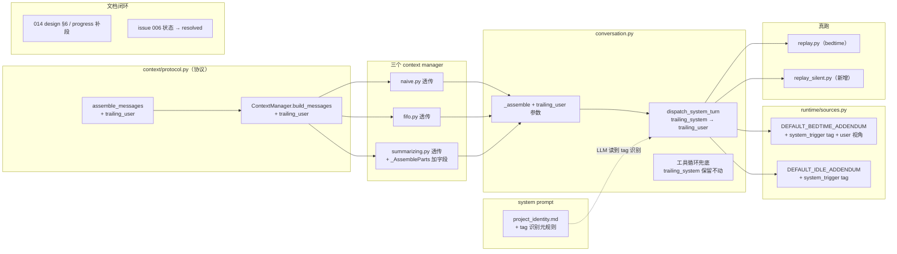

# 021 · 主动 source 触发信号改用 user role 注入 — 技术方案

> 对应 [`requirement.md`](./requirement.md)。本文讲"怎么做"：协议层加 `trailing_user` 槽位、三个 context manager 透传、`dispatch_system_turn` 切换、`<system_trigger>` tag 包裹 + `project_identity.md` 加 tag 识别说明、014 文档与 issue 006 闭环、真跑 replay。
>
> 项目级技术栈已在 [`0002`](../../decisions/0002-incubation-tech-stack/README.md) 锁定；上下文协议在 [`009 design`](../009-engine-context-management/design.md) 锁定 `assemble_messages` / `ContextManager.build_messages` 形态；014 当年选用 `trailing_system` 路径的方案在 [`014 design §6`](../014-engine-main-loop-and-bridge-push/design.md#6-dispatch_system_turn-入口) 锁定——本文是它的架构调整。

---

## 状态

<!-- 草稿（Draft） | 已确认（Confirmed） -->
已确认（Confirmed）

---

## 1. 设计目标回顾

把 014 的 `dispatch_system_turn` 注入路径从 `role="system"` trailing_system 切到 `role="user"` trailing_user。三个核心取向贯穿全文：

- **Additive over breaking**：`trailing_system` 槽位**保留**给 conversation 工具调用循环兜底收尾用（`conversation.py:913`），不删；`trailing_user` 是协议层加性扩展。所有既有调用（含 014 已有的 user pull 路径、agent-cli、tests）行为零变化。
- **架构层根治，不打补丁**：本期同时处理 (a) 协议层加槽位 (b) `dispatch_system_turn` 切换 (c) Claude Code 同款 tag + system prompt 缓解，对所有主动 source（bedtime / idle / 未来 A/D 类）通用——不只是修 issue 006 一个 case。
- **真 LLM 验证**：方向 A 已在真跑下证伪（issue 006 README），方向 B 也必须在真跑下验证成立——不仅是结构 OK，DeepSeek 真实行为也得拐过来。

---

## 2. 整体改动地图



涉及文件清单：

| 文件 | 改动类型 | 说明 |
|---|---|---|
| `agent/src/agent/context/protocol.py` | 修改（additive） | `assemble_messages` + `ContextManager.build_messages` 加 `trailing_user: str \| None = None` 参数；不变量 docstring 加一条 |
| `agent/src/agent/context/naive.py` | 修改（additive） | `build_messages` 加 `trailing_user` 透传 |
| `agent/src/agent/context/fifo.py` | 修改（additive） | `build_messages` 加 `trailing_user` 透传（首拼 + 截断循环各一处） |
| `agent/src/agent/context/summarizing.py` | 修改（additive） | `build_messages` 加 `trailing_user` 透传；`_AssembleParts` dataclass 加 `trailing_user: str \| None` 字段 |
| `agent/src/agent/conversation.py` | 修改（additive + 一行切换） | `_assemble` 加 `trailing_user` 参数透传；`dispatch_system_turn` 第 454 行 `trailing_system=` → `trailing_user=`；其余路径不动 |
| `agent/src/agent/runtime/sources.py` | 修改（行为变更） | `DEFAULT_BEDTIME_ADDENDUM` 改成 user 视角 + `<system_trigger>` 包裹；`DEFAULT_IDLE_ADDENDUM` 保留反思语义 + `<system_trigger>` 包裹 |
| `agent/src/agent/prompt_sections/project_identity.md` | 修改（追加段） | 末尾加一条元规则说明 `<system_trigger>` tag 含义 |
| `docs/requirements/014-engine-main-loop-and-bridge-push/design.md` | 修改（追加段） | §6 末尾补 "021 架构调整"小节，指向本需求 |
| `docs/requirements/014-engine-main-loop-and-bridge-push/progress.md` | 修改（追加日志行） | 实现日志加 2026-06-17 一行，指向本需求 |
| `docs/issues/006-bedtime-prompt-history-hijack/README.md` | 修改（状态 + 闭环段） | 状态 `open` → `resolved`；文末加 "已在 commit `<hash>`（feature/021）修复" |
| `agent/tests/test_context_assembly.py` | 修改（新增 case） | AC-1 顺序断言 + naive 透传 case |
| `agent/tests/test_context_fifo.py` | 修改（新增 case） | AC-2 fifo 透传 |
| `agent/tests/test_context_summarizing.py` | 修改（新增 case） | AC-2 summarizing 透传 |
| `agent/tests/test_conversation_dispatch_system_turn.py` | 修改（既有 case 调整 + 新 case） | AC-3 mock LLM 拦 messages，最后一条 role=`user` |
| `agent/tests/test_runtime_sources.py` | 修改（新增 case） | AC-4 `DEFAULT_*_ADDENDUM` 含 `<system_trigger>` tag |
| `agent/tests/test_system_prompt_composer.py` | 修改（新增 case） | AC-4 project_identity 渲染含 tag 识别说明 |
| `docs/issues/006-bedtime-prompt-history-hijack/replay_silent.py` | **新文件** | AC-5 silent turn 真跑 fixture |

---

## 3. 协议层：`trailing_user` 槽位

### 3.1 `assemble_messages` 签名与顺序

`agent/src/agent/context/protocol.py`：

```python
def assemble_messages(
    history: list[Message],
    system_prompt: str,
    new_user_input: str | None = None,
    extra_context: list[Message] | None = None,
    trailing_user: str | None = None,        # ← 新增
    trailing_system: str | None = None,
) -> list[Message]:
    """按 ContextManager 不变量把各成分拼成消息序列（所有策略共用）。

    顺序：[system?] + extra_context? + history + [new_user_input?] + [trailing_user?] + [trailing_system?]。
    ...
    """
    messages: list[Message] = []
    if system_prompt:
        messages.append(Message(role="system", content=system_prompt))
    if extra_context:
        messages.extend(extra_context)
    messages.extend(history)
    if new_user_input is not None:
        messages.append(Message(role="user", content=new_user_input))
    if trailing_user is not None:                                   # ← 新增
        messages.append(Message(role="user", content=trailing_user))
    if trailing_system is not None:
        messages.append(Message(role="system", content=trailing_system))
    return messages
```

> **关键取舍 · `trailing_user` 在 `new_user_input` 之后 / `trailing_system` 之前**：
> - 在 `new_user_input` 之后：主动轮场景下 `new_user_input=None`，实际不会同时出现；若未来某场景同时传，"用户先说话 → 系统触发提示" 是更自然的拼接顺序。
> - 在 `trailing_system` 之前：本期 `dispatch_system_turn` 用 `trailing_user` 替代 `trailing_system`，二者实际不会同时传；保留原 `trailing_system` 在最末，让兜底收尾路径（`conversation.py:913` 工具循环收尾）行为完全不变。

### 3.2 `ContextManager` Protocol 同步

```python
class ContextManager(Protocol):
    def build_messages(
        self,
        history: list[Message],
        system_prompt: str,
        new_user_input: str | None = None,
        extra_context: list[Message] | None = None,
        trailing_user: str | None = None,        # ← 新增
        trailing_system: str | None = None,
        runtime: RuntimeContext | None = None,
    ) -> BuildResult: ...
```

Protocol docstring 的"不变量"清单加一条：

```
N. `trailing_user` 若提供，rendered 为 role="user" 消息，位置在 `new_user_input` 之后、
   `trailing_system` 之前。语义：仅活在 LLM 视图、不落盘——主动 source（system_trigger）
   注入触发信号专用。与 `new_user_input`（已落盘的真用户输入）语义边界明确，互不替代。
```

> **关键取舍 · 不强制三者互斥 assert**：
> - `new_user_input` / `trailing_user` / `trailing_system` 三者实际不同时出现，加 assert 没有保护实际场景的价值。
> - 调用方语义责任：`dispatch_system_turn` 永远只传 `trailing_user`、`Conversation.send` 永远只传 `new_user_input`、工具循环兜底永远只传 `trailing_system`——三处都是 add-only call site。
> - Docstring 明确语义边界已经够。

---

## 4. 三个 context manager 透传

### 4.1 `naive.py`

```python
def build_messages(
    self,
    history: list[Message],
    system_prompt: str,
    new_user_input: str | None = None,
    extra_context: list[Message] | None = None,
    trailing_user: str | None = None,        # ← 新增
    trailing_system: str | None = None,
    runtime: RuntimeContext | None = None,
) -> BuildResult:
    messages = assemble_messages(
        history=history,
        system_prompt=system_prompt,
        new_user_input=new_user_input,
        extra_context=extra_context,
        trailing_user=trailing_user,         # ← 新增
        trailing_system=trailing_system,
    )
    return BuildResult(messages=messages)
```

### 4.2 `fifo.py`

两处 `assemble_messages` 调用（首拼 + 截断循环 line 72-78）各加一个 `trailing_user=trailing_user`：

```python
def build_messages(self, ..., trailing_user=None, trailing_system=None, runtime=None):
    full = assemble_messages(
        history=history, system_prompt=system_prompt,
        new_user_input=new_user_input, extra_context=extra_context,
        trailing_user=trailing_user,         # ← 新增
        trailing_system=trailing_system,
    )
    # ... 截断循环里同样加一份
```

### 4.3 `summarizing.py`

`_AssembleParts` dataclass 加字段：

```python
@dataclass(frozen=True)
class _AssembleParts:
    system_prompt: str
    new_user_input: str | None
    extra_context: list[Message] | None
    trailing_user: str | None                # ← 新增
    trailing_system: str | None

    def assemble(self, history: list[Message]) -> list[Message]:
        return assemble_messages(
            history=history,
            system_prompt=self.system_prompt,
            new_user_input=self.new_user_input,
            extra_context=self.extra_context,
            trailing_user=self.trailing_user, # ← 新增
            trailing_system=self.trailing_system,
        )
```

`build_messages` 入口 + 构造 `_AssembleParts` + `_fallback_result` 内 `self._fallback.build_messages(...)` 调用（`summarizing.py:217-224`）各加一处 `trailing_user=trailing_user`。

> **关键取舍 · 摘要 LLM 调用不受影响**：`build_summary_messages` / `render_summary_as_context` / `_compact` 内部摘要生成路径不读 `trailing_user`——summary 是基于较旧 history 文本生成的，跟当前请求的 trailing 注入无关。trailing_user 只在最终 `parts.assemble(...)` 拼装时生效。

---

## 5. `dispatch_system_turn` 切换

### 5.1 改动点

`agent/src/agent/conversation.py`：

```python
# 1. _assemble 加 trailing_user 参数透传（line 685-708）
def _assemble(
    self,
    new_user_input: str | None = None,
    extra_context: list[Message] | None = None,
    trailing_user: str | None = None,        # ← 新增
    trailing_system: str | None = None,
) -> list[Message]:
    # ...
    build = self._context_manager.build_messages(
        history=self._session.messages,
        system_prompt=self._build_system_prompt(),
        new_user_input=new_user_input,
        extra_context=extra_context,
        trailing_user=trailing_user,         # ← 新增
        trailing_system=trailing_system,
        runtime=self._make_runtime_context(),
    )
    # ...

# 2. dispatch_system_turn 第 454 行：trailing_system → trailing_user
openai_messages = self._assemble(trailing_user=system_prompt_addendum)
```

**就这一行 diff 是方向 B 的核心切换。** `_append_system_trigger_event` marker 落盘行为不变；`output_visibility` 两条分支（user / memory_only）都共用这一行，**两条路径一次切完**。

### 5.2 工具循环兜底（不动）

`conversation.py:913` 工具循环兜底收尾仍走 `trailing_system`：

```python
# 既有路径，保持不动
openai_messages = self._assemble(trailing_system=extra_system)
```

这条路径是 "LLM 自己 tool_call 后被强制收尾"，不是 turn 切换信号；trailing_system 语义合适，不切。

### 5.3 顺序保证

切换后 `dispatch_system_turn` 给 LLM 的 messages 序列：

```
[system_prompt] + [extra_context?] + [history...] + [trailing_user: addendum]
```

末尾是 `role="user"`——chat-completions 协议下这是"新一轮 turn 开始"的真正信号；LLM 应当切到"生成新一轮 assistant 回应"模式，不再续写 history 末尾 assistant 的话题。

> **关键取舍 · 不在 session.events 落 trailing_user**：与 014 design §6 既定的 `system_trigger` marker 模式一致——`system_trigger` event 已经记下"这一轮是哪个 source 触发的 + addendum 文本"用于回放；trailing_user 是该 marker 派生出来的 LLM 视图，不需要再落一次。这也是 Claude Code 同款 `isMeta: true` 的等价语义。

---

## 6. 缓解措施：tag 包裹 + system prompt 注释

### 6.1 sources.py 文案

```python
DEFAULT_BEDTIME_ADDENDUM = (
    "<system_trigger>"
    "到约定休息时间啦——该睡了。"
    "按你当前 persona 自然温和地提醒一句，不长篇大论，不强迫，"
    "让用户感到陪伴而不是被监督。"
    "</system_trigger>"
)

DEFAULT_IDLE_ADDENDUM = (
    "<system_trigger>"
    "定时器触发：基于最近的对话，沉默地为自己整理 1-3 条值得长存的事实——"
    "用户偏好、生活节奏、情绪倾向等都可以；不必回应任何人，只是写给未来的自己。"
    "</system_trigger>"
)
```

要点：
- **bedtime 文案 user 视角**：去掉方向 A 残留的"【主动轮 · 系统触发】"前缀 + "你（agent）现在要主动开口"指令措辞——LLM 看到的是 user role 消息，文案应当贴 user 提醒口吻，不再是给 agent 的祈使句。
- **idle 文案保留反思语义**：silent turn 不暴露给用户，"user 视角"对 LLM 意义不大；但 tag 包裹必要——让 LLM 识别这是系统触发的反思请求，不要"答复"这个请求。
- **去掉方向 A 已证伪的强化措辞**：方向 A 的 "**你（agent）现在要主动开口**"、"不要回应上一轮的对话内容、不要假装是 user 在说话"等被 DeepSeek 当作"现有对话的额外提示"消化的措辞，方向 B 不再依赖文案——靠 role 切换 + tag + system prompt 三层加固。

### 6.2 `project_identity.md` 加元规则

在 `agent/src/agent/prompt_sections/project_identity.md` 末尾追加一条：

```markdown
- **`<system_trigger>` 标识的消息**：当你在对话历史末尾看到一条 user role 但被
  `<system_trigger>...</system_trigger>` 包裹的消息时，**这不是用户真的说了这句话**，
  而是系统定时器 / 调度器触发的指令——你应当按 tag 内文本主动开口（如有需要发声）
  或沉默完成指令（如反思整理）。**不要**把 tag 内容当成用户发问回应、**不要**在
  后续对话里把它复述成"既然你说……"、"你刚才提到……"等——后续 user 无法看到这条
  注入，复述会让用户困惑。
```

要点：
- **位置在 `project_identity.md`**：跟"不暴露 AI 身份"、"工具失败拟人化兜底"等元规则同级；本文件是 system prompt 第一段（参 `composer.py:66-72` DEFAULT_KEYS），LLM 进入对话前先读这里——保证 tag 识别建立在所有人设之前。
- **不新建 section**：避免改 `composer.py` / `defaults.py` / `_SECTION_KEY_TO_FILENAME`，最小改动面落地。
- **+ ~150 tokens 影响所有轮**：用户轮（无 trailing_user）也读到这条，但内容是"看到此 tag 才适用"，无 tag 出现时是 no-op；不破坏 prompt cache（文本静态）。

### 6.3 tag 名选择

用 `<system_trigger>` 而非 `<system-reminder>`（Claude Code 风）：
- 与项目内既有 `EventType = "system_trigger"`（014 引入）命名一致，grep 一次就能定位所有相关代码
- 不刻意对齐外部框架，项目内一致性优先

---

## 7. 文档同步

### 7.1 014 design.md 补段

在 `docs/requirements/014-engine-main-loop-and-bridge-push/design.md` §6.1 末尾（"EventType 加性扩展"小节之后）追加：

```markdown
### 6.2 后续架构调整：trailing_system → trailing_user（021）

014 当年（2026-06-12）选用 `trailing_system` 注入路径，在 M14.8 真跑下表现正常——
但 015 端到端真跑 + issue 006 复现暴露：当 session history 末尾是上一轮 assistant
（尤其含问号），DeepSeek 把 trailing_system 当"现有对话的额外提示"消化、续写
assistant 上文，**不**触发新一轮 turn 切换。

详见 [`issue 006`](../../issues/006-bedtime-prompt-history-hijack/) 与
[`021 需求`](../021-system-trigger-user-injection/)。021 把注入路径切到
`trailing_user`（user role 是 chat-completions 协议的真正 turn 切换信号），
配套 `<system_trigger>` tag + project_identity.md 元规则缓解归因漂移。

本节 §6 的 `dispatch_system_turn` 第 2 步 `self._assemble(trailing_system=...)`
**已被 021 替换为** `self._assemble(trailing_user=...)`；其余步骤（marker 落盘、
两条 visibility 分支、自构 fragment 喂 memory）形态不变。
```

### 7.2 014 progress.md 补日志行

实现日志表加一行：

```
| 2026-06-17 | 021 架构调整 | 把 dispatch_system_turn 的 trailing_system 注入切到 trailing_user，配套 tag + system prompt 缓解。详见 021 需求。014 主体不动，总体状态保持 COMPLETED。 |
```

### 7.3 issue 006 闭环

`docs/issues/006-bedtime-prompt-history-hijack/README.md`：
- 顶部状态从 `open` 改为 `resolved`
- 顶部加一行 `修复 commit: <021 实施 commit hash>（feature/021）`
- "方向 A 尝试记录"小节**完全保留**——archaeology 价值，让未来读者看到方向 A 真跑证伪的路径
- 文末追加"方向 B 落地记录"小节：指向 021 需求、commit、关键 AC 结果

---

## 8. 影响分析

### 8.1 上下游影响

| 调用方 / 被调用方 | 影响 |
|---|---|
| `Conversation.send` / `stream`（既有 user 路径） | `_assemble` 加可选参数，默认 None；行为完全零变化 |
| `Conversation.dispatch_system_turn`（014 引入） | 第 454 行注入路径切换；外部观测：bedtime / silent turn 在 DeepSeek 上行为改善（不再续写上文） |
| 工具调用循环兜底（`conversation.py:913`） | **不动**，仍走 `trailing_system`；行为零变化 |
| 三个 context manager 的现有调用方 | `build_messages` 加可选参数，默认 None；行为零变化 |
| `agent-bridge` pull encoder（OpenAI / AG-UI） | 不动；既有镜像复制路径不受影响 |
| Push subscriber（014 引入） | 收到的 envelope 内容不变；只是 LLM 输出更可能是"主动开口"而非"续写上文" |
| `memory.observe` | fragment 形状零变化；silent turn 仍走自构 fragment 路径（speaker=agent）；与 013 协同硬约束一致 |
| 老 session JSONL | `system_trigger` event 落盘格式不变；trailing_user 不入 events——老文件兼容、新文件回放完全一致 |
| `agent-cli`（不走 bridge） | 不动 |

### 8.2 跨平台影响

无。本期纯逻辑改动，不引入新依赖、不改 IO 路径、不改 scripts。

### 8.3 风险点

| 风险 | 缓解 |
|---|---|
| **`trailing_user` 注入仍被 LLM 错误归因**（issue [#23537](https://github.com/anthropics/claude-code/issues/23537) / [#27128](https://github.com/anthropics/claude-code/issues/27128) 同类） | tag 包裹 + project_identity.md 元规则三层加固；AC-5 真跑专项观察"既然你说"等回声词 |
| **DeepSeek 仍续写上文**（方向 B 假设不成立） | AC-5 真跑 v4-flash + v4-pro 各 2-3 次取多数；若多数仍续写则 design 不通过、重审是否需要额外加固（如同时清空 history 末尾的 assistant 完成度提示）。本期落地按假设成立处理，真跑失败再立项 |
| **silent turn 在 trailing_user 下输出污染 memory**（LLM 把 tag 内容当用户提问、回答出"用户让我反思……"） | tag + system prompt + idle 文案"沉默写给自己"语义引导；AC-5 silent 真跑专项观察 memory_observation 文本质量 |
| **+150 tokens system prompt 影响（project_identity 加段）** | 一次性 +150 tokens，相对项目典型 system prompt（~1.5K tokens）增量 ~10%；保持 prompt cache 命中（文本静态、不变）；不主动优化（实际成本可忽略） |
| **既有 dispatch_system_turn 测试需要调整** | `test_conversation_dispatch_system_turn.py` 验"最后一条 message role=`system`"的既有 case 改为验 `role="user"`；mock LLM 拦 messages 的断言模式不变 |

---

## 9. 测试策略

### 9.1 既有单测预期

| 测试 | 预期 |
|---|---|
| `test_context_assembly.py` 现有 case（`test_assemble_full_ordering` / `test_assemble_trailing_after_user`） | 全绿。trailing_system 行为不变；新加 trailing_user case 在新位置（new_user_input 之后、trailing_system 之前） |
| `test_context_fifo.py` / `test_context_summarizing.py` 现有 case | 全绿。透传是加性参数，既有调用 `trailing_user=None` 行为零变化 |
| `test_runtime_dispatch.py` / `test_runtime_silent_turn.py` 现有 case | 全绿。`dispatch_system_turn` 接口不变，只内部切换 `_assemble` 参数 |
| `test_conversation_dispatch_system_turn.py` 现有 case | **2-3 个 case 需要调整**——验"最后一条 message role=`system`"的断言改为 `user`；其他既有 case 不动 |
| 整套 `./scripts/check` 既有 332 测试 | 全绿（含上述调整后） |

### 9.2 新增 / 修改单测

| 文件 | 新增覆盖 | 对应 AC |
|---|---|---|
| `test_context_assembly.py` | `test_assemble_trailing_user_position`：trailing_user 在 new_user_input 之后、trailing_system 之前、role="user"；`test_assemble_all_three_trailings_no_error`：三者同时传按顺序拼接不抛；`test_naive_passes_trailing_user`：naive 透传 | AC-1 + AC-2 (naive) |
| `test_context_fifo.py` | `test_fifo_passes_trailing_user`：fifo 首拼透传 + 截断后保留 trailing_user | AC-2 (fifo) |
| `test_context_summarizing.py` | `test_summarizing_passes_trailing_user`：summarizing 折叠 / 摘要 / 兜底三条路径均透传 trailing_user | AC-2 (summarizing) |
| `test_conversation_dispatch_system_turn.py` | 既有 case 调整断言为 `role="user"`；新 `test_dispatch_system_turn_injects_trailing_user`：mock LLM 拦截 messages，最后一条 role=user + content=addendum 全文 | AC-3 |
| `test_runtime_sources.py` | `test_default_bedtime_addendum_has_system_trigger_tag` + idle 版：常量含 `<system_trigger>` 开头 + `</system_trigger>` 结尾 | AC-4 |
| `test_system_prompt_composer.py` | `test_project_identity_has_system_trigger_rule`：默认 composer.compose() 输出含 `<system_trigger>` 关键词 + tag 识别说明片段 | AC-4 |

### 9.3 真跑验证（AC-5）

- **bedtime 路径**：用既有 `docs/issues/006-bedtime-prompt-history-hijack/replay.py`（line 1-56 截断 session，末尾 assistant 含两个问号）。调用 `conv.dispatch_system_turn(source_kind="cron:bedtime", system_prompt_addendum=DEFAULT_BEDTIME_ADDENDUM, output_visibility="user")`。
  - 期望：LLM 不续写"日本小女孩 meme"上文；按 BedtimeSource 语义主动开口"该睡了"。
  - 跑次：v4-flash 2-3 次 + v4-pro 2-3 次；多数行为成立（容忍 1/N 边缘 case）。
- **silent turn 路径**：新建 `docs/issues/006-bedtime-prompt-history-hijack/replay_silent.py`（复用 replay.py 大部分代码，改 `source_kind="idle_reflection"` + `output_visibility="memory_only"` + 用 `DEFAULT_IDLE_ADDENDUM`）。
  - 期望：LLM 输出仍走 `memory_observation`、不冒泡；文本不含"既然你说该睡了"、"既然你提醒我"等回声词（验缓解措施有效）。
  - 跑次：同上。

### 9.4 测试妥协

无。本期改动机制清晰、单测能覆盖到位；真跑由 AC-5 显式承担"DeepSeek 行为是否拐过来"的验证。

---

## 10. 真跑路径具体形态

### 10.1 `replay.py`（既有，bedtime）

已存在，本期不动——已经在调 `dispatch_system_turn(source_kind="cron:bedtime", system_prompt_addendum=DEFAULT_BEDTIME_ADDENDUM)`。021 实施完毕后再跑一次，验证 DeepSeek 行为已改善。

跑法：
```bash
uv run python docs/issues/006-bedtime-prompt-history-hijack/replay.py
REPLAY_MODEL=deepseek/deepseek-v4-pro uv run python docs/issues/006-bedtime-prompt-history-hijack/replay.py
```

### 10.2 `replay_silent.py`（新建）

复用 `replay.py` 的 session 加载 + LLMClient 装配模式，只改最后调用：

```python
# 与 replay.py 一致：加载 .env、隔离 TMP_DATA、截断 session 1-56 行、改 session_id
# ... 略 ...

# 唯一差异：调 silent turn 路径
text_buf: list[str] = []
events_seen: list[type] = []
for ev in conv.dispatch_system_turn(
    source_kind="idle_reflection",
    system_prompt_addendum=DEFAULT_IDLE_ADDENDUM,
    output_visibility="memory_only",
):
    events_seen.append(type(ev))  # 应当为空——silent turn 不 yield

# silent turn 不冒泡，文本要从 session.events 取（memory_observation event）
for ev in session.events[::-1]:
    if ev.type == "memory_observation":
        full_text = ev.payload["text"]
        break

print(f"[silent output] {full_text!r}")
print(f"[events yielded to caller] {events_seen}  (期望: [] 空列表)")

# 回声词检测（缓解措施有效性观察）
echo_phrases = ["既然你说", "既然你提醒", "你让我", "你刚才说要我"]
hits = [p for p in echo_phrases if p in full_text]
if hits:
    print(f"[⚠️ 回声词命中] {hits}")
else:
    print(f"[✓ 无回声词]")
```

### 10.3 跑前授权（llm-api-confirm）

按 [`llm-api-confirm`](../../../.cursor/rules/llm-api-confirm.mdc) rule，AC-5 真跑前 agent 必须先与用户对齐：
- **量级估算**：每次 replay 1 次 LLM 调用 (~500-1500 tokens 输入 + ~200 tokens 输出)；v4-flash 2-3 次 + v4-pro 2-3 次 × bedtime + silent = 8-12 次调用；总 ~10-20K tokens。
- **为什么必须真调**：本需求核心假设（"role=user 触发 turn 切换"）是 LLM API 语义层假设，**不能 mock 验证**——必须真 LLM 跑才知道 DeepSeek 行为是否如假设般改善。

---

## 11. 变更记录

| 日期 | 变更内容 | 是否需要重新实现 |
|------|---------|----------------|

---

## 文档元信息

- **状态**：已确认（Confirmed）
- **创建时间**：2026-06-17
- **确认时间**：2026-06-17
- **对应需求**：[`requirement.md`](./requirement.md)
- **承接需求**：[`014`](../014-engine-main-loop-and-bridge-push/)（架构调整，014 design §6 当年路径被真 LLM 证伪）
- **关联 issue**：[`006`](../../issues/006-bedtime-prompt-history-hijack/)（本需求落地后闭环 → resolved）
- **业界参考**：Claude Code `<system-reminder>` 模式 + 配套 system prompt 训练（同款缓解模板，本期 tag 名换成 `<system_trigger>` 与项目 event type 一致）
- **下一步**：本文档确认后撰写同目录 `progress.md`（任务清单），进 Phase 3 实施
