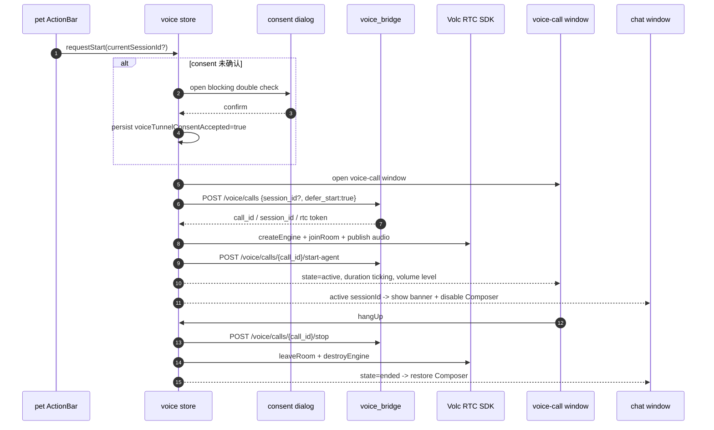

# 桌面端语音通话前端接入 - 技术方案

## 状态

CONFIRMED

## 需求文档

→ [requirement.md](./requirement.md)

## 0. 文档说明

本文档回答 029 需求中的“怎么做”：如何把 007 已验证的 voice_bridge + 火山 RTC Web SDK 拨号流接入 Tauri 桌面端前端。

本文档不重新讨论语音交互形态。项目级姿态已由 [`0005-voice-interaction-form`](../../decisions/0005-voice-interaction-form/README.md) 锁定：V1 显式拨号，不做 always-on 监听；公网穿透必须由用户显式接受。

## 1. 现状分析

### 1.1 已有底座

- `voice_bridge` 已提供控制平面：
  - `POST /voice/calls`
  - `POST /voice/calls/{call_id}/start-agent`
  - `GET /voice/calls/{call_id}`
  - `POST /voice/calls/{call_id}/stop`
- `voice_bridge/smoke/index.html` 已验证浏览器侧拨号流：
  - 获取 RTC 凭证
  - `VERTC.createEngine`
  - `joinRoom`
  - `startAudioCapture`
  - `publishStream`
  - 延迟 `start-agent`
  - 挂断后 `leaveRoom` + `destroyEngine`
- 007 已实现 session 续接与 `channel_change`：拨号传 `session_id` 时后端把同一 session 升级为 `voice`，挂断后降回 `text`。

### 1.2 前端现状

- pet ActionBar 已有稳定分页机制，当前生产按钮 4 个，dev 下 7 个；新增拨号按钮会影响 dev 下分页，必须保留箭头与 chip 宽度稳定。
- chat 窗当前只渲染文字与工具事件，`channel_change` 不进入 MessageList；输入条由 `Composer` 独立控制。
- 028 已落地 Tauri settings facade，支持跨窗口广播和持久化。当前只存 `theme`，可扩展一个非敏感 consent flag。
- 当前 Tauri 多窗口没有 `voice-call` 窗，macOS 也没有 `NSMicrophoneUsageDescription`。

### 1.3 关键风险

- macOS WKWebView 的 WebRTC 能力未在本项目中验证。普通浏览器 smoke 通过不代表 Tauri webview 可用。
- `@volcengine/rtc` npm 包在 Vite/Tauri build 下的兼容性未验证。007 smoke 使用 CDN UMD 包，本期要转 npm + Vite。
- 通话 UI 若复用 bubble 窗，会混淆“主动气泡”和“电话面板”职责；若新增窗口，则需要补 Tauri 多窗口 wiring。

## 2. 总体方案

本期按 “M29.0 兼容性验证 → M29.1 voice 域与状态机 → M29.2 独立通话小窗 → M29.3 pet/chat 接入 → M29.4 权限与验证” 实施。

核心选择：

- **新增前端 voice 域**：集中放 API、RTC SDK 适配、状态机和 UI，不把 WebRTC 细节散进 pet/chat。
- **新增独立 `voice-call` Tauri 小窗**：承载通话面板。pet ActionBar 只保留轻量拨号入口，通话中打开独立电话面板。
- **公网穿透 consent 持久化为非敏感设置**：复用 028 settings facade 增加 `voiceTunnelConsentAccepted`，不新增 settings 页分类，不存凭证、URL 或运行态。
- **M29.0 前置 spike 是实现门槛**：若 WKWebView 或 Vite 打包不通，停止后续 UI 实现，回到方案调整。

## 3. 涉及文件

| 文件路径 | 改动类型 | 说明 |
|---------|---------|------|
| `frontend/package.json` / `pnpm-lock.yaml` | 修改 | 新增并锁定 `@volcengine/rtc`，版本优先对齐 007 smoke 的 `4.66.20` |
| `frontend/vite.config.ts` | 修改 | dev proxy 增加 `/voice` → `127.0.0.1:18900`，方便 web/Tauri dev 同源调用 voice_bridge |
| `frontend/voice-call.html` | 新增 | 通话小窗 HTML entry |
| `frontend/src/pages/voice-call/main.tsx` | 新增 | 通话小窗 React 入口 |
| `frontend/src/pages/voice-call/App.tsx` | 新增 | 电话面板 UI |
| `frontend/src/services/api/voice.ts` | 新增 | voice_bridge HTTP 控制面客户端 |
| `frontend/src/services/voice/rtcClient.ts` | 新增 | 火山 RTC SDK 适配层 |
| `frontend/src/services/voice/types.ts` | 新增 | voice 域类型 |
| `frontend/src/stores/voice.ts` | 新增 | 跨页面复用的 voice 状态机 |
| `frontend/src/stores/voiceStateMachine.ts` | 新增 | 纯函数状态流转，便于单测 |
| `frontend/src/stores/voice.test.ts` | 新增 | 拨号、挂断、错误、重复触发测试 |
| `frontend/src/pages/pet/ActionBar.tsx` | 修改 | 新增拨号按钮，保留分页稳定 |
| `frontend/src/pages/pet/App.tsx` | 修改 | 接入 voice start flow 与 consent dialog |
| `frontend/src/pages/pet/actionBarPaging.test.ts` | 修改 | 补新增按钮后的分页 case |
| `frontend/src/pages/chat/App.tsx` | 修改 | 通话中 banner |
| `frontend/src/pages/chat/components/Composer.tsx` | 修改 | 支持 disabled reason，通话中禁用发送 |
| `frontend/src/lib/settings/index.ts` | 修改 | Settings 增加 `voiceTunnelConsentAccepted` |
| `frontend/src-tauri/src/settings.rs` | 修改 | Rust Settings 增加 consent 字段和 set/get 支持 |
| `frontend/src-tauri/tauri.conf.json` | 修改 | 增加 `voice-call` window、bundle macOS 配置 |
| `frontend/src-tauri/capabilities/default.json` | 修改 | 允许 `voice-call` window 使用默认能力 |
| `frontend/src-tauri/src/lib.rs` | 修改 | `voice-call` 关闭即隐藏；新增 `open_voice_call` / show helper |
| `frontend/src-tauri/Info.plist` | 新增 | macOS 麦克风权限说明 |
| `frontend/src-tauri/Entitlements.plist` | 按 spike 结论新增 | 如 M29.0 发现签名/sandbox 需要麦克风 entitlement，则新增并接入 |
| `docs/requirements/029-desktop-voice-call-frontend/progress.md` | Phase 3 新增 | 实现进度追踪 |

## 4. 数据流



## 5. 模块设计

### 5.1 M29.0 兼容性 spike

在正式接通 UI 前，先完成一个最小验证：

- 安装 `@volcengine/rtc@4.66.20`。
- 在前端建立临时 dev-only 验证入口或隐藏路径，执行最小 SDK 初始化：
  - `import VERTC from "@volcengine/rtc"`
  - `VERTC.createEngine(appId)`
  - `navigator.mediaDevices.getUserMedia({ audio: true })`
  - `engine.startAudioCapture()`
  - 在有真实 voice_bridge / tunnel 环境时跑 `joinRoom`、`publishStream`、`leaveRoom`
- 跑 `pnpm build`，确认 Vite 打包不因 SDK 的 UMD/worker/global 依赖失败。
- 在 macOS Tauri dev webview 中验证麦克风授权弹窗、设备枚举和音频采集。

通过标准：

- npm import 和 Vite build 成功。
- Tauri WKWebView 可触发麦克风权限并拿到音频流。
- 在可用 voice_bridge 环境下，join/publish/leave 行为与 smoke 一致。

失败处理：

- 若 npm 包不能被 Vite 打包，优先尝试动态 import；仍失败则设计回退，不进入产品 UI 实现。
- 若 WKWebView 不支持关键 WebRTC 能力，本需求标记阻塞，另起 spike 或调整技术路线。
- 不回退到产品代码使用 CDN smoke 脚本；CDN 仅保留在 `voice_bridge/smoke/`。

### 5.2 voice_bridge API 客户端

`frontend/src/services/api/voice.ts` 提供薄封装：

```ts
interface StartVoiceCallRequest {
  sessionId?: string;
  persona?: string;
  model?: string;
  deferStart?: boolean;
}

interface StartVoiceCallResponse {
  callId: string;
  sessionId: string;
  state: "pending" | "active" | "stopped" | "error";
  rtcAppId: string;
  roomId: string;
  userId: string;
  token: string;
}
```

实现要求：

- 对外使用 camelCase，内部适配 voice_bridge 的 snake_case。
- `createHttp` 可复用，但 voice_bridge base URL 与 agent_bridge 不同。dev 下走 Vite `/voice` proxy；Tauri build 下直接请求 `http://127.0.0.1:18900`。
- 错误统一转换成用户语言 + 内部 code，UI 不展示技术细节。

### 5.3 RTC SDK 适配层

`frontend/src/services/voice/rtcClient.ts` 是唯一直接 import `@volcengine/rtc` 的地方。

职责：

- 创建和销毁 engine。
- 设备授权与音频采集。
- `joinRoom`、`startAudioCapture`、`publishStream`。
- `leaveRoom`、`destroyEngine`、停止本地 tracks。
- 订阅本地音量 / 错误 / 用户进出房事件，转换成项目内部事件。

约束：

- 不在 React 组件中直接调用 VERTC。
- SDK 事件名和兼容性判断集中在适配层，避免页面散落 `window.VERTC` / `VERTC.events` 分支。
- M29.0 后把 smoke 中有效的事件订阅迁移过来，但日志降级为项目 logger / store state，不直接 `console.log`。

### 5.4 voice 状态机

状态机拆出纯函数，store 只负责副作用。

```ts
type VoiceCallPhase =
  | "idle"
  | "confirming_tunnel"
  | "dialing"
  | "joining_room"
  | "starting_agent"
  | "active"
  | "stopping"
  | "ended"
  | "error";
```

核心状态：

- `phase`
- `callId`
- `sessionId`
- `startedAt`
- `durationMs`
- `volumeLevel`
- `error`
- `consentAccepted`

核心动作：

- `requestStart({ sessionId? })`
- `confirmTunnelConsent()`
- `cancelTunnelConsent()`
- `hangUp()`
- `resetError()`
- `setVolume(level)`

并发约束：

- `idle` / `ended` / `error` 才允许开始新通话。
- `dialing` / `joining_room` / `starting_agent` / `active` 下重复拨号直接忽略并聚焦 `voice-call` 窗。
- `stopping` 下重复挂断忽略。
- 任一中间状态失败，都进入 `error`，并调用 best-effort cleanup。

跨窗口同步：

- 主状态由每个 webview 内的 Zustand store 持有，但通过 Tauri event 广播关键状态 `{callId, sessionId, phase}`。
- pet 发起后打开 `voice-call` 窗；chat 窗收到同 session active state 时显示 banner。
- 若某窗口错过事件，chat 切 session 时可通过 voice store 当前快照兜底。

### 5.5 公网穿透 double check

使用现有 `Dialog` / `Button` UI 封装，在 pet 触发拨号前阻塞。

文案要点：

- 语音通话需要 `voice_bridge` 已在本机运行。
- 火山云需要通过公网 URL 回调本机 voice_bridge。
- 本期不会自动启动 cloudflared，也不会自动管理公网 URL。
- 用户确认后才会请求麦克风权限并发起通话。

持久化：

- `Settings` 增加 `voiceTunnelConsentAccepted: boolean`，默认 `false`。
- 写入 028 settings JSON；这是非敏感偏好，不是凭证管理。
- 不持久化 `VOLC_*`、tunnel URL、`call_id`、room token、当前通话状态。
- 通话面板提供“关闭公网穿透确认”入口，写回 `false`；下次拨号重新 double check。

### 5.6 独立 voice-call 小窗

新增 Tauri window：

```json
{
  "label": "voice-call",
  "url": "voice-call.html",
  "title": "agent-friend · 语音通话",
  "width": 360,
  "height": 520,
  "resizable": false,
  "visible": false,
  "fullscreen": false
}
```

窗口行为：

- pet ActionBar 开始拨号时 `open_voice_call` show + focus。
- 用户关闭窗口时默认隐藏；若正在通话，窗口内关闭按钮触发 hangUp 后隐藏，避免直接销毁导致孤儿通话。
- app 退出或 webview unload 时执行 best-effort hangUp。

UI 方向：

- 参考用户提供截图：头像区域居中、状态文案居中、底部 controls。
- 未拨号或已结束时展示轻量拨号/重试入口。
- 通话中展示时长、本地音量 feedback、麦克风状态、挂断按钮。
- `PhoneOff` / `Mic` / `MessageSquare` 等使用 lucide 图标；交互件使用 `Button`、`TooltipButton`、`Dialog` 等封装组件。
- 所有视觉常量走项目 token / Tailwind token，不使用 arbitrary value 或硬编码色值。

### 5.7 pet ActionBar 接入

- 在按钮数组中新增语音拨号按钮，图标使用 `Phone` 或 `Mic`。
- 生产按钮从 4 个变 5 个，仍不分页。
- dev 按钮从 7 个变 8 个，仍分页；补 `derivePageState` 测试覆盖 8/6。
- 按钮 tooltip：
  - idle：`语音通话`
  - dialing/active：`通话中`
  - unavailable/error：`语音暂不可用`
- 通话中按钮点击聚焦 `voice-call` 窗，不新建 call。

### 5.8 chat banner 与 Composer 禁用

`ChatApp` 增加通话 banner：

- 当前 `currentSessionId` 与 voice store 的 `sessionId` 匹配，且 phase 属于 `dialing` / `joining_room` / `starting_agent` / `active` / `stopping` 时显示。
- banner 文案为“通话中”，可附带时长或“正在使用语音继续这段对话”。
- banner 内可提供“查看通话”按钮，打开 `voice-call` 窗。

`Composer` 增加 props：

```ts
interface ComposerProps {
  disabled?: boolean;
  disabledReason?: string;
}
```

行为：

- disabled 时不发送文本。
- placeholder 改成通话中提示。
- stop 按钮只控制文字流，不负责语音挂断。

不改 `sessionProjection` 的消息投影。本期 `channel_change` 只是 UI 状态信号，不渲染成历史消息。

### 5.9 macOS 权限

新增 `frontend/src-tauri/Info.plist`：

```xml
<key>NSMicrophoneUsageDescription</key>
<string>agent-friend 需要麦克风权限用于你主动发起的语音通话。</string>
```

Tauri v2 会把 `src-tauri/Info.plist` 与自动生成的 bundle 信息合并。

M29.0 若确认签名 / sandbox 需要 entitlements，再新增 `Entitlements.plist` 并在 `tauri.conf.json` 中配置：

```json
{
  "bundle": {
    "macOS": {
      "entitlements": "./Entitlements.plist"
    }
  }
}
```

## 6. 测试策略

自动化测试：

- `voiceStateMachine.test.ts`
  - 状态流转
  - 重复拨号保护
  - cancel consent 不触发拨号
  - 错误进入 cleanup
- `voice.test.ts`
  - mock `voiceApi` 与 `rtcClient`
  - 成功拨号顺序：consent → start call → join/publish → start-agent
  - 挂断顺序：stop call → leave/destroy
  - 中途失败释放资源
- `actionBarPaging.test.ts`
  - 8/6 dev 情况仍分页稳定
- `Composer` / chat banner 轻量组件测试（如现有测试框架容易覆盖）
  - voice active 时 send 不触发
  - voice ended 后恢复

手动 / smoke：

- M29.0 macOS Tauri dev：麦克风授权 + getUserMedia + SDK 初始化。
- 用户本机 voice smoke：启动 agent_bridge、voice_bridge、cloudflared，使用 pet ActionBar 拨号，确认能通话、能挂断、chat banner 正确。
- `pnpm build` 验证 SDK 打包。
- `./scripts/check/run.sh` 全量门禁。

## 7. 影响分析

### 上游影响

- 需要 voice_bridge 仍按 007 契约运行在 `127.0.0.1:18900`。
- 需要用户自行启动公网穿透，并确保 voice_bridge 配置中的 public URL 正确。
- 需要 macOS 用户在系统弹窗中允许麦克风。

### 下游影响

- 后续 voice_bridge sidecar 需求可以复用本期的 consent flag 和 voice UI，不需要重做产品入口。
- 后续凭证管理需求应另行扩展 settings，并为敏感凭证设计安全存储；不得复用本期 consent flag 存敏感信息。
- 后续 V2 形态可以复用 voice store 的拨号/挂断能力，但触发方式另行设计。

### 跨平台影响

- Windows WebView2 的 WebRTC 支持预期优于 WKWebView，但仍需手动 smoke。
- macOS 重点风险是 WKWebView getUserMedia、权限弹窗、Info.plist / entitlement。
- Linux 暂不作为本期实机验收重点，但 build 不应破坏。

### 风险点与处理

| 风险 | 处理 |
|------|------|
| WKWebView WebRTC 不支持或行为异常 | M29.0 先验证，失败即阻塞，不继续堆 UI |
| `@volcengine/rtc` Vite 打包失败 | 先尝试动态 import；仍失败则回到方案设计，不用 CDN 偷渡 |
| voice_bridge 未运行或 public URL 配错 | UI 展示用户语言错误，并提示检查 voice_bridge / 公网穿透 |
| 用户取消公网穿透确认 | 不请求麦克风、不调用 voice_bridge |
| 中途失败留下 RTC 房间或麦克风采集 | best-effort stop + leave + destroy；UI 提示重试 |
| 多入口重复拨号 | store 单例状态机保护，重复触发只聚焦通话窗 |
| ActionBar 新按钮导致分页抖动 | 复用现有 chip 宽度策略并补测试 |

## 8. 实施任务

1. M29.0：安装并验证 `@volcengine/rtc` npm + Vite + Tauri WKWebView。
2. M29.1：新增 voice API、RTC 适配层、状态机和单测。
3. M29.2：新增 `voice-call` HTML entry / Tauri window / 通话面板 UI。
4. M29.3：接入 pet ActionBar、公网穿透 double check、chat banner / Composer 禁用。
5. M29.4：补 macOS `Info.plist` / 可能的 entitlements、测试和 smoke 验证。

## 9. 变更记录

| 日期 | 变更内容 | 是否需要重新实现 |
|------|---------|----------------|
| 2026-06-25 | 创建技术方案（CONFIRMED） | 是 |
