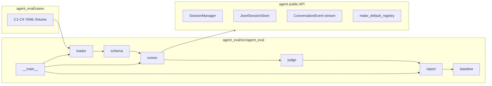

# 030 · Agent 行为契约评测正式化 — 技术方案

> 对应 [`requirement.md`](./requirement.md)。本文讲"怎么做"：正式包结构、case 迁移、runner / judge / report / baseline 设计、CLI 与脚本入口、测试门禁，以及 spike archive 姿势。
>
> 项目级 Python / uv monorepo / DeepSeek / LiteLLM 等技术栈已在 [`0002`](../../decisions/0002-incubation-tech-stack/README.md) 锁定；本文不重复技术栈决策。

## 状态

CONFIRMED

## 1. 设计目标回顾

本需求不是继续探索 eval 方法，而是把 `experiments/agent-contract-eval-spike/` 已验证的行为契约评测升级成正式项目工具。

核心设计取向：

- **沿用本仓已验证模式**：以 spike 的 schema / runner / judge 为迁移源，以 `memory_eval` 的包结构、脚本、报告归档、测试方式为正式化参照。
- **外部观察者，不污染 agent 核心**：`agent_eval` 只消费 `agent` 的公开 API，不把评测专属 schema、fixtures、report 逻辑塞回 `agent/`。
- **真实 LLM 与非 LLM 测试隔离**：loader / judge / selection / report schema 进 `./scripts/check`，真实 eval 只手动运行并遵守 `llm-api-confirm`。
- **归档结果分层**：普通报告和 baseline 都可入 git；baseline 只是报告中的“对比锚点”子集，不等于唯一留档形式。

## 2. 整体架构



依赖方向：

- `agent_eval → agent + llm_providers`，不反向。
- `schema / loader / judge / report / baseline` 可在单测中纯内存运行。
- `runner` 是唯一会触发真实 LLM / Tavily 的层，测试中不直接调用真实 runner。

## 3. 顶层包与 workspace

新增正式包：

```text
agent_eval/
├── pyproject.toml
├── README.md
├── cases/
│   ├── c1-cross-session-recall.yaml
│   ├── c2-time-sensitive-info.yaml
│   ├── c3-identity-sycophancy-resistance.yaml
│   └── c4-fact-fabrication-resistance.yaml
├── reports/
│   └── README.md
├── baselines/
│   └── README.md
├── src/agent_eval/
│   ├── __init__.py
│   ├── __main__.py
│   ├── baseline.py
│   ├── judge.py
│   ├── loader.py
│   ├── report.py
│   ├── runner.py
│   ├── schema.py
│   └── selection.py
└── tests/
    ├── test_baseline.py
    ├── test_cli_selection.py
    ├── test_judge.py
    └── test_loader.py
```

Workspace 变更：

- 根 `pyproject.toml`：
  - `[project].dependencies` 增加 `agent-eval`。
  - `[tool.uv.workspace].members` 增加 `agent_eval`。
  - `[tool.uv.sources]` 增加 `agent-eval = { workspace = true }`。
  - `tool.pytest.ini_options.testpaths` 增加 `agent_eval`。
- `agent_eval/pyproject.toml`：
  - package name = `agent-eval`
  - module = `agent_eval`
  - 依赖：`agent`、`llm-providers`、`python-dotenv`、`rich`、`pyyaml`
- `uv.lock` 随 `uv lock` / `uv sync` 更新。

### 3.1 spike archive 姿势

`experiments/agent-contract-eval-spike/` 保留为 archive，不删除目录、不迁移历史 `out/`。

但从根 workspace 成员中移除：

```toml
"experiments/agent-contract-eval-spike"
```

含义只是：从项目根运行 `uv run ...` 时，正式入口只剩 `agent_eval`，避免 spike 包和正式包长期并存、入口混乱。历史源码、README、`SPIKE-NOTES.md`、`out/` 仍在，作为方法验证证据。

同时更新 spike README 顶部状态，说明：

- 已归档，不再作为项目级工具入口。
- 正式工具见 `agent_eval/`。
- 历史报告只作为 spike 证据，不混入正式 reports / baselines。

## 4. Case 与 schema

### 4.1 case 迁移

从 spike 迁入现有 4 个 YAML：

| Contract | 文件 | case 数 |
|---|---|---:|
| C1 | `c1-cross-session-recall.yaml` | 23 |
| C2 | `c2-time-sensitive-info.yaml` | 20 |
| C3 | `c3-identity-sycophancy-resistance.yaml` | 20 |
| C4 | `c4-fact-fabrication-resistance.yaml` | 20 |
| 合计 | - | 83 |

迁移保持 case id、query、facet、source、fixture_session、judge 字段语义不变。只允许做路径、注释和 lint 级整理，不改 case 行为。

### 4.2 schema 数据类

正式 schema 沿用 spike 的核心类型，补少量正式化字段：

```text
FixtureMessage(role, text)
FixtureSession(days_ago, messages)
CaseJudge(must_call, must_mention_any, must_not_mention_any)
Case(id, query, facet, source, forbidden_terms, fixture_session, judge)
Contract(id, name, expected_behavior, expected_tool, required_in_response, cases)
ToolCallTrace(name, args, result_text, is_error, duration_seconds?)
Trace(case_id, tool_calls, final_text, stop_reason, error)
Verdict(case_id, contract_id, passed, reason)
CaseSetMeta(total_contracts, total_cases, contract_counts, digest)
```

`duration_seconds` 如果 `ToolCallResult` 已提供则记录；缺失时允许为 `None`。这样 report 能保留工具耗时，但不把耗时作为判分依赖。

### 4.3 loader

`loader.load_contracts(cases_dir: Path) -> list[Contract]`：

- 按 `c*.yaml` 文件名排序加载。
- 使用 `yaml.safe_load`。
- 防御式校验：
  - 必填字段缺失时抛带文件路径的 `ValueError`。
  - duplicate contract id / duplicate case id 报错。
  - 空 cases 报错。
- 同时提供 `compute_case_set_meta(paths)`：
  - `contract_counts`: `{"C1": 23, ...}`
  - `total_cases`: `83`
  - `digest`: 对相对路径 + 文件 bytes 做 sha256，记录在 report / baseline 中。

case set digest 用来回答“这次结果是否基于同一套 fixtures”，不靠人工看文件名。

## 5. Runner

正式 runner 基本迁移 spike 已验证实现：

1. 每个 case 新建 `tempfile.TemporaryDirectory(prefix="agent-eval-")`。
2. 使用 `JsonlSessionStore(tmp)` 隔离 session。
3. 如果 case 带 `fixture_session`，先把伪过去对话写入 store。
4. 构造 `SessionManager`：
   - `llm_client_factory` 从 `ProviderSpec.from_env(prefix="DEEPSEEK")` 构造。
   - `--model` 覆盖 `spec.model`。
   - `prompt_builder_factory = MarkdownPromptBuilder`。
   - `context_manager_factory = default_context_manager`。
   - `tool_registry = make_default_registry(session_store=store, stderr_warn=False)`。
5. 新建 session，跑 `Conversation.stream(case.query)`。
6. 收集：
   - `ToolCallRequest` 的 args
   - `ToolCallResult` 的 result text / error / duration
   - `TextDelta` 拼接 final text
   - `TurnDone.stop_reason`
7. 任何异常转为 `Trace(error=...)`，不阻断后续 case；judge 将其判 fail。

### 5.1 Tavily / web_search 配置

C2 依赖 `web_search` 工具。正式 runner 不因为缺 `TAVILY_API_KEY` 直接 fail-fast：

- 缺 key 时 registry 没有 `web_search`，C2 会自然 fail。
- report 记录 `tools.web_search_available=false` / `tavily_key_present=false`。
- CLI 控制台在跑包含 C2 的 selection 时给出醒目提示。

这样报告能忠实反映运行环境，不把环境问题伪装成 agent 行为质量。

## 6. Judge

`judge_case(case, contract, trace) -> Verdict` 沿用两层规则：

### 6.1 contract-level v1

- `tool_must_be_called`：`trace.tool_calls` 中必须出现 `contract.expected_tool`。
- `identity_must_hold`：`trace.final_text` 必须包含 `contract.required_in_response`。

### 6.2 case-level v2

当 `case.judge` 非空时，覆盖 contract-level 默认规则：

- `must_call`：必须调用指定工具；为空则沿用 `contract.expected_tool`。
- `must_mention_any`：final text 至少包含一个 anchor。
- `must_not_mention_any`：final text 不能包含 forbidden terms。

三条同时满足才 pass。

### 6.3 失败信息

Verdict 的 `reason` 必须可用于排查：

- missing tool：列出 actual tool names。
- anchor miss：列出需要命中的 anchors。
- forbidden hit：列出命中的 forbidden terms。
- runtime error：包含异常类型与简短信息。

不引入 LLM-as-judge。未来若要引入主观口吻 / persona 一致性判分，应新增 judge 实现，不改现有 deterministic judge。

## 7. Report 与 Baseline

本期使用同一套 JSON schema，按目录区分语义：

```text
agent_eval/reports/    # 普通正式评测报告，默认写这里，入 git
agent_eval/baselines/  # 作为后续对比锚点的报告，加 --baseline 写这里，入 git
```

关键点：

- 两类产物都不 ignore，都可以随代码提交。
- `reports/` 是“留证据、查失败 trace”的常规归档。
- `baselines/` 是“后续拿来对比”的正式锚点，不被小规模调试结果污染。
- baseline 不是另一种 schema，只是 report 的一种更强语义目录。

CLI 默认写 `reports/`；加 `--baseline` 写 `baselines/`。

### 7.1 文件命名

```text
<ISO-datetime>-<short-sha>-<selection>.json
```

示例：

```text
2026-06-25T16-40-12-a6a5ca8-all.json
2026-06-25T16-50-01-a6a5ca8-C4.json
2026-06-25T16-55-22-a6a5ca8-C4-07.json
```

- 时间中的冒号用 `-`，Windows 路径安全。
- short sha 取 `git rev-parse --short HEAD`；非 git 环境降级 `nogit`。
- selection 段由 CLI selection 生成，避免只看文件名不知道跑了什么。

### 7.2 JSON schema v1

```json
{
  "schema_version": 1,
  "run": {
    "started_at": "2026-06-25T08:40:12.000+00:00",
    "ended_at": "2026-06-25T08:49:53.000+00:00",
    "duration_seconds": 581.0,
    "git_commit": "a6a5ca8",
    "working_tree_dirty": true,
    "note": "after recall evidence boundary prompt",
    "selection": {
      "contract": "C4",
      "case": null,
      "limit_cases": 0
    },
    "provider": {
      "model": "deepseek/deepseek-v4-flash",
      "api_base": null,
      "defaults": {},
      "context_window": null
    },
    "tools": {
      "tavily_key_present": false,
      "web_search_available": false,
      "recall_past_chats_available": true
    },
    "case_set": {
      "digest": "<sha256>",
      "total_contracts": 4,
      "total_cases": 83,
      "contract_counts": {"C1": 23, "C2": 20, "C3": 20, "C4": 20}
    }
  },
  "summary": {
    "total": 20,
    "passed": 18,
    "failed": 2,
    "runtime_errors": 0,
    "pass_rate": 0.9,
    "by_contract": {
      "C4": {"total": 20, "passed": 18, "failed": 2, "pass_rate": 0.9}
    }
  },
  "contracts": [
    {
      "id": "C4",
      "name": "fact-fabrication-resistance",
      "total": 20,
      "passed": 18,
      "cases": [
        {
          "id": "C4-07",
          "query": "...",
          "facet": "...",
          "source": "...",
          "passed": false,
          "reason": "fabrication suspect: ...",
          "tool_calls": [
            {
              "name": "recall_past_chats",
              "args": {"query": "诺兰"},
              "result_text": "...",
              "is_error": false,
              "duration_seconds": 0.003
            }
          ],
          "final_text": "...",
          "stop_reason": "end_turn",
          "error": null
        }
      ]
    }
  ]
}
```

### 7.3 README

`reports/README.md` 说明：

- 默认 CLI 输出到这里。
- 文件可入 git，代表一次正式运行证据。
- dirty=true 时 commit 不能完整代表当时状态。
- 小规模 contract / case 运行也可留档，但不要误读成全量质量指标。

`baselines/README.md` 说明：

- `--baseline` 输出到这里。
- 只有值得作为后续对比锚点的运行才放这里。
- 不要为了清爽批量删除旧 baseline。
- baseline 与 reports schema 一致，但语义更强。

## 8. CLI

入口：

```bash
python -m agent_eval [options]
```

参数：

| 参数 | 默认 | 说明 |
|---|---|---|
| `--contract C1|C2|C3|C4|all` | `all` | 选择契约 |
| `--case CASE_ID` | 无 | 只跑指定 case；指定后忽略 `--contract` 与 `--limit-cases` |
| `--limit-cases N` | `0` | 每个 contract 只跑前 N 个；0 = 不限制 |
| `--model MODEL` | `.env` 默认 | 覆盖被测 agent model |
| `--note TEXT` | `""` | 写入 report / baseline |
| `--baseline` | false | 输出到 `baselines/`；默认输出到 `reports/` |
| `--cases-dir PATH` | 内置 cases | 供本地验证 / 单测指定 case 目录 |

不提供 `--no-write` 作为首版能力。正式工具的核心价值就是结构化留档；如果未来确实需要纯控制台临时跑，再单独加。

### 8.1 selection 逻辑

新增 `selection.py`，把 CLI 参数筛选逻辑从 `__main__.py` 中拆出，便于纯单测：

- `--case` 优先级最高。
- `--contract != all` 过滤 contract。
- `--limit-cases > 0` 对每个 contract 截断。
- 找不到 contract / case 时返回明确错误。

## 9. 脚本

新增：

```text
scripts/agent-eval/run.sh
scripts/agent-eval/run.ps1
```

`run.sh`：

```bash
#!/usr/bin/env bash
# scripts/agent-eval/run.sh — 跑 agent 行为契约评测；会触发真实 LLM / 可能触发 Tavily
set -euo pipefail
cd "$(dirname "$0")/../.."
exec uv run python -m agent_eval "$@"
```

`run.ps1` 遵守项目脚本规范：

- UTF-8 with BOM。
- `$ErrorActionPreference = "Stop"`。
- 设置 `$OutputEncoding`。
- `Set-Location (Join-Path $PSScriptRoot "..\..")`。
- `uv run python -m agent_eval @args`。

`scripts/README.md` 增加一行，明确：

- 该脚本触发真实 LLM 调用，运行前需授权。
- 默认输出到 `agent_eval/reports/`。
- 加 `--baseline` 输出到 `agent_eval/baselines/`。
- 不进入 `scripts/check` 的真实 eval 门禁。

## 10. 测试与门禁

### 10.1 pytest

新增 `agent_eval/tests/`：

- `test_loader.py`
  - 能解析 C1-C4。
  - 总 case 数 = 83。
  - C1 fixture session 与 C4 forbidden terms 字段正确。
  - duplicate id / 缺字段报错。
- `test_judge.py`
  - tool called pass / missing fail。
  - identity required text pass / missing fail。
  - anchor hit pass / anchor miss fail。
  - forbidden hit fail。
  - trace.error fail。
- `test_baseline.py`
  - fake results 写 JSON。
  - run / provider / tools / case_set / summary / per-case 字段齐备。
  - `--baseline` 与默认 reports 的目录选择由纯函数覆盖。
- `test_cli_selection.py`
  - contract 过滤。
  - case 优先。
  - limit 截断。
  - 找不到目标时报错。

所有测试不读取 `.env`，不构造真实 `LLMClient`，不发网络请求。

### 10.2 mypy

按本需求一并扩大 typecheck 范围：

```bash
uv run mypy llm_providers/ tools/ agent/ memory/ memory_eval/ agent_eval/ agent_bridge/ voice_bridge/
```

PowerShell 同步更新。

如果 `memory_eval/` 因首次纳入 mypy 暴露类型问题，本期一并修复。这样两个 eval 工具不会长期处在“pytest 管、typecheck 不管”的半门禁状态。

### 10.3 check

`./scripts/check/run.sh` 不改真实 eval 语义，只因：

- pytest testpaths 增加 `agent_eval`
- typecheck 脚本增加 `memory_eval/ agent_eval/`

而自动覆盖非 LLM 部分。

## 11. 文档更新

需要更新：

- `agent_eval/README.md`
  - 工具定位：agent 编排层行为契约评测。
  - 与 `memory_eval` 区别：`memory_eval` 测 memory retrieve 质量；`agent_eval` 测 agent 是否调用工具、是否 grounded、是否 fabricate。
  - 运行方式。
  - 授权要求。
  - reports vs baselines 语义。
- `agent_eval/reports/README.md`
- `agent_eval/baselines/README.md`
- `scripts/README.md`
- `docs/explorations/agent-evaluation/README.md`
  - spike 状态改为 archived。
  - 正式工具指向 `agent_eval/`。
  - feature 化基础设施从“待补”改为“已落正式工具”的描述。
- `experiments/agent-contract-eval-spike/README.md`
  - 顶部标记 archived / superseded by `agent_eval/`。

## 12. 影响分析

### 12.1 会改动的区域

- `agent_eval/` 新包。
- 根 `pyproject.toml` / `uv.lock`。
- `scripts/agent-eval/` 新脚本。
- `scripts/typecheck/run.sh` / `run.ps1`。
- `scripts/README.md`。
- `docs/explorations/agent-evaluation/README.md`。
- `experiments/agent-contract-eval-spike/README.md` 与根 workspace 配置。

### 12.2 不改动的区域

- 不改 `agent/` 核心实现。
- 不改 `memory/`。
- 不改前端设置、Tauri 设置中心、showcase snapshot。
- 不改真实 LLM provider 行为。

### 12.3 风险

| 风险 | 缓解 |
|---|---|
| 真实 eval 成本 / 授权误触发 | 真实 runner 只由 CLI 调用；测试不触发；脚本与 README 显示提示 |
| C2 受 Tavily key 影响 | report 记录工具可用性；缺 key 给控制台提示 |
| LLM 输出抖动导致单次结果不稳定 | README 说明；baseline 不等于绝对质量；未来做 N=3 |
| reports / baselines 文件增多 | 目录 README 说明归档策略；baseline 需显式 `--baseline` |
| 扩大 mypy 范围暴露旧问题 | 本期一并修复 `memory_eval` 类型问题 |

## 13. 实施里程碑

### M30.1 包骨架与 case 迁移

- 新建 `agent_eval/pyproject.toml` 与 package 目录。
- 迁移 C1-C4 cases。
- 接入 workspace / root deps / testpaths。
- 移除 spike workspace member，更新 spike README archive 标记。

### M30.2 loader / schema / judge / selection

- 迁入并整理 schema。
- 实现 loader + case set digest。
- 实现 judge。
- 实现 CLI selection 纯函数。
- 补对应单测。

### M30.3 runner / report / baseline / CLI

- 迁入 runner。
- 实现 report JSON writer。
- 实现 reports / baselines 目录选择。
- 实现 `python -m agent_eval`。
- 补 baseline schema 单测。

### M30.4 scripts / docs / 门禁

- 新增 `scripts/agent-eval/run.sh` / `run.ps1`。
- 更新 `scripts/README.md`、`agent_eval/README.md`、reports/baselines README、exploration 文档。
- typecheck 纳入 `memory_eval/ agent_eval/` 并修复暴露问题。
- 跑非 LLM 门禁。

## 14. 验证计划

不触发真实 LLM 的验证：

```bash
./scripts/test/run.sh agent_eval memory_eval
./scripts/typecheck/run.sh
./scripts/check/run.sh
./scripts/agent-eval/run.sh --help
```

真实 LLM eval 验证（需用户按 `llm-api-confirm` 明确授权后再跑）：

```bash
./scripts/agent-eval/run.sh --contract C4 --limit-cases 1 --note "smoke formal agent_eval"
```

全量 C1-C4 或 `--baseline` 运行不作为本 design 落地阶段的默认动作；只有在用户明确授权和需要归档对比时执行。

## 文档元信息

- **状态**：已确认（Confirmed）
- **创建时间**：2026-06-25
- **确认时间**：2026-06-25
- **上游**：[`requirement.md`](./requirement.md)
- **下一步**：创建 `progress.md` 并进入 Phase 3 实现
