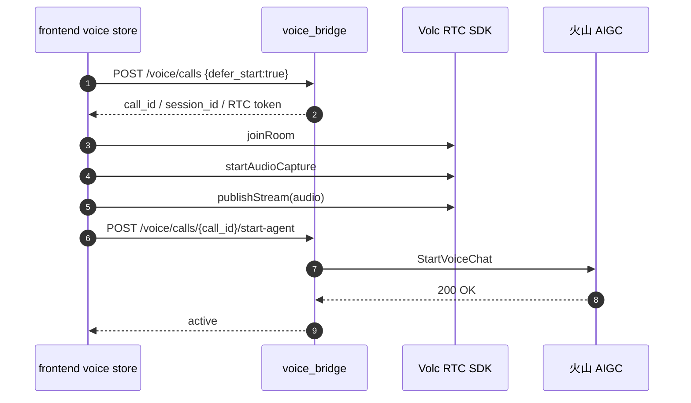
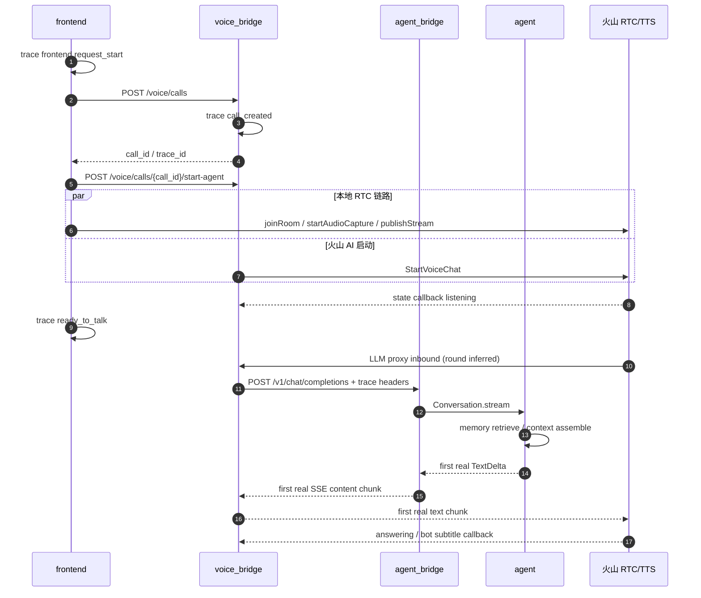
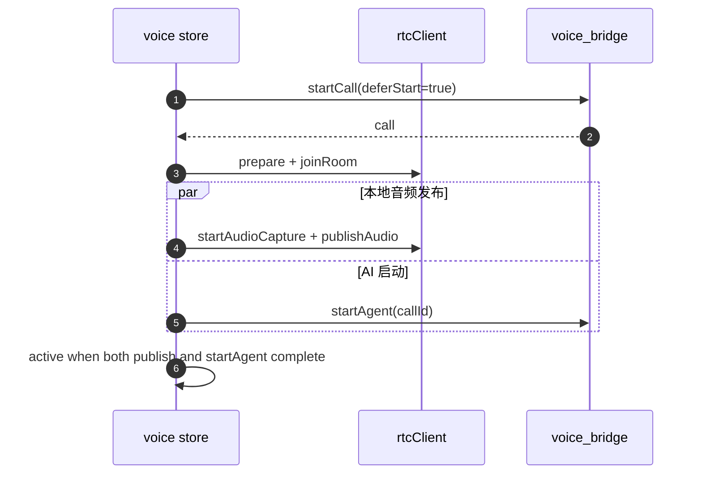

# 031 · voice-call-latency-optimization - 技术方案

## 状态

CONFIRMED

## 需求文档

→ [requirement.md](./requirement.md)

## 0. 文档说明

本文档回答 031 需求中的“怎么做”：如何把桌面端语音通话的冷启动和回复延迟拆清楚，并在不削弱 agent 回答能力的前提下做第一批低风险优化。

本文档不重新讨论语音交互形态。项目级姿态仍以 [0005 voice interaction form](../../decisions/0005-voice-interaction-form/README.md) 为准：语音必须由用户显式触发，不做 always-on 监听；公网穿透必须显式接受。

## 1. 现状分析

### 1.1 已有链路

029 收尾后，桌面端语音通话的启动路径是：



核心代码：

- `frontend/src/stores/voice.ts`：前端拨号状态机与副作用编排。
- `frontend/src/services/voice/rtcClient.ts`：火山 RTC SDK 适配，包含 `joinRoom` / `startAudioCapture` / `publishStream`。
- `voice_bridge/src/voice_bridge/routes/control.py`：`/voice/calls` 与 `/voice/calls/{call_id}/start-agent` 控制面。
- `voice_bridge/src/voice_bridge/rtc/scenes.py`：`StartVoiceChat` request body，包括 state / subtitle callback URL。

### 1.2 已观测瓶颈

issue 028 的最近一次成功通话显示：

| 分段 | 耗时 | 判断 |
|------|------|------|
| `requestStart -> startCall ok` | 1.236s | 可接受，但需持续观测 |
| `startCall ok -> joinRoom start` | 0.850s | 前端准备 / 动态 import / SDK 初始化 |
| `joinRoom start -> joinRoom ok` | 4.906s | 外部 RTC 入房波动 |
| `startAudioCapture ok -> publishStream audio ok` | 21.775s | 最大异常点，疑似 SDK / 设备 / 网络 / 调用顺序 |
| `publishStream -> startAgent ok` | 6.435s | 火山 `StartVoiceChat` 外部耗时，被 publish 串行拖后 |
| `requestStart -> active` | 35.270s | 用户感知冷启动过长 |

同一通话的两轮回复显示：

| 分段 | Round 1 | Round 2 | 判断 |
|------|---------|---------|------|
| `ASR final -> LLM proxy inbound` | 0.520s | 0.459s | ASR 到 voice_bridge 不慢 |
| `LLM proxy inbound -> answering callback` | 8.324s | 9.508s | 需拆成 agent 首文本 / proxy 转发 / 火山 TTS |
| `LLM proxy inbound -> first bot subtitle` | 10.800s | 14.959s | 体感首响偏慢 |
| `ASR final -> first bot subtitle` | 11.320s | 15.418s | 不符合自然通话预期 |

### 1.3 当前观测缺口

现在的日志能看见前端少量 console、voice_bridge `llm proxy inbound`、agent_bridge HTTP 200、火山 state / subtitle callback payload，但缺少几个关键点：

- agent_bridge 收到请求到装配完成的耗时。
- memory retrieve / context assemble 的耗时。
- 首个真实 `TextDelta` 的时间。
- voice_bridge 从 agent_bridge 收到首个可转发真实文本 chunk 的时间。
- 火山收到文本后到 `answering` / 首个 bot subtitle 的耗时。
- 每轮回复的 round id / trace id，只能靠人工按时间近似对齐。

尤其要避免误判：OpenAI SSE encoder 会先发一个空 role chunk，这说明 HTTP/SSE 通道已开始，但不代表用户能听见声音或看见字幕。

### 1.4 设计原则

- **先测准，再优化**：本期先补足端到端分段，优化只做已知低风险点。
- **不削弱回答能力**：不默认禁 memory、禁工具、裁 persona、裁 system prompt。
- **观测不侵入协议**：OpenAI / AG-UI 对外协议保持兼容，trace 信息走日志和内部 header，不改响应 body。
- **并行不破坏状态机**：session 绑定、call 清理、挂断降回 text 的 007 / 029 语义保持不变。
- **外部慢要可解释**：火山、RTC SDK、公网穿透、LLM provider 的波动无法完全控制，但日志要能定位。

## 2. 总体方案

本期按 5 个里程碑实施：

| 里程碑 | 目标 |
|--------|------|
| M31.1 | 建立 latency trace 口径与日志工具，串起前端 / voice_bridge / agent_bridge / agent / 火山回调 |
| M31.2 | 优化冷启动编排，把火山 AI 启动与本地 RTC publish 链路并行化 |
| M31.3 | 补回复链路首文本观测，区分空 SSE chunk、真实文本 delta、火山 answering / subtitle |
| M31.4 | 落地低风险 warmup / preflight，优先处理 memory / jieba 与 RTC 设备冷路径 |
| M31.5 | 增加 gated voice 策略实验与前端细状态，完成测试和 Windows smoke 记录 |

### 2.1 目标数据流



## 3. 涉及文件

| 文件路径 | 改动类型 | 说明 |
|---------|---------|------|
| `frontend/src/services/voice/types.ts` | 修改 | 增加更细的启动 phase / diagnostic / trace 字段 |
| `frontend/src/stores/voiceStateMachine.ts` | 修改 | 增加状态文案与状态分组 |
| `frontend/src/stores/voice.ts` | 修改 | 增加 trace 日志、调整冷启动编排、触发 preflight |
| `frontend/src/services/voice/rtcClient.ts` | 修改 | 拆分 join / capture / publish，可单独计时与并行编排 |
| `frontend/src/pages/voice-call/App.tsx` | 修改 | 展示更细阶段和诊断 |
| `frontend/src/stores/voice.test.ts` | 修改 | 覆盖并发启动、失败清理、状态流转 |
| `frontend/src/stores/voiceStateMachine.test.ts` | 修改 | 覆盖新增 phase label / blocking 判断 |
| `voice_bridge/src/voice_bridge/latency.py` | 新增 | voice_bridge latency 日志 helper |
| `voice_bridge/src/voice_bridge/routes/control.py` | 修改 | 记录控制面事件、`StartVoiceChat` 分段、callback 分段 |
| `voice_bridge/src/voice_bridge/routes/llm_proxy.py` | 修改 | 记录 inbound、上游首字节、首个真实文本 chunk、最后 chunk |
| `voice_bridge/tests/unit/test_latency.py` | 新增 | 真实文本 chunk 判定与日志 helper 单测 |
| `voice_bridge/tests/integration/test_acceptance_criteria.py` | 修改 | 覆盖 start-agent 并发语义、callback 观测不破坏旧 AC |
| `agent_bridge/src/agent_bridge/latency.py` | 新增 | agent_bridge latency 日志 helper |
| `agent_bridge/src/agent_bridge/protocols/openai/routes.py` | 修改 | 记录 inbound / 装配完成，透传 trace header |
| `agent_bridge/src/agent_bridge/protocols/openai/encoders.py` | 修改 | 记录首个真实 `TextDelta` / last chunk |
| `agent/src/agent/conversation.py` | 修改 | 记录 memory retrieve / context assemble 分段 |
| `agent_bridge/tests/test_openai_routes.py` | 修改 | 覆盖 trace header 不影响 OpenAI 协议 |
| `agent/tests/test_channel.py` 或新增测试 | 修改 / 新增 | 覆盖 voice warmup 不改变 channel / memory 语义 |
| `docs/requirements/031-voice-call-latency-optimization/progress.md` | Phase 3 新增 | 实现进度追踪 |
| `docs/issues/028-voice-call-latency-breakdown/README.md` | Phase 3 收尾修改 | 记录 031 结果与剩余瓶颈 |

## 4. Latency Trace 设计

### 4.1 trace 标识

本期使用两个层次的标识：

| 标识 | 来源 | 用途 |
|------|------|------|
| `call_id` | voice_bridge `/voice/calls` 创建 | 串起一次通话冷启动、回调、挂断 |
| `session_id` | agent_bridge session | 串起 agent / memory / 会话事件 |
| `voice_trace_id` | 前端拨号时生成，未传则 voice_bridge 用 `call_id` 兜底 | 串起跨进程日志；不进入公开协议 body |
| `round_seq` | voice_bridge LLM proxy 按同一 call 的 inbound 次数递增 | 串起一轮 ASR final → LLM → TTS |

`round_seq` 采用 voice_bridge 进程内计数，存放在 call registry 的扩展运行态中。它不是持久化数据，进程重启后归零；对 latency 诊断足够。

### 4.2 header 透传

voice_bridge 转发到 agent_bridge 时附加内部 header：

- `X-Agent-Friend-Voice-Trace-Id`
- `X-Agent-Friend-Voice-Call-Id`
- `X-Agent-Friend-Voice-Round-Seq`

这些 header 只在本机进程间使用，不改变 OpenAI request body，不返回给火山。agent_bridge 如果没有这些 header，按普通文本 / OpenAI 请求处理。

### 4.3 日志格式

Python 侧统一使用结构化 key-value 日志，例：

```text
voice_latency event=llm_proxy_inbound call_id=... session_id=... trace_id=... round_seq=2 t_ms=...
voice_latency event=agent_first_text_delta call_id=... session_id=... trace_id=... round_seq=2 elapsed_ms=...
```

前端 console 保持现有风格，但增加固定前缀和同样字段：

```text
[voice][latency] event=rtc_publish_ok callId=... traceId=... elapsedMs=...
```

不新增专门的数据库或 JSONL 文件，继续依赖现有日志文件：

- Windows `%LOCALAPPDATA%/agent-friend/Logs/voice_bridge.log`
- Windows `%LOCALAPPDATA%/agent-friend/Logs/agent_bridge.log`
- Windows `%LOCALAPPDATA%/agent-friend/Logs/memory.log`
- Tauri / frontend 既有日志输出

### 4.4 首个真实文本 chunk 判定

OpenAI SSE 中以下内容不算“真实文本”：

- `delta.role`
- `delta.content == ""`
- 空 choices / usage-only chunk
- tool call delta
- error envelope
- `[DONE]`

只有 `choices[0].delta.content` 为非空字符串时，才记为 `first_real_text_delta` / `first_real_text_chunk`。

voice_bridge 不改变 SSE 内容，只在代理层旁路解析一份 chunk，用于日志判定。解析失败时不阻断转发，只记录 `sse_parse_failed`。

## 5. 冷启动编排

### 5.1 当前问题

前端当前在 `frontend/src/stores/voice.ts` 中串行等待：

1. `voiceApi.startCall({ deferStart: true })`
2. `rtcClient.joinAndPublish(...)`
3. `voiceApi.startAgent(callId)`
4. `phase = active`

这导致 `publishStream` 偶发 20s+ 时，火山 `StartVoiceChat` 也被整体推迟。

### 5.2 新编排

本期将 RTC 适配层拆成显式步骤：

```ts
interface RtcClient {
  prepare(credentials: RtcJoinCredentials): Promise<void>;
  joinRoom(): Promise<void>;
  startAudioCapture(): Promise<void>;
  publishAudio(): Promise<void>;
  cleanup(): Promise<void>;
}
```

前端启动改为：



`startAgent` 的默认提前点选为 **`joinRoom ok` 之后**：

- session / call binding 已完成。
- 用户已经在 RTC 房间中，火山 AI 进房有目标房间。
- 本地 `startAudioCapture` / `publishStream` 即使继续慢，也不会继续阻塞 `StartVoiceChat`。

如果 smoke 发现火山要求用户音频发布后再 `StartVoiceChat` 才稳定，则退回到 `startAudioCapture ok` 后并行；这个退回点写入 progress，不改变需求边界。

### 5.3 active 判定

前端 `active` 不再仅表示 `startAgent ok`，而是表示：

- RTC join 已完成。
- 本地音频 capture / publish 已完成，或 publish 已失败并进入可解释错误。
- `startAgent` 已完成。

为了避免“AI 已在房间但用户还没发布音频”时误导用户，UI 阶段会拆成：

| phase | 用户文案 | 含义 |
|-------|----------|------|
| `dialing` | 正在创建通话 | `/voice/calls` 中 |
| `joining_room` | 正在进入房间 | RTC join 中 |
| `preparing_microphone` | 正在准备麦克风 | capture / publish 中 |
| `connecting_agent` | 正在连接她 | `StartVoiceChat` 中 |
| `active` | 正在听 | 两条链路都就绪 |

### 5.4 失败清理

并行后失败组合变多，清理策略：

- `startAgent` 失败：停止本地 RTC，调用 `stopCall`，phase `error`。
- `publishAudio` 失败：调用 `stopCall`，停止 RTC，phase `error`。
- 用户取消 / 关闭窗口：取消未完成的启动 token，best-effort `stopCall` + `cleanupRtc`。
- `stopCall` 继续保持幂等，后端清理空语音 session 的逻辑保留。

## 6. 回复链路观测

### 6.1 voice_bridge LLM proxy

`voice_bridge/src/voice_bridge/routes/llm_proxy.py` 增加：

- inbound 时间。
- upstream request start。
- upstream response headers received。
- first upstream byte。
- first real text chunk parsed。
- last chunk / done。
- upstream error / parse error。

实现方式：

- `resp.aiter_bytes()` 仍原样 yield。
- 每个 chunk yield 前旁路喂给轻量 SSE parser。
- parser 只做日志判断，不改变 chunk 边界，不重打包。

### 6.2 agent_bridge OpenAI 路由与 encoder

`routes.py` 增加：

- request inbound。
- decode done。
- session bind / transient start done。
- streaming response created。

`encoders.py` 增加：

- encoder start。
- first role chunk sent。
- first `TextDelta` observed。
- first real SSE content chunk sent。
- turn done / error。

注意：`first role chunk sent` 用于协议观测，不作为用户体感首响。

### 6.3 agent / memory 分段

`agent/src/agent/conversation.py` 增加：

- memory retrieve start / done。
- context assemble start / done。
- LLM stream start。
- first `LLMTextDelta` observed。

memory retrieve 本身已经在 `memory.log` 有摘要日志，本期补的是 agent 侧围绕 retrieve 的耗时边界，避免跨日志人工猜。

### 6.4 火山 callback

当前 `voice_bridge/src/voice_bridge/rtc/scenes.py` 已启用：

- `EnableConversationStateCallback = True`
- state callback URL
- subtitle callback URL

本期保持该方向，增强 callback 解析：

- state callback 中识别 `listening` / `thinking` / `answering` / `answerFinish` 等状态（字段名按真实 payload 兼容解析）。
- subtitle callback 中识别用户 ASR final、bot subtitle first。
- 未识别 payload 仍完整记录摘要，避免解析失败丢诊断。

如果火山 payload 格式在不同版本下不稳定，设计退化为“原始 callback 时间 + payload 摘要”，不让解析失败影响通话。

## 7. Warmup / Preflight

### 7.1 memory / jieba warmup

目标：消除首轮语音回复里已观测到的 `jieba` 冷加载放大。

方案：

- 在 agent_bridge runtime 启动时，如果 memory enabled，执行一次轻量 warmup：
  - 调用 memory store 的 tokenize / retrieve 空查询路径，或新增 `Memory.warmup()`。
  - 不写记忆，不改变用户数据。
  - 只触发分词模块加载和 SQLite / FTS 基础连接准备。
- warmup 失败只记录 warning，不阻断 agent_bridge 启动。

倾向新增 `Memory.warmup()`，而不是从 agent_bridge 直接 import memory 内部 `_tokenize`。这样边界更干净，也方便测试。

### 7.2 RTC / microphone preflight

目标：把设备授权 / SDK support check 从“用户等待接通”里尽量前移，但仍遵守显式触发语义。

触发点选为：用户点击语音入口并通过公网穿透 double check 后、真正 `startCall` 前。

理由：

- 用户已经明确进入语音动作，不属于后台监听。
- 可以更早触发系统麦克风授权和 SDK support check。
- 如果用户取消公网穿透确认，不请求麦克风权限。

前端实现：

- `rtcClient.preflight()` 执行 `VERTC.isSupported()` 与必要的设备授权 / 枚举。
- preflight 不加入 RTC 房间，不发布音频，不启动火山 AI。
- preflight 成功后短期缓存结果；缓存只在当前窗口生命周期内有效。

如果 WebView / SDK 无法安全单独 preflight，则退化为拆分日志，不强行做。

## 8. Voice 策略实验

### 8.1 默认行为

默认路径保持 029 当前能力：

- memory 启用状态不变。
- tool registry 不变。
- persona / system prompt 不裁剪。
- context manager 不换。
- model 不换。

### 8.2 实验开关

新增内部实验配置，默认关闭：

- `VOICE_LATENCY_EXPERIMENT_SHORT_REPLY=false`
- `VOICE_LATENCY_EXPERIMENT_MAX_TOKENS=`（空 = 不覆盖）
- `VOICE_LATENCY_EXPERIMENT_DISABLE_TOOLS=false`
- `VOICE_LATENCY_EXPERIMENT_CONTEXT_BUDGET=`（空 = 不覆盖）

这些配置仅用于本期 smoke / 对照，不进入用户 settings UI。

### 8.3 实验约束

- 每个实验开启时必须打日志，包含实验名和生效范围。
- 实验不能改变非 voice channel。
- 实验不能在没有对照数据时转为默认。
- 若实验导致回答明显变短、拒答变多、人格表达变弱，必须回退。

### 8.4 本期推荐实验顺序

1. 只加观测，不开任何策略。
2. 尝试“语音首句更快”的 prompt 微调：提醒先用短自然句开头，再补充细节。
3. 只在 smoke 中测试 `max_tokens` 上限，不默认生效。
4. 工具限制作为最后选项，默认不做。

## 9. 前端状态与 UI

### 9.1 phase 扩展

`VoiceCallPhase` 从：

```ts
"dialing" | "joining_room" | "starting_agent" | "active"
```

扩展为：

```ts
"dialing"
| "preflighting"
| "joining_room"
| "preparing_microphone"
| "connecting_agent"
| "active"
```

`starting_agent` 保留兼容或迁移为 `connecting_agent`。测试覆盖 label 和 blocking 语义。

### 9.2 diagnostic 扩展

`VoiceCallFailureStage` 增加：

- `preflight`
- `rtc_join`
- `rtc_capture`
- `rtc_publish`
- `start_agent`
- `callback_wait`

用户文案仍是自然语言；开发者诊断显示 stage + message。

### 9.3 UI 要求

- voice-call 小窗主文案展示当前阶段。
- 长耗时阶段超过阈值后显示温和提示，如“麦克风还在准备，可能是设备授权或网络慢了一点”。
- 不展示技术栈名、异常栈、火山错误码等内部细节。

## 10. 测试与验证

### 10.1 自动化测试

必须覆盖：

- SSE parser 能识别首个真实文本 chunk，忽略 role / empty content / `[DONE]`。
- trace header 缺失时普通 OpenAI 请求不受影响。
- voice_bridge LLM proxy 旁路解析失败不阻断原始 chunk 转发。
- 前端并行启动中 `startAgent` 和 `publishAudio` 任一失败都能清理。
- 新 phase label / blocking 判断正确。
- `Memory.warmup()` 不写入用户数据，不改变 retrieve 结果。

### 10.2 本地门禁

代码实现完成后跑：

```bash
./scripts/check/run.sh
```

若主要验证环境在 Windows，则按项目惯例补跑：

```powershell
./scripts/check/run.ps1
```

### 10.3 Windows 真链路 smoke

记录至少两次成功通话：

- 一次冷启动。
- 一次同进程热启动。

每次记录：

- `requestStart -> ready_to_talk`
- `ASR final -> first real TextDelta`
- `first real TextDelta -> answering`
- `answering -> first bot subtitle`
- `ASR final -> first bot subtitle`

如果仍超过目标阈值，必须能指出剩余瓶颈属于 RTC / 火山 / LLM provider / 本地代码哪一段。

## 11. 风险与回退

| 风险 | 影响 | 回退 |
|------|------|------|
| `startAgent` 提前后火山 AI 入房不稳定 | 冷启动失败率上升 | 回退到 `startAudioCapture ok` 后启动，保留观测 |
| SSE 旁路解析出错 | 可能影响代理稳定性 | parser 错误吞掉，只记录 warning；原始 chunk 继续转发 |
| preflight 触发麦克风权限时机让用户困惑 | 体验变差 | 只在 double check 后触发；必要时关闭 preflight |
| warmup 意外增加启动耗时 | agent_bridge 启动慢 | warmup 异步 / best-effort，失败或超时不阻断 |
| voice 策略实验削弱回答能力 | 用户体验退化 | 默认关闭；实验只在显式配置下生效 |

## 12. 实施任务

Phase 3 生成 `progress.md` 时按以下任务拆分：

- M31.1 latency trace helper 与字段口径
- M31.2 voice_bridge control / callback / LLM proxy 观测
- M31.3 agent_bridge / agent / memory 首文本和 retrieve 观测
- M31.4 前端 RTC 步骤拆分与冷启动并行化
- M31.5 preflight / warmup
- M31.6 gated voice 策略实验配置
- M31.7 UI 状态细化
- M31.8 自动化测试、Windows smoke、issue 028 回填

## 变更记录

| 日期 | 变更内容 | 是否需要重新实现 |
|------|---------|----------------|
| 2026-06-26 | 创建技术方案（CONFIRMED） | 是 |
