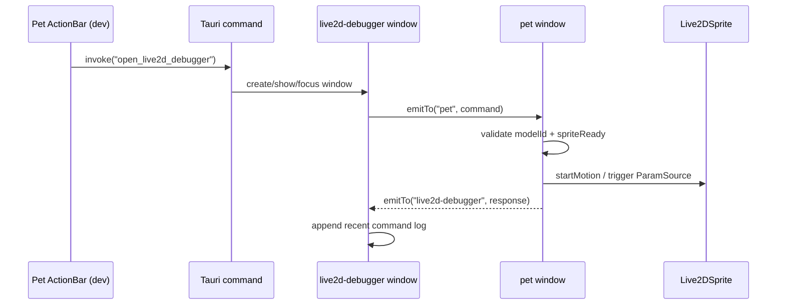

# 033 · 桌宠 Live2D 调试器 - 技术方案

## 状态

<!-- 草稿（Draft） | 已确认（Confirmed） -->
已确认（Confirmed）

---

## 需求文档

→ [requirement.md](./requirement.md)

---

## 1. 设计目标回顾

本期把 [exploration · pet-live2d-debugger](../../explorations/pet-live2d-debugger/README.md) 收敛成一个 **debug build 专属的 Live2D motion / feedback 调试窗口**：

- 从桌宠 ActionBar dev-only 分页打开调试窗口。
- 调试窗口展示当前模型 motion catalog，并向 pet 窗真实 Live2D sprite 发送播放命令。
- 支持一键触发现有点击反馈、参数反馈 only、回 idle、idle 随机动作。
- 调试窗口记录最近命令结果，辅助人工观察 motion 语义。
- release build 用户不可触达。

设计关键约束：**首版只服务当前 Hiyori，但不能把调试器写死成 Hiyori-only**。motion catalog、命令协议、UI 分区都按“当前模型”抽象，为后续模型切换 / 模型 trial / 参数源扩展留接缝。

---

## 2. 总体方案

### 2.1 数据流



### 2.2 核心选择

| 设计点 | 选择 | 原因 |
| --- | --- | --- |
| 调试窗口 | debug build 动态 `WebviewWindowBuilder` 创建 | release 不在 `tauri.conf.json` 常驻隐藏窗口；边界干净 |
| 命令通道 | 前端 Tauri event：`emitTo("pet", ...)` + `listen(...)` | Rust 只负责开窗；Live2D 命令协议在前端类型层演进 |
| 执行者 | pet 窗真实 Live2D sprite | 观察对象与桌面真实状态一致，不维护第二个预览实例 |
| catalog 来源 | 首版从 `PET_LIVE2D_CONFIG.modelPath` 读取 `model3.json` 并投影 | 能覆盖 Hiyori；后续模型切换只替换“当前模型配置”来源 |
| 业务核心 | 抽 `executeLive2DDebugCommand` 纯执行器 | Tauri event 是薄壳，成功 / 错误路径可用 fake sprite 单测 |
| UI 形态 | 工作台窗口：Motion / 快捷 / 参数源 / 日志 | 窄而直观，后续模型切换 / 参数编辑能自然扩展 |

---

## 3. 文件清单

### 3.1 新增文件

| 文件 | 说明 |
| --- | --- |
| `frontend/live2d-debugger.html` | 新窗口 HTML entry。 |
| `frontend/src/pages/live2d-debugger/main.tsx` | React entry，挂载 `Live2DDebuggerApp`。 |
| `frontend/src/pages/live2d-debugger/App.tsx` | 调试窗口 UI：模型状态、motion 控制、快捷区、参数源区、日志区。 |
| `frontend/src/pages/live2d-debugger/debugLog.ts` | 最近命令日志 reducer，内存态保留固定条数。 |
| `frontend/src/pages/live2d-debugger/debugLog.test.ts` | 日志 reducer 单测。 |
| `frontend/src/pet/live2dDebugger/protocol.ts` | 调试命令 / 响应 / catalog 类型、事件名、priority 映射类型。 |
| `frontend/src/pet/live2dDebugger/catalog.ts` | 从当前模型配置 + `model3.json` 投影通用 `Live2DMotionCatalog`。 |
| `frontend/src/pet/live2dDebugger/catalog.test.ts` | catalog 投影单测。 |
| `frontend/src/pet/live2dDebugger/executor.ts` | pet 侧命令执行器：校验 modelId / sprite ready / group index，执行 sprite 或参数源动作。 |
| `frontend/src/pet/live2dDebugger/executor.test.ts` | fake sprite + fake actions 覆盖命令成功 / 错误 / model mismatch。 |
| `frontend/src/pages/pet/useLive2DDebugBridge.ts` | pet 窗 hook：listen command，调用 executor，emit response。 |

### 3.2 改造文件

| 文件 | 改动 |
| --- | --- |
| `frontend/src-tauri/src/lib.rs` | debug build 下新增 `open_live2d_debugger` command；动态创建 / show / focus `live2d-debugger` 窗口。 |
| `frontend/vite.config.ts` | build input 新增 `live2d-debugger.html`。 |
| `frontend/src/pages/pet/ActionBar.tsx` | dev-only 按钮新增“Live2D 调试器”，图标用 lucide，透传 `onOpenLive2DDebugger`。 |
| `frontend/src/pages/pet/actionBarPaging.test.ts` | dev 默认按钮数从 8 变 9，补分页覆盖。 |
| `frontend/src/pages/pet/App.tsx` | 新增 `openLive2DDebugger` invoke；调用 `useLive2DDebugBridge(...)`；把 ActionBar 新 callback 传入。 |
| `frontend/src/pages/pet/usePetInteractions.ts` | 返回 debug controls：真实点击反馈、参数反馈 only、idle 快捷触发所需的函数；真实点击路径保持不变。 |
| `frontend/src/pet/live2dConfig.ts` | 不改语义；catalog 模块读取其 `modelName` / `modelPath` / `motionGroups` / `motionNo`。如需新增只读 helper，保持向后兼容。 |

### 3.3 不动文件

- 018 状态机：`frontend/src/stores/petState.ts` / `petStatePolicy.ts`
- 024 参数源实现本体：`GazeSource` / `DragReactionSource` / `TapReactionSource` 的参数算法不改
- 016 bubble window 与 `petBubble` store / policy
- chat / settings / memory inspector / voice-call 页面逻辑

---

## 4. Tauri 窗口设计

### 4.1 动态 dev-only 窗口

新增 command 只在 debug build 注册：

```rust
#[cfg(debug_assertions)]
#[tauri::command]
fn open_live2d_debugger(app: tauri::AppHandle) -> Result<(), String> {
    if app.get_webview_window("live2d-debugger").is_none() {
        tauri::WebviewWindowBuilder::new(
            &app,
            "live2d-debugger",
            tauri::WebviewUrl::App("live2d-debugger.html".into()),
        )
        .title("agent-friend · Live2D 调试器")
        .inner_size(460.0, 680.0)
        .min_inner_size(380.0, 520.0)
        .resizable(true)
        .visible(false)
        .build()
        .map_err(|e| e.to_string())?;
    }
    show_and_focus(&app, "live2d-debugger")
}
```

注册位置：

- `#[cfg(debug_assertions)]` 的 `invoke_handler` 加 `open_live2d_debugger`
- release `invoke_handler` 不注册该 command
- `on_window_event` 不强制拦 close：调试窗口关闭后销毁即可，下次 command 重新创建；如果实施中发现 Tauri close 后 label 状态不稳定，再改成与 `memory-inspector` 一样 close 即 hide

### 4.2 为什么不写进 `tauri.conf.json`

静态窗口会让 release build 也携带一个隐藏窗口配置；即使入口隐藏，配置层仍存在产品不可见的工具窗口。动态窗口 + debug command gate 更贴合需求里的“生产用户不可触达”，也方便后续把调试器迁移为更独立的开发工具。

---

## 5. 调试协议

### 5.1 事件名

```ts
export const LIVE2D_DEBUGGER_COMMAND_EVENT = "live2d-debugger://command";
export const LIVE2D_DEBUGGER_RESPONSE_EVENT = "live2d-debugger://response";
export const LIVE2D_DEBUGGER_WINDOW_LABEL = "live2d-debugger";
export const PET_WINDOW_LABEL = "pet";
```

调试窗口发命令：

```ts
await emitTo(PET_WINDOW_LABEL, LIVE2D_DEBUGGER_COMMAND_EVENT, command);
```

pet 窗回响应：

```ts
await emitTo(
  LIVE2D_DEBUGGER_WINDOW_LABEL,
  LIVE2D_DEBUGGER_RESPONSE_EVENT,
  response,
);
```

每条 command 带 `requestId`，调试窗口用它把 pending 状态与 response 对齐。

### 5.2 类型结构

```ts
export interface Live2DModelRef {
  /** 稳定模型标识；首版由 `${modelName}:${modelPath}` 派生。 */
  modelId: string;
  modelName: string;
  modelPath: string;
}

export interface Live2DMotionEntry {
  group: string;
  index: number;
  file: string;
}

export interface Live2DMotionCatalog {
  model: Live2DModelRef;
  groups: Array<{ name: string; motions: Live2DMotionEntry[] }>;
  defaults: {
    idleGroup: string | null;
    idleIndex: number;
    tapGroup: string | null;
    tapIndex: number;
  };
}

export type Live2DDebugPriority = "idle" | "normal" | "force";

export type Live2DDebugCommand =
  | { kind: "queryCatalog"; requestId: string }
  | {
      kind: "playMotion";
      requestId: string;
      modelId: string;
      group: string;
      index: number;
      priority: Live2DDebugPriority;
    }
  | { kind: "triggerTapFeedback"; requestId: string; modelId: string }
  | { kind: "triggerTapParamsOnly"; requestId: string; modelId: string }
  | { kind: "playIdle"; requestId: string; modelId: string }
  | { kind: "playRandomIdle"; requestId: string; modelId: string };

export type Live2DDebugResponse =
  | {
      requestId: string;
      ok: true;
      kind: Live2DDebugCommand["kind"];
      catalog?: Live2DMotionCatalog;
      message: string;
    }
  | {
      requestId: string;
      ok: false;
      kind: Live2DDebugCommand["kind"];
      code:
        | "sprite_not_ready"
        | "model_mismatch"
        | "group_not_found"
        | "motion_not_found"
        | "motion_failed"
        | "catalog_failed"
        | "skipped_by_phase";
      message: string;
    };
```

### 5.3 模型切换接缝

首版只有 Hiyori，但命令仍带 `modelId`：

- 调试窗口加载 catalog 后保存当前 `model.modelId`
- `playMotion` / 快捷命令都带这个 `modelId`
- pet executor 执行前重新读取当前 catalog 的 `modelId`
- 不一致则返回 `model_mismatch`

未来加入模型切换时，这个 guard 可以避免旧窗口 / 旧 pending 命令打到新模型上；调试窗口只需要刷新 catalog，不需要改变协议语义。

---

## 6. Catalog 设计

### 6.1 首版实现

`catalog.ts` 提供：

```ts
export async function loadCurrentMotionCatalog(
  config = PET_LIVE2D_CONFIG,
): Promise<Live2DMotionCatalog>;

export function buildMotionCatalogFromModel3(
  config: PetLive2DConfig,
  model3: unknown,
): Live2DMotionCatalog;
```

首版流程：

1. `fetch(PET_LIVE2D_CONFIG.modelPath)` 读取 `Hiyori.model3.json`
2. 解析 `FileReferences.Motions`
3. 投影为 `groups[]`
4. `file` 保留 model3 中的相对路径
5. `defaults` 来自 `PET_LIVE2D_CONFIG.motionGroups` / `motionNo`
6. `modelId = `${modelName}:${modelPath}``

Hiyori 当前会得到至少：

- `IdleLoop` group
- `Idle` group
- `TapBody` group

### 6.2 不从 UI 写死 Hiyori

调试窗口不出现类似 `const groups = ["IdleLoop", "Idle", "TapBody"]` 的硬编码。UI 全部从 catalog 渲染：

- group select 的选项来自 `catalog.groups`
- motion index select 的选项来自当前 group 的 `motions`
- 默认按钮读取 `catalog.defaults`
- 日志记录 `modelName / group / index / file`

如果未来当前模型变成其他 model3，只要 catalog 能投影，UI 不需要改。

---

## 7. Pet 侧执行器

### 7.1 执行边界

`executor.ts` 不直接依赖 React / Tauri event：

```ts
export interface Live2DDebugExecutorEnv {
  getSprite: () => Live2DSprite | null;
  getSpriteReady: () => boolean;
  getCatalog: () => Promise<Live2DMotionCatalog>;
  getPhase: () => PetPhase;
  actions: {
    triggerTapFeedback: () => "played" | "skipped_by_phase";
    triggerTapParamsOnly: () => "played" | "skipped_by_phase";
  };
  random: () => number;
}

export async function executeLive2DDebugCommand(
  command: Live2DDebugCommand,
  env: Live2DDebugExecutorEnv,
): Promise<Live2DDebugResponse>;
```

这样可以用 fake sprite 单测：

- sprite not ready
- model mismatch
- group 不存在
- index 越界
- `startMotion` reject
- tap 快捷被 speaking phase 跳过
- random idle 从 catalog 候选中选择

### 7.2 command 行为

| command | 行为 |
| --- | --- |
| `queryCatalog` | 读取并返回当前 catalog，不要求 sprite ready。 |
| `playMotion` | 校验 modelId / group / index / sprite ready 后调用 `sprite.startMotion({ group, no: index, priority })`。 |
| `triggerTapFeedback` | 调用 024 现有真实点击路径对应的 debug control，等价用户点击；speaking 时沿现有规则跳过。 |
| `triggerTapParamsOnly` | 只触发 `TapReactionSource.fire()`，不调用 `startMotion`；speaking 时同样跳过，避免和 lip-sync 抢 `ParamMouthOpenY`。 |
| `playIdle` | 播放 catalog defaults 中的 idle group / index。 |
| `playRandomIdle` | 优先从默认 idle group 里随机选 motion；默认 group 不存在时退到第一个非空 group；失败返回可见错误。 |

### 7.3 priority 映射

`protocol.ts` 定义调试层 priority 枚举，executor 内映射到 `easy-live2d.Priority`：

| 调试值 | easy-live2d |
| --- | --- |
| `idle` | `Priority.Idle` |
| `normal` | `Priority.Normal` |
| `force` | `Priority.Force` |

UI 默认选 `force`，确保调试动作立即覆盖当前 idle，满足“快速看清动作”的目标；开发者可切回 `normal` / `idle` 观察自然队列效果。

---

## 8. `usePetInteractions` 接缝

当前真实点击逻辑在 `usePetInteractions.onSlotClick` 内部：

```ts
if (phase === "speaking") return;
tap.fire();
sprite.startMotion({ group: tapGroup, no: tapNo, priority: Priority.Normal });
```

本期把它拆成可复用函数，但保持真实点击行为不变：

```ts
export interface PetInteractions {
  onSlotClick: (e: PIXI.FederatedPointerEvent) => void;
  onSlotDragMove: (vx: number, vy: number) => void;
  debugControls: {
    triggerTapFeedback: () => "played" | "skipped_by_phase";
    triggerTapParamsOnly: () => "played" | "skipped_by_phase";
  };
}
```

实现约束：

- `onSlotClick` 继续调用 `triggerTapFeedback()`，所以真实点击路径与调试路径共用同一段逻辑
- `triggerTapParamsOnly()` 只 `tap.fire()`，不调 `sprite.startMotion`
- 两者都保留 speaking gate，避免调试时打断输出嘴动
- 不暴露 `TapReactionSource` 实例给 `PetApp` 之外的调用方

---

## 9. Pet bridge Hook

`useLive2DDebugBridge.ts` 挂在 `PetApp`：

```ts
useLive2DDebugBridge({
  spriteRef,
  spriteReady,
  debugControls,
  getPhase: () => usePetStateStore.getState().phase,
});
```

hook 职责：

1. dev build 下注册 `listen<Live2DDebugCommand>(LIVE2D_DEBUGGER_COMMAND_EVENT, ...)`
2. 每条命令调用 `executeLive2DDebugCommand`
3. `emitTo("live2d-debugger", LIVE2D_DEBUGGER_RESPONSE_EVENT, response)`
4. cleanup 用现有 `safeUnlisten` 模式，兼容 StrictMode / hot reload stale listener

release build 下该 hook 可直接 no-op；如果文件仍被打包，内部用 `if (!import.meta.env.DEV) return` 防止监听。

---

## 10. 调试窗口 UI

### 10.1 布局

单窗口工作台，不做 landing：

```text
┌───────────────────────────────┐
│ 当前模型: hiyori   ready/状态  │
├──────────── Motion ───────────┤
│ group select                  │
│ motion select                 │
│ priority segmented/select     │
│ [Play]                        │
├──────────── 快捷 ─────────────┤
│ [Tap] [Params only] [Idle]     │
│ [Random idle]                 │
├──────────── 日志 ─────────────┤
│ 14:02:11 play Idle[4] ok      │
│ 14:02:16 play Foo[0] failed   │
└───────────────────────────────┘
```

### 10.2 组件与 token

- 交互件复用 `@/components/ui`：`Button`、`Select`、`Input`（如需要 index 手输）、`ScrollArea`、`Badge`、`Separator`、`TooltipButton`
- 图标用 lucide：ActionBar 入口可用 `SlidersHorizontal` 或 `WandSparkles`
- 不写原生 `<button>` / `<input>`；不新增 shadcn 组件
- 不硬编码颜色 / 字号 / 间距 / 圆角；使用现有 token utility class
- 日志是调试信息，不持久化；默认保留最近 50 条

### 10.3 初始化行为

窗口 mount 后：

1. 生成 `requestId`
2. `emitTo("pet", queryCatalog)`
3. 收到 catalog 后填充 group / motion 控件
4. 默认选择 `catalog.defaults.tapGroup/index`（便于一打开就看点击动作）或 `idleGroup/index`，具体实施时按体感选一个更方便的默认
5. 如果 pet 窗未 ready，显示错误日志，允许手动刷新 catalog

---

## 11. 验证策略

### 11.1 自动化

| 覆盖点 | 测试 |
| --- | --- |
| catalog 投影 | `catalog.test.ts`：给 model3 fixture，断言 group / index / file / defaults / modelId |
| executor 成功路径 | fake sprite，断言 `startMotion` 参数 group / no / priority |
| executor 错误路径 | sprite null、not ready、model mismatch、group missing、index missing、startMotion reject |
| tap debug controls | `usePetInteractions` 相关测试或 executor fake actions，断言 feedback 与 params-only 分流 |
| 日志 reducer | append / cap 50 / pending response 对齐 |
| ActionBar 分页 | 新增按钮后 dev 按钮数 9/6 仍分页稳定 |

### 11.2 手动 / 视觉

- `./scripts/check/run.sh` 全绿
- dev build 打开 pet → ActionBar dev 分页 → Live2D 调试器窗口
- 在真实 Tauri 桌面端试：
  - `IdleLoop` / `Idle` / `TapBody` 任意合法 motion 可播放
  - priority = `force` 时能立即覆盖 idle
  - 点击反馈与真实点击桌宠效果一致
  - 参数反馈 only 不播放 motion，只显示脸红 / 嘴型参数叠加
  - 非法 index 有日志错误且窗口不崩
- 回报视觉路径标注 `desktop screenshot` / `desktop DOM via CDP` / `not verified`

### 11.3 不跑真实 LLM

本期验收不需要触发聊天或真实 LLM。若人工顺手验证 chat/push 相关路径，需按既有 `llm-api-confirm` 授权流程单独确认。

---

## 12. 风险与处理

| 风险 | 影响 | 处理 |
| --- | --- | --- |
| 动态窗口 close 后 label 生命周期与预期不一致 | 再次打开失败 | 先按 close 销毁实现；若撞到 Tauri label 残留，再改成 close 即 hide |
| model3 fetch 在 Tauri dev / build 路径不一致 | catalog 加载失败 | 使用 public 绝对路径 `PET_LIVE2D_CONFIG.modelPath`；失败显示日志并保留刷新按钮 |
| 调试 motion 覆盖状态机 motion | 观察时状态短暂偏离 | dev-only 可接受；executor 不改 store，只调 sprite motion；下一次状态机事件自然接管 |
| 参数反馈 only 与 lip-sync 抢 mouth 参数 | speaking 时嘴型干扰 | speaking gate 跳过 params-only，日志返回 `skipped_by_phase` |
| 后续模型切换需要更多 metadata | 首版 catalog 字段不够 | `Live2DModelRef` 保留 `modelId/modelName/modelPath`；后续可加 `source/type/license` 可选字段，不破坏当前命令 |

---

## 13. 变更记录

| 日期 | 变更内容 | 是否需要重新实现 |
|------|---------|----------------|
| 2026-06-27 | 初版技术方案：动态 dev-only Tauri 窗口 + 前端 event 命令通道 + pet 真实 sprite executor + 当前模型 catalog 抽象；显式保留后续 Live2D 模型切换接缝。 | 是 |
