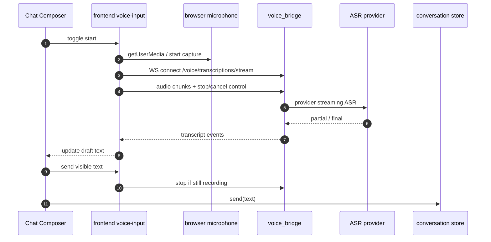

# Chat Composer 语音输入 - 技术方案

## 状态

CONFIRMED

## 需求文档

-> [requirement.md](./requirement.md)

## 0. 文档说明

本文档回答 034 需求中的“怎么做”：如何在 Chat Composer 中接入开关式语音输入，让用户点击麦克风开始录音、再次点击停止，并在录音期间优先边说边出字。

本文档不重新讨论语音交互形态。项目级姿态仍以 [0005 voice interaction form](../../decisions/0005-voice-interaction-form/README.md) 为准：语音必须显式触发，不做 always-on 监听。本需求也不复用 029/031 的语音通话链路，不创建 call，不触发 `channel_change`。

## 1. 现状分析

### 1.1 Chat Composer

当前输入条在 `frontend/src/pages/chat/components/Composer.tsx` 中使用 `@tdesign-react/chat` 的 `ChatSender`。

几个关键现状：

- Composer 当前是**不受控**使用：TDesign web component 自己维护输入状态，提交时从 `onSend.detail.value` 取值。
- 这不是偶然选择。18 号修复里曾说明：React `value + onChange` 受控模式与 TDesign web component 的 change 事件同步在部分场景下不稳定，导致输入框聚焦但打字不更新 React state。
- Composer 已有 IME guard：在 host element capture phase 拦截 composition 中的 Enter，避免中文 / 日文候选词确认被误发送。
- `ChatSender` 自身支持 `value` / `defaultValue` / `onChange` / `actions` / `readyToSend`。因此可以做程序化写入，但必须控制影响面，不能简单把整个 Composer 改成普通 React controlled textarea。

### 1.2 现有语音前端

029 / 031 已有语音通话前端：

- `frontend/src/stores/voice.ts`：语音通话状态机，包含拨号、RTC 入房、麦克风采集、挂断、跨窗口状态同步。
- `frontend/src/services/voice/rtcClient.ts`：火山 RTC SDK 适配层，能触发麦克风权限、采集音频、发布 RTC audio stream。
- `frontend/src/pages/voice-call/App.tsx`：通话小窗 UI，已有音量反馈、麦克风状态和通话状态文案。

这些可以复用“麦克风反馈体感”和少量工具函数，但不能直接复用通话 store。语音输入不应打开 `voice-call` 窗、不应 join RTC、不应调用 `/voice/calls`。

### 1.3 voice_bridge

`voice_bridge` 当前职责是语音通话控制平面 + LLM 入站代理：

- `voice_bridge/src/voice_bridge/routes/control.py`：`/voice/calls`、`/voice/calls/{call_id}/start-agent`、callback、stop。
- `voice_bridge/src/voice_bridge/rtc/scenes.py`：组装 `StartVoiceChat`，其中包含火山 ASR / TTS 参数。
- `voice_bridge/src/voice_bridge/app.py`：已有文件日志链路，生产环境会写入 `voice_bridge.log`。
- `voice_bridge/src/voice_bridge/latency.py`：已有 `voice_latency` key-value 日志格式和 SSE 文本观察 helper。

这说明 `voice_bridge` 适合继续承接 ASR 相关能力，但新增的转写接口应独立于通话控制面。

### 1.4 关键风险

| 风险 | 影响 |
|------|------|
| 火山实时 ASR 协议 / SDK 接入细节未在仓库内验证 | 不能在设计里凭空写死上游帧格式 |
| TDesign `ChatSender` 受控模式历史上不稳 | ASR 写入可能破坏用户手打和 IME 行为 |
| 浏览器录音格式与 ASR 上游要求不一致 | 可能需要重采样 / 转码 / AudioWorklet |
| 用户在 partial 阶段直接发送 | 可能发送尚未被 final 修正的文本 |
| 日志如果记录正文 | 会把用户口述内容写入本地日志，增加隐私风险 |

## 2. 总体方案

本需求新增一条与语音通话并行的语音输入链路：



核心边界：

- 前端新增 `voice-input` 域，和 `voice` 通话域并列。
- 前后端之间先定义项目自己的转写事件协议，供应商 ASR 只藏在 `voice_bridge` adapter 内部。
- 第一版交互是“点击开始 / 点击停止”的开关式录音，不做按住说话。
- 第一版文本插入规则是追加到当前输入末尾；保留未来光标位置插入的接口口子。
- 日志默认不记录 transcript 正文，只记录长度、阶段、trace、耗时和错误码。

## 3. 涉及文件

| 文件路径 | 改动类型 | 说明 |
|---------|---------|------|
| `frontend/src/pages/chat/components/Composer.tsx` | 修改 | 接入语音按钮、draft adapter、ASR 文本追加、发送时停止录音 |
| `frontend/src/pages/chat/components/VoiceInputAction.tsx` | 新增 | Composer 内的麦克风 / 停止按钮和状态反馈 |
| `frontend/src/services/api/voiceInput.ts` | 新增 | 连接 `voice_bridge` transcription WebSocket 的客户端 |
| `frontend/src/services/voiceInput/types.ts` | 新增 | 语音输入事件、状态、错误、trace 类型 |
| `frontend/src/services/voiceInput/recorder.ts` | 新增 | 麦克风采集、音量采样、音频 chunk 输出 |
| `frontend/src/stores/voiceInput.ts` | 新增 | 语音输入状态机和副作用编排 |
| `frontend/src/stores/voiceInputStateMachine.ts` | 新增 | 纯函数：状态、按钮可用性、文案 |
| `frontend/src/stores/voiceInput.test.ts` | 新增 | 开始/停止/取消/partial/final/发送中停止的测试 |
| `frontend/src/stores/voiceInputStateMachine.test.ts` | 新增 | 状态流转与文案测试 |
| `frontend/src/styles/vendor/tdesign-chat.css` | 修改 | 必要时补 Composer action / 状态样式覆盖 |
| `voice_bridge/src/voice_bridge/assembly.py` | 修改 | Runtime 增加 ASR adapter |
| `voice_bridge/src/voice_bridge/routes/transcription.py` | 新增 | `/voice/transcriptions/stream` WebSocket 路由 |
| `voice_bridge/src/voice_bridge/asr/types.py` | 新增 | ASR adapter 输入 / 输出事件类型 |
| `voice_bridge/src/voice_bridge/asr/provider.py` | 新增 | ASR adapter interface + fake / fallback 组合 |
| `voice_bridge/src/voice_bridge/asr/volc.py` | 新增 | 火山 ASR adapter；具体协议以实现前官方文档 / spike 为准 |
| `voice_bridge/src/voice_bridge/errors.py` | 修改 | 语音输入相关错误码与用户文案 |
| `voice_bridge/src/voice_bridge/settings.py` | 修改 | 如上游 ASR 需要新增配置，挂在 voice_bridge settings |
| `voice_bridge/tests/unit/test_transcription_route.py` | 新增 | WebSocket 路由、事件协议、错误分支 |
| `voice_bridge/tests/unit/test_asr_provider.py` | 新增 | adapter 行为、partial/final、取消、日志字段 |
| `docs/requirements/034-chat-composer-voice-input/progress.md` | Phase 3 新增 | 实现进度追踪 |

## 4. 前后端事件协议

### 4.1 连接

前端连接：

```text
ws://127.0.0.1:18900/voice/transcriptions/stream?trace_id=<id>
```

dev 下通过 Vite proxy 走同源 `/voice/transcriptions/stream`；生产 Tauri 走 `127.0.0.1:18900`，与现有 `voiceApi` base URL 保持一致。

### 4.2 Client -> voice_bridge

WebSocket 中混合使用 JSON text frame 和 binary frame：

```ts
type ClientVoiceInputEvent =
  | {
      type: "start";
      traceId: string;
      audio: {
        format: "pcm16" | "webm-opus";
        sampleRate: number;
        channels: 1;
      };
      locale?: "zh-CN";
    }
  | { type: "stop" }
  | { type: "cancel" };
```

音频 chunk 使用 binary frame。binary payload 的真实格式由 `start.audio.format` 说明。

第一版目标格式倾向 `pcm16/16k/mono`，因为流式 ASR 上游通常更容易消费 PCM。若前端 AudioWorklet / 重采样风险过高，可在 M34.0 回退为 `webm-opus` 并由后端转码，或直接进入停止后一次性 ASR 路径。

### 4.3 voice_bridge -> Client

```ts
type ServerVoiceInputEvent =
  | { type: "ready"; traceId: string }
  | { type: "partial"; traceId: string; text: string; stableText?: string }
  | { type: "final"; traceId: string; text: string }
  | { type: "stopped"; traceId: string; reason: "client_stop" | "client_cancel" | "provider_done" }
  | { type: "error"; traceId: string; code: string; message: string };
```

语义：

- `partial.text` 是当前可见的临时识别结果。
- `final.text` 是本次语音输入确认后的结果。
- 前端可以在 `partial` 阶段更新 Composer，并允许用户发送当前可见文本。
- `error.message` 是可展示给用户的自然语言，不暴露上游堆栈。

### 4.4 发送时机

用户在录音或 partial 阶段点击发送时：

1. Composer 读取当前可见文本。
2. `voiceInputStore.stop({ reason: "send" })` 发送 stop，停止本地采集。
3. 立即调用现有 `send(text)` 走普通文字消息链路。
4. 后续迟到的 `final` 不再覆盖已发送文本，只记录 debug 日志。

这接受 partial 可能尚未 final 修正的风险，换取“ASR 出字后可直接发送”的体验。

## 5. 前端设计

### 5.1 voice-input 状态机

```ts
type VoiceInputPhase =
  | "idle"
  | "requesting_microphone"
  | "connecting"
  | "recording"
  | "stopping"
  | "error";
```

核心状态：

- `phase`
- `traceId`
- `volumeLevel`
- `partialText`
- `finalText`
- `error`
- `startedAt`
- `lastEventAt`

核心动作：

- `start()`
- `stop()`
- `cancel()`
- `sendAndStop(text)`
- `resetError()`

`recording` 表示本地正在采集或 ASR 正在进行。停止按钮在 `recording` / `connecting` / `requesting_microphone` 下可用，点击后进入 `stopping` 或直接 cancel。

### 5.2 麦克风采集

前端新增 `recorder.ts`，职责是：

- `navigator.mediaDevices.getUserMedia({ audio: true })`
- 采样音量，输出 0-100 的 `volumeLevel`
- 输出音频 chunk 给 WebSocket 客户端
- 停止时关闭 tracks

第一版优先实现能稳定喂给 ASR 的格式。设计预留两个实现：

| 实现 | 优点 | 风险 |
|------|------|------|
| AudioWorklet / WebAudio -> PCM16 | 流式 ASR 友好，低延迟 | 代码量较大，重采样需测试 |
| MediaRecorder -> webm/opus | 浏览器 API 简单 | 上游 ASR 未必直接接受，后端可能要转码 |

M34.0 先验证供应商 ASR 支持的输入格式，再选择实现。若无法在合理成本内打通实时音频格式，进入停止后一次性 ASR 回退。

### 5.3 Composer draft adapter

本期不直接把整个 Composer 重写成普通 textarea。方案是在现有 `ChatSender` 外层增加最小 draft adapter：

- React state 保存 `draftText`，传给 `ChatSender.value`。
- `onChange` 更新 `draftText`。
- 继续保留当前 capture-phase IME guard。
- 同时监听 host element 的原生 `change` 事件作为兜底，修复 reactify change 同步不稳定风险。
- `onSend` 不信任闭包里的 state，优先使用 `e.detail.value`，并与 `draftText` 做一致性兜底。

ASR 文本合成：

```ts
interface VoiceDraftSegment {
  baseText: string;
  separator: "" | " ";
  partialText: string;
  committedText: string;
}
```

开始语音输入时记录 `baseText = currentDraft`。后续：

- `partial`：展示 `baseText + separator + partialText`
- `final`：提交为 `baseText + separator + finalText`
- `cancel`：回到 `baseText`
- 用户手动编辑：结束当前 voice segment，后续 ASR partial 不再覆盖用户编辑后的内容，只能追加新的 segment

第一版插入规则：

- 默认追加到输入末尾。
- 如果 `baseText` 非空且不以空白结尾，自动加一个空格或换行的具体规则由实现时按中文输入体感确定。
- 不做光标位置插入。

未来扩展口子：

- `VoiceDraftSegment` 可增加 `anchor: { start: number; end: number }`，把追加末尾替换成光标位置插入。
- `recorder` 和 `voiceInputStore` 不依赖插入策略，只产出 transcript 事件。

### 5.4 Composer actions

使用 `ChatSender.actions` 自定义 action 列表：

- 保留原发送按钮。
- 在发送按钮旁增加语音按钮。
- `idle`：`Mic` 图标，tooltip “语音输入”。
- `recording` / `connecting`：`Square` 或 `StopCircle` 图标，tooltip “停止录音”。
- `error`：按钮回到 `Mic`，输入框下方或按钮 tooltip 展示错误。

按钮使用 lucide 图标和项目 `Button` / `TooltipButton` 风格。由于 `ChatSender.actions` 要返回 TDesign action render，若直接嵌 React 组件不稳定，则在 Composer 外层绝对定位一枚项目 `TooltipButton`，并用 CSS 与 TDesign footer 对齐。这一实现细节不改变状态机。

### 5.5 视觉反馈复用

从 `voice-call/App.tsx` 抽出纯展示 helper：

- `volumeLabel(level)`
- `MicLevelBars`
- `MicPulseButton` 或等价展示组件

组件放在 `frontend/src/components/voice/`，不得依赖 `useVoiceStore`。语音通话页和 Composer 语音输入都只传入 props。

## 6. voice_bridge 设计

### 6.1 Runtime 装配

`VoiceBridgeRuntime` 增加：

```py
asr_provider: AsrProvider
```

`build_runtime(settings)` 根据 settings 装配默认 provider。测试可注入 fake provider。

### 6.2 ASR provider interface

```py
@dataclass
class AsrStartOptions:
    trace_id: str
    audio_format: str
    sample_rate: int
    channels: int
    locale: str | None

@dataclass
class AsrTranscriptEvent:
    type: Literal["partial", "final"]
    text: str

class AsrSession(Protocol):
    async def send_audio(self, chunk: bytes) -> None: ...
    async def finish(self) -> None: ...
    async def cancel(self) -> None: ...
    async def events(self) -> AsyncIterator[AsrTranscriptEvent]: ...

class AsrProvider(Protocol):
    async def start(self, options: AsrStartOptions) -> AsrSession: ...
```

路由只依赖这个接口，不直接依赖火山协议。

### 6.3 WebSocket route

`voice_bridge/src/voice_bridge/routes/transcription.py`：

- `@router.websocket("/transcriptions/stream")`
- accept 后等待 `start` JSON。
- 启动 ASR session。
- 并发两个任务：
  - client -> provider：读取 binary audio / stop / cancel。
  - provider -> client：读取 partial/final，发送 JSON。
- 捕获 `WebSocketDisconnect`，执行 cancel。
- 任一侧异常都 best-effort 关闭 provider session，并写日志。

FastAPI WebSocket 支持 `accept()`、循环接收、发送 JSON / text / binary，并可捕获 `WebSocketDisconnect`。本设计只使用这些基础能力，避免引入额外 WebSocket 框架。

### 6.4 火山 ASR adapter

`voice_bridge/src/voice_bridge/asr/volc.py` 作为供应商适配层。

M34.0 必须先完成官方协议验证：

- 实时 ASR 入口、鉴权方式、AppId / AccessToken 使用方式。
- 支持的音频编码、采样率、分片大小。
- partial / final 字段语义。
- 错误码和断连语义。
- Python 依赖选择：优先复用 lock 中已有 `websockets`；如需要新增依赖，记录原因。

如果验证发现火山实时 ASR 不适合本期：

- 保留 `AsrProvider` interface 和前端状态机。
- `VolcAsrProvider` 可先实现停止后一次性 ASR，或在 route 中切换到 one-shot fallback。
- `progress.md` 必须记录回退原因、影响和后续恢复实时 ASR 的条件。

### 6.5 日志

复用 `voice_bridge/src/voice_bridge/latency.py` 的 key-value 口径，新增事件：

```text
voice_latency event=voice_input_ws_connected trace_id=...
voice_latency event=voice_input_start trace_id=... format=pcm16 sample_rate=16000
voice_latency event=voice_input_ready trace_id=... elapsed_ms=...
voice_latency event=voice_input_first_audio trace_id=... elapsed_ms=...
voice_latency event=voice_input_first_partial trace_id=... elapsed_ms=... text_len=...
voice_latency event=voice_input_final trace_id=... elapsed_ms=... text_len=...
voice_latency event=voice_input_stop trace_id=... reason=client_stop
voice_latency event=voice_input_error trace_id=... code=...
```

前端复用 `console.info` -> Tauri log 的文件链路，补齐同一个 trace 下的本地阶段耗时：

```text
[voice-input][latency] event=frontend_request_start traceId=...
[voice-input][latency] event=frontend_recorder_start traceId=...
[voice-input][latency] event=frontend_recorder_ready traceId=... elapsedMs=...
[voice-input][latency] event=frontend_first_audio_chunk traceId=... elapsedMs=... bytesLen=... queued=true
[voice-input][latency] event=frontend_first_local_volume traceId=... elapsedMs=... volumeLevel=...
[voice-input][latency] event=frontend_ws_connect_start traceId=... elapsedMs=...
[voice-input][latency] event=frontend_ws_open traceId=... elapsedMs=... queuedChunks=... queuedBytes=...
[voice-input][latency] event=frontend_queued_audio_flushed traceId=... elapsedMs=... queuedChunks=... queuedBytes=...
[voice-input][latency] event=frontend_server_ready traceId=... elapsedMs=...
[voice-input][latency] event=frontend_first_transcript traceId=... kind=partial elapsedMs=... textLen=...
[voice-input][latency] event=frontend_final_transcript traceId=... elapsedMs=... textLen=...
[voice-input][latency] event=frontend_stop_request traceId=... reason=manual elapsedMs=...
[voice-input][latency] event=frontend_stopped traceId=... reason=client_stop elapsedMs=...
[voice-input][latency] event=frontend_cancel traceId=... phase=... elapsedMs=...
[voice-input][latency] event=frontend_error traceId=... phase=... code=... elapsedMs=...
```

日志原则：

- 默认不记录 transcript 正文。
- 默认不记录原始音频。
- 不记录 token / access key。
- 必须进入 `voice_bridge.log` 文件链路，方便后续从本地日志排查。

## 7. 回退方案

回退不是另一个需求，而是同一接口和状态机下的 adapter 策略。

### 7.1 实时 ASR 路径

- 前端边录边发 audio chunk。
- 后端边转发给 ASR provider。
- provider 返回 partial/final。
- Composer 实时更新 draft。

### 7.2 停止后 ASR 路径

触发条件：

- 实时 ASR 官方协议不可用或鉴权不可控。
- WebView 音频格式无法稳定转成实时 ASR 需要的格式。
- 实时路径延迟 / 断连 / 识别质量明显不可接受。

行为：

- 录音期间仍显示音量反馈和录音状态。
- 前端本地缓存音频。
- 用户点击停止后上传完整音频。
- 后端转写完成后返回 final。
- Composer 填入 final 文本。

对用户的影响：

- 不再边说边出字。
- 仍保留开关式录音、可编辑、手动发送、日志 trace。

## 8. 测试策略

### 8.1 前端自动化

- `voiceInputStateMachine.test.ts`
  - idle -> requesting_microphone -> connecting -> recording -> stopping -> idle
  - error 后可重试
  - recording 时按钮语义为停止
- `voiceInput.test.ts`
  - start 成功后打开 mic 和 WebSocket
  - partial 更新 draft
  - final 提交 draft
  - cancel 恢复 base text
  - send during partial 会 stop recorder 并发送当前可见文本
  - WebSocket error 保留已有输入
- Composer 测试
  - 已有文本 + ASR 文本追加，不覆盖
  - IME guard 仍生效
  - disabled / historyLoading / voice call blocking 时不能开启语音输入

### 8.2 voice_bridge 自动化

- WebSocket route
  - start -> binary audio -> partial/final -> stop
  - client cancel 调 provider.cancel
  - client disconnect 调 provider.cancel
  - provider error 返回用户语言 error
- ASR provider fake
  - partial/final 顺序
  - 空结果
  - 错误码映射
- 日志
  - trace_id 出现在关键事件
  - text_len 记录，正文不记录
  - token 不出现在日志中

### 8.3 手动 smoke

- 启动 agent_bridge / voice_bridge / frontend。
- 打开 chat 窗，点击 Composer 麦克风。
- 授权麦克风后说一段中文。
- 观察输入框实时出字；停止后文本可编辑。
- 点击发送，消息以普通 user text 出现在会话里。
- 检查 `voice_bridge.log` 有同一 trace 的 start / partial / final / stop。
- 断开 voice_bridge 或拒绝麦克风权限，确认错误提示和已有输入保留。

## 9. 影响分析

### 9.1 上游影响

- 需要 `voice_bridge` 运行在 `127.0.0.1:18900`。
- 需要火山语音服务凭证可用。
- 不需要 `VOICE_BRIDGE_PUBLIC_URL`，不需要 cloudflared，因为语音输入是本机前端 -> 本机 voice_bridge -> ASR provider，不是火山 RTC 回调 voice_bridge。

### 9.2 下游影响

- 发送后的消息仍是普通 text，不影响 agent_bridge / agent / memory 的现有协议。
- 历史会话里只看到用户最终发送的文本，不记录语音输入过程。
- 未来可把同一 `voice-input` 域复用到 pet / IM surface，但本期只接 Chat Composer。

### 9.3 跨平台影响

- Windows：WebView2 支持 getUserMedia，仍需手动 smoke 验证音频格式。
- macOS：029 已补 `NSMicrophoneUsageDescription`，文案目前写“语音通话”，本期需要在实现时评估是否改成同时覆盖语音输入。
- Linux：非本期重点，但前端 build 和单测不应破坏。

### 9.4 风险与处理

| 风险 | 处理 |
|------|------|
| 受控 `ChatSender` 再次出现输入不同步 | 保持 adapter 小范围；加原生事件兜底；必要时退回 imperative value sync |
| 实时 ASR 接入成本超预期 | 进入停止后一次性 ASR 回退路径，并在 progress 记录 |
| 用户 partial 阶段发送错字 | 保持手动发送责任边界；发送当前可见文本；后续可加“识别中”轻提示 |
| 音频格式不被上游接受 | M34.0 先做协议验证；必要时换格式或后端转码 |
| 日志泄露口述内容 | 默认只记长度、阶段、错误码，不记正文和音频 |
| voice call 与 voice input 同时占麦克风 | ChatApp 已有 voice call blocking；Composer 在通话占用当前 session 时禁用语音输入 |

## 10. 实施任务

Phase 3 生成 `progress.md` 时按以下任务拆分：

1. M34.0：ASR 官方协议 / 音频格式验证，确定实时路径或回退策略。
2. M34.1：voice_bridge ASR provider interface + fake provider + WebSocket route。
3. M34.2：voice_bridge 火山 ASR adapter / fallback adapter + 日志字段。
4. M34.3：前端 recorder + voiceInput WebSocket client + 状态机。
5. M34.4：Composer draft adapter + 麦克风/停止 action + ASR 文本追加。
6. M34.5：麦克风反馈组件抽取，复用到 voice-call / Composer。
7. M34.6：错误处理、取消、发送中停止、日志关联。
8. M34.7：自动化测试、手动 smoke、门禁。

## 变更记录

| 日期 | 变更内容 | 是否需要重新实现 |
|------|---------|----------------|
| 2026-06-27 | 创建技术方案（CONFIRMED） | 是 |
