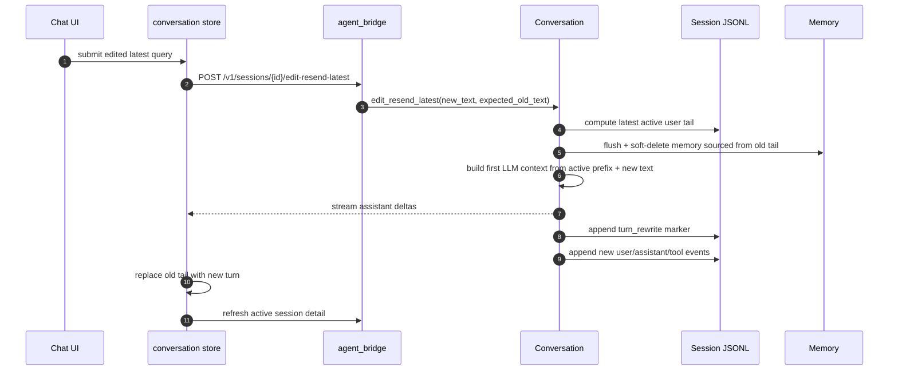

# 035 · 编辑并重发最后一条用户输入 - 技术方案

## 状态

CONFIRMED

## 需求文档

-> [requirement.md](./requirement.md)

## 0. 文档说明

本文档回答 035 需求中的“怎么做”：如何让用户编辑最近一条 user query 并重新发送，同时保证 UI、LLM 上下文、历史恢复和长期记忆不会继续沿用旧错误输入。

本文档只设计“最后一条用户输入”的编辑重发，不设计任意历史消息分支系统。

## 1. 现状分析

### 1.1 Chat UI

当前 chat 页核心文件：

- `frontend/src/pages/chat/components/Composer.tsx`：底部输入条，直接使用 `@tdesign-react/chat` 的 `ChatSender`。
- `frontend/src/pages/chat/components/MessageList.tsx`：渲染 `conversation` store 中的领域消息。
- `frontend/src/pages/chat/components/MessageActionBar.tsx`：消息 action bar，目前只有复制与时间。
- `frontend/src/stores/conversation.ts`：当前会话消息、流式态、历史加载、发送与打开会话。
- `frontend/src/stores/sessionProjection.ts`：把后端 session events 投影成前端 `ChatMessage[]`。

`Composer` 里已有输入相关机制：

- controlled `draftText`。
- TDesign web component 原生 `change` / `input` 事件兜底。
- capture phase IME guard，避免中文 / 日文候选词确认时误触 Enter 发送。
- 语音输入 draft 合并、prewarm、停止录音等底部 composer 业务逻辑。

因此 Sender 封装必须把“通用输入行为”和“底部业务能力”分开，避免内联编辑框被语音输入等逻辑污染。

### 1.2 前端发送链路

当前 `conversation.send(text)` 行为：

1. 前端乐观插入 user message 和 assistant placeholder。
2. `runAgentStream({ threadId: sessionId, text })` 调 `POST /ag-ui/run`。
3. bridge 按 SSE 返回 AG-UI 事件。
4. store 把事件累积进 assistant placeholder。

发送时前端每轮只带最新 user message。历史上下文不在前端拼，而是由 bridge 根据 `thread_id=session_id` 打开后端 JSONL session 后自行组装。

这意味着编辑重发不能只在前端把消息数组裁掉；否则后端仍会读取旧完整 session 继续对话。

### 1.3 后端 session 与 bridge

当前 bridge 的 `POST /ag-ui/run`：

- 通过 `RunAgentInput.thread_id` 找到或创建同名 session。
- `SessionBridge.bind_persistent` 打开持久化 session。
- `Conversation.stream(user_input)` 追加 user / assistant / tool 等事件。

session 存储是 JSONL append-only：

- `Session.messages` 从事件流派生 LLM 上下文。
- `Session.latest_compaction()` 从事件流中找最近上下文摘要。
- `GET /v1/sessions/{id}` 返回原始 events，前端再投影成消息。

当前没有 fork / truncate / edit API。

### 1.4 长期记忆

对话完成后，`Conversation._observe_turn` 会把本轮事件经 `agent.memory_feed.project_turn` 投影成 `ConversationFragment`，交给 `memory.Memory.observe` 异步抽取。

记忆条目通过 `source_ref` / `provenance` 指回 session event：

- episodic: `source_ref = "{session_id}#{first_uuid}..{last_uuid}"`
- semantic: `provenance = [episodic_id, ...]`

如果用户编辑重发旧 query，但旧 turn 产生的 memory 仍保持 active，后续召回可能继续污染新活跃对话。本需求必须处理这个问题。

## 2. 总体方案

本期采用“同一 session 内 append-only rewrite marker + active projection”的方案。

核心设计：

1. session 原始 JSONL 不硬删、不改旧行。
2. 编辑重发时追加一条 `turn_rewrite` marker，记录被替换的旧最后一轮事件 uuid。
3. `Session.active_events` 从原始 events 派生活跃事件流，忽略被 marker 标记为 inactive 的旧 tail。
4. `Session.messages`、`latest_compaction()`、前端历史恢复都使用 active projection。
5. 新增 edit-resend SSE endpoint，以最新 active user turn 为目标，重新跑一轮 LLM。
6. edit-resend 前对旧 tail 对应 memory 做软失效，避免旧错误 query 后续召回。



## 3. 涉及文件

| 文件路径 | 改动类型 | 说明 |
|---------|---------|------|
| `agent/src/agent/sessions/events.py` | 修改 | 新增 `turn_rewrite` 事件类型。 |
| `agent/src/agent/sessions/session.py` | 修改 | 新增 active projection；`messages` / `latest_compaction` 改走 active events。 |
| `agent/src/agent/conversation.py` | 修改 | 新增编辑重发入口，复用现有工具调用流式循环。 |
| `agent/src/agent/memory_feed.py` | 小改 | 如需辅助定位 source refs，保持过滤策略不变。 |
| `memory/src/memory/facade.py` | 修改 | 新增按 source refs 失效记忆的门面方法。 |
| `memory/src/memory/store/sqlite_store.py` | 修改 | 新增按 session/event source 软删 episodic/semantic 的 store 方法。 |
| `agent_bridge/src/agent_bridge/routes/meta.py` | 修改 | 新增 edit-resend SSE endpoint；session detail 返回 active events。 |
| `agent_bridge/src/agent_bridge/protocols/ag_ui/encoders.py` | 修改 | 支持传入自定义 conversation runner，复用 AG-UI SSE 编码。 |
| `agent_bridge/tests/...` | 新增/修改 | 覆盖 route、active projection、memory invalidation。 |
| `frontend/src/services/stream.ts` | 修改 | 新增 `editResendLatestStream`，复用 SSE 解析。 |
| `frontend/src/services/api/sessions.ts` | 修改 | `SessionDetail` 使用 active events 字段。 |
| `frontend/src/types/meta.ts` | 修改 | `SessionDetail.active_events` 类型。 |
| `frontend/src/stores/sessionProjection.ts` | 修改 | 优先投影 `active_events`。 |
| `frontend/src/stores/conversation.ts` | 修改 | 新增 `editResendLatest` action 与提交状态。 |
| `frontend/src/pages/chat/components/ChatSenderBox.tsx` | 新增 | 项目级 ChatSender 封装，支持 bottom/edit placement。 |
| `frontend/src/pages/chat/components/Composer.tsx` | 修改 | 复用 ChatSenderBox，保留底部业务能力。 |
| `frontend/src/pages/chat/components/EditMessageSender.tsx` | 新增 | 内联编辑输入区。 |
| `frontend/src/pages/chat/components/MessageActionBar.tsx` | 修改 | user 最新消息显示编辑按钮。 |
| `frontend/src/pages/chat/components/MessageList.tsx` | 修改 | 编辑态切换、可编辑判断、提交回调。 |
| `frontend/src/stores/conversation.test.ts` | 修改 | 覆盖 edit-resend store 行为。 |
| `frontend/src/stores/sessionProjection.test.ts` | 修改 | 覆盖 active events 投影。 |
| `docs/requirements/035-edit-and-resend-user-query/progress.md` | Phase 3 新增 | 实现进度追踪。 |

## 4. 后端设计

### 4.1 新事件：`turn_rewrite`

新增 append-only marker：

```json
{
  "type": "turn_rewrite",
  "uuid": "<marker_uuid>",
  "ts": "2026-06-28T04:00:00Z",
  "payload": {
    "reason": "edit_resend_latest",
    "target_user_uuid": "<old_user_event_uuid>",
    "inactive_event_uuids": [
      "<old_user_event_uuid>",
      "<old_assistant_event_uuid>",
      "<old_tool_event_uuid>",
      "<old_compaction_uuid>"
    ],
    "replacement_text_sha256": "<hex>"
  },
  "meta": {}
}
```

说明：

- `inactive_event_uuids` 是编辑发生时“最新 active user turn”从 user event 到当前 active tail 的事件集合。
- marker 自身不参与 LLM 上下文，也不渲染给普通用户。
- 原始 JSONL 保留旧事件，便于调试审计。
- `SCHEMA_VERSION` 不递增：这是纯加性事件类型，老文件无该事件时行为不变。

`replacement_text_sha256` 只用于审计与排查，不重复存明文；新明文由后续 `user_message` 事件承载。

### 4.2 Active projection

在 `Session` 中新增：

```py
@property
def active_events(self) -> list[Event]: ...
```

投影规则：

1. 从原始 `events` 中收集所有 `turn_rewrite.payload.inactive_event_uuids`。
2. 过滤掉这些 inactive events。
3. 过滤掉 `turn_rewrite` marker 本身。
4. 其余事件保持原始顺序。

随后调整：

- `Session.messages` 从 `active_events` 派生。
- `Session.latest_compaction()` 只扫描 `active_events`。
- 后续新增依赖“当前对话历史”的逻辑都优先用 active projection。

这样旧 tail 不会进入下一轮 LLM 上下文，旧 compaction 也不会继续作为摘要污染后续上下文。

### 4.3 最新 active user turn 定位

新增内部 helper：

```py
def latest_active_user_turn(session: Session) -> LatestUserTurn | None:
    ...
```

返回：

- `target_user_event`
- `inactive_events`: active events 中从 target user event 到 active tail 的事件

校验：

- 找不到 user event -> 400 / RUN_ERROR。
- `expected_user_content` 不为空且与 target user content 不一致 -> 冲突错误。
- target user 后面如果还有另一个 active user event，则不可能成为 latest；helper 自然不会返回非最后 user。

### 4.4 Conversation edit-resend 入口

新增 `Conversation.edit_resend_latest(...)`：

```py
def edit_resend_latest(
    self,
    new_user_input: str,
    *,
    expected_user_content: str | None = None,
) -> Iterator[ConversationEvent]:
    ...
```

关键语义：

1. 计算 latest active user turn 与 inactive events。
2. 对 inactive events 对应的 memory source 做失效处理。
3. 第一轮 LLM 上下文使用“active prefix + new_user_input”，而不是当前完整 `Session.messages`。
4. 第一轮 LLM 如果完全没启动或初始化失败，不追加 `turn_rewrite`，原会话保持不变。
5. 第一轮 LLM 一旦产生可持久化输出，先追加 `turn_rewrite`，再按现有顺序追加新 `user_message` / `assistant_message` / tool events。
6. 后续工具调用 continuation 可直接走 `Session.messages`，因为 marker 已落盘，active projection 已生效。

为避免复制整段工具调用循环，实施时把现有 `Conversation.stream` 抽成内部共用方法，例如：

```py
def _stream_user_turn(
    self,
    user_input: str,
    *,
    first_turn_messages: Callable[[], list[dict[str, Any]]],
    before_persist_first_turn: Callable[[], None] | None = None,
) -> Iterator[ConversationEvent]:
    ...
```

普通发送与 edit-resend 共享工具调用、partial 持久化、memory observe、错误处理逻辑。

### 4.5 Bridge endpoint

新增自有 endpoint：

```text
POST /v1/sessions/{session_id}/edit-resend-latest
Accept: text/event-stream
Content-Type: application/json
```

请求体：

```ts
interface EditResendLatestRequest {
  text: string;
  expected_user_content?: string;
}
```

返回：

- 与 `/ag-ui/run` 相同的 AG-UI SSE 事件流。
- `RUN_ERROR` 使用现有 `agent_bridge.errors.map_exception` 生成拟人化错误。

不复用 `/ag-ui/run` 的原因：

- 这是项目自有 session 操作，不是标准 AG-UI run 语义。
- endpoint 名称直接暴露“edit latest user query”的产品语义，避免把私有行为塞进 `forwardedProps` 后难以维护。

`encode_stream` 增加可选 runner 参数，让新 endpoint 复用 AG-UI 编码：

```py
encode_stream(
    conv_factory,
    user_input,
    run_conversation=lambda conv, text: conv.edit_resend_latest(...),
)
```

### 4.6 Session detail

`GET /v1/sessions/{id}` 保留原始 `events`，新增 `active_events`：

```json
{
  "session_id": "...",
  "title": "...",
  "persona": "...",
  "model": "...",
  "events": [/* raw append-only events */],
  "active_events": [/* filtered active projection */]
}
```

前端默认使用 `active_events` 渲染；调试工具仍可读取 raw `events`。

### 4.7 Memory 失效

新增 `Memory.invalidate_sources(...)`：

```py
def invalidate_sources(
    self,
    *,
    session_id: str,
    event_uuids: set[str],
    reason: str,
) -> None:
    ...
```

执行策略：

1. 先 `self._worker.flush()`，确保 edit 发生前已入队的旧 turn 抽取全部完成。
2. 调 `SqliteMemoryStore.soft_delete_by_source_events(...)` 软删旧 tail 直接产生的 memory。

store 方法：

```py
def soft_delete_by_source_events(
    self,
    *,
    session_id: str,
    event_uuids: set[str],
    deleted_at: datetime,
) -> MemoryInvalidationResult:
    ...
```

软删规则：

- 找到 active episodic rows，若 `source_ref` 属于该 `session_id` 且 range 两端命中 `event_uuids`，设置 `deleted_at`。
- 找到 active semantic rows，若 `provenance` 中包含被软删的 episodic id，设置 `deleted_at`。
- pinned semantic 也软删；用户编辑重发代表旧输入不应继续作为事实来源。
- 不 hard delete，方便后续排查。

这不是完整 forget 系统，只是对“最后一轮被替换”的 source 做一致性失效。

### 4.8 失败语义

| 阶段 | 行为 |
|------|------|
| 请求 text 为空 | HTTP 400，前端正常不会发出。 |
| session 不存在 | RUN_ERROR 或 HTTP 404，前端刷新后回首页/错误态。 |
| expected_user_content 不匹配 | RUN_ERROR，前端刷新当前 session，避免覆盖错误对象。 |
| LLM 初始化失败且无任何输出 | 不追加 `turn_rewrite`，原 active view 不变。 |
| marker 已追加后中断 | 与普通 `stream` 一致，保留新 user 与 partial/error assistant，旧 tail 已 inactive。 |
| memory invalidation 失败 | edit-resend 失败，不进入新 turn；避免明知旧 memory 未失效还继续跑新上下文。 |

## 5. 前端设计

### 5.1 Stream service

`frontend/src/services/stream.ts` 新增：

```ts
export interface EditResendLatestInput {
  threadId: string;
  text: string;
  expectedUserContent?: string;
}

export async function* editResendLatestStream(
  input: EditResendLatestInput,
  opts?: RunStreamOptions,
): AsyncGenerator<BaseEvent> {
  ...
}
```

内部复用现有 SSE 解析函数，只是 URL 和 body 不同。

### 5.2 Session detail projection

`SessionDetail` 增加可选字段：

```ts
active_events?: SessionEvent[];
```

`conversation.openSession` 改为：

```ts
const events = detail.active_events ?? detail.events;
messages: projectSessionEvents(events)
```

`projectSessionEvents` 本身不需要理解 `turn_rewrite`，因为后端已经给 active events。为防旧 bridge 兼容，可在遇到 raw events 时自然忽略 unknown marker，但不承担完整 active projection。

### 5.3 Conversation store

新增状态：

```ts
editResending: boolean;
```

新增 action：

```ts
editResendLatest: (input: {
  text: string;
  expectedUserContent: string;
}) => Promise<void>;
```

行为：

1. 校验 `currentSessionId`、非 streaming、非 historyLoading、文本非空。
2. 找到当前 messages 中最后一个 user message 和它之前的 prefix。
3. 乐观替换为 `prefix + new user message + assistant placeholder`。
4. 调 `editResendLatestStream` 消费 SSE，累积 assistant placeholder。
5. finally 刷新 sessions list。
6. 成功后重新 `GET /v1/sessions/{id}`，用 active events rehydrate 当前 messages，拿到后端真实 event ids。
7. 失败时同样 rehydrate 当前 session，以后端 active projection 为准，并显示拟人错误。

注意：edit-resend route 以“服务端最新 active user turn”为目标，不依赖前端乐观 message id。`expectedUserContent` 用来防止用户本地视图过期时误改错误对象。

### 5.4 Sender 封装

新增 `ChatSenderBox`：

```tsx
type ChatSenderPlacement = "bottom" | "edit";

interface ChatSenderBoxProps {
  placement: ChatSenderPlacement;
  value: string;
  autosize?: ComponentProps<typeof ChatSender>["autosize"];
  disabled?: boolean;
  loading?: boolean;
  placeholder?: string;
  footerPrefix?: ReactNode;
  footerSuffix?: ReactNode;
  onChange: (value: string) => void;
  onSend: (value: string) => void;
  onStop?: () => void;
}
```

封装职责：

- 统一渲染 `ChatSender`。
- 统一 IME Enter guard。
- 统一 native `change` / `input` 事件兜底。
- 根据 `placement` 设置默认 autosize、外层样式和基础 slot。
- 透传必要 props，保留 TDesign ChatSender 的扩展空间。

不放入封装的内容：

- conversation store 调用。
- voice input 状态机。
- 底部 composer 的 prewarm / 录音 / stopVoiceInput。
- inline edit 的取消按钮状态。

底部 `Composer` 变成：

- 继续持有语音输入相关逻辑。
- 使用 `ChatSenderBox placement="bottom"`。
- 通过 `footerPrefix` 注入 `VoiceInputAction`。

编辑区使用：

- `ChatSenderBox placement="edit"`。
- `footerSuffix` 或外层 footer 渲染取消/发送按钮。

### 5.5 Message UI

`MessageActionBar` 增加 edit props：

```ts
interface MessageActionBarProps {
  role: ChatRole;
  createdAt: string;
  copyText: string;
  editable?: boolean;
  onEdit?: () => void;
}
```

只有满足以下条件时传 `editable=true`：

- message.role === "user"
- 它是当前 messages 中最后一个 user message
- `streaming === false`
- `historyLoading === false`
- 文字输入没有被 voice call blocking 禁用
- 当前没有其他 message 正在编辑或提交

编辑按钮使用 lucide `Pencil` + 现有 `TooltipButton` 风格。

`MessageList` 持有轻量 UI state：

```ts
editingMessageId: string | null
```

编辑 draft 放在 `EditMessageSender` 内部，提交时传给 store。这样编辑态是页面局部 UI 状态，不污染全局 conversation 数据。

### 5.6 Inline edit UI

新增 `EditMessageSender`：

- 初始值来自原 user message 的纯文本。
- cancel 调 `onCancel`，只退出编辑态。
- submit 调 `onSubmit(trimmed)`。
- submitting 时禁用输入和按钮。
- 空白文本时发送按钮 disabled。

布局沿用 user 消息右侧视觉，不套嵌多层 card。输入区宽度与 user 气泡区域一致，避免出现突兀的大块表单。

## 6. 测试策略

### 6.1 后端测试

- `agent.sessions`
  - `turn_rewrite` JSONL 往返。
  - `active_events` 过滤 inactive events 和 marker。
  - `Session.messages` 不包含旧 user / assistant / tool。
  - `latest_compaction()` 忽略 inactive compaction。
- `agent.Conversation`
  - edit-resend 只允许 latest active user turn。
  - edit-resend 首轮上下文不包含旧 tail。
  - LLM 初始化失败时不追加 marker。
  - marker 后中断保留新 partial 语义。
- `memory`
  - 按 source events 软删 episodic。
  - 按 episodic provenance 软删 semantic，包括 pinned。
  - 不命中其他 session / 其他 turn。
- `agent_bridge`
  - edit-resend endpoint 返回 AG-UI SSE。
  - expected content mismatch 返回拟人化 RUN_ERROR。
  - `GET /v1/sessions/{id}` 返回 raw events + active_events。

### 6.2 前端测试

- `sessionProjection.test.ts`
  - 使用 `active_events` 投影，不渲染 raw 旧 tail。
- `conversation.test.ts`
  - `editResendLatest` 裁掉旧 tail 并消费新 SSE。
  - streaming/historyLoading 时不提交。
  - route 失败后 rehydrate 当前 session。
- `MessageList` / 组件测试
  - 只有最后 user message 显示编辑按钮。
  - cancel 不调用 store action。
  - 空白文本不能 submit。
- `ChatSenderBox`
  - bottom/edit placement 都能触发 onChange/onSend。
  - IME guard 逻辑从 Composer 迁移后仍存在。

### 6.3 手动验收

1. 启动 bridge + frontend。
2. 发一条明显错误的 user query，等待 assistant 回复完成。
3. 点击该 user 消息编辑按钮。
4. 修改文本并发送。
5. 确认旧 query 和旧 assistant 回复从当前活跃视图消失。
6. 确认新 query 触发新的流式回复。
7. 再发一条追问，确认上下文基于新 query 延续。
8. 刷新历史列表并重新打开该 session，确认视图仍是新 active projection。
9. 检查 memory inspector 或日志，确认旧 tail 直接来源的 memory 已软失效。

## 7. 影响分析

### 7.1 上游影响

- 改动 `agent` session 投影语义，但只对含 `turn_rewrite` 的新事件生效，老 session 不受影响。
- 新增 bridge 自有 endpoint，不改变 `/ag-ui/run` wire 格式。
- `GET /v1/sessions/{id}` 加字段，不破坏现有调用方。

### 7.2 下游影响

- 前端历史会话打开后将看到 active projection，而不是 raw append-only 全量分支。
- conversation history tool 如果依赖 `Session.messages`，会自然使用 active messages，符合“当前活跃对话”语义。
- 调试时 raw JSONL 仍保留旧事件，需要开发者理解 `turn_rewrite` marker。

### 7.3 风险点

| 风险 | 处理 |
|------|------|
| active projection 和前端投影不一致 | 后端 `active_events` 作为前端默认数据源，减少重复实现。 |
| memory 抽取异步导致旧事实晚到 | edit-resend 前 `Memory.flush()`，再按 source 软删。 |
| flush 可能让编辑提交变慢 | 这是少量手动操作；优先保证语义正确。必要时后续再做 tombstone 优化。 |
| ChatSender 封装过度耦合底部业务 | 封装只放通用输入行为，语音输入留在 Composer 外层。 |
| LLM 初始化失败导致旧视图被误隐藏 | marker 延后到第一轮可持久化阶段，初始化失败不改 session。 |
| 工具外部副作用无法撤销 | 本期只保证上下文/视图回溯；不承诺撤销外部世界副作用。 |

## 8. 决策汇总

| 编号 | 决策 | 理由 |
|------|------|------|
| D-1 | 同一 session 内 append `turn_rewrite` marker，不 fork 新 session。 | 本期只解决最近输入重输；保留历史连续性和侧栏列表稳定。 |
| D-2 | 原始 JSONL 不硬删，active projection 负责当前语义。 | 保留审计与调试能力，避免破坏 append-only 存储。 |
| D-3 | `Session.messages` / `latest_compaction` 改走 active events。 | 保证 LLM 上下文和摘要都不继续用旧 tail。 |
| D-4 | `GET /v1/sessions/{id}` 增加 `active_events`。 | 前端刷新和后端上下文共享同一活跃语义。 |
| D-5 | 新增自有 `/v1/sessions/{id}/edit-resend-latest` SSE endpoint。 | 私有 session 操作不塞进标准 AG-UI run。 |
| D-6 | memory 采用 source-based 软失效。 | 避免旧错误 query 静默污染后续召回，同时保留可追溯记录。 |
| D-7 | Sender 封装用 `placement` 参数区分 bottom/edit。 | 符合本需求复用目标，后续共同能力可在封装内演进。 |

## 9. 实施任务

Phase 3 生成 `progress.md` 时按以下任务拆分：

1. M35.1：session `turn_rewrite` 事件 + active projection + 单测。
2. M35.2：memory source soft-delete + facade invalidation + 单测。
3. M35.3：Conversation edit-resend runner + bridge SSE endpoint + 后端测试。
4. M35.4：frontend stream API + SessionDetail active events + projection/store 测试。
5. M35.5：ChatSenderBox 封装，Composer 迁移到底部 placement。
6. M35.6：Message action edit 按钮 + EditMessageSender + MessageList 编辑态。
7. M35.7：联调 edit-resend 成功/失败/刷新重开语义。
8. M35.8：桌面视觉验收、`./scripts/check`、需求 AC 手动验收。

## 10. 变更记录

| 日期 | 变更内容 | 是否需要重新实现 |
|------|---------|----------------|
| 2026-06-28 | 创建技术方案（CONFIRMED）。 | 是 |
